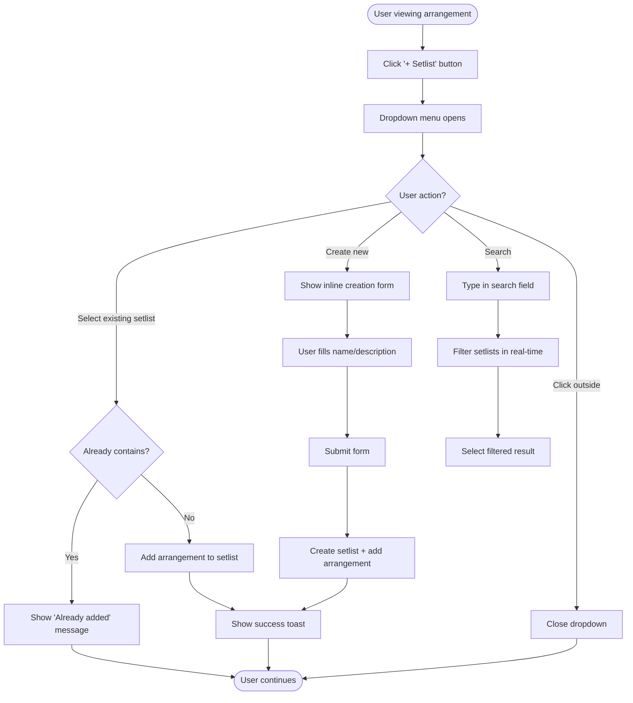
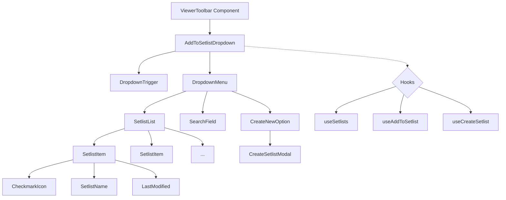
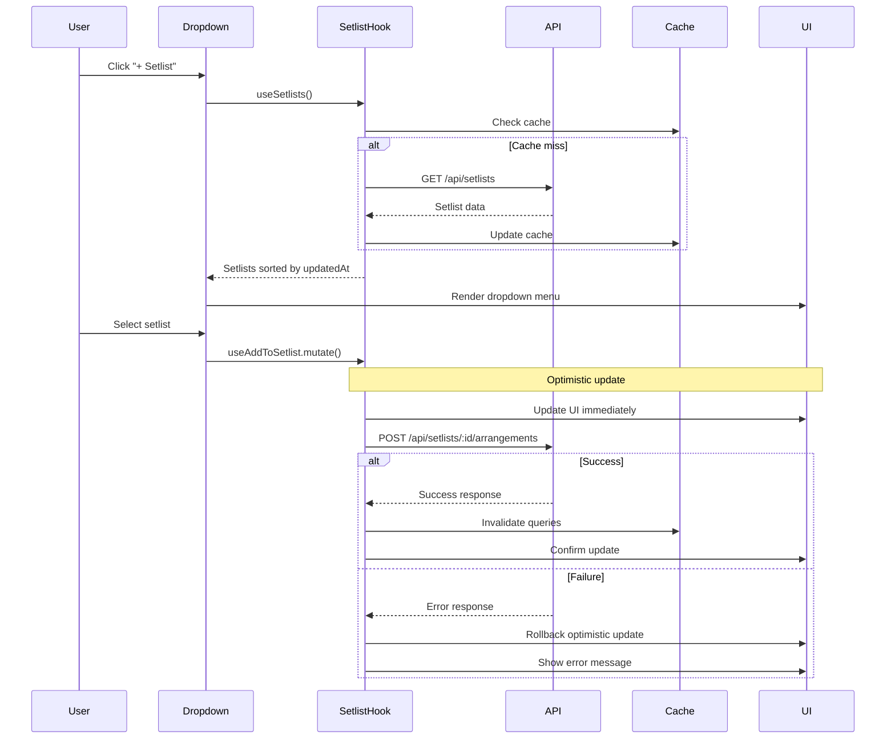
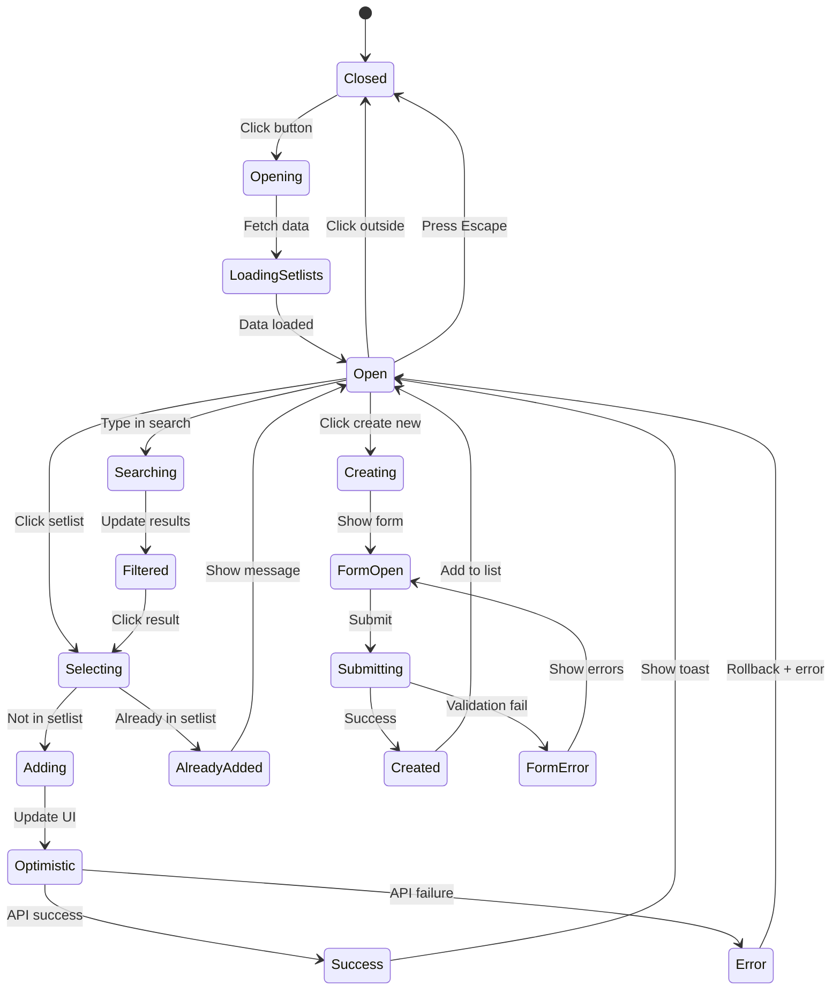

# Product Requirements Document: Add to Setlist Dropdown Feature

## Executive Summary

This PRD defines the implementation of an enhanced "Add to Setlist" dropdown feature that allows users to quickly add arrangements to their setlists while viewing an arrangement. The feature will provide a seamless experience with a dropdown menu showing "Create new setlist" option followed by the user's existing setlists sorted by recency of edits.

## Problem Statement

### Current State
- Users viewing an arrangement have no direct way to add it to a setlist
- The ViewerToolbar has an unused `onAddToSetlist` prop placeholder
- Users must navigate away from the arrangement view to add it to a setlist
- No visual indication of which setlists already contain the arrangement

### User Pain Points
1. **Context switching**: Users lose their place when navigating to setlist management
2. **Workflow interruption**: Cannot quickly save arrangements while browsing
3. **Duplicate additions**: No visibility into existing setlist inclusions
4. **Multiple steps**: Current process requires too many clicks

### Business Impact
- Reduced user engagement with setlist feature
- Lower arrangement discovery and usage
- Decreased session time and user satisfaction

## Solution Overview

Implement a dropdown menu component activated by the "+ Setlist" button in the arrangement viewer toolbar that provides:
1. Quick access to create a new setlist
2. List of user's existing setlists ordered by recent activity
3. Visual indicators for setlists already containing the arrangement
4. Single-click addition with optimistic UI updates
5. Inline setlist creation without leaving the page

## User Stories

### Epic: Quick Add to Setlist from Arrangement Viewer

#### Story 1: Add Arrangement to Existing Setlist
**As a** musician viewing an arrangement  
**I want** to quickly add it to one of my existing setlists  
**So that** I can build my performance repertoire without interrupting my browsing

**Acceptance Criteria:**
- [ ] Clicking "+ Setlist" button shows dropdown menu
- [ ] Dropdown displays user's setlists sorted by last modified date
- [ ] Shows visual indicator (checkmark) for setlists already containing the arrangement
- [ ] Single click adds arrangement to selected setlist
- [ ] Success feedback appears (toast notification)
- [ ] Optimistic UI update shows immediate checkmark
- [ ] Dropdown remains open for multiple additions

**Technical Notes:**
- Use existing `useAddToSetlist` mutation hook
- Implement optimistic updates via React Query
- Cache setlist data for performance

#### Story 2: Create New Setlist with Arrangement
**As a** musician discovering a new arrangement  
**I want** to create a new setlist and add the arrangement in one action  
**So that** I can start organizing my music immediately

**Acceptance Criteria:**
- [ ] "Create new setlist" appears as first option in dropdown
- [ ] Clicking opens inline creation form
- [ ] Form includes name field (required) and description (optional)
- [ ] Submit creates setlist and adds arrangement atomically
- [ ] New setlist appears in dropdown immediately after creation
- [ ] Error handling for duplicate names

**Technical Notes:**
- Use `useCreateSetlist` mutation with arrangement parameter
- Transaction pattern for atomic operation
- Form validation using existing patterns

#### Story 3: Search and Filter Setlists
**As a** power user with many setlists  
**I want** to search and filter my setlists in the dropdown  
**So that** I can quickly find the right setlist

**Acceptance Criteria:**
- [ ] Search field appears when dropdown has >10 items
- [ ] Real-time filtering as user types
- [ ] Filters by setlist name and description
- [ ] Shows "No setlists found" when no matches
- [ ] Keyboard navigation support (arrow keys)

**Technical Notes:**
- Implement fuzzy search for forgiving matching
- Debounce search input (150ms)
- Virtual scrolling for large lists (>50 items)

## User Experience Design

### User Flow Diagram



### Component Architecture



### Wireframe Mockup

```
┌────────────────────────────────────────────────┐
│  🎵 Arrangement Title                          │
│ ┌──────────────────────────────────────────┐  │
│ │ [Print] [Stage] [+ Setlist ▼] [Share]    │  │
│ └──────────────────────────────────────────┘  │
│                    ▼                           │
│         ┌─────────────────────────┐           │
│         │ 🔍 Search setlists...   │           │
│         ├─────────────────────────┤           │
│         │ ➕ Create new setlist   │           │
│         ├─────────────────────────┤           │
│         │ ✓ Sunday Service        │           │
│         │   Modified 2 hours ago  │           │
│         ├─────────────────────────┤           │
│         │   Youth Group           │           │
│         │   Modified yesterday    │           │
│         ├─────────────────────────┤           │
│         │ ✓ Christmas Special     │           │
│         │   Modified 3 days ago   │           │
│         └─────────────────────────┘           │
│                                                │
│  [Chord sheet content...]                      │
└────────────────────────────────────────────────┘
```

## Technical Architecture

### Data Flow Sequence



### Component Structure

```typescript
// AddToSetlistDropdown.tsx
interface AddToSetlistDropdownProps {
  arrangement: Arrangement
  variant?: 'icon' | 'button' | 'text'
  onSuccess?: (setlist: Setlist) => void
}

interface DropdownState {
  isOpen: boolean
  searchQuery: string
  isCreating: boolean
  selectedSetlists: Set<string>
}

// Data structures
interface SetlistWithInclusion extends Setlist {
  containsArrangement: boolean
  lastModifiedRelative: string // "2 hours ago"
}

interface CreateSetlistFormData {
  name: string
  description?: string
  isPublic: boolean
  addArrangement: boolean
}
```

### State Management



## API Specifications

### Endpoints

#### 1. Get User's Setlists with Arrangement Status
```http
GET /api/setlists?userId={userId}&checkArrangement={arrangementId}
Authorization: Bearer {token}

Response: 200 OK
{
  "setlists": [
    {
      "id": "setlist_123",
      "name": "Sunday Service",
      "description": "Regular Sunday worship",
      "updatedAt": "2024-01-15T10:30:00Z",
      "createdAt": "2024-01-01T08:00:00Z",
      "arrangements": ["arr_456", "arr_789"],
      "containsArrangement": true,
      "arrangementCount": 12
    }
  ],
  "total": 25
}
```

#### 2. Add Arrangement to Setlist
```http
POST /api/setlists/{setlistId}/arrangements
Authorization: Bearer {token}
Content-Type: application/json

{
  "arrangementId": "arr_123",
  "order": null,  // Auto-append to end
  "notes": "Key of G works better",
  "customization": {
    "keyOverride": "G",
    "capoOverride": 2
  }
}

Response: 201 Created
{
  "setlistArrangement": {
    "id": "sa_789",
    "arrangementId": "arr_123",
    "setlistId": "setlist_456",
    "order": 5,
    "addedAt": "2024-01-15T14:30:00Z",
    "addedBy": "user_123"
  }
}
```

#### 3. Create Setlist with Initial Arrangement
```http
POST /api/setlists
Authorization: Bearer {token}
Content-Type: application/json

{
  "name": "New Setlist",
  "description": "Created from arrangement viewer",
  "isPublic": false,
  "initialArrangement": {
    "arrangementId": "arr_123",
    "notes": "Starting song"
  }
}

Response: 201 Created
{
  "setlist": {
    "id": "setlist_new",
    "name": "New Setlist",
    "arrangements": ["arr_123"],
    "createdAt": "2024-01-15T14:35:00Z"
  }
}
```

### Error Handling

```typescript
enum SetlistErrorCode {
  DUPLICATE_NAME = 'DUPLICATE_NAME',
  ARRANGEMENT_ALREADY_EXISTS = 'ARRANGEMENT_ALREADY_EXISTS',
  SETLIST_NOT_FOUND = 'SETLIST_NOT_FOUND',
  UNAUTHORIZED = 'UNAUTHORIZED',
  QUOTA_EXCEEDED = 'QUOTA_EXCEEDED'
}

interface SetlistError {
  code: SetlistErrorCode
  message: string
  details?: Record<string, any>
}
```

## Implementation Plan

### Phase 1: Core Dropdown Functionality (MVP)
**Priority: P0 - Must Have**

1. Create `AddToSetlistDropdown` component
2. Integrate with existing `useSetlists` hook
3. Implement basic dropdown UI with setlist display
4. Add click-to-add functionality with `useAddToSetlist`
5. Show checkmarks for existing inclusions
6. Add success/error toast notifications

**Success Metrics:**
- Users can add arrangements to setlists in <3 clicks
- 90% success rate for add operations
- <500ms response time for dropdown open

### Phase 2: Create New Setlist
**Priority: P1 - Should Have**

1. Add "Create new setlist" option to dropdown
2. Implement inline creation form
3. Add atomic create-and-add operation
4. Form validation and error handling
5. Update dropdown list after creation

**Success Metrics:**
- 50% of new setlists created via this flow
- <2 seconds for create-and-add operation

### Phase 3: Search and Filtering
**Priority: P2 - Nice to Have**

1. Add search field for >10 setlists
2. Implement fuzzy search algorithm
3. Add keyboard navigation
4. Virtual scrolling for large lists
5. Recent/favorite setlists section

**Success Metrics:**
- 80% of searches find target in <3 keystrokes
- Smooth scrolling for 100+ setlists

### Phase 4: Advanced Features
**Priority: P3 - Future Enhancement**

1. Bulk operations (add to multiple setlists)
2. Arrangement customization in dropdown
3. Setlist preview on hover
4. Drag-and-drop reordering
5. Collaborative setlists indication

## Dependencies

### Technical Dependencies
- React Query v5 for data fetching and caching
- Radix UI or Floating UI for dropdown positioning
- React Hook Form for creation form
- Lucide React for icons
- Existing auth context for user identification

### Design System Dependencies
- Use existing button variants
- Follow current dropdown patterns
- Maintain consistent spacing and typography
- Use standard color tokens for states

### API Dependencies
- Setlist CRUD endpoints must be stable
- Authentication middleware required
- Rate limiting considerations
- WebSocket for real-time updates (future)

## Testing Strategy

### Unit Tests
```typescript
describe('AddToSetlistDropdown', () => {
  test('renders dropdown trigger button')
  test('opens dropdown on click')
  test('shows user setlists sorted by recency')
  test('indicates setlists containing arrangement')
  test('adds arrangement on selection')
  test('handles API errors gracefully')
  test('closes on escape key')
  test('closes on outside click')
})
```

### Integration Tests
- Test with mock API responses
- Verify optimistic updates
- Test error rollback scenarios
- Validate cache invalidation

### E2E Tests
```gherkin
Feature: Add to Setlist from Arrangement Viewer
  
  Scenario: Add arrangement to existing setlist
    Given I am viewing an arrangement
    When I click the "+ Setlist" button
    And I select "Sunday Service" from the dropdown
    Then the arrangement should be added to the setlist
    And I should see a success message
  
  Scenario: Create new setlist with arrangement
    Given I am viewing an arrangement
    When I click the "+ Setlist" button
    And I click "Create new setlist"
    And I enter "Practice Session" as the name
    And I submit the form
    Then a new setlist should be created
    And the arrangement should be added to it
```

## Performance Considerations

### Optimization Strategies
1. **Lazy Loading**: Load setlist details on demand
2. **Caching**: Cache setlist data for 5 minutes
3. **Debouncing**: Debounce search input (150ms)
4. **Virtual Scrolling**: For lists >50 items
5. **Optimistic Updates**: Immediate UI feedback
6. **Batch Operations**: Group multiple additions

### Performance Targets
- Dropdown open: <100ms
- Search response: <50ms
- Add operation: <500ms perceived
- Memory usage: <10MB for 100 setlists

## Security Considerations

### Access Control
- Verify user owns setlist before modification
- Validate arrangement exists and is accessible
- Rate limit API calls (10 additions/minute)
- Sanitize user input in creation form

### Data Privacy
- Don't expose private setlist details
- Mask user IDs in client
- Encrypt sensitive data in transit
- Audit log for setlist modifications

## Success Metrics

### Key Performance Indicators
1. **Adoption Rate**: 60% of active users use feature within first month
2. **Task Completion**: 95% success rate for add operations
3. **Time to Task**: <5 seconds average to add arrangement
4. **Error Rate**: <1% API failure rate
5. **User Satisfaction**: 4.5/5 rating in feedback

### Monitoring and Analytics
```typescript
// Track events
analytics.track('setlist_dropdown_opened', {
  arrangementId: arrangement.id,
  setlistCount: setlists.length
})

analytics.track('arrangement_added_to_setlist', {
  arrangementId: arrangement.id,
  setlistId: setlist.id,
  method: 'dropdown',
  timeToAdd: performance.now() - startTime
})

analytics.track('setlist_created_inline', {
  arrangementId: arrangement.id,
  setlistName: formData.name
})
```

## Risks and Mitigations

### Technical Risks

| Risk | Impact | Probability | Mitigation |
|------|--------|-------------|------------|
| API rate limiting | High | Medium | Implement client-side throttling and caching |
| Large setlist counts | Medium | Low | Virtual scrolling and pagination |
| Network latency | Medium | Medium | Optimistic updates and offline support |
| Browser compatibility | Low | Low | Progressive enhancement approach |

### User Experience Risks

| Risk | Impact | Probability | Mitigation |
|------|--------|-------------|------------|
| Accidental additions | Low | Medium | Undo functionality in toast |
| Overwhelming options | Medium | Low | Search and favorites section |
| Slow perceived performance | High | Low | Optimistic UI updates |
| Confusion about checkmarks | Low | Medium | Clear visual design and tooltips |

## Future Enhancements

### Next Iterations
1. **Smart Suggestions**: ML-based setlist recommendations
2. **Bulk Operations**: Add multiple arrangements at once
3. **Templates**: Create setlists from templates
4. **Collaboration**: Real-time multi-user editing
5. **Analytics**: Setlist performance tracking
6. **Export**: Generate printable setlist sheets
7. **Scheduling**: Link setlists to calendar events
8. **Practice Mode**: Track practice time per setlist

### Platform Expansion
- Mobile app integration
- Desktop app support
- API for third-party integrations
- Webhook notifications
- Public embed widgets

## Appendices

### A. Existing Component Reference
- `AddToSetlistButton` - Current implementation in `/src/features/setlists/components/selectors/`
- `SetlistSelectorModal` - Modal version for reference
- `useSetlists` - Hook for fetching setlists
- `useAddToSetlist` - Mutation hook for adding

### B. Design Tokens
```css
--dropdown-bg: var(--color-surface);
--dropdown-border: var(--color-border);
--dropdown-shadow: 0 4px 6px rgba(0, 0, 0, 0.1);
--item-hover: var(--color-primary-alpha-10);
--item-selected: var(--color-primary-alpha-20);
--success-color: var(--color-success);
--error-color: var(--color-error);
```

### C. Accessibility Requirements
- ARIA labels for all interactive elements
- Keyboard navigation support (Tab, Arrow keys, Enter, Escape)
- Screen reader announcements for state changes
- Color contrast ratio ≥4.5:1
- Focus indicators visible
- Semantic HTML structure

### D. Browser Support
- Chrome 90+
- Firefox 88+
- Safari 14+
- Edge 90+
- Mobile browsers (iOS Safari 14+, Chrome Mobile)

---

**Document Version**: 1.0.0  
**Last Updated**: January 2024  
**Status**: Ready for Implementation  
**Author**: AI Product Manager  
**Reviewers**: Pending