# ChordSheetJS Formatting Optimization - Product Requirements Document

## Executive Summary

This PRD outlines the optimization and enhancement of ChordSheetJS rendering implementation in the HSA Songbook application. The goal is to improve chord sheet display consistency, performance, and user experience across all viewing contexts (preview, viewer, stage mode, and print).

## Problem Statement

### Current Pain Points
1. **Rendering Inconsistency**: Current implementation uses manual HTML processing with regex patterns, leading to potential inconsistencies
2. **Performance Issues**: Multiple rendering passes and string manipulations impact performance, especially on mobile devices
3. **Limited Formatting Control**: Current CSS injection approach is fragile and doesn't leverage ChordSheetJS's full capabilities
4. **Transposition Complexity**: Manual chord transposition logic adds complexity and potential for errors
5. **Mobile Responsiveness**: Suboptimal mobile experience with HtmlTableFormatter

### User Impact
- Musicians experience inconsistent chord display across different viewing modes
- Mobile users face readability issues during performances
- Slow rendering affects real-time editing experience
- Limited customization options for different performance contexts

## Solution Overview

Implement a comprehensive ChordSheetJS formatting system that:
1. Leverages ChordSheetJS's built-in formatters optimally
2. Provides consistent rendering across all contexts
3. Optimizes for mobile and stage performance
4. Implements proper caching and memoization
5. Supports advanced formatting features

## User Stories

### Epic: Enhanced Chord Sheet Rendering

#### Story 1: Consistent Chord Display
**As a** musician  
**I want** chords to display consistently across preview and viewer  
**So that** I can trust what I see while editing matches performance view  

**Acceptance Criteria:**
- [ ] Identical chord positioning in editor preview and viewer
- [ ] Consistent styling across all viewing modes
- [ ] No layout shifts when switching between modes
- [ ] Proper alignment of chords above lyrics

**Technical Notes:**
- Use single rendering pipeline
- Implement unified CSS strategy
- Cache parsed song objects

#### Story 2: Mobile-Optimized Display
**As a** mobile user  
**I want** chord sheets to be easily readable on my phone  
**So that** I can use the app during performances  

**Acceptance Criteria:**
- [ ] Responsive layout that adapts to screen size
- [ ] Touch-friendly chord sheet navigation
- [ ] Pinch-to-zoom functionality
- [ ] Optimal font sizing for mobile screens
- [ ] Horizontal scroll prevention

**Technical Notes:**
- Implement HtmlDivFormatter for responsive layout
- Add viewport meta tags
- Use CSS Grid/Flexbox for layout

#### Story 3: Performance Mode Optimization
**As a** performer  
**I want** instant chord sheet rendering  
**So that** there's no delay when switching songs during a gig  

**Acceptance Criteria:**
- [ ] Sub-100ms render time for average song
- [ ] Smooth scrolling without jank
- [ ] Instant transposition
- [ ] No re-renders on preference changes

**Technical Notes:**
- Implement render caching
- Use Web Workers for parsing if needed
- Optimize DOM operations

#### Story 4: Advanced Formatting Features
**As a** advanced user  
**I want** control over chord sheet appearance  
**So that** I can customize for my specific needs  

**Acceptance Criteria:**
- [ ] Theme selection (light/dark/stage/custom)
- [ ] Font family and size controls
- [ ] Chord notation styles (standard/jazz)
- [ ] Section highlighting
- [ ] Print-optimized formatting

**Technical Notes:**
- Leverage ChordSheetJS configuration
- Implement preference persistence
- Support custom CSS injection

## Technical Architecture

### Component Architecture

```mermaid
graph TB
    subgraph "Rendering Pipeline"
        A[ChordPro Input] --> B[Parser]
        B --> C[Song Object]
        C --> D[Formatter Selection]
        D --> E[HTML Generation]
        E --> F[Style Injection]
        F --> G[Final Output]
    end
    
    subgraph "Formatter Strategy"
        D --> H{Context?}
        H -->|Preview| I[HtmlDivFormatter]
        H -->|Viewer| I
        H -->|Print| J[HtmlTableFormatter]
        H -->|Export| K[TextFormatter]
    end
    
    subgraph "Caching Layer"
        C --> L[Song Cache]
        E --> M[HTML Cache]
        F --> N[Styled Cache]
    end
```



### Data Flow


### State Management


## API Specifications

### ChordSheetRenderer Service

```typescript
interface ChordSheetRenderer {
  /**
   * Parse and render ChordPro content
   */
  render(options: RenderOptions): RenderResult;
  
  /**
   * Transpose existing render
   */
  transpose(semitones: number): RenderResult;
  
  /**
   * Update display preferences
   */
  updatePreferences(prefs: Partial<DisplayPreferences>): void;
  
  /**
   * Clear all caches
   */
  clearCache(): void;
}

interface RenderOptions {
  content: string;
  format: 'html-div' | 'html-table' | 'text' | 'chordpro';
  context: 'preview' | 'viewer' | 'stage' | 'print';
  preferences?: DisplayPreferences;
  transpose?: number;
  useCache?: boolean;
}

interface RenderResult {
  html: string;
  metadata: SongMetadata;
  renderTime: number;
  cacheHit: boolean;
  errors?: ParseError[];
}

interface DisplayPreferences {
  theme: 'light' | 'dark' | 'stage' | 'custom';
  fontSize: number;
  fontFamily: string;
  chordStyle: 'standard' | 'jazz' | 'roman';
  showDiagrams: boolean;
  lineHeight: number;
  chordColor?: string;
  lyricColor?: string;
}
```

### Formatter Factory

```typescript
class FormatterFactory {
  static createFormatter(
    format: FormatterType,
    options?: FormatterOptions
  ): ChordSheetJS.Formatter {
    switch(format) {
      case 'responsive':
        return new ChordSheetJS.HtmlDivFormatter(options);
      case 'print':
        return new ChordSheetJS.HtmlTableFormatter(options);
      case 'text':
        return new ChordSheetJS.TextFormatter(options);
      default:
        return new ChordSheetJS.HtmlDivFormatter(options);
    }
  }
}
```

### Cache Manager

```typescript
interface CacheManager {
  // Song object cache
  getCachedSong(content: string): ChordSheetJS.Song | null;
  cacheSong(content: string, song: ChordSheetJS.Song): void;
  
  // HTML cache
  getCachedHtml(key: string): string | null;
  cacheHtml(key: string, html: string): void;
  
  // Cache management
  clear(): void;
  getStats(): CacheStatistics;
}
```

## Data Models

### Song Metadata Structure

```typescript
interface SongMetadata {
  title?: string;
  artist?: string;
  key?: string;
  tempo?: number;
  time?: string;
  capo?: number;
  duration?: number;
  
  // Sections
  sections: Section[];
  
  // Computed
  hasChords: boolean;
  chordCount: number;
  lineCount: number;
}

interface Section {
  type: 'verse' | 'chorus' | 'bridge' | 'intro' | 'outro' | 'custom';
  label?: string;
  lines: Line[];
}

interface Line {
  lyrics: string;
  chords: ChordPosition[];
}

interface ChordPosition {
  chord: string;
  position: number;
  beat?: number;
}
```

## Implementation Phases

### Phase 1: Core Renderer Optimization
- Replace regex-based HTML processing with native ChordSheetJS methods
- Implement proper formatter selection based on context
- Add basic caching for parsed songs
- Ensure consistent rendering across preview and viewer

### Phase 2: Mobile & Responsive Enhancements  
- Implement HtmlDivFormatter for responsive layouts
- Add touch gesture support
- Optimize font sizing for mobile
- Implement viewport-aware rendering

### Phase 3: Performance Optimization
- Implement comprehensive caching strategy
- Add render time monitoring
- Optimize DOM updates with virtual scrolling for long songs
- Consider Web Worker for parsing if needed

### Phase 4: Advanced Features
- Custom theme creation UI
- Chord diagram generation
- Section navigation/jumping
- Auto-scroll with timing markers
- Export to multiple formats (PDF, DOCX, TXT)

### Phase 5: Polish & Refinement
- Animation and transitions
- Accessibility improvements
- Print stylesheet optimization
- Performance profiling and optimization

## Risks & Mitigations

| Risk | Impact | Likelihood | Mitigation |
|------|--------|------------|------------|
| ChordSheetJS API changes | High | Low | Pin version, comprehensive testing |
| Performance regression | High | Medium | Benchmark suite, performance budget |
| Browser compatibility | Medium | Low | Progressive enhancement, polyfills |
| Complex songs break parser | High | Medium | Graceful degradation, error boundaries |
| Cache memory issues | Medium | Medium | LRU cache with size limits |

## Success Metrics

### Performance Metrics
- **Render time**: < 100ms for 95th percentile
- **Time to interactive**: < 200ms
- **Frame rate**: Consistent 60fps during scroll
- **Memory usage**: < 50MB for typical session

### User Experience Metrics
- **Error rate**: < 0.1% of render attempts
- **Mobile usage**: 40% increase in mobile sessions
- **User satisfaction**: > 4.5/5 rating for chord display
- **Feature adoption**: 60% users customize preferences

### Technical Metrics  
- **Cache hit rate**: > 80% for repeat renders
- **Code coverage**: > 90% for renderer module
- **Bundle size impact**: < 10KB gzipped increase
- **Lighthouse score**: > 95 for performance

## Testing Strategy

### Unit Tests
```typescript
describe('ChordSheetRenderer', () => {
  it('should render basic ChordPro correctly');
  it('should handle transposition');
  it('should apply user preferences');
  it('should cache parsed songs');
  it('should handle invalid input gracefully');
});
```

### Integration Tests
- Render pipeline end-to-end
- Cache invalidation scenarios
- Preference persistence
- Cross-browser rendering

### Performance Tests
- Render time benchmarks
- Memory profiling
- Cache efficiency
- Mobile performance

### User Acceptance Tests
- Visual regression testing
- Mobile device testing
- Print output validation
- Accessibility compliance

## Documentation Requirements

### Developer Documentation
- API reference for ChordSheetRenderer
- Formatter customization guide
- Cache strategy explanation
- Performance optimization tips

### User Documentation  
- Chord sheet formatting guide
- Preference customization tutorial
- Mobile usage tips
- Troubleshooting guide

## Appendices

### A. ChordSheetJS Formatter Comparison

| Feature | HtmlDivFormatter | HtmlTableFormatter | TextFormatter |
|---------|-----------------|-------------------|---------------|
| Responsive | ✅ Excellent | ❌ Poor | ✅ Good |
| Print | ✅ Good | ✅ Excellent | ✅ Good |
| Performance | ✅ Fast | ⚠️ Moderate | ✅ Very Fast |
| Styling | ✅ Flexible | ⚠️ Limited | ❌ None |
| Mobile | ✅ Excellent | ❌ Poor | ✅ Good |

### B. Browser Support Matrix

| Browser | Minimum Version | Notes |
|---------|----------------|-------|
| Chrome | 90+ | Full support |
| Firefox | 88+ | Full support |
| Safari | 14+ | Full support |
| Edge | 90+ | Full support |
| iOS Safari | 14+ | Touch optimized |
| Chrome Android | 90+ | Touch optimized |

### C. Performance Budget

| Metric | Budget | Measurement |
|--------|--------|-------------|
| First Render | < 50ms | Time to first pixel |
| Complete Render | < 100ms | Time to last pixel |
| Re-render | < 30ms | Preference change |
| Transpose | < 20ms | Per semitone |
| Memory | < 10MB | Per song |
| Cache Size | < 50MB | Total limit |

---

## Approval and Sign-off

This PRD requires approval from:
- [ ] Engineering Lead
- [ ] Product Owner
- [ ] UX Designer
- [ ] QA Lead

**Next Steps**: Create implementation PRP with detailed technical specifications and validation gates.