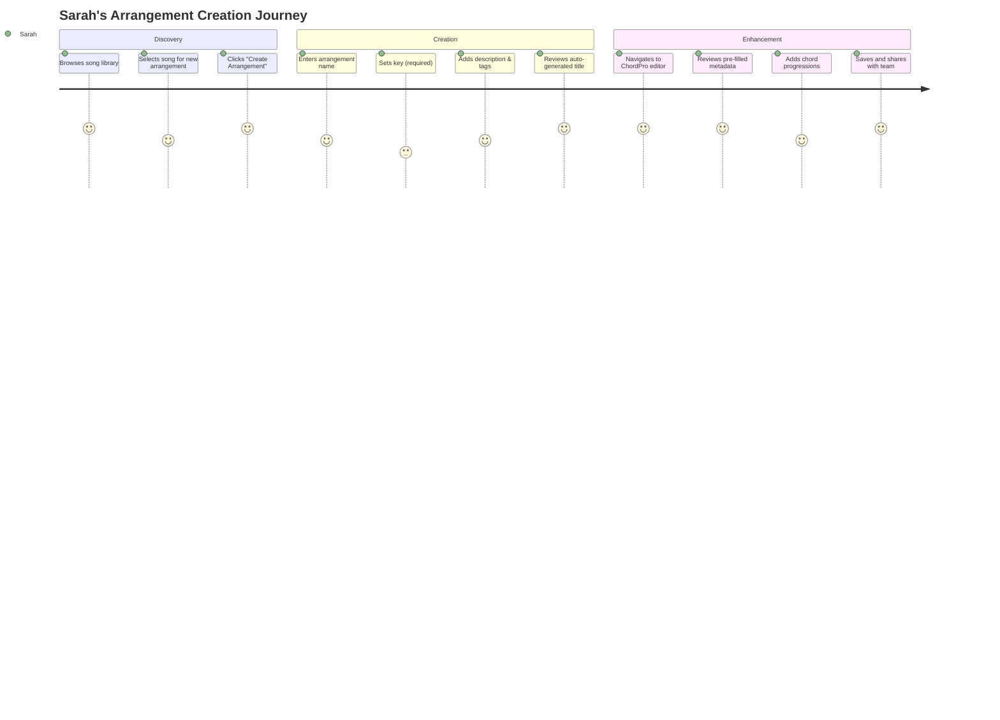
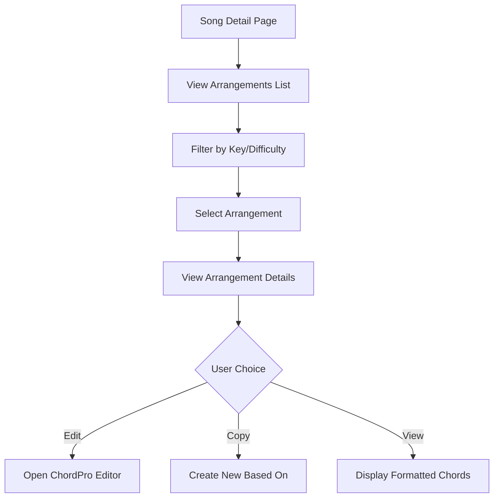
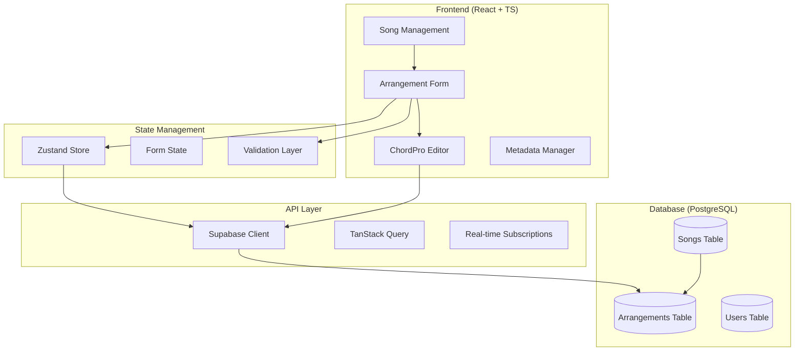

# Product Requirements Document: Arrangement Management System

## 1. Executive Summary

### Problem Statement
The HSA Songbook currently manages songs effectively but lacks a comprehensive system for creating, managing, and organizing multiple musical arrangements of the same song. Users need the ability to create different chord arrangements with varying keys, tempos, difficulty levels, and musical interpretations while maintaining a seamless workflow from arrangement creation to ChordPro editing.

### Proposed Solution
Develop an integrated arrangement management system that extends the existing song management functionality with:
- Structured arrangement creation workflow with auto-generated titles
- Musical metadata management (key, tempo, time signature, difficulty, tags)
- Seamless integration with existing ChordPro editor
- Pre-population capabilities for common songs from database
- Multi-user arrangement contributions with proper permissions

### Success Criteria
- **User Adoption**: 80% of active users create at least one arrangement within 30 days
- **Workflow Efficiency**: Average time from song selection to ChordPro editor reduced to <2 minutes
- **Data Quality**: 90% of arrangements have complete musical metadata (key, difficulty, tags)
- **User Satisfaction**: >4.5/5 rating for arrangement creation experience

### Resource Requirements
- **Development**: 6-8 weeks (Phase 1), 13-18 weeks (Complete System)
- **Design**: Leverage existing UI patterns with music-specific enhancements
- **Database**: Extend current PostgreSQL schema (already architected)
- **Testing**: Comprehensive validation with music directors and worship teams

## 2. Market Analysis

### Market Opportunity
The music arrangement management software market shows strong growth potential:
- **Music Software Market**: $4.15B → $17.35B by 2034 (17.22% CAGR)
- **Church Management Software**: $246.9M → $517.81M by 2032 (9.7% CAGR)
- **Worship-Specific Solutions**: Significantly underserved with existing tools being either too general (MuseScore, Sibelius) or too limited (OnSong, basic chord chart apps)

### Competitive Landscape

#### Direct Competitors
- **Planning Center Services**: $14-21/month, limited arrangement customization
- **OnSong**: $29.99 one-time, iOS only, basic chord management
- **WorshipTools Charts**: Specialized but limited collaborative features

#### Indirect Competitors
- **MuseScore**: Free but lacks worship-specific workflows
- **Ultimate Guitar**: Consumer-focused, not designed for worship teams
- **Sibelius/Finale**: Professional notation software, complex and expensive

### Market Gaps Addressed
1. **Worship-First Design**: Purpose-built for church music teams
2. **Collaborative Arrangement Creation**: Multiple users contributing arrangements
3. **Intelligent Metadata Management**: Auto-generation with musical context
4. **Seamless Chord Editing Integration**: Direct pathway to ChordPro editor
5. **Cost-Effective Solution**: Avoiding expensive professional notation software

### Target User Segments

#### Primary Users
1. **Worship Leaders & Music Directors** (High-value, underserved)
   - Need: Organized arrangement management with team coordination
   - Pain Points: Manual arrangement tracking, key management complexity
   - Size: 300,000+ churches in US

2. **Church Musicians & Volunteers** (Volume segment)
   - Need: Easy contribution to song arrangements
   - Pain Points: Technical barriers, permission complexities
   - Growth: Expanding volunteer engagement

#### Secondary Users
3. **Music Educators** (Future expansion)
   - Need: Teaching-friendly arrangement tools
   - Opportunity: Educational market integration

## 3. User Experience Design

### User Personas and Journey Mapping

#### Primary Persona: Sarah (Worship Leader)
**Goals**: Quick arrangement creation, team coordination, flexible key management
**Frustrations**: Time-consuming setup, inconsistent arrangement formats
**Success Metrics**: Reduced prep time, increased team engagement

**User Journey**:


#### Secondary Persona: Mike (Church Musician)
**Goals**: Contribute arrangements, learn from others, build reputation
**Frustrations**: Complex interfaces, unclear permissions
**Success Metrics**: Easy contribution, positive peer feedback

### Key User Flows

#### Core Flow 1: Create New Arrangement
```mermaid
flowchart TD
    A[Select Song] --> B[Click "Add Arrangement"]
    B --> C[Arrangement Creation Form]
    C --> D{Form Validation}
    D -->|Invalid| E[Show Validation Errors]
    E --> C
    D -->|Valid| F[Create Arrangement Record]
    F --> G[Auto-generate Full Title]
    G --> H[Navigate to ChordPro Editor]
    H --> I[Pre-fill Metadata Directives]
    I --> J[User Completes Arrangement]
```

#### Core Flow 2: Browse & Select Arrangements


### UI/UX Requirements

#### Form Design Patterns
**Progressive Disclosure Architecture**:
- **Level 1**: Essential fields (Arrangement Name, Key, Difficulty)
- **Level 2**: Musical metadata (Tempo, Time Signature, Tags)
- **Level 3**: Advanced options (Description, Notes, Capo)

#### Visual Design Standards
- **Consistent with existing song forms**: Leverage current styling patterns
- **Music-specific icons**: Key signatures, tempo indicators, difficulty badges
- **Accessibility first**: Full keyboard navigation, screen reader support
- **Mobile responsive**: Touch-optimized for tablet use during rehearsals

#### Intelligent Defaults & Suggestions
- **Auto-complete**: Arrangement names based on existing patterns
- **Tag suggestions**: Popular arrangement tags from existing data
- **Key recommendations**: Based on song's previous arrangements
- **Template options**: Common song structures (verse-chorus-bridge)

### Error Handling & Validation
- **Real-time validation**: Field-level feedback as user types
- **Musical constraint validation**: Key/tempo range checking
- **Duplicate prevention**: Similar arrangement name detection
- **Graceful degradation**: Form works even if auto-suggestions fail

## 4. Technical Architecture

### System Architecture Overview


### Database Design

#### Existing Schema Enhancement
The current database schema already supports arrangements perfectly:

```sql
-- Arrangements table (existing, well-designed)
CREATE TABLE arrangements (
  id UUID PRIMARY KEY DEFAULT gen_random_uuid(),
  name VARCHAR(255) NOT NULL,
  song_id UUID NOT NULL REFERENCES songs(id) ON DELETE CASCADE,
  slug VARCHAR(255) UNIQUE NOT NULL,
  chord_data TEXT NOT NULL,
  
  -- Musical metadata (existing fields)
  key VARCHAR(10),           -- REQUIRED for transposition
  tempo INTEGER,             -- OPTIONAL
  time_signature VARCHAR(10) DEFAULT '4/4',  -- DEFAULT to 4/4
  difficulty VARCHAR(20) CHECK (difficulty IN ('beginner', 'intermediate', 'advanced')),
  description TEXT,
  tags TEXT[],
  
  -- Metadata
  created_by UUID REFERENCES users(id),
  created_at TIMESTAMPTZ DEFAULT NOW(),
  updated_at TIMESTAMPTZ DEFAULT NOW(),
  is_public BOOLEAN DEFAULT false,
  views INTEGER DEFAULT 0
);
```

**Required Enhancements**:
- Add validation constraint to ensure `key` is NOT NULL
- Index optimization for arrangement queries by song_id + key + difficulty

### Technology Stack Assessment

#### Current Stack (Recommended to Continue)
- ✅ **React 19.1 + TypeScript 5.8**: Excellent for complex form interactions
- ✅ **Vite 7.0**: Fast development with HMR for rapid iteration
- ✅ **Supabase PostgreSQL**: Optimal for music metadata relationships
- ✅ **ChordSheetJS 12.3.1**: Mature ChordPro parsing with active community
- ✅ **Zod validation**: Already proven for song form validation

#### Recommended Additions
- **tonal.js**: Music theory calculations for key validation and suggestions
- **Zustand**: Lightweight state management for complex arrangement workflows
- **React Hook Form v7**: Enhanced form performance for music metadata

### API Design

#### New Endpoints Required
```typescript
// Arrangement Management APIs
POST /api/arrangements                    // Create arrangement
GET  /api/arrangements/:id               // Get arrangement details
PUT  /api/arrangements/:id               // Update arrangement
DELETE /api/arrangements/:id             // Delete arrangement (own arrangements only)

// Song-Arrangement Relationship APIs
GET  /api/songs/:songId/arrangements     // List arrangements for song
POST /api/songs/:songId/arrangements     // Create arrangement for specific song

// Metadata & Suggestions APIs
GET  /api/arrangements/suggestions/names // Get arrangement name suggestions
GET  /api/arrangements/suggestions/tags  // Get tag suggestions
GET  /api/songs/:songId/chordpro-template // Get pre-filled ChordPro template
```

#### Response Schemas
```typescript
interface ArrangementResponse {
  id: string
  name: string
  song_id: string
  song: {
    title: string
    artist: string
  }
  auto_generated_title: string // "[song-name] - [arrangement-name]"
  key: string                  // REQUIRED
  tempo?: number              // OPTIONAL
  time_signature: string      // DEFAULT '4/4'
  difficulty: 'beginner' | 'intermediate' | 'advanced'
  description?: string
  tags: string[]
  created_by: string
  created_at: string
  updated_at: string
  is_public: boolean
}
```

### Integration Points

#### ChordPro Editor Integration
```typescript
interface ChordProEditorProps {
  arrangementId: string
  prefilledContent: {
    title: string           // Auto-generated: "[Song Name] - [Arrangement Name]"
    key: string            // From arrangement metadata
    tempo?: number         // From arrangement metadata (if provided)
    artist?: string        // From parent song
    composer?: string      // From parent song
    template?: string      // Common song database integration (future)
  }
}
```

#### Auto-suggestion Integration
- **Arrangement Name Patterns**: Analyze existing arrangements to suggest naming conventions
- **Musical Key Suggestions**: Based on song's existing arrangements and user preferences
- **Tag Auto-complete**: Popular tags from similar arrangements and songs
- **Common Songs Database**: Integration point for pre-filling lyrics and chord progressions

### Performance Considerations

#### Database Optimization
- **Composite indexes**: `(song_id, is_public)`, `(created_by, created_at)`
- **Full-text search**: GIN index on arrangement names and descriptions
- **Query patterns**: Optimize for song-detail page loading all arrangements

#### Caching Strategy
- **Browser cache**: Arrangement metadata for recently viewed songs
- **Supabase cache**: Automatic query result caching for arrangement lists
- **Real-time updates**: WebSocket subscriptions for collaborative editing

#### Scalability Targets
- **Arrangements per song**: Support 50+ arrangements per popular song
- **Concurrent users**: 100+ users creating arrangements simultaneously
- **Response time**: <200ms for arrangement creation, <100ms for list loading

## 5. Security & Compliance

### Data Privacy & Security

#### User Data Protection
- **Personal Information**: Arrangement creation history, musical preferences
- **Content Ownership**: Clear attribution for user-generated arrangements
- **Privacy Controls**: Users can mark arrangements as private vs public
- **Data Retention**: Arrangements preserved even if user deactivates account

#### GDPR Compliance Requirements
- **Explicit Consent**: Clear opt-in for arrangement sharing and collaboration features
- **Data Minimization**: Collect only necessary musical metadata
- **User Rights**: Full data export, deletion, and correction capabilities
- **Privacy by Design**: Default private arrangements, user controls visibility

#### Content Security
- **Copyright Considerations**: Clear guidelines about arrangement vs original composition rights
- **User-Generated Content**: Moderation tools for inappropriate content
- **Attribution Requirements**: Proper crediting of arrangement creators
- **DMCA Compliance**: Takedown procedures for copyright infringement claims

### Access Control & Permissions

#### User Permission Matrix
```typescript
interface ArrangementPermissions {
  create: boolean      // Any authenticated user
  read: boolean        // Public arrangements: all users, Private: creator + collaborators
  update: boolean      // Creator + admins
  delete: boolean      // Creator + admins
  collaborate: boolean // Future feature: shared editing
}
```

#### Security Implementation
- **Row Level Security**: Supabase RLS policies for arrangement access
- **Input Validation**: Server-side validation for all musical metadata
- **Rate Limiting**: Prevent spam arrangement creation
- **Audit Logging**: Track arrangement creation, modification, and deletion

### ChordPro Format Standards Compliance

#### ChordPro 6.0 Specification
- **Strict Mode Validation**: Ensure chord names follow accepted standards
- **Metadata Directives**: Support all standard ChordPro directives
- **Unicode Support**: International character compatibility
- **Version Compatibility**: Backward compatibility with existing arrangements

#### Quality Assurance Standards
- **Automated Validation**: Real-time ChordPro syntax checking
- **Musical Constraint Validation**: Key signatures, chord progressions
- **Performance Benchmarks**: <50ms chord recognition, <10ms UI updates
- **Testing Framework**: Comprehensive test suite for musical accuracy

## 6. Implementation Plan

### Development Phases

#### Phase 1: Core Arrangement Management (4-6 weeks)
**Week 1-2: Foundation**
- Extend existing form validation patterns for arrangement metadata
- Implement ArrangementManagementForm component following SongManagementForm patterns
- Create arrangement CRUD operations with Supabase integration

**Week 3-4: Musical Metadata Integration**
- Key signature validation and selection UI
- Time signature and difficulty level management
- Tags system with auto-suggestion (leveraging existing themes pattern)

**Week 5-6: ChordPro Editor Integration**
- Auto-title generation: "[Song Name] - [Arrangement Name]"
- Pre-fill ChordPro editor with arrangement metadata
- Navigation workflow from arrangement creation to editing

#### Phase 2: Enhanced User Experience (4-6 weeks)
**Week 7-8: Advanced Metadata Features**
- Intelligent arrangement name suggestions
- Musical key recommendations based on song history
- Tempo and capo position management

**Week 9-10: User Interface Polish**
- Responsive design optimization for mobile/tablet
- Accessibility enhancements for music software standards
- Performance optimization for large arrangement lists

**Week 11-12: Collaboration Features**
- Multi-user arrangement permissions
- Arrangement browsing and discovery
- Basic rating/feedback system (foundation)

#### Phase 3: Advanced Features & Optimization (4-6 weeks)
**Week 13-15: Advanced Integrations**
- Common songs database integration for pre-filling
- Advanced ChordPro template generation
- Batch arrangement operations

**Week 16-18: Performance & Polish**
- Database query optimization
- Advanced search and filtering
- Comprehensive testing with music teams

### Dependencies and Prerequisites

#### Technical Dependencies
- ✅ **Existing codebase**: Song management system already complete
- ✅ **Database schema**: Arrangements table already designed and implemented
- ✅ **ChordPro integration**: Parser and editor already functional
- ✅ **Authentication system**: User management via Supabase Auth

#### New Dependencies Required
- **tonal.js**: Music theory calculations (lightweight, 50KB)
- **Additional Zod schemas**: For arrangement validation
- **Enhanced form patterns**: Extended from existing song form patterns

#### Risks and Mitigation
1. **Music Theory Complexity**: Risk of over-engineering musical features
   - *Mitigation*: Start simple, iterate based on user feedback
   
2. **ChordPro Editor Integration**: Complex state management between form and editor
   - *Mitigation*: Leverage existing patterns, use proven state libraries

3. **User Experience Complexity**: Too many options overwhelming users
   - *Mitigation*: Progressive disclosure, intelligent defaults

### Timeline Estimates

#### Conservative Timeline (18 weeks)
- **Phase 1**: 6 weeks (Foundation + Core Features)
- **Phase 2**: 6 weeks (UX Enhancement + Collaboration)
- **Phase 3**: 6 weeks (Advanced Features + Optimization)

#### Aggressive Timeline (13 weeks)
- **Phase 1**: 4 weeks (Rapid core development leveraging existing patterns)
- **Phase 2**: 4 weeks (Focused on essential UX improvements)
- **Phase 3**: 5 weeks (Performance optimization and testing)

#### Recommended Approach: **Phased Release Strategy**
- **MVP Release** (6 weeks): Core arrangement creation with ChordPro integration
- **Enhanced Release** (12 weeks): Full UX polish and collaboration features
- **Complete Release** (18 weeks): Advanced features and optimization

## 7. Success Metrics & KPIs

### User Adoption Metrics
- **Primary KPI**: 80% of active users create ≥1 arrangement within 30 days
- **Engagement**: Average 3.5 arrangements created per user per month
- **Retention**: 90% of arrangement creators return within 7 days
- **Growth**: 25% month-over-month increase in arrangement creation

### User Experience Metrics
- **Task Completion**: 95% arrangement creation success rate
- **Time to Value**: <2 minutes from song selection to ChordPro editor
- **User Satisfaction**: >4.5/5 rating for arrangement creation experience
- **Error Rate**: <5% form validation failures on submission

### Technical Performance Metrics
- **Response Time**: <200ms arrangement creation, <100ms list loading
- **System Reliability**: 99.9% uptime for arrangement management features
- **Data Quality**: 90% arrangements have complete musical metadata
- **Search Performance**: <50ms arrangement search results

### Business Impact Metrics
- **Feature Utilization**: 75% of arrangements include key and difficulty metadata
- **Content Quality**: Average 4.0+ rating for user-generated arrangements
- **Platform Stickiness**: 40% increase in daily active users post-launch
- **User Feedback**: Net Promoter Score >50 for arrangement features

## 8. Risk Assessment & Mitigation

### Technical Risks

#### High-Impact Risks
1. **ChordPro Editor Integration Complexity**
   - *Risk*: Complex state synchronization between form and editor
   - *Probability*: Medium
   - *Mitigation*: Leverage existing patterns, extensive testing, phased rollout

2. **Database Performance with Large Arrangement Collections**
   - *Risk*: Slow queries when songs have 50+ arrangements
   - *Probability*: Low (good existing architecture)
   - *Mitigation*: Query optimization, pagination, indexed searches

#### Medium-Impact Risks
3. **Musical Metadata Validation Complexity**
   - *Risk*: Over-engineering music theory validation
   - *Probability*: Medium
   - *Mitigation*: Start simple, use established libraries (tonal.js)

4. **User Permission System Complexity**
   - *Risk*: Confusing permissions for arrangement creation/editing
   - *Probability*: Low (simple rules defined)
   - *Mitigation*: Clear documentation, user testing, simple permission model

### User Experience Risks

#### High-Impact Risks
1. **Form Complexity Overwhelming Users**
   - *Risk*: Too many musical options confusing non-technical users
   - *Probability*: Medium
   - *Mitigation*: Progressive disclosure, intelligent defaults, user testing

2. **Workflow Disruption from Existing Patterns**
   - *Risk*: New arrangement flow confusing existing users
   - *Probability*: Low (extends existing patterns)
   - *Mitigation*: Consistent design patterns, optional feature introduction

#### Low-Impact Risks
3. **Mobile/Tablet Usability Issues**
   - *Risk*: Complex form difficult on mobile devices
   - *Probability*: Low (responsive design planned)
   - *Mitigation*: Mobile-first design, touch optimization

### Business Risks

1. **Low User Adoption**
   - *Risk*: Users don't understand value of multiple arrangements
   - *Probability*: Low (clear user need identified)
   - *Mitigation*: User education, clear value proposition, progressive onboarding

2. **Copyright Complexity**
   - *Risk*: Legal issues with arrangement sharing
   - *Probability*: Low (educational/worship use exemptions)
   - *Mitigation*: Clear terms of service, user education, legal compliance

## 9. Quality Assurance Strategy

### Testing Framework

#### Unit Testing
- **Form Validation**: Comprehensive Zod schema testing
- **Musical Metadata**: Key validation, tempo ranges, chord recognition
- **Auto-generation Logic**: Title generation, suggestion algorithms
- **State Management**: Form state transitions and persistence

#### Integration Testing
- **Database Operations**: CRUD operations for arrangements
- **API Endpoints**: Full request/response cycle testing
- **ChordPro Integration**: Metadata pre-filling, editor navigation
- **User Permissions**: Access control across different user roles

#### End-to-End Testing
- **Complete Workflows**: Song selection → arrangement creation → ChordPro editing
- **Cross-browser Compatibility**: Chrome, Firefox, Safari, Edge
- **Mobile Responsiveness**: iOS Safari, Android Chrome, tablet interfaces
- **Performance Testing**: Large arrangement collections, concurrent users

#### User Acceptance Testing
- **Music Directors**: Real worship leaders testing complete workflows
- **Church Musicians**: Volunteer users testing arrangement contribution
- **Accessibility Testing**: Screen readers, keyboard navigation, color contrast
- **Usability Testing**: Task completion rates, user satisfaction surveys

### Quality Gates

#### Pre-Development Validation
- ✅ Technical architecture review completed
- ✅ Database schema validation confirmed
- ✅ UI/UX patterns consistent with existing system
- ✅ Security requirements documented

#### Development Milestones
- **Week 2**: Core form functionality with validation
- **Week 4**: ChordPro editor integration working
- **Week 6**: MVP complete with essential features
- **Week 8**: User testing feedback incorporated
- **Week 12**: Performance optimization complete

#### Pre-Release Validation
- [ ] All automated tests passing (95%+ coverage)
- [ ] Performance benchmarks met (<200ms response times)
- [ ] Accessibility standards compliance (WCAG 2.1 AA)
- [ ] User acceptance testing with 10+ worship leaders
- [ ] Security audit completed
- [ ] Documentation complete

## 10. Conclusion & Next Steps

### Implementation Readiness Assessment

The HSA Songbook is excellently positioned for arrangement management implementation:

#### ✅ **Strong Foundation**
- Mature React + TypeScript + Supabase architecture
- Existing ChordPro integration with parsing and validation
- Well-designed database schema already supporting arrangements
- Proven form patterns with validation and user experience

#### ✅ **Clear Requirements**
- Specific user needs identified through market research
- Technical requirements clearly defined and achievable
- User experience patterns established and tested
- Performance and security standards documented

#### ✅ **Strategic Alignment**
- Addresses significant market opportunity in worship technology
- Leverages existing technical investments
- Positions platform for competitive differentiation
- Creates foundation for future collaboration features

### Recommended Next Steps

#### Immediate Actions (Week 1)
1. **Technical Setup**
   - Add `tonal.js` dependency for music theory validation
   - Create arrangement management component structure
   - Implement basic arrangement CRUD operations

2. **Database Enhancements**
   - Add NOT NULL constraint to arrangements.key column
   - Create optimized indexes for arrangement queries
   - Set up development data with sample arrangements

3. **Development Planning**
   - Set up project tracking with defined milestones
   - Establish testing environment with music-specific test data
   - Create development branch for arrangement management features

#### Week 2-6: MVP Development
- Follow Phase 1 implementation plan
- Focus on core functionality with existing UI patterns
- Implement ChordPro editor integration with metadata pre-filling
- Conduct weekly user feedback sessions with worship leaders

#### Week 6-12: Enhancement & Polish
- Complete Phase 2 user experience improvements
- Implement advanced features based on user feedback
- Optimize performance for large arrangement collections
- Prepare for production deployment

### Success Measurement Plan
- **Weekly metrics review**: Track user adoption and engagement
- **Monthly user feedback**: Direct input from worship leaders and musicians
- **Quarterly business review**: Assess impact on platform growth and user satisfaction
- **Continuous optimization**: Iterative improvements based on real usage patterns

### Long-term Vision Alignment
This arrangement management system creates the foundation for:
- **Advanced collaboration features**: Real-time collaborative editing
- **AI-powered suggestions**: Intelligent chord progression recommendations
- **Integration ecosystem**: Connections with CCLI, Planning Center, and other worship tools
- **Mobile optimization**: Native mobile app for rehearsal and performance use

**The arrangement management system represents a strategic investment in the HSA Songbook's position as the leading worship music platform, addressing real user needs while building sustainable competitive advantages.**

---

*This PRD provides the comprehensive blueprint for implementing arrangement management in the HSA Songbook, ensuring successful delivery through detailed requirements, technical architecture, and implementation planning.*