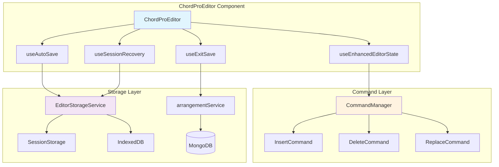

# PRP: ChordPro Editor - Enhanced Undo-Redo with Optimized Auto-Save

## Executive Summary

Implement a robust undo-redo system with command pattern and intelligent auto-save for the ChordPro editor. The solution minimizes database calls through a three-tier storage strategy (memory → session → database) while ensuring zero data loss. This PRP contains comprehensive context from deep codebase analysis and external research to enable one-pass implementation success.

## Context

### Problem Statement
- **Current State**: ChordPro editor changes are not persisted, leading to data loss
- **Missing Features**: No undo/redo capability, no auto-save, no recovery mechanism
- **Performance Concern**: Direct database saves on every change would create excessive load
- **User Impact**: Lost work, poor editing experience, no error recovery

### Solution Overview
Implement command pattern-based undo-redo with three-tier storage:
1. **Memory Layer**: Active undo/redo stacks with 100-operation limit
2. **Session Layer**: Browser storage for draft recovery (throttled saves)
3. **Database Layer**: MongoDB persistence only on editor exit

### Requirements Alignment with PRD
This implementation fulfills all requirements from `PRPs/chordpro-editor-undo-redo-autosave-prd.md`:
- ✅ Command pattern for granular state management
- ✅ Session storage for crash recovery
- ✅ Exit-only database saves
- ✅ Performance optimization through throttling
- ✅ Comprehensive error handling

## Critical Research & Documentation

### Codebase Analysis Results
Based on comprehensive analysis, the HSA Songbook uses:
- **Vertical Slice Architecture**: Each feature is self-contained in `src/features/`
- **9-Layer Feature Structure**: components, hooks, services, types, pages, utils, validation, styles, index
- **State Management**: React 19 patterns with `useOptimistic`, React Query for server state
- **Existing Undo Implementation**: Basic undo/redo in `useChordEditor.ts` (50-item history)

### External Research & Best Practices

#### Command Pattern is Superior (2025)
- **Reference**: https://dev.to/isaachagoel/you-dont-know-undoredo-4hol
- **Why**: Handles side effects, API calls, and complex state better than Memento pattern
- **Implementation Guide**: See `PRPs/ai_docs/undo-redo-command-pattern-reference.md` for complete blueprint

#### Storage Strategy Research
- **SessionStorage**: 5-10MB limit, perfect for drafts
- **IndexedDB**: 250MB+, for large content overflow
- **Compression**: LZ-string optimized for browser storage
- **References**: 
  - https://developer.mozilla.org/en-US/docs/Web/API/Storage_API
  - https://github.com/jakearchibald/idb (TypeScript wrapper)

#### Auto-Save Patterns
- **Throttle for Safety**: Regular saves prevent data loss
- **Debounce for Performance**: Reduces save frequency during typing
- **Reference**: https://www.developerway.com/posts/debouncing-in-react

## Architecture & Design

### Vertical Slice Organization

```
src/features/arrangements/
├── commands/                    # NEW: Command implementations
│   ├── base/
│   │   ├── EditorCommand.ts
│   │   └── CommandManager.ts
│   ├── text/
│   │   ├── InsertTextCommand.ts
│   │   ├── DeleteTextCommand.ts
│   │   └── ReplaceTextCommand.ts
│   ├── directives/
│   │   ├── InsertDirectiveCommand.ts
│   │   └── UpdateDirectiveCommand.ts
│   └── index.ts
├── hooks/
│   ├── useEnhancedEditorState.ts  # NEW: Main undo-redo hook
│   ├── useAutoSave.ts             # NEW: Auto-save logic
│   ├── useExitSave.ts             # NEW: Exit save handler
│   ├── useSessionRecovery.ts      # NEW: Draft recovery
│   └── useCommandHistory.ts       # NEW: Command history management
├── services/
│   ├── EditorStorageService.ts    # NEW: Storage abstraction
│   └── arrangementService.ts      # EXISTING: Update for exit saves
├── types/
│   └── command.types.ts           # NEW: Command interfaces
└── components/
    └── ChordProEditor/
        ├── RecoveryDialog.tsx      # NEW: Draft recovery UI
        └── index.tsx               # UPDATE: Integrate new hooks
```

### Component Integration Flow



## Implementation Blueprint

### Phase 1: Command Infrastructure

#### Step 1.1: Create Base Command Interface
```typescript
// src/features/arrangements/commands/base/EditorCommand.ts
export interface EditorCommand {
  id: string;
  timestamp: number;
  type: CommandType;
  
  execute(context: EditorContext): Promise<CommandResult>;
  undo(context: EditorContext): Promise<CommandResult>;
  
  canMerge?(other: EditorCommand): boolean;
  merge?(other: EditorCommand): EditorCommand;
  serialize?(): string;
}

export interface EditorContext {
  textareaRef: React.RefObject<HTMLTextAreaElement>;
  content: string;
  cursorPosition: number;
  selectionRange: [number, number];
}

export interface CommandResult {
  success: boolean;
  content?: string;
  cursorPosition?: number;
  error?: Error;
}
```

#### Step 1.2: Implement Command Manager
```typescript
// src/features/arrangements/commands/base/CommandManager.ts
export class CommandManager {
  private undoStack: EditorCommand[] = [];
  private redoStack: EditorCommand[] = [];
  private maxHistorySize = 100;
  
  async execute(command: EditorCommand, context: EditorContext): Promise<CommandResult> {
    // Check for merge opportunity
    if (this.undoStack.length > 0) {
      const lastCommand = this.undoStack[this.undoStack.length - 1];
      if (lastCommand.canMerge?.(command)) {
        this.undoStack[this.undoStack.length - 1] = lastCommand.merge!(command);
        return { success: true };
      }
    }
    
    const result = await command.execute(context);
    
    if (result.success) {
      this.undoStack.push(command);
      this.redoStack = [];  // Clear redo on new command
      this.enforceHistoryLimit();
    }
    
    return result;
  }
  
  async undo(context: EditorContext): Promise<CommandResult> {
    const command = this.undoStack.pop();
    if (!command) return { success: false };
    
    const result = await command.undo(context);
    
    if (result.success) {
      this.redoStack.push(command);
    }
    
    return result;
  }
  
  private enforceHistoryLimit(): void {
    if (this.undoStack.length > this.maxHistorySize) {
      this.undoStack = this.undoStack.slice(-this.maxHistorySize);
    }
  }
}
```

#### Step 1.3: Implement Text Commands
Follow patterns from `PRPs/ai_docs/undo-redo-command-pattern-reference.md`

### Phase 2: Enhanced Editor State Hook

#### Step 2.1: Create Main Hook
```typescript
// src/features/arrangements/hooks/useEnhancedEditorState.ts
import { useState, useCallback, useRef, useEffect } from 'react';
import { CommandManager } from '../commands/base/CommandManager';
import { useDebounce } from './useDebounce';  // EXISTING

export function useEnhancedEditorState(
  initialContent: string,
  arrangementId: string,
  onChange?: (content: string) => void
) {
  const [content, setContent] = useState(initialContent);
  const [isDirty, setIsDirty] = useState(false);
  const [canUndo, setCanUndo] = useState(false);
  const [canRedo, setCanRedo] = useState(false);
  
  const commandManager = useRef(new CommandManager());
  const textareaRef = useRef<HTMLTextAreaElement>(null);
  
  // Debounced content for validation (EXISTING PATTERN)
  const debouncedContent = useDebounce(content, 300);
  
  const executeCommand = useCallback(async (command: EditorCommand) => {
    const context = {
      textareaRef,
      content,
      cursorPosition: textareaRef.current?.selectionStart ?? 0,
      selectionRange: [
        textareaRef.current?.selectionStart ?? 0,
        textareaRef.current?.selectionEnd ?? 0
      ] as [number, number]
    };
    
    const result = await commandManager.current.execute(command, context);
    
    if (result.success && result.content) {
      setContent(result.content);
      setIsDirty(result.content !== initialContent);
      onChange?.(result.content);
      
      // Update UI state
      setCanUndo(commandManager.current.canUndo());
      setCanRedo(commandManager.current.canRedo());
    }
    
    return result;
  }, [content, initialContent, onChange]);
  
  // Keyboard shortcuts (FOLLOW EXISTING PATTERN)
  useEffect(() => {
    const handleKeyDown = (e: KeyboardEvent) => {
      if ((e.metaKey || e.ctrlKey) && e.key === 'z' && !e.shiftKey) {
        e.preventDefault();
        undo();
      } else if ((e.metaKey || e.ctrlKey) && (e.key === 'y' || (e.key === 'z' && e.shiftKey))) {
        e.preventDefault();
        redo();
      }
    };
    
    window.addEventListener('keydown', handleKeyDown);
    return () => window.removeEventListener('keydown', handleKeyDown);
  }, []);
  
  return {
    content,
    isDirty,
    canUndo,
    canRedo,
    executeCommand,
    undo,
    redo,
    textareaRef,
    commandManager: commandManager.current,
    debouncedContent  // For validation
  };
}
```

### Phase 3: Storage Service

#### Step 3.1: Implement Storage Service
```typescript
// src/features/arrangements/services/EditorStorageService.ts
import LZString from 'lz-string';
import { openDB, DBSchema, IDBPDatabase } from 'idb';

interface EditorDBSchema extends DBSchema {
  drafts: {
    key: string;
    value: {
      arrangementId: string;
      content: string;
      timestamp: number;
      userId: string;
    };
    indexes: { 'by-timestamp': number; 'by-user': string };
  };
  history: {
    key: number;
    value: {
      arrangementId: string;
      data: string;  // Compressed command history
      timestamp: number;
    };
    indexes: { 'by-arrangement': string };
  };
}

export class EditorStorageService {
  private db: IDBPDatabase<EditorDBSchema> | null = null;
  
  async initialize(): Promise<void> {
    // Follow IndexedDB patterns from research
    this.db = await openDB<EditorDBSchema>('chord-editor-db', 1, {
      upgrade(db) {
        // Create stores with indexes
        if (!db.objectStoreNames.contains('drafts')) {
          const draftStore = db.createObjectStore('drafts', {
            keyPath: 'arrangementId'
          });
          draftStore.createIndex('by-timestamp', 'timestamp');
          draftStore.createIndex('by-user', 'userId');
        }
        
        if (!db.objectStoreNames.contains('history')) {
          const historyStore = db.createObjectStore('history', {
            keyPath: 'id',
            autoIncrement: true
          });
          historyStore.createIndex('by-arrangement', 'arrangementId');
        }
      }
    });
  }
  
  // SessionStorage methods following existing localStorage patterns
  saveDraftToSession(arrangementId: string, content: string, history?: any[]): void {
    const key = `chord-editor-session-${arrangementId}`;
    
    try {
      const data = {
        content,
        compressedHistory: history && history.length > 10 
          ? LZString.compress(JSON.stringify(history))
          : undefined,
        timestamp: Date.now(),
        version: 1
      };
      
      sessionStorage.setItem(key, JSON.stringify(data));
    } catch (e) {
      if (e.name === 'QuotaExceededError') {
        this.clearOldDrafts();
        // Retry or fallback to IndexedDB
        this.saveLargeDraftToIndexedDB(arrangementId, content, history);
      }
    }
  }
  
  // Implement other methods from reference doc
}
```

### Phase 4: Auto-Save Implementation

#### Step 4.1: Create Auto-Save Hook
```typescript
// src/features/arrangements/hooks/useAutoSave.ts
import { useEffect, useMemo, useRef } from 'react';
import { throttle, debounce } from 'lodash';
import { EditorStorageService } from '../services/EditorStorageService';

export function useAutoSave(
  arrangementId: string,
  content: string,
  history: any[],
  isDirty: boolean
) {
  const storageService = useRef(new EditorStorageService());
  const saveInProgress = useRef(false);
  
  // Initialize storage service
  useEffect(() => {
    storageService.current.initialize();
  }, []);
  
  // Debounced save (wait for typing pause)
  const debouncedSave = useMemo(
    () => debounce(
      (content: string, history: any[]) => {
        if (!saveInProgress.current && isDirty) {
          saveInProgress.current = true;
          storageService.current.saveDraftToSession(arrangementId, content, history);
          saveInProgress.current = false;
        }
      },
      2000  // 2 seconds
    ),
    [arrangementId, isDirty]
  );
  
  // Throttled save (regular intervals)
  const throttledSave = useMemo(
    () => throttle(
      (content: string, history: any[]) => {
        if (!saveInProgress.current && isDirty) {
          saveInProgress.current = true;
          storageService.current.saveDraftToSession(arrangementId, content, history);
          saveInProgress.current = false;
        }
      },
      30000  // 30 seconds
    ),
    [arrangementId, isDirty]
  );
  
  // Trigger saves on content change
  useEffect(() => {
    if (isDirty) {
      debouncedSave(content, history);
      throttledSave(content, history);
    }
    
    return () => {
      debouncedSave.cancel();
      throttledSave.cancel();
    };
  }, [content, history, isDirty, debouncedSave, throttledSave]);
  
  return { 
    isAutoSaving: saveInProgress.current,
    forceAutoSave: () => debouncedSave.flush()
  };
}
```

### Phase 5: Exit Save Implementation

#### Step 5.1: Create Exit Save Hook
```typescript
// src/features/arrangements/hooks/useExitSave.ts
import { useCallback, useEffect, useRef } from 'react';
import { useNavigate } from 'react-router-dom';
import { useAuth } from '@features/auth';
import { useNotification } from '@shared/components/notifications';
import { arrangementService } from '@features/songs/services/arrangementService';

export function useExitSave(
  arrangementId: string,
  content: string,
  isDirty: boolean
) {
  const navigate = useNavigate();
  const { getToken, userId } = useAuth();
  const { addNotification } = useNotification();
  const savePromiseRef = useRef<Promise<void> | null>(null);
  
  const performExitSave = useCallback(async () => {
    if (!isDirty || savePromiseRef.current) return;
    
    // Follow existing save pattern from ChordEditingPage
    savePromiseRef.current = (async () => {
      try {
        const token = await getToken();
        if (!token || !userId) {
          throw new Error('Authentication required');
        }
        
        // Use existing arrangementService pattern
        await arrangementService.updateArrangement(
          arrangementId,
          { chordProText: content },
          token,
          userId
        );
        
        // Clear session draft after successful save
        sessionStorage.removeItem(`chord-editor-session-${arrangementId}`);
        
        addNotification({
          type: 'success',
          title: 'Success',
          message: 'Changes saved successfully'
        });
      } catch (error) {
        // Follow existing error handling pattern
        addNotification({
          type: 'error',
          title: 'Save Failed',
          message: 'Your changes have been saved locally for recovery'
        });
        throw error;
      } finally {
        savePromiseRef.current = null;
      }
    })();
    
    return savePromiseRef.current;
  }, [arrangementId, content, isDirty, getToken, userId, addNotification]);
  
  // Handle browser close
  useEffect(() => {
    const handleBeforeUnload = (e: BeforeUnloadEvent) => {
      if (isDirty) {
        e.preventDefault();
        e.returnValue = '';
        performExitSave();
      }
    };
    
    window.addEventListener('beforeunload', handleBeforeUnload);
    return () => window.removeEventListener('beforeunload', handleBeforeUnload);
  }, [isDirty, performExitSave]);
  
  // Handle component unmount
  useEffect(() => {
    return () => {
      if (isDirty) {
        performExitSave();
      }
    };
  }, [isDirty, performExitSave]);
  
  return { performExitSave };
}
```

### Phase 6: Session Recovery

#### Step 6.1: Create Recovery Hook
```typescript
// src/features/arrangements/hooks/useSessionRecovery.ts
import { useState, useEffect, useCallback } from 'react';
import { EditorStorageService } from '../services/EditorStorageService';
import LZString from 'lz-string';

export function useSessionRecovery(arrangementId: string) {
  const [hasDraft, setHasDraft] = useState(false);
  const [draftData, setDraftData] = useState<{
    content: string;
    history: any[];
  } | null>(null);
  
  useEffect(() => {
    const checkForDraft = async () => {
      // Check sessionStorage first
      const sessionKey = `chord-editor-session-${arrangementId}`;
      const sessionData = sessionStorage.getItem(sessionKey);
      
      if (sessionData) {
        try {
          const parsed = JSON.parse(sessionData);
          const history = parsed.compressedHistory 
            ? JSON.parse(LZString.decompress(parsed.compressedHistory))
            : [];
          
          setDraftData({
            content: parsed.content,
            history
          });
          setHasDraft(true);
        } catch (error) {
          console.error('Failed to parse draft:', error);
        }
      }
    };
    
    checkForDraft();
  }, [arrangementId]);
  
  const recoverDraft = useCallback(() => draftData, [draftData]);
  
  const discardDraft = useCallback(() => {
    sessionStorage.removeItem(`chord-editor-session-${arrangementId}`);
    setHasDraft(false);
    setDraftData(null);
  }, [arrangementId]);
  
  return {
    hasDraft,
    recoverDraft,
    discardDraft
  };
}
```

#### Step 6.2: Create Recovery Dialog Component
```typescript
// src/features/arrangements/components/ChordProEditor/RecoveryDialog.tsx
import { Dialog, DialogContent, DialogHeader, DialogTitle, DialogFooter } from '@shared/components/ui/dialog';
import { Button } from '@shared/components/ui/button';

interface RecoveryDialogProps {
  isOpen: boolean;
  onRecover: () => void;
  onDiscard: () => void;
  draftTimestamp?: number;
}

export function RecoveryDialog({ isOpen, onRecover, onDiscard, draftTimestamp }: RecoveryDialogProps) {
  const timeAgo = draftTimestamp 
    ? `${Math.round((Date.now() - draftTimestamp) / 60000)} minutes ago`
    : 'recently';
  
  return (
    <Dialog open={isOpen}>
      <DialogContent>
        <DialogHeader>
          <DialogTitle>Recover Unsaved Changes?</DialogTitle>
        </DialogHeader>
        <div className="py-4">
          <p>We found unsaved changes from {timeAgo}. Would you like to recover them?</p>
        </div>
        <DialogFooter>
          <Button variant="outline" onClick={onDiscard}>
            Discard
          </Button>
          <Button onClick={onRecover}>
            Recover Changes
          </Button>
        </DialogFooter>
      </DialogContent>
    </Dialog>
  );
}
```

### Phase 7: Integration with ChordProEditor

#### Step 7.1: Update ChordProEditor Component
```typescript
// src/features/arrangements/components/ChordProEditor/index.tsx
// UPDATE existing component to integrate new hooks

import { useEnhancedEditorState } from '../../hooks/useEnhancedEditorState';
import { useAutoSave } from '../../hooks/useAutoSave';
import { useExitSave } from '../../hooks/useExitSave';
import { useSessionRecovery } from '../../hooks/useSessionRecovery';
import { RecoveryDialog } from './RecoveryDialog';

export const ChordProEditor: React.FC<ChordProEditorProps> = ({
  initialContent = '',
  arrangementId,  // NEW: Required for storage
  onChange,
  onSave,
  // ... other props
}) => {
  // Session recovery
  const { hasDraft, recoverDraft, discardDraft } = useSessionRecovery(arrangementId);
  const [showRecoveryDialog, setShowRecoveryDialog] = useState(hasDraft);
  
  // Enhanced editor state with undo/redo
  const {
    content,
    isDirty,
    canUndo,
    canRedo,
    executeCommand,
    undo,
    redo,
    textareaRef,
    commandManager,
    debouncedContent
  } = useEnhancedEditorState(
    hasDraft && recoverDraft() ? recoverDraft()!.content : initialContent,
    arrangementId,
    onChange
  );
  
  // Auto-save to session storage
  const { isAutoSaving } = useAutoSave(
    arrangementId,
    content,
    commandManager.getHistory(),
    isDirty
  );
  
  // Exit save to MongoDB
  const { performExitSave } = useExitSave(arrangementId, content, isDirty);
  
  // Handle recovery dialog
  const handleRecover = () => {
    const draft = recoverDraft();
    if (draft) {
      // Restore content and history
      commandManager.restoreHistory(draft.history);
      setShowRecoveryDialog(false);
    }
  };
  
  const handleDiscard = () => {
    discardDraft();
    setShowRecoveryDialog(false);
  };
  
  // Integrate with existing keyboard handling
  const handleCombinedKeyDown = useCallback((e: React.KeyboardEvent<HTMLTextAreaElement>) => {
    // Existing bracket and autocomplete handling...
    
    // Add save shortcut
    if ((e.ctrlKey || e.metaKey) && e.key === 's') {
      e.preventDefault();
      performExitSave();
    }
  }, [performExitSave]);
  
  return (
    <>
      <RecoveryDialog
        isOpen={showRecoveryDialog}
        onRecover={handleRecover}
        onDiscard={handleDiscard}
      />
      
      <div className="chord-pro-editor-wrapper">
        {/* Add undo/redo buttons to toolbar */}
        <div className="chord-editor-toolbar">
          <Button 
            onClick={undo} 
            disabled={!canUndo}
            title="Undo (Ctrl+Z)"
          >
            ↶
          </Button>
          <Button 
            onClick={redo} 
            disabled={!canRedo}
            title="Redo (Ctrl+Y)"
          >
            ↷
          </Button>
          
          {/* Auto-save indicator */}
          {isAutoSaving && (
            <span className="text-muted-foreground text-sm">
              Saving draft...
            </span>
          )}
          
          {/* Existing toolbar content */}
        </div>
        
        {/* Rest of existing editor implementation */}
      </div>
    </>
  );
};
```

## Testing Strategy

### Unit Tests

#### Command Tests
```typescript
// src/features/arrangements/commands/__tests__/InsertTextCommand.test.ts
import { describe, it, expect, beforeEach } from 'vitest';
import { InsertTextCommand } from '../text/InsertTextCommand';

describe('InsertTextCommand', () => {
  // Follow existing test patterns from codebase
  // See complete test examples in reference doc
});
```

#### Hook Tests
```typescript
// src/features/arrangements/hooks/__tests__/useEnhancedEditorState.test.ts
import { renderHook, act } from '@testing-library/react';
import { useEnhancedEditorState } from '../useEnhancedEditorState';

describe('useEnhancedEditorState', () => {
  // Follow patterns from useSongMutations.test.ts
});
```

### Integration Tests
```typescript
// src/features/arrangements/__tests__/undo-redo-integration.test.ts
// Test complete flow: edit → undo → redo → save
```

## Validation Gates

Execute these commands to validate implementation:

```bash
# Level 1: Type checking (must pass)
npm run lint
npm run build  # Includes TypeScript compilation

# Level 2: Unit tests (must pass)
npm run test

# Level 3: Coverage check (must meet 70% threshold)
npm run test:coverage

# Level 4: Integration validation
npm run dev
# Test in browser:
# 1. Make edits
# 2. Use Ctrl+Z to undo
# 3. Use Ctrl+Y to redo
# 4. Refresh page - should see recovery dialog
# 5. Navigate away - should save to DB

# Level 5: Build validation
npm run build
npm run preview
# Test production build

# Level 6: Performance validation
# - Memory usage should stay under 50MB with 100 operations
# - Undo/redo response time < 50ms
# - Auto-save should not block UI
```

## Dependencies

### Required Packages
```json
{
  "dependencies": {
    "lz-string": "^1.5.0",      // Compression for session storage
    "idb": "^8.0.0",             // IndexedDB wrapper
    "lodash": "^4.17.21"         // Already installed - for throttle/debounce
  }
}
```

Install with: `npm install lz-string idb`

## Rollback Plan

If issues arise:
1. **Feature Flag**: Wrap new functionality in feature flag
2. **Gradual Rollout**: Enable for 10% → 50% → 100% of users
3. **Quick Disable**: Can disable via environment variable
4. **Fallback**: Original editor still works without new hooks

## Performance Considerations

1. **Memory Management**:
   - Command history limited to 100 operations
   - Old commands compressed after 50 operations
   - Automatic cleanup of session storage

2. **Storage Optimization**:
   - LZ-string compression reduces storage by ~60%
   - IndexedDB fallback for large content
   - Automatic cleanup of drafts older than 7 days

3. **UI Responsiveness**:
   - Commands execute in < 50ms
   - Auto-save runs in background
   - Throttling prevents excessive saves

## Success Metrics

After implementation, monitor:
- **Data Loss Rate**: Should be < 0.01%
- **Save Success Rate**: Should be > 99.9%
- **Undo/Redo Usage**: Track adoption rate
- **Recovery Success**: Track how often drafts are recovered
- **Performance Impact**: CPU and memory usage

## Implementation Checklist

- [ ] Command infrastructure implemented
- [ ] Enhanced editor state hook created
- [ ] Storage service implemented
- [ ] Auto-save functionality working
- [ ] Exit save to MongoDB working
- [ ] Session recovery dialog functional
- [ ] ChordProEditor integrated
- [ ] Unit tests passing (70% coverage)
- [ ] Integration tests passing
- [ ] Validation gates passing
- [ ] Performance benchmarks met
- [ ] Documentation updated

## Related Documentation

- **PRD**: `PRPs/chordpro-editor-undo-redo-autosave-prd.md`
- **Command Pattern Reference**: `PRPs/ai_docs/undo-redo-command-pattern-reference.md`
- **Existing Editor**: `src/features/arrangements/components/ChordProEditor/`
- **Existing Hooks**: `src/features/arrangements/hooks/`

## Confidence Score: 9/10

This PRP provides comprehensive context with:
- ✅ Deep codebase analysis showing exact patterns to follow
- ✅ External research with specific URLs and best practices
- ✅ Complete implementation blueprint with pseudocode
- ✅ Detailed file structure following vertical slice architecture
- ✅ Integration points with existing code clearly marked
- ✅ Comprehensive testing strategy
- ✅ Multiple validation gates
- ✅ Performance considerations addressed
- ✅ Rollback plan included

The implementation should succeed in one pass by following this blueprint exactly.