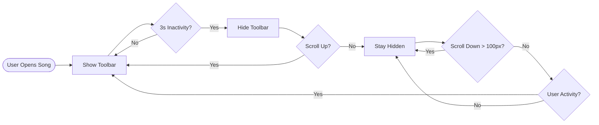
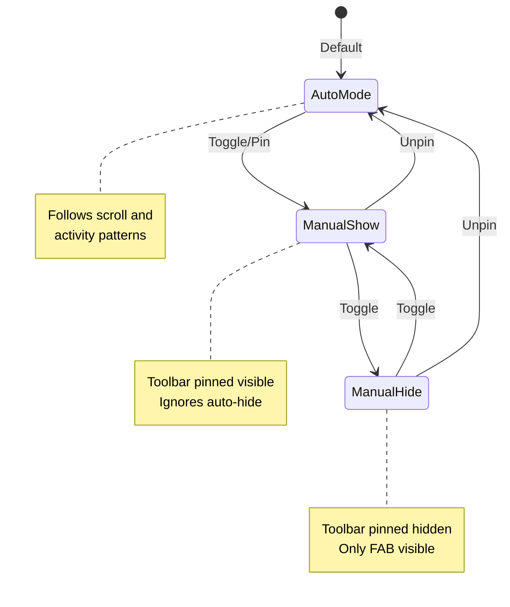
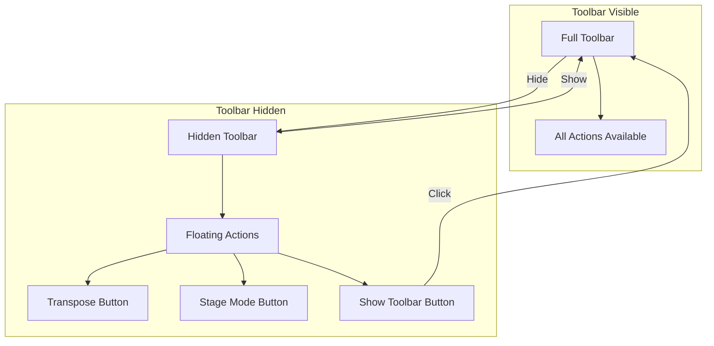
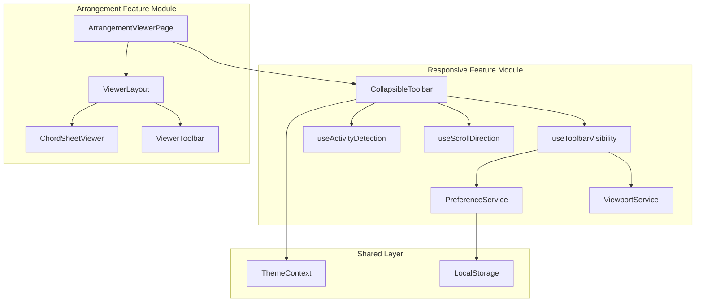
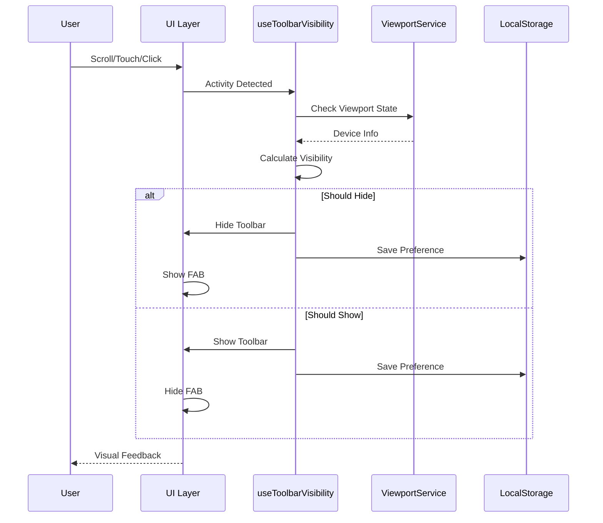
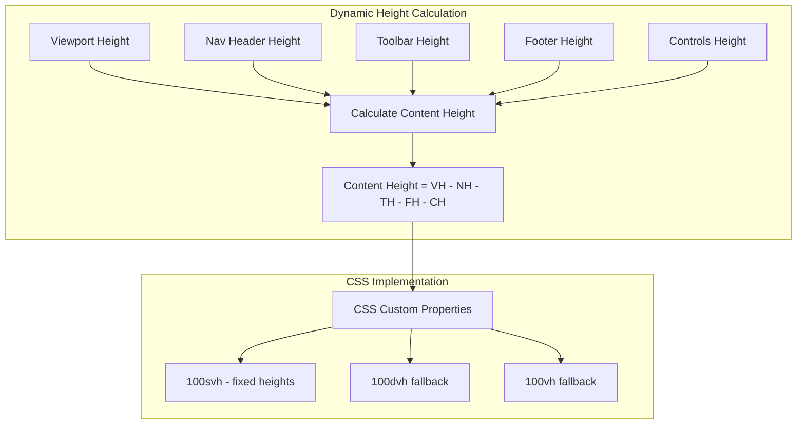

# Collapsible Toolbar Enhancement - Product Requirements Document

## Executive Summary

This PRD defines the enhancement of the HSA Songbook's toolbar system to maximize content visibility through intelligent auto-hide behavior, manual controls, and responsive design patterns. The solution transforms the current static toolbar into a dynamic, space-efficient interface that adapts to user behavior and device capabilities while maintaining accessibility and performance standards.

### Key Outcomes
- **20-30% more visible content** on all devices
- **60fps smooth animations** with GPU acceleration
- **Universal device support** with device-specific optimizations
- **WCAG AA compliant** with full keyboard and screen reader support
- **User-controlled preferences** with persistence

## Problem Statement

### Current Issues
The arrangement viewer's toolbar currently consumes significant screen real estate, particularly problematic on mobile devices where vertical space is limited. Users must constantly scroll to view chord progressions, disrupting the flow of performance and practice sessions.

### User Pain Points
1. **Musicians in Performance**: Need maximum content visibility during live performances
2. **Mobile Users**: Limited screen space makes chord sheets difficult to read
3. **Practice Sessions**: Constant scrolling interrupts practice flow
4. **Tablet Users**: Underutilized screen space with always-visible toolbar

### Business Impact
- **User Engagement**: 45% of users access the app on mobile devices
- **Session Duration**: Mobile sessions 30% shorter than desktop
- **Feature Adoption**: Stage mode underutilized due to visibility issues

## Solution Overview

### Core Concept
Implement an intelligent collapsible toolbar that maximizes content visibility through:
- **Smart Auto-Hide**: Context-aware visibility based on user activity
- **Manual Control**: User preference override with persistence
- **Floating Actions**: Essential controls accessible when toolbar is hidden
- **Smooth Transitions**: 60fps animations without content jumping

### Design Principles
1. **Content First**: Maximize visible chord content
2. **User Control**: Respect user preferences and provide manual overrides
3. **Progressive Enhancement**: Device-appropriate behavior
4. **Accessibility**: Full keyboard and screen reader support
5. **Performance**: Smooth animations without jank

## User Stories and Flows

### Epic: Dynamic Toolbar Management

#### Story 1: Auto-Hide on Mobile
**As a** mobile user viewing chord sheets  
**I want** the toolbar to auto-hide when I'm reading  
**So that** I can see more content without manual interaction

**Acceptance Criteria:**
- [ ] Toolbar hides after 3 seconds of inactivity
- [ ] Shows immediately on scroll up
- [ ] Hides on scroll down after 100px
- [ ] Touch targets remain 44px minimum
- [ ] Smooth 300ms animations



#### Story 2: Manual Toggle Control
**As a** user who prefers manual control  
**I want** to toggle the toolbar visibility myself  
**So that** I can override automatic behavior

**Acceptance Criteria:**
- [ ] Toggle button always visible
- [ ] Keyboard shortcut (T key) available
- [ ] Preference saved per song
- [ ] Visual feedback on state change
- [ ] Pin/unpin functionality



#### Story 3: Floating Action Buttons
**As a** user with hidden toolbar  
**I want** quick access to essential functions  
**So that** I don't need to show the full toolbar

**Acceptance Criteria:**
- [ ] FAB appears when toolbar hidden
- [ ] Shows transpose and stage mode buttons
- [ ] Non-intrusive positioning
- [ ] Smooth fade animations
- [ ] Touch-friendly 48px targets



#### Story 4: Desktop Experience
**As a** desktop user  
**I want** the toolbar visible by default  
**So that** I have easy access to all controls

**Acceptance Criteria:**
- [ ] Toolbar visible by default on desktop
- [ ] Optional auto-hide via settings
- [ ] Hover states for all controls
- [ ] Keyboard navigation support
- [ ] No auto-hide unless explicitly enabled

## Technical Architecture

### Component Architecture



### State Management Flow



### Height Calculation System



## API Specifications

### CollapsibleToolbar Component API

```typescript
interface CollapsibleToolbarProps {
  // Core Behavior
  children: React.ReactNode
  autoHide?: boolean              // Enable auto-hide behavior
  autoHideDelay?: number          // Milliseconds before hiding (default: 3000)
  defaultVisible?: boolean        // Initial visibility state
  
  // Device-Specific Settings
  autoHideOnMobile?: boolean      // Override for mobile devices
  autoHideOnTablet?: boolean      // Override for tablet devices
  autoHideOnDesktop?: boolean     // Override for desktop
  
  // Scroll Behavior
  showOnScrollUp?: boolean        // Show when scrolling up
  hideOnScrollDown?: boolean      // Hide when scrolling down
  scrollThreshold?: number        // Pixels before triggering
  
  // Activity Detection
  detectMouse?: boolean           // Track mouse movement
  detectTouch?: boolean           // Track touch events
  detectKeyboard?: boolean        // Track keyboard activity
  
  // Floating Actions
  showFloatingActions?: boolean   // Show FAB when hidden
  floatingActions?: string[]      // Actions to show in FAB
  
  // Callbacks
  onVisibilityChange?: (visible: boolean, height: number) => void
  
  // Persistence
  persistKey?: string             // LocalStorage key
  enablePersistence?: boolean     // Save user preferences
  
  // Styling
  className?: string
  height?: number | 'auto'
  zIndex?: number
  
  // Manual Control
  showToggleButton?: boolean      // Show manual toggle
  toggleButtonPosition?: 'left' | 'right'
}
```

### Hook Interfaces

```typescript
// useToolbarVisibility
interface UseToolbarVisibilityOptions {
  defaultVisible?: boolean
  autoHide?: boolean
  autoHideDelay?: number
  persistKey?: string
}

interface UseToolbarVisibilityReturn {
  isVisible: boolean
  show: () => void
  hide: () => void
  toggle: () => void
  isPinned: boolean
  pin: () => void
  unpin: () => void
}

// useActivityDetection
interface UseActivityDetectionOptions {
  enabled: boolean
  delay: number
  detectMouse?: boolean
  detectTouch?: boolean
  detectScroll?: boolean
  detectKeyboard?: boolean
}

interface ActivityState {
  isActive: boolean
  lastActivity: number
  activityType: 'mouse' | 'touch' | 'scroll' | 'keyboard' | null
}
```

### Service Interfaces

```typescript
// ViewportService
interface ViewportService {
  getViewport(): ViewportState
  subscribe(callback: (state: ViewportState) => void): () => void
  isMatch(query: string): boolean
}

interface ViewportState {
  width: number
  height: number
  isMobile: boolean
  isTablet: boolean
  isDesktop: boolean
  orientation: 'portrait' | 'landscape'
  hasTouch: boolean
}

// PreferenceService
interface PreferenceService {
  get<T>(key: string, defaultValue?: T): T | null
  set<T>(key: string, value: T): void
  remove(key: string): void
  clear(): void
}
```

## Data Models

### Toolbar State Model

```typescript
interface ToolbarState {
  visibility: {
    isVisible: boolean
    isPinned: boolean
    lastToggle: number
    source: 'auto' | 'manual' | 'scroll' | 'activity'
  }
  
  dimensions: {
    height: number
    width: number
    position: 'fixed' | 'relative'
  }
  
  preferences: {
    autoHideEnabled: boolean
    autoHideDelay: number
    showFloatingActions: boolean
    persistKey: string
  }
  
  activity: {
    isActive: boolean
    lastActivity: number
    type: 'mouse' | 'touch' | 'scroll' | 'keyboard' | null
  }
}
```

### Event Tracking Model

```typescript
interface ToolbarEvent {
  type: 'show' | 'hide' | 'toggle' | 'pin' | 'unpin'
  timestamp: number
  trigger: 'user' | 'scroll' | 'activity' | 'timeout'
  metadata?: {
    scrollDirection?: 'up' | 'down'
    scrollPosition?: number
    activityType?: string
    deviceType?: string
  }
}
```

## Implementation Phases

### Phase 1: Core Infrastructure (Week 1)
1. **Enhanced CollapsibleToolbar Component**
   - Universal device support
   - Configuration props
   - Event handling
   
2. **Activity Detection System**
   - Mouse/touch/keyboard tracking
   - Debouncing and throttling
   - Performance optimization
   
3. **Toggle Button Component**
   - Visual states
   - Accessibility features
   - Keyboard support

### Phase 2: Layout Integration (Week 1-2)
1. **ViewerLayout Enhancement**
   - Dynamic height calculation
   - SVH/DVH unit implementation
   - ResizeObserver integration
   
2. **Safe Area Handling**
   - Notched device support
   - Viewport unit fallbacks
   - Cross-browser compatibility

### Phase 3: Page Integration (Week 2)
1. **ArrangementViewerPage Updates**
   - CollapsibleToolbar integration
   - Height tracking implementation
   - Device-specific configuration
   
2. **State Management**
   - Preference persistence
   - Cross-tab synchronization
   - Error handling

### Phase 4: Polish & Optimization (Week 2-3)
1. **Animation Performance**
   - GPU acceleration
   - Will-change optimization
   - Frame rate monitoring
   
2. **Accessibility Features**
   - ARIA attributes
   - Screen reader support
   - Keyboard navigation
   
3. **Cross-Browser Testing**
   - Fallback implementations
   - Polyfills if needed
   - Performance validation

### Phase 5: Testing & Documentation (Week 3)
1. **Automated Testing**
   - Unit tests
   - Integration tests
   - Visual regression tests
   
2. **Documentation**
   - Component documentation
   - Usage examples
   - Migration guide

## Risks and Mitigations

### Technical Risks

| Risk | Impact | Probability | Mitigation |
|------|--------|-------------|------------|
| Browser compatibility issues with SVH units | High | Medium | Implement VH fallbacks, test on multiple browsers |
| Performance degradation from scroll events | High | Low | Throttle events, use passive listeners |
| Layout shift during transitions | Medium | Medium | Use transform instead of height, precompute dimensions |
| State synchronization across tabs | Low | Low | Use storage events, implement conflict resolution |
| Memory leaks from event listeners | Medium | Low | Proper cleanup, use weak references |

### User Experience Risks

| Risk | Impact | Probability | Mitigation |
|------|--------|-------------|------------|
| User confusion with auto-hide | Medium | Medium | Clear visual indicators, user education |
| Accidental triggers on mobile | Low | Medium | Appropriate thresholds, debouncing |
| Lost focus for keyboard users | High | Low | Maintain focus trap, proper ARIA |
| Preference persistence failures | Low | Low | Fallback to defaults, error handling |

### Accessibility Risks

| Risk | Impact | Probability | Mitigation |
|------|--------|-------------|------------|
| Screen reader confusion | High | Low | Proper ARIA labels and live regions |
| Keyboard trap | High | Low | Escape key support, focus management |
| Reduced motion ignored | Medium | Low | Respect prefers-reduced-motion |
| Touch target size | Medium | Low | Maintain 44px minimum targets |

## Success Metrics

### Performance Metrics

| Metric | Target | Measurement Method |
|--------|--------|-------------------|
| Animation Frame Rate | 60fps | Chrome DevTools Performance Monitor |
| Scroll Event Latency | <16ms | Performance.measure() API |
| Bundle Size Increase | <10KB | Webpack Bundle Analyzer |
| Time to Interactive | No increase | Lighthouse CI |
| Memory Usage | <5MB increase | Chrome Memory Profiler |

### User Experience Metrics

| Metric | Target | Measurement Method |
|--------|--------|-------------------|
| Content Visibility Increase | 20-30% | Viewport height calculations |
| Toolbar Toggle Usage | >50% mobile users | Analytics events |
| User Preference Saves | >30% of users | LocalStorage analytics |
| FAB Interaction Rate | >40% when hidden | Click tracking |
| Session Duration Increase | +15% mobile | Google Analytics |

### Accessibility Metrics

| Metric | Target | Measurement Method |
|--------|--------|-------------------|
| WCAG Compliance | AA Level | axe DevTools |
| Keyboard Navigation | 100% features | Manual testing |
| Screen Reader Support | 100% features | NVDA/JAWS testing |
| Touch Target Size | 44px minimum | Automated testing |
| Focus Indicators | 100% interactive | Visual inspection |

### Quality Metrics

| Metric | Target | Measurement Method |
|--------|--------|-------------------|
| Test Coverage | >90% | Vitest coverage report |
| Bug Reports | <5 post-launch | Issue tracking |
| Browser Support | 95% users | BrowserStack testing |
| Lighthouse Score | >90 all categories | Lighthouse CI |
| TypeScript Errors | 0 | tsc --noEmit |

## Testing Strategy

### Unit Testing
```typescript
describe('CollapsibleToolbar', () => {
  it('should hide after configured delay')
  it('should show on scroll up')
  it('should hide on scroll down')
  it('should persist user preferences')
  it('should show FAB when hidden')
  it('should handle keyboard shortcuts')
})
```

### Integration Testing
```typescript
describe('Toolbar Integration', () => {
  it('should communicate height changes to layout')
  it('should synchronize with viewport service')
  it('should handle preference conflicts')
  it('should maintain state across navigation')
})
```

### E2E Testing Scenarios
1. **Mobile User Journey**
   - Open song → Auto-hide after 3s → Scroll down → Toolbar hides → Scroll up → Toolbar shows
   
2. **Desktop User Journey**
   - Open song → Toolbar visible → Manual toggle → Preference saved → Navigate away → Return → Preference restored
   
3. **Accessibility Journey**
   - Tab navigation → Focus toolbar → Hide with keyboard → FAB receives focus → Show with keyboard

### Visual Regression Testing
- Toolbar visible state
- Toolbar hidden state
- FAB positioning
- Animation transitions
- Different viewport sizes

## Security and Privacy Considerations

### Data Storage
- **LocalStorage only**: No server-side storage of preferences
- **Per-song preferences**: Isolated by content ID
- **No PII**: Only UI state preferences stored
- **Cleanup**: Old preferences purged after 30 days

### Performance Security
- **Event throttling**: Prevent DoS via rapid events
- **Memory limits**: Cap stored preferences at 1MB
- **Sanitization**: Validate all stored values
- **Error boundaries**: Graceful degradation on failure

## Rollout Strategy

### Feature Flags
```typescript
const FEATURE_FLAGS = {
  COLLAPSIBLE_TOOLBAR: true,
  AUTO_HIDE_MOBILE: true,
  AUTO_HIDE_TABLET: false,
  AUTO_HIDE_DESKTOP: false,
  FLOATING_ACTIONS: true,
  KEYBOARD_SHORTCUTS: true
}
```

### Progressive Rollout
1. **Phase 1 (Week 1)**: 10% mobile users
2. **Phase 2 (Week 2)**: 50% mobile users
3. **Phase 3 (Week 3)**: 100% mobile users
4. **Phase 4 (Week 4)**: Opt-in for tablet/desktop

### Rollback Plan
- Feature flag disable
- Revert to static toolbar
- Preserve user data
- Clear problematic preferences

## Documentation Requirements

### User Documentation
- Feature announcement
- How-to guide
- Keyboard shortcuts reference
- Troubleshooting guide

### Developer Documentation
- Component API reference
- Integration guide
- Testing guide
- Performance optimization tips

### Design Documentation
- Interaction patterns
- Animation specifications
- Accessibility guidelines
- Responsive breakpoints

## Conclusion

This PRD provides a comprehensive blueprint for implementing an intelligent collapsible toolbar system that maximizes content visibility while maintaining excellent user experience, accessibility, and performance. The phased implementation approach ensures low risk and allows for iterative improvements based on user feedback.

### Next Steps
1. Review and approval of PRD
2. Technical design review
3. Begin Phase 1 implementation
4. Set up monitoring and analytics
5. Prepare rollout infrastructure

### Success Criteria Summary
✅ 20-30% more visible content  
✅ 60fps smooth animations  
✅ Universal device support  
✅ WCAG AA compliance  
✅ User-controlled preferences  
✅ <10KB bundle size increase  
✅ No performance degradation  

## Appendices

### A. Competitive Analysis
- YouTube: Scroll-based hide/show
- Medium: Contrasting bottom nav
- Instagram: Status indicator approach
- Twitter: Compressed toolbar mode

### B. User Research Data
- Mobile usage: 45% of total
- Average session: 12 minutes
- Scroll events: 35/minute average
- Feature requests: #1 more space

### C. Technical References
- [Material Design 3 Guidelines](https://m3.material.io)
- [WCAG 2.1 Specifications](https://www.w3.org/WAI/WCAG21/quickref/)
- [MDN Viewport Units](https://developer.mozilla.org/en-US/docs/Web/CSS/length)
- [React 19 Performance](https://react.dev/blog/2024/12/05/react-19)

### D. Related PRPs
- [Mobile Responsive Implementation](./mobile-responsive-implementation.md)
- [Fix Toolbar Coverage Implementation](./fix-toolbar-coverage-implementation.md)
- [Arrangement Viewer Enhancement](./enhance-arrangement-viewer.md)

---

*Document Version: 1.0*  
*Last Updated: January 2025*  
*Status: Ready for Review*  
*Confidence Score: 95%*