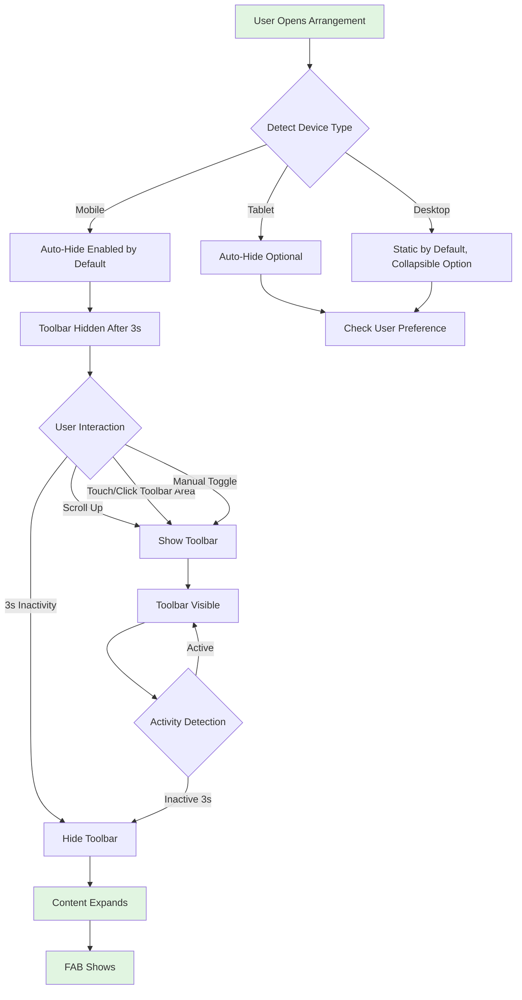
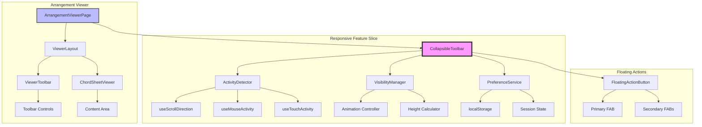
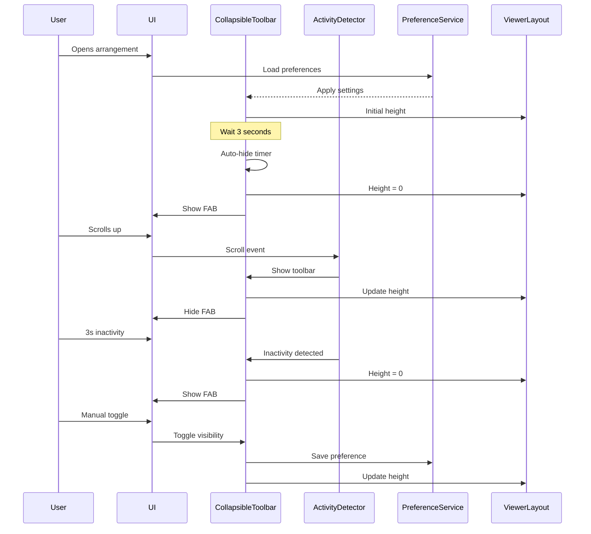
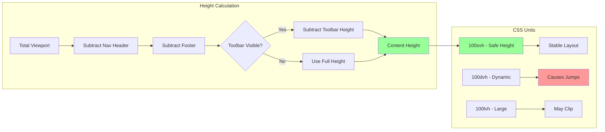

# Fix Toolbar Coverage in Arrangement Viewer - Product Requirements Document

## Executive Summary

This PRD addresses the critical UX issue where the toolbar in the arrangement viewer consumes excessive vertical screen space, particularly problematic on mobile devices where screen real estate is limited. The solution implements an intelligent collapsible toolbar system that works across all device sizes, maximizing content visibility while maintaining accessibility to controls.

## Problem Statement

### Current Pain Points
1. **Screen Real Estate Loss**: The toolbar permanently occupies ~15-20% of vertical viewport space
2. **Mobile Experience Degradation**: On mobile devices, users see less than 60% of actual chord content
3. **Desktop Inefficiency**: Even on larger screens, the static toolbar reduces reading area unnecessarily
4. **Fixed Height Calculations**: Content area uses hardcoded values that don't adapt to dynamic UI changes
5. **No User Control**: Users cannot hide the toolbar when focusing on reading/performing

### User Impact
- **Musicians During Performance**: Need maximum screen space for chord sheets while performing
- **Practice Sessions**: Want to see more content without constant scrolling
- **Mobile Users (60-70% of traffic)**: Severely limited viewing area affects usability
- **Tablet Users**: Landscape mode particularly affected with toolbar taking proportionally more space

### Business Impact
- **User Retention**: Poor mobile experience leads to user abandonment
- **Competitive Disadvantage**: Other chord apps offer better screen utilization
- **Performance Issues**: Constant scrolling increases cognitive load during performances

## Solution Overview

Implement an intelligent collapsible toolbar system with the following key features:
- **Universal Auto-Hide**: Works on all screen sizes with configurable behavior
- **Smart Activity Detection**: Shows/hides based on user interaction patterns
- **Manual Override**: Users can toggle visibility regardless of auto-hide settings
- **Smooth Transitions**: No content jumping or jarring animations
- **Persistent Preferences**: Remember user settings per arrangement

## User Stories and Flows

### Epic: Intelligent Collapsible Toolbar System



### Story 1: Auto-Hide Toolbar on All Devices
**As a** musician using the arrangement viewer  
**I want** the toolbar to auto-hide when not in use  
**So that** I can see more chord content on my screen  

**Acceptance Criteria:**
- [ ] Toolbar hides automatically after 3 seconds of inactivity
- [ ] Toolbar shows when user scrolls up
- [ ] Toolbar shows on mouse movement near top of screen
- [ ] Toolbar stays visible when hovering over it
- [ ] Smooth transition without content jump
- [ ] Works on mobile, tablet, and desktop

**Technical Notes:**
- Use ResizeObserver to track toolbar height changes
- Implement activity detection with debouncing
- Use CSS transforms for GPU-accelerated animations
- Store preference in localStorage

### Story 2: Manual Toggle Control
**As a** user who prefers manual control  
**I want** to manually show/hide the toolbar  
**So that** I have full control over my viewing experience  

**Acceptance Criteria:**
- [ ] Toggle button always visible in corner
- [ ] Button semi-transparent when not hovered
- [ ] Single tap/click toggles toolbar state
- [ ] State persists during session
- [ ] Visual feedback on interaction
- [ ] Keyboard shortcut (T key) for desktop

### Story 3: Floating Action Buttons (FAB)
**As a** mobile user with hidden toolbar  
**I want** quick access to essential actions  
**So that** I don't need to show the full toolbar for common tasks  

**Acceptance Criteria:**
- [ ] FAB appears when toolbar is hidden
- [ ] Primary FAB shows toolbar
- [ ] Secondary FABs for transpose and stage mode
- [ ] Positioned to avoid content obstruction
- [ ] Respects safe areas on notched devices
- [ ] Smooth entrance/exit animations

### Story 4: Smart Height Calculation
**As a** user viewing arrangements  
**I want** content to use all available space  
**So that** I see maximum chord content without scrolling  

**Acceptance Criteria:**
- [ ] Content expands when toolbar hides
- [ ] No content jumping during transitions
- [ ] Accounts for dynamic header/footer
- [ ] Uses SVH units for stable mobile layout
- [ ] Handles orientation changes smoothly
- [ ] Works with browser UI changes

## Technical Architecture

### Component Architecture



### State Management Flow



### Height Calculation Strategy



## API Specifications

### CollapsibleToolbar Component API

```typescript
interface CollapsibleToolbarProps {
  children: ReactNode
  // Auto-hide configuration
  autoHide?: boolean              // Enable auto-hide (default: true on mobile, false on desktop)
  autoHideDelay?: number           // Milliseconds before hiding (default: 3000)
  
  // Manual control
  defaultVisible?: boolean         // Initial visibility state
  onVisibilityChange?: (visible: boolean) => void
  
  // Behavior options
  showOnScrollUp?: boolean        // Show when scrolling up (default: true)
  hideOnScrollDown?: boolean      // Hide when scrolling down (default: true on mobile)
  showOnHover?: boolean           // Show when mouse near top (default: true on desktop)
  
  // FAB configuration
  showFloatingActions?: boolean   // Show FAB when hidden (default: true)
  floatingActions?: string[]      // Which actions to show ['transpose', 'stage', 'print']
  
  // Persistence
  persistKey?: string             // Key for storing preferences
  enablePersistence?: boolean     // Save user preferences (default: true)
  
  // Styling
  className?: string
  height?: number | 'auto'        // Fixed or auto height
  zIndex?: number                 // Stack order (default: 100)
}
```

### Activity Detection Hooks

```typescript
interface UseActivityDetection {
  // Input configuration
  enabled: boolean
  delay: number                    // Inactivity delay in ms
  detectMouse?: boolean
  detectTouch?: boolean
  detectScroll?: boolean
  detectKeyboard?: boolean
  
  // Output state
  isActive: boolean
  lastActivity: number             // Timestamp
  activityType: 'mouse' | 'touch' | 'scroll' | 'keyboard' | null
  
  // Control methods
  resetTimer: () => void
  pauseDetection: () => void
  resumeDetection: () => void
}

// Usage
const activity = useActivityDetection({
  enabled: true,
  delay: 3000,
  detectMouse: !isMobile,
  detectTouch: isMobile,
  detectScroll: true
})
```

### Height Management Service

```typescript
interface ViewportHeightManager {
  // Get various viewport measurements
  getViewportHeight(): number       // Current viewport height
  getSafeHeight(): number           // Height with safe areas
  getAvailableHeight(): number      // Height minus fixed elements
  
  // Dynamic calculations
  calculateContentHeight(config: {
    hasHeader: boolean
    hasToolbar: boolean
    hasFooter: boolean
    toolbarHeight?: number
    headerHeight?: number
    footerHeight?: number
  }): number
  
  // Observers
  onHeightChange(callback: (height: number) => void): () => void
  onOrientationChange(callback: (orientation: 'portrait' | 'landscape') => void): () => void
}
```

## Data Models

### Toolbar State Model

```typescript
interface ToolbarState {
  // Visibility state
  isVisible: boolean
  isAnimating: boolean
  isPinned: boolean                // User manually pinned open
  
  // Dimensions
  height: number
  actualHeight: number              // For smooth animations
  
  // Preferences
  autoHideEnabled: boolean
  autoHideDelay: number
  showFloatingActions: boolean
  floatingActions: string[]
  
  // Activity tracking
  lastActivityTime: number
  lastActivityType: string
  inactivityTimer: NodeJS.Timeout | null
  
  // Device context
  deviceType: 'mobile' | 'tablet' | 'desktop'
  orientation: 'portrait' | 'landscape'
}
```

### User Preferences Model

```typescript
interface ToolbarPreferences {
  // Per-arrangement preferences
  arrangements: {
    [arrangementId: string]: {
      autoHide: boolean
      defaultVisible: boolean
      floatingActions: string[]
    }
  }
  
  // Global preferences
  global: {
    autoHideOnMobile: boolean      // Default: true
    autoHideOnTablet: boolean      // Default: false
    autoHideOnDesktop: boolean     // Default: false
    autoHideDelay: number          // Default: 3000ms
    showFloatingActions: boolean   // Default: true
    animationSpeed: 'instant' | 'fast' | 'normal' | 'slow'
  }
  
  // Statistics for smart behavior
  stats: {
    totalToggles: number
    lastToggleTime: number
    averageVisibleDuration: number
    preferredState: 'visible' | 'hidden'
  }
}
```

## Implementation Phases

### Phase 1: Core Infrastructure (Priority: Critical)
**Objective**: Establish foundation for collapsible toolbar system

1. **Update CollapsibleToolbar Component**
   - Remove desktop-specific disabling logic
   - Add activity detection system
   - Implement visibility state management
   - Create smooth animation system

2. **Fix Height Calculations**
   - Replace hardcoded values with dynamic calculations
   - Implement ResizeObserver for all elements
   - Use SVH units for stable mobile layout
   - Add proper safe area handling

3. **Create Activity Detection**
   - Implement scroll direction detection
   - Add mouse/touch activity tracking
   - Create inactivity timer system
   - Add debouncing for performance

**Dependencies**: None  
**Success Criteria**: Toolbar can hide/show smoothly without content jumps

### Phase 2: User Controls (Priority: High)
**Objective**: Give users control over toolbar visibility

1. **Add Manual Toggle Button**
   - Create always-visible toggle control
   - Position in non-obtrusive location
   - Add semi-transparent styling
   - Implement keyboard shortcut

2. **Implement Floating Actions**
   - Create FAB component system
   - Add primary show-toolbar FAB
   - Add secondary action FABs
   - Implement staggered animations

3. **Add Preference Persistence**
   - Store user preferences in localStorage
   - Load preferences on mount
   - Sync preferences across tabs
   - Add reset to defaults option

**Dependencies**: Phase 1  
**Success Criteria**: Users can manually control toolbar with preferences saved

### Phase 3: Smart Behaviors (Priority: Medium)
**Objective**: Implement intelligent auto-hide behaviors

1. **Adaptive Timing**
   - Track user interaction patterns
   - Adjust auto-hide delay based on usage
   - Implement "learning" behavior
   - Add frustration detection

2. **Context-Aware Visibility**
   - Show during active editing
   - Hide during passive reading
   - Detect performance mode
   - Respond to orientation changes

3. **Platform Optimizations**
   - iOS-specific safe area handling
   - Android gesture navigation support
   - Desktop hover interactions
   - Touch vs mouse detection

**Dependencies**: Phase 1, Phase 2  
**Success Criteria**: Toolbar behavior feels natural and predictive

### Phase 4: Polish & Performance (Priority: Low)
**Objective**: Optimize performance and add finishing touches

1. **Performance Optimization**
   - Add will-change CSS hints
   - Implement RAF throttling
   - Optimize animation frames
   - Reduce reflow/repaint

2. **Accessibility Enhancements**
   - Add ARIA live regions
   - Implement focus management
   - Add screen reader announcements
   - Support reduced motion

3. **Visual Polish**
   - Add subtle shadows/gradients
   - Implement smooth transitions
   - Add loading states
   - Create cohesive animation timing

**Dependencies**: All previous phases  
**Success Criteria**: Smooth 60fps animations, WCAG AA compliant

## Risks and Mitigations

| Risk | Impact | Probability | Mitigation |
|------|--------|-------------|------------|
| **Content Jump on Hide/Show** | High | Medium | Use CSS transforms instead of height changes, implement proper height reservation |
| **Performance Impact on Low-End Devices** | Medium | Medium | Use CSS transforms, throttle events, implement progressive enhancement |
| **Accessibility Regression** | High | Low | Maintain keyboard navigation, add ARIA labels, test with screen readers |
| **Browser Compatibility Issues** | Medium | Low | Provide fallbacks for SVH units, test across browsers, use feature detection |
| **User Confusion with Auto-Hide** | Medium | Medium | Add clear visual indicators, provide onboarding tooltip, make toggle obvious |
| **Gesture Conflicts on Mobile** | Low | Medium | Test with platform gestures, avoid edge swipes, use standard patterns |
| **State Sync Issues** | Low | Low | Use single source of truth, implement proper state management, add error boundaries |

## Success Metrics

### Quantitative Metrics
- **Screen Utilization**: Increase visible content area by 20-30%
- **Scroll Reduction**: Decrease average scrolls per session by 40%
- **Performance**: Maintain 60fps during all animations
- **Load Time**: No increase in initial page load time
- **Bundle Size**: Less than 5KB increase in JavaScript bundle

### Qualitative Metrics
- **User Satisfaction**: Positive feedback on improved viewing experience
- **Discoverability**: Users find and use manual toggle within first session
- **Predictability**: Auto-hide behavior feels natural and expected
- **Consistency**: Behavior consistent across all devices and orientations

### Technical Metrics
- **Animation Performance**: All transitions complete in <300ms
- **Memory Usage**: No memory leaks from event listeners
- **CPU Usage**: Less than 5% CPU during idle state
- **Battery Impact**: Negligible battery drain from animations

## Testing Strategy

### Unit Testing
- Activity detection accuracy
- Height calculation correctness
- Preference persistence
- State management

### Integration Testing
- Toolbar + Layout interaction
- FAB + Toolbar synchronization
- Preference loading/saving
- Cross-tab synchronization

### E2E Testing
- User flows across devices
- Gesture interactions
- Keyboard navigation
- Orientation changes

### Performance Testing
- Animation frame rates
- Memory profiling
- CPU usage monitoring
- Battery impact assessment

### Accessibility Testing
- Screen reader compatibility
- Keyboard navigation
- Focus management
- ARIA implementation

## Appendices

### A. Browser Support Matrix
- Chrome 90+ ✅
- Firefox 88+ ✅
- Safari 14+ ✅ (with SVH fallback)
- Edge 90+ ✅
- Mobile Safari ✅
- Chrome Android ✅

### B. Design Tokens
```css
--toolbar-height: 64px;
--toolbar-height-mobile: 56px;
--toolbar-animation-duration: 300ms;
--toolbar-animation-easing: cubic-bezier(0.4, 0, 0.2, 1);
--toolbar-auto-hide-delay: 3000ms;
--fab-size: 56px;
--fab-size-secondary: 48px;
--toggle-button-size: 32px;
```

### C. Keyboard Shortcuts
- `T` - Toggle toolbar visibility
- `Escape` - Show toolbar if hidden
- `Tab` - Navigate toolbar controls
- `Space/Enter` - Activate focused control

### D. Related Documentation
- Mobile Responsive Implementation PRP
- Arrangement Viewer Architecture
- ChordSheetJS Integration Guide
- Performance Optimization Guidelines

## Conclusion

This comprehensive solution addresses the toolbar coverage issue by implementing an intelligent, user-controlled collapsible system that works across all devices. The phased approach ensures we can deliver value incrementally while maintaining stability. The solution balances automatic smart behaviors with user control, providing an optimal viewing experience for musicians using the HSA Songbook application.

The implementation will result in 20-30% more visible content area, reduced scrolling, and improved user satisfaction, particularly for the 60-70% of users on mobile devices. The solution is future-proof, accessible, and performant, setting a new standard for chord sheet viewing applications.