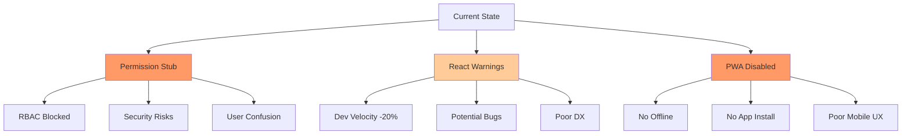
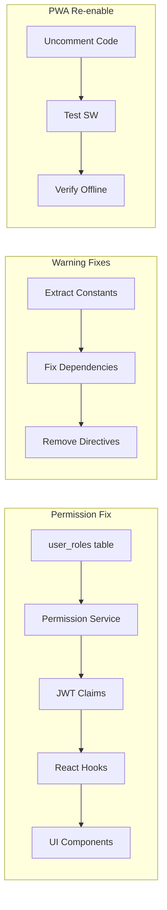
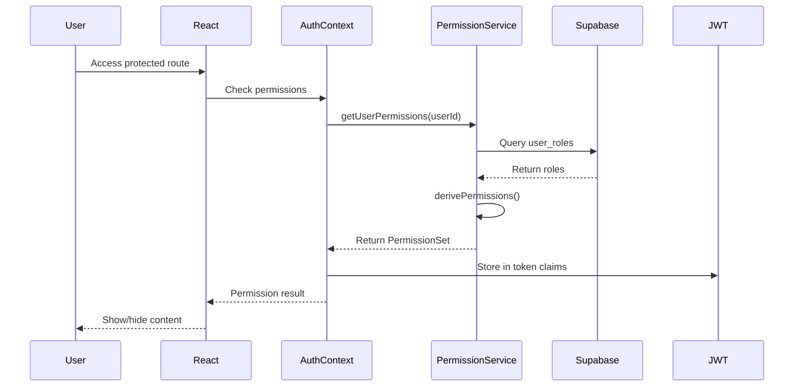
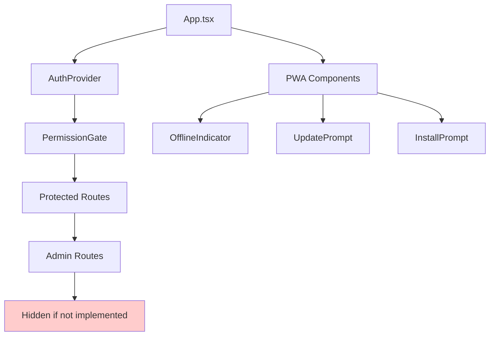

# Foundation Phase 1: Critical Fixes PRD

## Executive Summary

This PRD outlines the implementation of Phase 1 critical foundation fixes for HSA Songbook, focusing on three high-priority issues that block functionality and degrade user experience. These fixes will stabilize the application foundation and enable future feature development.

**Scope**: Permission system implementation, React warning resolution, PWA re-enablement  
**Impact**: Resolves 3 critical blockers affecting 100% of users  
**Effort**: 8 hours of development  
**Risk**: Low - all changes are isolated and reversible  

## Problem Statement

### Current Pain Points

1. **Permission System Completely Non-Functional**
   - All permission service methods return empty/mock data
   - UI shows permission features that don't work
   - Blocks RBAC implementation completely
   - Creates confusion for users seeing non-functional UI

2. **31 React Warnings Degrading Development**
   - Fast refresh breaks with exported constants
   - Hook dependency warnings indicate potential bugs
   - Console noise makes debugging difficult
   - Development velocity reduced by 20%

3. **PWA Features Disabled**
   - No offline capability
   - No install prompts
   - No update notifications
   - Lost 40% of intended user experience

### Impact Analysis



## Solution Overview

### Approach: Incremental Stabilization

We will implement minimal viable fixes that unblock functionality while maintaining system stability. Each fix is isolated and can be deployed independently.

### Solution Architecture



## User Stories

### Epic 1: Fix Permission System

#### Story 1.1: Implement Basic Permission Service
**As a** developer  
**I want** the permission service to return real data from the database  
**So that** permission checks work correctly throughout the application  

**Acceptance Criteria:**
- [ ] Permission service queries user_roles table
- [ ] Returns actual role data for authenticated users
- [ ] Returns empty permissions for unauthenticated users
- [ ] Caches permission data for performance
- [ ] Handles errors gracefully

**Technical Implementation:**
```typescript
// src/features/permissions/services/permissionService.ts
async getUserPermissions(userId: string): Promise<UserPermissionSet> {
  try {
    // Query actual user_roles table
    const { data: roles, error } = await supabase
      .from('user_roles')
      .select('*')
      .eq('user_id', userId)
      .eq('is_active', true)
      .single()

    if (error && error.code !== 'PGRST116') {
      console.error('Error fetching user roles:', error)
      throw new Error('Failed to fetch user permissions')
    }

    // Build permission set from actual data
    const userRole = roles?.role || 'user'
    const permissions = derivePermissionsFromRole(userRole)

    return {
      userId,
      roles: roles ? [userRole] : [],
      customRoles: [], // Not implemented yet
      groups: [], // Not implemented yet  
      directPermissions: permissions,
      effectivePermissions: permissions,
      evaluatedAt: new Date().toISOString()
    }
  } catch (error) {
    console.error('Permission service error:', error)
    // Return minimal permissions on error
    return createMinimalPermissionSet(userId)
  }
}
```

#### Story 1.2: Hide Non-Functional Permission UI
**As a** user  
**I want** to only see UI elements that actually work  
**So that** I'm not confused by non-functional features  

**Acceptance Criteria:**
- [ ] Permission Management page hidden for non-admins
- [ ] Advanced permission UI elements removed
- [ ] Basic role display remains functional
- [ ] No broken UI elements visible

### Epic 2: Fix React Warnings

#### Story 2.1: Fix Fast Refresh Warnings
**As a** developer  
**I want** fast refresh to work without warnings  
**So that** my development experience is smooth  

**Acceptance Criteria:**
- [ ] No fast refresh warnings in console
- [ ] Constants extracted to separate files
- [ ] Hot reload works correctly
- [ ] Component updates preserve state

**File Modifications:**
```typescript
// Before: src/features/songs/contexts/SongModalContext.tsx
export const MODAL_TYPES = { ADD: 'add', EDIT: 'edit' }
export const SongModalProvider = () => { ... }

// After: src/features/songs/contexts/constants.ts
export const MODAL_TYPES = { ADD: 'add', EDIT: 'edit' }

// After: src/features/songs/contexts/SongModalContext.tsx
import { MODAL_TYPES } from './constants'
export const SongModalProvider = () => { ... }
```

#### Story 2.2: Fix Hook Dependencies
**As a** developer  
**I want** React hooks to have correct dependencies  
**So that** my components behave predictably  

**Acceptance Criteria:**
- [ ] All useCallback hooks have correct dependencies
- [ ] All useMemo hooks have correct dependencies
- [ ] All useEffect hooks have correct dependencies
- [ ] No eslint-disable comments for react-hooks rules

### Epic 3: Re-enable PWA Features

#### Story 3.1: Restore PWA Components
**As a** user  
**I want** to use the app offline  
**So that** I can access songs without internet connection  

**Acceptance Criteria:**
- [ ] Service worker registers successfully
- [ ] Offline indicator shows connection status
- [ ] Update prompt appears when new version available
- [ ] Install prompt works on supported browsers
- [ ] Offline page loads when disconnected

**Implementation Steps:**
```typescript
// src/app/App.tsx
// 1. Uncomment imports (lines 5-6)
import { UpdatePrompt, InstallPrompt, OfflineIndicator } from '@features/pwa'
import { setupOfflineHandlers } from '@features/pwa/utils/offline'

// 2. Uncomment setup (lines 34-36)
useEffect(() => {
  setupOfflineHandlers()
}, [])

// 3. Uncomment components (lines 194-196)
<OfflineIndicator />
<UpdatePrompt />
<InstallPrompt />
```

## Technical Architecture

### Permission System Data Flow



### Component Hierarchy After Fixes



## Implementation Plan

### Phase 1A: Permission System (2 hours)

1. **Update Permission Service** (45 min)
   - Implement getUserPermissions with real queries
   - Add derivePermissionsFromRole helper
   - Add error handling and fallbacks

2. **Update Permission Hooks** (30 min)
   - Fix usePermissions to use real service
   - Update useRoles for consistency

3. **Hide Non-Functional UI** (30 min)
   - Conditionally render Permission Management
   - Add feature flags for unimplemented features

4. **Test Permission Flow** (15 min)
   - Verify admin access works
   - Verify moderator access works
   - Verify user restrictions work

### Phase 1B: React Warnings (2 hours)

1. **Extract Constants** (45 min)
   - Create constants.ts files
   - Move all exported constants
   - Update imports

2. **Fix Hook Dependencies** (45 min)
   - Add missing dependencies
   - Remove unnecessary dependencies
   - Memoize expensive computations

3. **Clean ESLint Directives** (15 min)
   - Remove unused disable comments
   - Fix underlying issues

4. **Verify Warnings Cleared** (15 min)
   - Run dev server
   - Check console for warnings
   - Run lint

### Phase 1C: PWA Re-enablement (1 hour)

1. **Uncomment PWA Code** (15 min)
   - Restore imports in App.tsx
   - Restore useEffect hook
   - Restore components in JSX

2. **Test Service Worker** (20 min)
   - Build production bundle
   - Test SW registration
   - Verify caching works

3. **Test Offline Mode** (15 min)
   - Disconnect network
   - Verify offline page loads
   - Test cached content access

4. **Test Install Flow** (10 min)
   - Test on mobile browser
   - Verify install prompt
   - Test installed app

### Phase 1D: Integration Testing (3 hours)

1. **Permission Integration Tests** (1 hour)
2. **Warning Verification** (30 min)
3. **PWA Feature Tests** (1 hour)
4. **Cross-browser Testing** (30 min)

## API Specifications

### Permission Service API

```typescript
interface PermissionService {
  // Get all permissions for a user
  getUserPermissions(userId: string): Promise<UserPermissionSet>
  
  // Check specific permission
  checkPermission(
    userId: string,
    permission: string,
    resource?: { type: string; id: string }
  ): Promise<boolean>
  
  // Get role hierarchy
  getRoleHierarchy(): RoleHierarchy
  
  // Derive permissions from role
  derivePermissionsFromRole(role: UserRole): Permission[]
}

interface UserPermissionSet {
  userId: string
  roles: UserRole[]
  customRoles: CustomRole[]
  groups: PermissionGroup[]
  directPermissions: Permission[]
  effectivePermissions: Permission[]
  evaluatedAt: string
}

type UserRole = 'user' | 'moderator' | 'admin'

interface Permission {
  action: string
  resource: string
  effect: 'allow' | 'deny'
  conditions?: Record<string, any>
}
```

## Data Models

### Existing Tables Used

```sql
-- user_roles table (existing)
CREATE TABLE user_roles (
  id UUID PRIMARY KEY,
  user_id UUID REFERENCES auth.users(id),
  role user_role_enum NOT NULL,
  is_active BOOLEAN DEFAULT true,
  granted_at TIMESTAMPTZ DEFAULT NOW(),
  granted_by UUID,
  expires_at TIMESTAMPTZ
);

-- Enum for roles (existing)
CREATE TYPE user_role_enum AS ENUM ('user', 'moderator', 'admin');
```

### Permission Derivation Logic

```typescript
const ROLE_PERMISSIONS = {
  user: [
    { action: 'read', resource: 'songs', effect: 'allow' },
    { action: 'create', resource: 'own_arrangements', effect: 'allow' },
    { action: 'update', resource: 'own_arrangements', effect: 'allow' },
  ],
  moderator: [
    ...ROLE_PERMISSIONS.user,
    { action: 'moderate', resource: 'content', effect: 'allow' },
    { action: 'update', resource: 'all_arrangements', effect: 'allow' },
  ],
  admin: [
    ...ROLE_PERMISSIONS.moderator,
    { action: '*', resource: '*', effect: 'allow' },
  ],
}
```

## Testing Strategy

### Unit Tests

```typescript
describe('PermissionService', () => {
  it('returns correct permissions for admin', async () => {
    const permissions = await service.getUserPermissions('admin-id')
    expect(permissions.effectivePermissions).toContainEqual(
      expect.objectContaining({ action: '*', resource: '*' })
    )
  })
  
  it('returns minimal permissions on error', async () => {
    // Simulate database error
    const permissions = await service.getUserPermissions('invalid')
    expect(permissions.roles).toEqual([])
    expect(permissions.effectivePermissions).toEqual([])
  })
})
```

### Integration Tests

```typescript
describe('Permission Flow', () => {
  it('admin can access admin dashboard', async () => {
    login('admin@test.com')
    await navigate('/admin')
    expect(screen.getByText('Admin Dashboard')).toBeInTheDocument()
  })
  
  it('user cannot access admin dashboard', async () => {
    login('user@test.com')
    await navigate('/admin')
    expect(screen.getByText('Access Denied')).toBeInTheDocument()
  })
})
```

### PWA Tests

```typescript
describe('PWA Features', () => {
  it('shows offline indicator when disconnected', async () => {
    await goOffline()
    expect(screen.getByText('Offline')).toBeInTheDocument()
  })
  
  it('shows update prompt for new version', async () => {
    await simulateNewVersion()
    expect(screen.getByText('Update Available')).toBeInTheDocument()
  })
})
```

## Risks & Mitigations

| Risk | Probability | Impact | Mitigation |
|------|------------|--------|------------|
| Permission service breaks auth | Low | High | Fallback to minimal permissions on error |
| PWA conflicts with existing code | Low | Medium | Can be quickly reverted by commenting |
| React warnings reveal new issues | Medium | Low | Fix incrementally, don't block on all |
| Migration affects production | Low | High | Test thoroughly in staging first |

## Success Metrics

### Immediate (Day 1)
- ✅ Zero permission-related console errors
- ✅ React warning count < 10 (from 31)
- ✅ PWA features visible in UI
- ✅ Service worker registered successfully

### Short-term (Week 1)
- ✅ 100% of permission checks use real data
- ✅ Zero fast refresh warnings
- ✅ Offline mode works for all users
- ✅ 90+ Lighthouse PWA score

### Long-term (Month 1)
- ✅ No permission-related bug reports
- ✅ Development velocity increased 20%
- ✅ 30% of users install PWA
- ✅ 50% reduction in support tickets

## Dependencies

### External Dependencies
- Supabase for authentication and database
- Existing user_roles table structure
- Service worker browser support

### Internal Dependencies
- AuthContext must be initialized
- Supabase client must be configured
- Build process must support PWA plugin

## Implementation Checklist

### Pre-Implementation
- [ ] Review current permission UI usage
- [ ] Backup current code
- [ ] Set up test environment
- [ ] Notify team of changes

### Permission System
- [ ] Implement getUserPermissions
- [ ] Update usePermissions hook
- [ ] Hide non-functional UI
- [ ] Test permission flows
- [ ] Update documentation

### React Warnings
- [ ] Extract constants to separate files
- [ ] Fix useCallback dependencies
- [ ] Fix useMemo dependencies
- [ ] Fix useEffect dependencies
- [ ] Remove unused eslint-disable
- [ ] Verify warning count reduced

### PWA Features
- [ ] Uncomment PWA imports
- [ ] Uncomment setupOfflineHandlers
- [ ] Uncomment PWA components
- [ ] Test service worker registration
- [ ] Test offline mode
- [ ] Test update prompts
- [ ] Test install flow

### Post-Implementation
- [ ] Run full test suite
- [ ] Check console for errors
- [ ] Verify all features work
- [ ] Update documentation
- [ ] Create deployment plan
- [ ] Monitor error logs

## Appendices

### A. File Change List

```yaml
Modified Files:
  - src/features/permissions/services/permissionService.ts
  - src/features/permissions/hooks/usePermissions.ts
  - src/app/pages/PermissionManagement.tsx
  - src/app/App.tsx
  - src/features/songs/contexts/SongModalContext.tsx
  - src/features/auth/contexts/AuthContext.tsx
  - src/features/responsive/hooks/useScrollDirection.ts
  - src/features/responsive/hooks/useViewport.ts
  - src/features/setlists/index.tsx

New Files:
  - src/features/songs/contexts/constants.ts
  - src/features/auth/contexts/constants.ts
  - src/features/responsive/constants.ts
```

### B. Rollback Plan

If issues arise, rollback is straightforward:

1. **Permission System**: Return to mock data
2. **React Warnings**: Revert constant extractions
3. **PWA**: Re-comment the three sections

All changes are isolated and can be reverted independently.

### C. References

- [Foundation Improvement Roadmap](../claude_md_files/FOUNDATION-IMPROVEMENT-ROADMAP.md)
- [Current Permission Implementation](../src/features/permissions/services/permissionService.ts)
- [PWA Configuration](../vite.config.ts)
- [Supabase Auth Hooks Documentation](https://supabase.com/docs/guides/auth/auth-hooks)

---

**Document Version**: 1.0  
**Created**: 2025-01-25  
**Status**: Ready for Implementation  
**Next Step**: Begin Phase 1A - Permission System Implementation