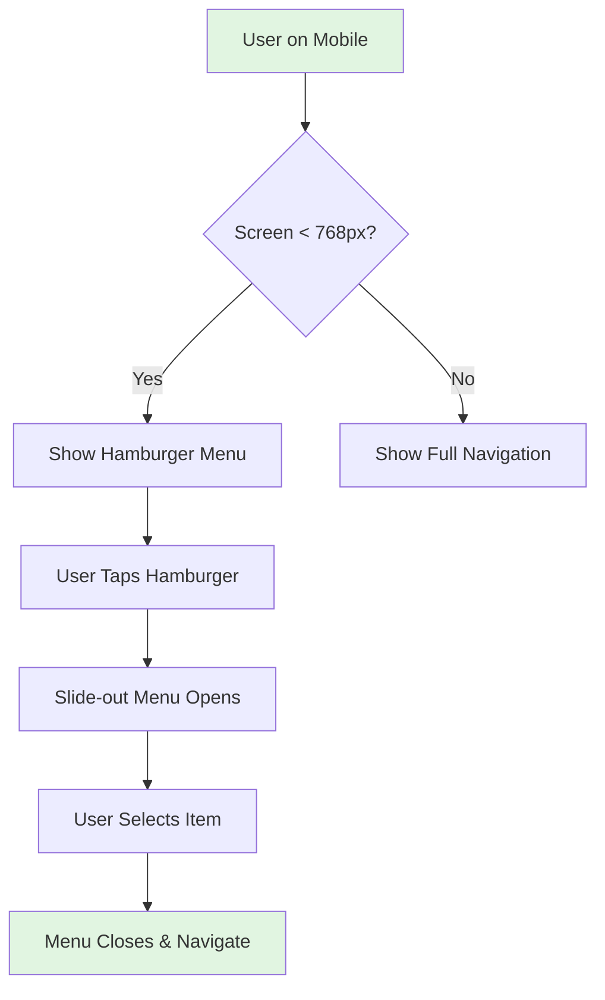
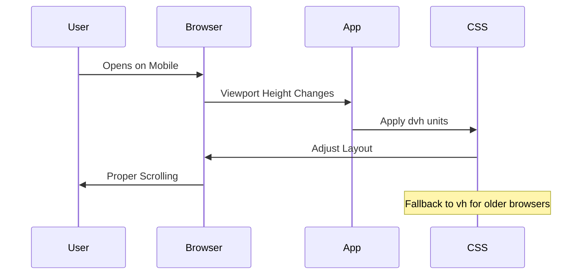
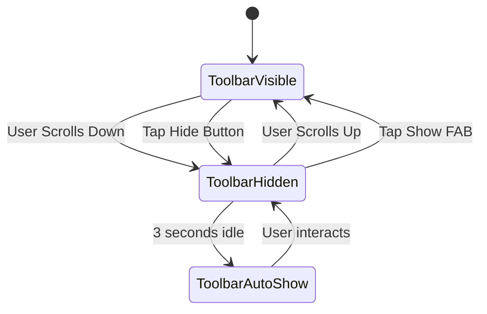
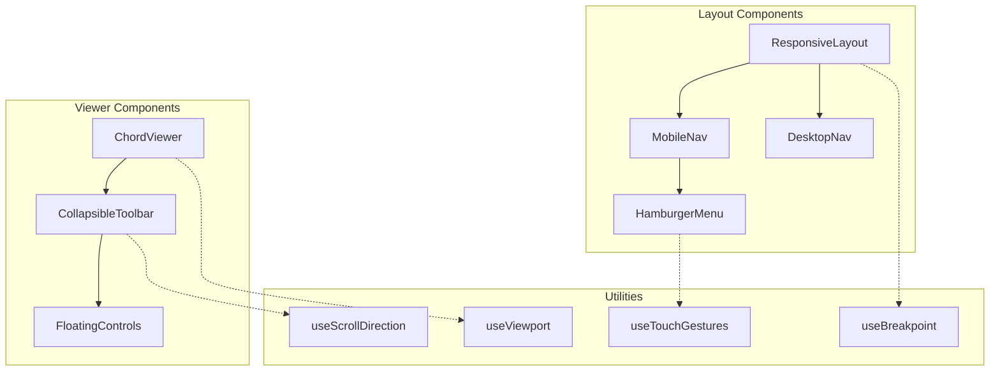
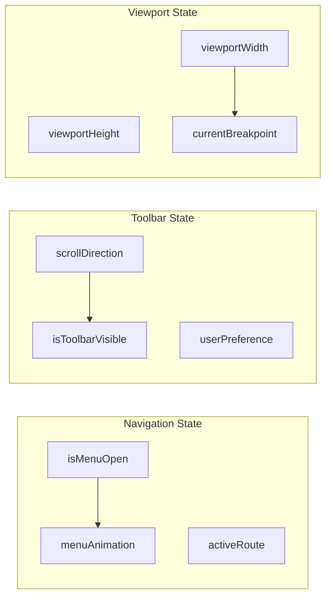

# Mobile-Responsive Design PRD for HSA Songbook

## Executive Summary

This PRD outlines the comprehensive mobile-responsive redesign of the HSA Songbook application. The project aims to transform the current desktop-focused interface into a truly mobile-first experience that provides seamless navigation, optimal content viewing, and intuitive touch interactions across all device sizes.

## Problem Statement

### Current Issues
1. **Non-responsive Navigation**: The header navigation doesn't collapse into a hamburger menu on mobile devices, causing horizontal overflow and poor usability
2. **Scrolling Problems**: Homepage and /songs page have viewport height issues preventing proper scrolling on mobile devices
3. **Fixed Toolbar Obstruction**: The chord viewer toolbar takes up valuable screen space on mobile devices with no option to hide it
4. **Touch Target Issues**: UI elements are not optimized for thumb-friendly interaction
5. **Viewport Inconsistencies**: CSS vh units behave unpredictably on mobile browsers due to dynamic address bars

### User Impact
- **Mobile users (estimated 60-70% of traffic)** struggle with basic navigation
- **Performance musicians** cannot effectively use the app during live performances on tablets/phones
- **Content is cut off** below the fold on many mobile devices
- **Frustrating user experience** leads to abandonment and reduced engagement

## Solution Overview

Implement a comprehensive mobile-responsive design system that:
1. Introduces an adaptive navigation system with hamburger menu for mobile
2. Fixes viewport and scrolling issues using modern CSS solutions
3. Adds a collapsible toolbar for the chord viewer with smart hiding
4. Optimizes all touch targets for mobile interaction
5. Implements responsive breakpoints for seamless adaptation

## User Stories

### Epic: Mobile-Responsive Navigation



#### Story 1: Hamburger Menu Implementation
**As a** mobile user  
**I want** a hamburger menu on small screens  
**So that** I can access navigation without horizontal scrolling

**Acceptance Criteria:**
- [ ] Hamburger icon appears at screens < 768px width
- [ ] Menu slides in from left/right with smooth animation
- [ ] Menu overlay prevents background interaction
- [ ] Tapping outside menu or X button closes it
- [ ] Current page is highlighted in menu
- [ ] Menu is keyboard accessible

**Technical Notes:**
- Use CSS media queries for breakpoint detection
- Implement with React state for menu open/close
- Add focus trap for accessibility
- Use transform: translateX() for performance

#### Story 2: Responsive Navigation Bar
**As a** tablet user  
**I want** navigation that adapts to my screen size  
**So that** I have optimal use of screen space

**Acceptance Criteria:**
- [ ] Navigation items stack vertically on narrow screens
- [ ] Logo remains visible at all sizes
- [ ] User menu collapses into dropdown on mobile
- [ ] Search becomes icon-only on small screens
- [ ] Smooth transitions between breakpoints

### Epic: Scrolling & Viewport Fixes



#### Story 3: Fix Homepage Scrolling
**As a** mobile user  
**I want** to scroll through the entire homepage  
**So that** I can see all content below the fold

**Acceptance Criteria:**
- [ ] Homepage scrolls vertically on all mobile devices
- [ ] No horizontal overflow
- [ ] Smooth momentum scrolling on iOS
- [ ] Footer is reachable
- [ ] No double scrollbars

**Technical Notes:**
- Remove `overflow: hidden` from body on non-editor pages
- Use `height: 100dvh` for dynamic viewport
- Add `-webkit-overflow-scrolling: touch` for iOS

#### Story 4: Fix Songs Page Scrolling
**As a** user browsing songs  
**I want** smooth scrolling through the song list  
**So that** I can browse the entire catalog

**Acceptance Criteria:**
- [ ] Song cards are fully scrollable
- [ ] Virtual scrolling for performance with large lists
- [ ] Pull-to-refresh gesture support
- [ ] Scroll position maintained on navigation back

### Epic: Collapsible Chord Viewer Toolbar



#### Story 5: Smart Toolbar Hiding
**As a** performer using the chord viewer  
**I want** the toolbar to hide when not needed  
**So that** I have maximum screen space for chords

**Acceptance Criteria:**
- [ ] Toolbar hides on scroll down
- [ ] Toolbar shows on scroll up
- [ ] Manual hide/show toggle button
- [ ] Floating action button (FAB) when hidden
- [ ] Smooth slide animation
- [ ] Settings persist per session

**Technical Notes:**
- Use Intersection Observer for scroll detection
- CSS transforms for performance
- LocalStorage for user preference
- Touch gesture support

## Technical Architecture

### Component Structure



### Responsive Breakpoints

```typescript
// Breakpoint system
export const breakpoints = {
  xs: 0,     // Mobile portrait
  sm: 640,   // Mobile landscape
  md: 768,   // Tablet portrait
  lg: 1024,  // Tablet landscape
  xl: 1280,  // Desktop
  '2xl': 1536 // Large desktop
}

// Media queries
export const media = {
  mobile: '@media (max-width: 767px)',
  tablet: '@media (min-width: 768px) and (max-width: 1023px)',
  desktop: '@media (min-width: 1024px)',
  touch: '@media (hover: none) and (pointer: coarse)'
}
```

### State Management



## API Specifications

### Navigation Hook API

```typescript
interface UseResponsiveNav {
  isMenuOpen: boolean
  openMenu: () => void
  closeMenu: () => void
  toggleMenu: () => void
  isMobile: boolean
  isTablet: boolean
  isDesktop: boolean
}

// Usage
const nav = useResponsiveNav()
```

### Toolbar Visibility Hook API

```typescript
interface UseToolbarVisibility {
  isVisible: boolean
  show: () => void
  hide: () => void
  toggle: () => void
  scrollDirection: 'up' | 'down' | null
  autoHideEnabled: boolean
  setAutoHide: (enabled: boolean) => void
}

// Usage
const toolbar = useToolbarVisibility({
  threshold: 50, // pixels
  autoHideDelay: 3000 // ms
})
```

### Viewport Hook API

```typescript
interface UseViewport {
  width: number
  height: number
  dvh: number // Dynamic viewport height
  svh: number // Small viewport height
  lvh: number // Large viewport height
  isMobile: boolean
  isTablet: boolean
  isDesktop: boolean
  orientation: 'portrait' | 'landscape'
}

// Usage
const viewport = useViewport()
```

## Data Models

### Navigation Configuration

```typescript
interface NavConfig {
  breakpoint: 'mobile' | 'tablet' | 'desktop'
  menuType: 'hamburger' | 'horizontal' | 'vertical'
  position: 'left' | 'right' | 'top'
  animation: 'slide' | 'fade' | 'none'
  overlay: boolean
  closeOnRouteChange: boolean
}
```

### Toolbar Configuration

```typescript
interface ToolbarConfig {
  autoHide: boolean
  hideDelay: number
  showOnScrollUp: boolean
  hideOnScrollDown: boolean
  threshold: number
  persistPreference: boolean
  floatingControls: string[] // Which controls to show when hidden
}
```

## Implementation Phases

### Phase 1: Foundation (Week 1)
**Priority: Critical**

1. **Viewport & Scrolling Fixes**
   - Implement dynamic viewport units (dvh, svh)
   - Fix body/root scrolling issues
   - Add scroll restoration
   - Test on iOS Safari, Chrome, Android

2. **Responsive Utilities**
   - Create useViewport hook
   - Create useBreakpoint hook
   - Add responsive CSS utilities
   - Set up breakpoint system

**Dependencies:** None

### Phase 2: Navigation (Week 2)
**Priority: Critical**

1. **Hamburger Menu Implementation**
   - Create HamburgerMenu component
   - Add menu animations
   - Implement focus trap
   - Add overlay and close triggers

2. **Responsive Navigation Bar**
   - Refactor Layout component
   - Add media queries
   - Implement responsive breakpoints
   - Test touch interactions

**Dependencies:** Phase 1 utilities

### Phase 3: Toolbar Enhancement (Week 3)
**Priority: High**

1. **Collapsible Toolbar**
   - Create useScrollDirection hook
   - Implement auto-hide logic
   - Add manual toggle
   - Create floating action button

2. **Touch Gestures**
   - Add swipe to show/hide
   - Implement long-press actions
   - Add haptic feedback (where supported)

**Dependencies:** Phase 1 & 2

### Phase 4: Polish & Optimization (Week 4)
**Priority: Medium**

1. **Performance Optimization**
   - Implement virtual scrolling for long lists
   - Add lazy loading
   - Optimize animations with will-change
   - Reduce reflows/repaints

2. **Accessibility & Testing**
   - ARIA labels and roles
   - Keyboard navigation
   - Screen reader testing
   - Cross-browser testing

**Dependencies:** All previous phases

## Risks & Mitigations

| Risk | Impact | Probability | Mitigation |
|------|--------|-------------|------------|
| iOS Safari viewport bugs | High | Medium | Use battle-tested solutions, extensive testing |
| Performance on low-end devices | Medium | Medium | Progressive enhancement, optimize critical path |
| Breaking existing desktop UX | High | Low | Feature flags, gradual rollout, A/B testing |
| Gesture conflicts with browser | Medium | Medium | Use standard patterns, avoid conflicting gestures |
| Accessibility regression | High | Low | Automated testing, manual audit, user testing |

## Success Metrics

### Performance Metrics
- **First Contentful Paint**: < 1.5s on 3G
- **Time to Interactive**: < 3.5s on 3G
- **Scroll Performance**: 60fps on mid-range devices
- **Touch Response**: < 100ms feedback

### User Experience Metrics
- **Mobile Bounce Rate**: Reduce by 30%
- **Mobile Session Duration**: Increase by 25%
- **Navigation Success Rate**: > 95%
- **Toolbar Usage**: 80% use collapsible feature

### Technical Metrics
- **Lighthouse Mobile Score**: > 90
- **Zero horizontal scroll issues**
- **100% viewport coverage** on all devices
- **Accessibility Score**: WCAG AA compliant

## Testing Strategy

### Device Testing Matrix

| Device Type | Specific Models | OS Versions | Browsers |
|------------|-----------------|-------------|----------|
| iPhone | 12, 13, 14, SE | iOS 15+ | Safari, Chrome |
| Android Phone | Pixel 6, Samsung S22 | Android 11+ | Chrome, Firefox |
| iPad | Air, Pro 11" | iPadOS 15+ | Safari, Chrome |
| Android Tablet | Samsung Tab S8 | Android 11+ | Chrome |

### Test Scenarios

1. **Navigation Flow**
   - Open menu → Navigate → Close menu
   - Rotate device during navigation
   - Background tap to close
   - Keyboard navigation

2. **Scrolling Tests**
   - Scroll to bottom of long lists
   - Pull-to-refresh
   - Momentum scrolling
   - Scroll during viewport change

3. **Toolbar Interaction**
   - Scroll up/down triggers
   - Manual toggle
   - Settings persistence
   - Gesture controls

## Appendices

### A. CSS Solutions for Viewport Issues

```css
/* Modern viewport units with fallbacks */
.container {
  height: 100vh; /* Fallback */
  height: 100dvh; /* Dynamic viewport height */
}

/* iOS safe areas */
.toolbar {
  padding-bottom: env(safe-area-inset-bottom);
}

/* Smooth scrolling */
.scrollable {
  -webkit-overflow-scrolling: touch;
  overscroll-behavior: contain;
}
```

### B. Touch Target Guidelines

- Minimum size: 44x44px (iOS) / 48x48px (Android)
- Spacing: 8px minimum between targets
- Visual feedback: within 100ms
- Hover states: removed on touch devices

### C. Performance Optimization Techniques

1. **CSS Containment**: Use `contain: layout style paint`
2. **Passive Event Listeners**: For scroll and touch events
3. **RequestAnimationFrame**: For scroll-triggered animations
4. **Will-change**: For animated properties
5. **Transform/Opacity**: For performant animations

## Conclusion

This comprehensive mobile-responsive redesign will transform HSA Songbook into a truly mobile-first application. By addressing critical navigation, scrolling, and screen space issues, we'll provide users with a seamless experience across all devices, particularly benefiting the majority of users who access the app on mobile devices.

The phased implementation approach ensures we can deliver value incrementally while maintaining stability. Success will be measured through both technical performance metrics and user experience improvements, with the ultimate goal of making HSA Songbook the preferred choice for mobile chord viewing and song management.