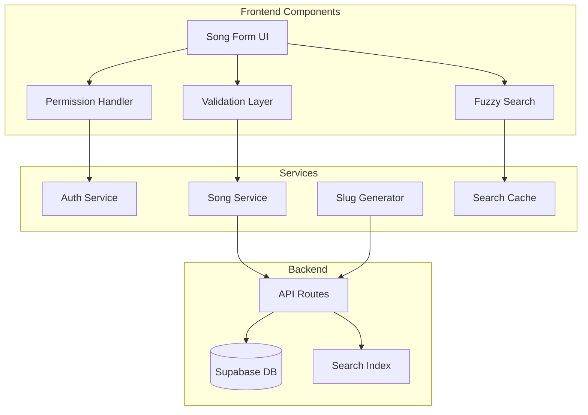
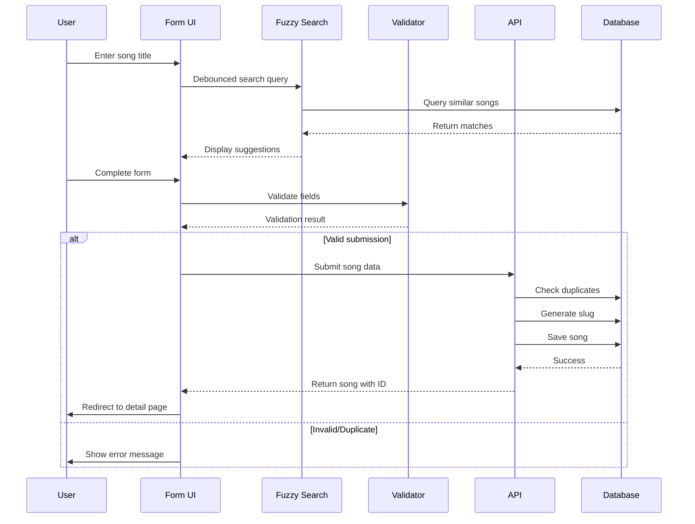
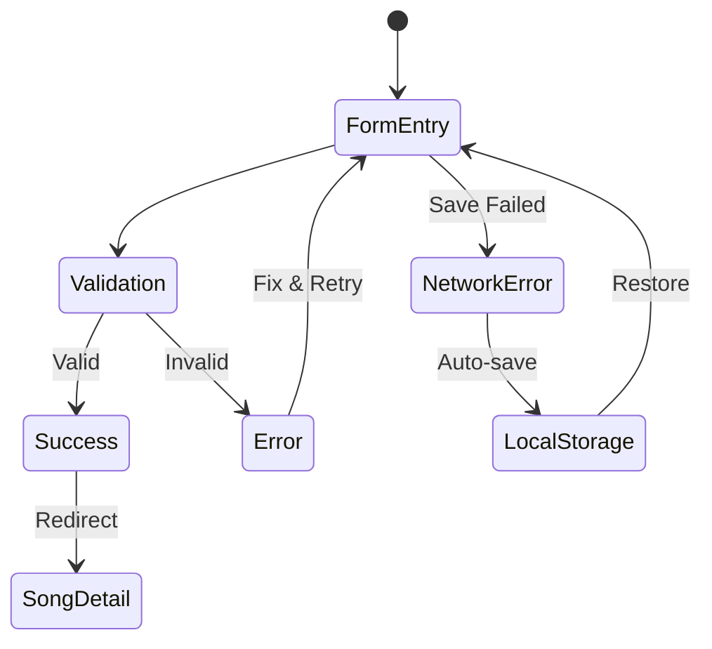

# Song Management Form - Product Requirements Document

## Executive Summary

This PRD defines the requirements for implementing an MVP song management form that enables users to create and edit song metadata in the HSA Songbook application. The form will support role-based permissions, intelligent duplicate detection through fuzzy search, and automated slug generation while maintaining a clear separation between songs (metadata) and arrangements (musical details).

## Problem Statement

### Current State
- No standardized way to add or edit song metadata
- Risk of duplicate song entries
- Inconsistent data quality across user submissions
- No permission-based editing system

### Impact
- Database pollution with duplicate entries
- Confusion for users searching for songs
- Inability to maintain authoritative song catalog
- Poor data quality affecting arrangement associations

## Solution Overview

A comprehensive song management form with:
- **Smart Duplicate Detection**: Fuzzy search showing similar songs before creation
- **Role-Based Permissions**: Different access levels for users and admins
- **Data Quality Controls**: Validation, autocomplete, and standardized categories
- **Seamless UX**: Single-page form with intelligent field assistance

## User Access Points

### Form Access Methods

The Song Management Form will be accessible through multiple entry points in the application:

1. **Song List Page (`/songs`)**
   - Primary "Add New Song" button in the header (for authenticated users)
   - Floating Action Button (FAB) on mobile for quick access
   - Empty state prompt when no songs exist

2. **Song Detail Page (`/songs/:slug`)**
   - "Edit Song" button for song creators and admins
   - "Suggest Edit" option for other users (future enhancement)

3. **User Dashboard** (future)
   - "My Songs" section with quick add button
   - Draft songs resumption

4. **Navigation Menu**
   - "Add Song" quick link in main navigation (authenticated users)
   - Keyboard shortcut (Ctrl/Cmd + N) for power users

### Access Control
- **Guest Users**: Prompted to sign in or continue as guest when clicking add button
- **Authenticated Users**: Direct access to form
- **Admins**: Additional bulk import option in admin panel

## User Stories

### Epic: Song Management System

#### Story 1: Add New Song (General User)
**As a** logged-in user  
**I want** to add new songs to the catalog  
**So that** I can contribute to the community songbook

**Acceptance Criteria:**
- [ ] User must be authenticated (including guest login)
- [ ] Form shows fuzzy search results while typing title
- [ ] Duplicate detection shows title, artist, and year
- [ ] Auto-generates unique slug on save
- [ ] Validates required fields (title, artist, year)
- [ ] Redirects to song detail page after creation

**Technical Notes:**
- Use Fuse.js for fuzzy search
- Implement debounced search (300ms)
- Use nanoid for slug generation

#### Story 2: Edit Own Songs (General User)
**As a** song creator  
**I want** to edit songs I've created  
**So that** I can correct mistakes or update information

**Acceptance Criteria:**
- [ ] Edit button visible only on user's own songs
- [ ] Form pre-populates with existing data
- [ ] Maintains original slug (no regeneration)
- [ ] Tracks last modified by user
- [ ] Shows success confirmation

#### Story 3: Admin Song Management
**As an** admin user  
**I want** to edit or delete any song  
**So that** I can maintain data quality

**Acceptance Criteria:**
- [ ] Admin can edit any song
- [ ] Admin can delete songs
- [ ] Deletion requires confirmation
- [ ] Audit trail maintained

#### Story 4: Guest User Flow
**As a** guest user  
**I want** to add songs before creating an account  
**So that** I can contribute immediately

**Acceptance Criteria:**
- [ ] Guest login option available
- [ ] Songs associated with guest session
- [ ] Prompt to create account after submission
- [ ] Transfer ownership when account created

## Technical Architecture

### System Components



### Data Flow Diagram



## User Interface Design

### Form Layout

```mermaid
graph TD
    subgraph "Song Management Form"
        T[Title Input with Fuzzy Search]
        D[Duplicate Detection Panel]
        A[Artist Input with Autocomplete]
        Y[Year Input - Number]
        C[CCLI Number - Optional]
        CAT[Category Dropdown]
        TAG[Tags Multi-Select]
        TH[Themes Multi-Input]
        S[Source Input - Optional]
        N[Notes Textarea - Optional]
        B[Action Buttons]
    end
    
    T --> D
    D --> A
    A --> Y
    Y --> C
    C --> CAT
    CAT --> TAG
    TAG --> TH
    TH --> S
    S --> N
    N --> B
```



### Field Specifications

| Field | Type | Required | Validation | Features |
|-------|------|----------|------------|----------|
| Title | Text | Yes | Min 1 char | Fuzzy search, duplicate detection |
| Artist | Text | Yes | Min 1 char | Autocomplete from existing |
| Year | Number | Yes | 1800-current | Number input |
| CCLI | Number | No | Numeric only | Format validation |
| Category | Select | Yes | From predefined | Dropdown with 8 options |
| Tags | Multi-select | Yes (1-10) | From list + custom | Fuzzy search, deduplication |
| Themes | Array | No | Text array | Free-form entry |
| Source | Text | No | Max 255 chars | Text input |
| Notes | Textarea | No | Max 1000 chars | Rich text |

### Duplicate Detection UI

```
┌─────────────────────────────────────────┐
│ Similar songs found:                    │
├─────────────────────────────────────────┤
│ ⚠️ Amazing Grace                        │
│    Artist: John Newton                  │
│    Year: 1779                          │
│    [View Song]                         │
├─────────────────────────────────────────┤
│ ℹ️ Amazing Grace (Modern)               │
│    Artist: Chris Tomlin                │
│    Year: 2006                          │
│    [View Song]                         │
└─────────────────────────────────────────┘
```

## API Specifications

### Endpoints

#### POST /api/songs
Create new song

**Request:**
```json
{
  "title": "Amazing Grace",
  "artist": "John Newton",
  "compositionYear": 1779,
  "ccli": "123456",
  "category": "Classic-Hymn",
  "tags": ["grace", "redemption", "traditional"],
  "themes": ["Salvation", "Forgiveness"],
  "source": "Olney Hymns",
  "notes": "Written by former slave trader"
}
```

**Response:**
```json
{
  "id": "uuid",
  "slug": "amazing-grace-jn-x7k2p",
  "title": "Amazing Grace",
  "artist": "John Newton",
  "compositionYear": 1779,
  "metadata": {
    "createdBy": "user-id",
    "createdAt": "2025-01-20T10:00:00Z",
    "isPublic": true
  }
}
```

#### GET /api/songs/search
Fuzzy search for duplicate detection

**Request:**
```
GET /api/songs/search?q=amazing%20grace&limit=5
```

**Response:**
```json
{
  "results": [
    {
      "id": "uuid",
      "title": "Amazing Grace",
      "artist": "John Newton",
      "year": 1779,
      "score": 0.95
    }
  ]
}
```

#### GET /api/artists/autocomplete
Artist name suggestions

**Request:**
```
GET /api/artists/autocomplete?q=john&limit=10
```

#### GET /api/tags/search
Tag fuzzy search and validation

**Request:**
```
GET /api/tags/search?q=christ&limit=10
```

## Data Models

### Song Schema Enhancement

```typescript
interface SongFormData {
  // Core fields (required)
  title: string
  artist: string
  compositionYear: number
  
  // Categorization (required)
  category: SongCategory
  tags: string[] // 1-10 items
  
  // Optional metadata
  ccli?: string
  themes?: string[]
  source?: string
  notes?: string
}

interface SongCategory {
  value: string
  label: string
  description: string
}

interface DuplicateDetectionResult {
  id: string
  title: string
  artist: string
  year: number
  similarity: number // 0-1 score
}
```

### Permission Model

```typescript
interface UserPermissions {
  canCreate: boolean
  canEditOwn: boolean
  canEditAll: boolean
  canDelete: boolean
}

const PERMISSION_MATRIX = {
  guest: {
    canCreate: true,
    canEditOwn: false,
    canEditAll: false,
    canDelete: false
  },
  user: {
    canCreate: true,
    canEditOwn: true,
    canEditAll: false,
    canDelete: false
  },
  admin: {
    canCreate: true,
    canEditOwn: true,
    canEditAll: true,
    canDelete: true
  }
}
```

## Implementation Phases

### Phase 1: Core Form Implementation (MVP)
- Basic form with required fields
- Client-side validation
- Slug generation
- Create operation only

### Phase 2: Duplicate Detection
- Fuzzy search integration
- Similarity scoring
- Duplicate warning UI
- Search caching

### Phase 3: Autocomplete Features
- Artist autocomplete
- Tag fuzzy search
- Category enforcement
- Custom tag validation

### Phase 4: Permission System
- User authentication check
- Edit own songs
- Admin capabilities
- Guest user flow

### Phase 5: Enhanced UX
- Auto-save draft
- Form state persistence
- Bulk operations (admin)
- CCLI validation

## Validation Rules

### Frontend Validation

```javascript
const validationSchema = {
  title: {
    required: true,
    minLength: 1,
    maxLength: 255,
    pattern: /^[^<>]*$/ // No HTML
  },
  artist: {
    required: true,
    minLength: 1,
    maxLength: 255
  },
  compositionYear: {
    required: true,
    min: 1000,
    max: new Date().getFullYear()
  },
  ccli: {
    pattern: /^\d+$/,
    maxLength: 20
  },
  category: {
    required: true,
    enum: VALID_CATEGORIES
  },
  tags: {
    required: true,
    minItems: 1,
    maxItems: 10,
    itemPattern: /^[a-zA-Z0-9-]+$/
  }
}
```

### Backend Validation
- Duplicate title+artist+year combination check
- CCLI uniqueness validation
- Tag normalization (lowercase, trim)
- Category whitelist enforcement

## Error Handling

### User-Facing Errors

| Error Type | Message | Action |
|------------|---------|--------|
| Duplicate Song | "A song with this title and artist already exists" | Show existing song link |
| Invalid CCLI | "CCLI number must contain only digits" | Highlight field |
| Too Many Tags | "Maximum 10 tags allowed" | Disable add button |
| Network Error | "Unable to save. Please try again" | Retry button |
| Permission Denied | "You don't have permission to edit this song" | Redirect to view |

### Error Recovery



## Performance Considerations

### Optimization Strategies

1. **Debounced Search**
   - 300ms delay for fuzzy search
   - Cancel previous requests
   - Cache recent searches (5 min TTL)

2. **Lazy Loading**
   - Load categories on mount
   - Load tags on first focus
   - Virtualize long lists (>100 items)

3. **Form State Management**
   - Use React Hook Form for performance
   - Minimal re-renders
   - Field-level validation

4. **API Optimization**
   - Batch validation requests
   - Use ETags for cache
   - Implement request deduplication

## Accessibility Requirements

- **WCAG AA Compliance**
  - Proper label associations
  - ARIA descriptions for complex fields
  - Keyboard navigation support
  - Screen reader announcements

- **Form Usability**
  - Clear error messages
  - Visual feedback for validation
  - Progress indication
  - Help text for complex fields

## Security Considerations

### Input Sanitization
- HTML stripping for all text fields
- SQL injection prevention
- XSS protection through React
- CSRF token validation

### Permission Verification
- Server-side permission checks
- JWT validation
- Rate limiting (10 songs/hour per user)
- Audit logging for admin actions

## Success Metrics

### Primary Metrics
- **Duplicate Reduction**: <5% duplicate songs created
- **Form Completion**: >80% completion rate
- **Validation Success**: >90% first-try validation pass
- **User Satisfaction**: >4.5/5 rating

### Secondary Metrics
- Average time to complete: <2 minutes
- Autocomplete usage: >60% of submissions
- Guest to user conversion: >30%
- Data quality score: >95%

## Risks & Mitigations

| Risk | Impact | Mitigation |
|------|--------|------------|
| Fuzzy search performance | High | Implement caching, limit results |
| Duplicate tags proliferation | Medium | Admin tag management, normalization |
| Guest spam | Medium | Rate limiting, captcha if needed |
| Data loss during entry | Low | Auto-save, session storage |

## Testing Strategy

### Unit Tests
- Validation logic
- Slug generation
- Permission matrix
- Fuzzy search scoring

### Integration Tests
- Form submission flow
- Duplicate detection
- Autocomplete APIs
- Permission enforcement

### E2E Tests
- Complete song creation
- Edit existing song
- Guest to user flow
- Admin operations

### Performance Tests
- Fuzzy search with 10k songs
- Form with max tags
- Concurrent submissions
- API response times

## Future Enhancements

1. **Bulk Import** - CSV/JSON upload for admins
2. **CCLI Integration** - Validate against official database
3. **AI Suggestions** - Smart tag recommendations
4. **Version History** - Track all edits
5. **Collaborative Editing** - Multiple users suggest edits
6. **Mobile App** - Native form experience

## Appendices

### A. Category Definitions
Per SONG-CATEGORIES.md:
- Traditional-Holy
- New-Holy  
- American-Pioneer
- Adapted-Secular
- Secular-General
- Contemporary-Christian
- Classic-Hymn
- Original-Interchurch

### B. Slug Generation Algorithm
Per SLUG.md:
1. Slugify title (lowercase, hyphenate)
2. Add artist initials
3. Append 5-char nanoid
4. Example: `amazing-grace-jn-x7k2p`

### C. Fuzzy Search Configuration

```javascript
const fuseOptions = {
  keys: ['title', 'artist'],
  threshold: 0.3,
  includeScore: true,
  minMatchCharLength: 2,
  ignoreLocation: true
}
```

---

## Implementation Checklist

- [ ] Review and approve PRD
- [ ] Set up database migrations
- [ ] Implement form component
- [ ] Add validation layer
- [ ] Integrate fuzzy search
- [ ] Build autocomplete services
- [ ] Add permission checks
- [ ] Create API endpoints
- [ ] Write comprehensive tests
- [ ] Deploy to staging
- [ ] User acceptance testing
- [ ] Production deployment

This PRD is ready for implementation with all context needed for successful development.