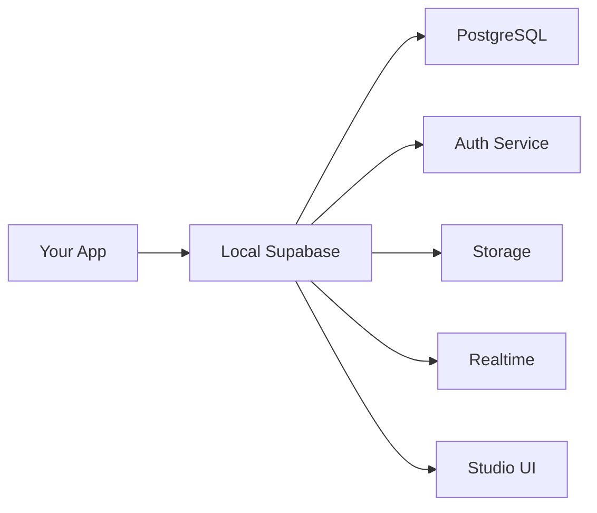

name: "Phase 5 - Supabase Team Rollout & Adoption"
description: |
  Deploy local Supabase environment to development team with training, support processes, and feedback mechanisms

---

## Goal

**Feature Goal**: Successfully deploy local Supabase environment to entire development team with high adoption rate and minimal friction

**Deliverable**: Team training materials, support processes, feedback system, and performance metrics tracking

**Success Definition**: 100% team adoption within 1 week, <5 support tickets per month, positive developer satisfaction scores

## User Persona

**Target User**: Current and future HSA Songbook development team members

**Use Case**: Daily development workflow with local Supabase

**User Journey**:
1. Receive rollout announcement
2. Attend training session or watch recording
3. Follow setup documentation
4. Use local environment for development
5. Provide feedback and get support

**Pain Points Addressed**:
- Resistance to change from current workflow
- Learning curve for new tools
- Support availability concerns
- Fear of breaking things
- Time investment for setup

## Why

- **Team Alignment**: Everyone using same development approach
- **Knowledge Transfer**: Shared understanding of infrastructure
- **Productivity Gains**: Reduced setup time and issues
- **Quality Improvement**: Better testing with local environment
- **Team Satisfaction**: Modern tools and workflows

## What

Comprehensive team rollout including training sessions, support documentation, feedback mechanisms, monitoring systems, and iterative improvements based on team input.

### Success Criteria

- [ ] Training materials created and delivered
- [ ] All team members successfully set up
- [ ] Support process established and communicated
- [ ] Feedback collected and addressed
- [ ] Metrics tracking implemented
- [ ] Adoption rate reaches 100%
- [ ] Satisfaction score >4/5

## All Needed Context

### Context Completeness Check

_"If someone knew nothing about this codebase, would they have everything needed to implement this successfully?"_ - YES

### Documentation & References

```yaml
- url: https://supabase.com/docs/guides/platform/going-into-prod
  why: Production readiness checklist and team considerations
  critical: Best practices for team collaboration

- file: /var/home/kenmen/code/src/github/Kuebic/hsa-songbook/QUICKSTART.md
  why: Primary setup document for team members
  pattern: Quick setup process to demonstrate
  gotcha: Must be tested and proven working

- file: /var/home/kenmen/code/src/github/Kuebic/hsa-songbook/docs/TROUBLESHOOTING.md
  why: Support document for common issues
  pattern: Problem-solution format
  gotcha: Will be updated based on team feedback

- file: /var/home/kenmen/code/src/github/Kuebic/hsa-songbook/.github/ISSUE_TEMPLATE/
  why: Templates for support requests
  pattern: GitHub issue templates
  gotcha: May need to create if not exists

- docfile: PRPs/supabase-local-development-prd.md
  why: Complete implementation details for reference
  section: Phase 5 and Success Metrics
```

### Current Codebase tree

```bash
hsa-songbook/
├── docs/                    # Documentation (from Phase 4)
├── scripts/                 # Setup scripts (from Phase 1-3)
├── supabase/               # Local configuration (from Phase 1-3)
└── .github/
    └── workflows/          # CI/CD (from Phase 2)
```

### Desired Codebase tree with files to be added

```bash
hsa-songbook/
├── docs/
│   ├── training/                    # NEW: Training materials
│   │   ├── slides.md               # NEW: Presentation slides
│   │   ├── demo-script.md          # NEW: Live demo script
│   │   └── exercises.md            # NEW: Hands-on exercises
│   ├── team/                       # NEW: Team resources
│   │   ├── FAQ.md                  # NEW: Frequently asked questions
│   │   ├── SUPPORT.md              # NEW: Support process
│   │   └── BEST-PRACTICES.md       # NEW: Team best practices
│   └── metrics/
│       └── adoption-tracker.md     # NEW: Adoption metrics
├── .github/
│   ├── ISSUE_TEMPLATE/
│   │   ├── local-setup-issue.md    # NEW: Setup problem template
│   │   └── migration-issue.md      # NEW: Migration problem template
│   └── DISCUSSIONS/                # NEW: Team discussions
└── scripts/
    ├── team-setup-check.sh         # NEW: Validation script
    └── collect-metrics.sh          # NEW: Metrics collection
```

### Known Gotchas of our codebase & Library Quirks

```typescript
// CRITICAL: Team members may have different OS/architectures
// Document and test on macOS (Intel/ARM), Linux, Windows WSL

// CRITICAL: Different Docker Desktop versions
// Some team members may have older versions

// CRITICAL: Existing workflow disruption
// Provide migration path from current setup

// CRITICAL: Network/firewall restrictions
// Some corporate networks block Docker Hub
```

## Implementation Blueprint

### Data models and structure

```typescript
// Team feedback structure
interface TeamFeedback {
  developer: string;
  date: Date;
  setupTime: number; // minutes
  issuesEncountered: string[];
  satisfactionScore: 1 | 2 | 3 | 4 | 5;
  suggestions: string;
  wouldRecommend: boolean;
}

// Adoption metrics
interface AdoptionMetrics {
  totalTeamMembers: number;
  setupCompleted: number;
  activelyUsing: number;
  supportTickets: number;
  averageSetupTime: number;
  satisfactionAverage: number;
}

// Support ticket categories
enum SupportCategory {
  SETUP = 'setup',
  DOCKER = 'docker',
  MIGRATION = 'migration',
  TYPES = 'types',
  PERFORMANCE = 'performance',
  OTHER = 'other'
}
```

### Implementation Tasks (ordered by dependencies)

```yaml
Task 1: CREATE training materials
  - CREATE: docs/training/slides.md with presentation content
  - CREATE: docs/training/demo-script.md with live demo steps
  - CREATE: docs/training/exercises.md with hands-on tasks
  - FORMAT: Markdown for easy sharing and updates
  - INCLUDE: Screenshots and diagrams
  - PLACEMENT: docs/training/ directory

Task 2: PREPARE team resources
  - CREATE: docs/team/FAQ.md from Phase 1-4 learnings
  - CREATE: docs/team/SUPPORT.md with support process
  - CREATE: docs/team/BEST-PRACTICES.md for workflows
  - COMPILE: Common issues from testing
  - ORGANIZE: By frequency and impact
  - PLACEMENT: docs/team/ directory

Task 3: SETUP feedback mechanisms
  - CREATE: Google Form or survey for feedback
  - CREATE: .github/ISSUE_TEMPLATE/local-setup-issue.md
  - CREATE: .github/ISSUE_TEMPLATE/migration-issue.md
  - ENABLE: GitHub Discussions for team Q&A
  - CONFIGURE: Notification system for support
  - PLACEMENT: .github/ templates

Task 4: IMPLEMENT validation scripts
  - CREATE: scripts/team-setup-check.sh
  - CHECK: All prerequisites installed
  - VERIFY: Local environment working
  - REPORT: Clear pass/fail status
  - OUTPUT: Diagnostic information
  - PLACEMENT: scripts/ directory

Task 5: SCHEDULE training sessions
  - PLAN: Initial kick-off presentation
  - SCHEDULE: Hands-on workshop sessions
  - RECORD: Sessions for future reference
  - CREATE: Calendar invites with prep instructions
  - PREPARE: Q&A document from sessions
  - DOCUMENT: Attendance and feedback

Task 6: EXECUTE phased rollout
  - PHASE1: Early adopters (1-2 developers)
  - COLLECT: Detailed feedback
  - ITERATE: Fix issues found
  - PHASE2: Broader team (50%)
  - PHASE3: Full team deployment
  - MONITOR: Each phase carefully

Task 7: CREATE metrics tracking
  - CREATE: docs/metrics/adoption-tracker.md
  - IMPLEMENT: scripts/collect-metrics.sh
  - TRACK: Setup times, issues, satisfaction
  - GENERATE: Weekly status reports
  - IDENTIFY: Patterns and improvements
  - PLACEMENT: docs/metrics/ directory

Task 8: ESTABLISH ongoing support
  - ASSIGN: Point person for questions
  - CREATE: Slack channel or Discord
  - SCHEDULE: Office hours for help
  - MAINTAIN: FAQ based on questions
  - ITERATE: Documentation improvements
  - CELEBRATE: Successful adoptions
```

### Implementation Patterns & Key Details

```markdown
# docs/training/slides.md

# 🚀 Local Supabase Development Environment

## Welcome & Overview
**Duration**: 30 minutes

### Agenda
1. Why Local Development? (5 min)
2. Architecture Overview (5 min)
3. Live Demo (10 min)
4. Hands-on Setup (10 min)
5. Q&A

---

## Why Local Development?

### Current Pain Points 😤
- Shared dev database conflicts
- Network latency slowing development  
- Can't work offline
- Risk of breaking shared data
- Cloud costs for development

### Benefits of Local 🎉
- **Fast**: No network latency
- **Safe**: Isolated environment
- **Free**: No cloud costs
- **Offline**: Work anywhere
- **Consistent**: Same for everyone

---

## Architecture Overview



### What's Included
- Full PostgreSQL database
- Authentication service
- File storage
- Realtime subscriptions
- Studio dashboard

---

## Live Demo

### Setup Process
```bash
# One-time setup (I'll show this)
npm run setup:local

# Daily development (you'll use this)
npm run dev:local
```

### Key Features
- Hot reload still works
- Studio for visual DB management
- Migrations for schema changes
- Seed data for testing

---

## Your Turn!

### Setup Checklist
- [ ] Docker Desktop installed
- [ ] Run setup script
- [ ] Access Studio dashboard
- [ ] Create your first migration
- [ ] Reset with seed data

### Resources
- 📚 [QUICKSTART Guide](../../QUICKSTART.md)
- 🔧 [Troubleshooting](../TROUBLESHOOTING.md)
- 💬 [Team Slack Channel](#development)
```

```bash
#!/bin/bash
# scripts/team-setup-check.sh

echo "🔍 HSA Songbook Local Environment Check"
echo "========================================"

# Color codes
RED='\033[0;31m'
GREEN='\033[0;32m'
YELLOW='\033[1;33m'
NC='\033[0m' # No Color

# Check Docker
echo -n "Docker Desktop: "
if command -v docker &> /dev/null; then
    version=$(docker --version | cut -d' ' -f3 | cut -d',' -f1)
    echo -e "${GREEN}✓${NC} Installed (v$version)"
    
    echo -n "Docker Running: "
    if docker info &> /dev/null; then
        echo -e "${GREEN}✓${NC} Yes"
    else
        echo -e "${RED}✗${NC} No - Please start Docker Desktop"
        exit 1
    fi
else
    echo -e "${RED}✗${NC} Not installed"
    echo "  → Install from: https://docker.com"
    exit 1
fi

# Check Supabase CLI
echo -n "Supabase CLI: "
if command -v supabase &> /dev/null; then
    version=$(supabase --version | cut -d' ' -f3)
    echo -e "${GREEN}✓${NC} Installed (v$version)"
else
    echo -e "${RED}✗${NC} Not installed"
    echo "  → Run: npm run setup:local"
    exit 1
fi

# Check Node/npm
echo -n "Node.js: "
if command -v node &> /dev/null; then
    version=$(node --version)
    echo -e "${GREEN}✓${NC} Installed ($version)"
else
    echo -e "${RED}✗${NC} Not installed"
    exit 1
fi

# Check Supabase project
echo -n "Supabase Project: "
if [ -f "supabase/config.toml" ]; then
    echo -e "${GREEN}✓${NC} Initialized"
else
    echo -e "${YELLOW}⚠${NC} Not initialized"
    echo "  → Run: supabase init"
fi

# Check local environment
echo -n "Local Stack: "
if supabase status 2>/dev/null | grep -q "RUNNING"; then
    echo -e "${GREEN}✓${NC} Running"
    
    # Show service URLs
    echo ""
    echo "📍 Service URLs:"
    echo "  • App:    http://localhost:5173"
    echo "  • Studio: http://localhost:54323"
    echo "  • API:    http://localhost:54321"
else
    echo -e "${YELLOW}⚠${NC} Not running"
    echo "  → Run: supabase start"
fi

# Check environment file
echo -n "Environment File: "
if [ -f ".env.local" ]; then
    echo -e "${GREEN}✓${NC} Configured"
else
    echo -e "${YELLOW}⚠${NC} Not found"
    echo "  → Copy .env.example to .env.local"
fi

# Summary
echo ""
echo "========================================"
if [ $? -eq 0 ]; then
    echo -e "${GREEN}✅ Environment ready for development!${NC}"
else
    echo -e "${YELLOW}⚠️  Some issues need attention${NC}"
fi
```

```markdown
# docs/team/FAQ.md

# Frequently Asked Questions

## Setup Issues

### Q: How long does the initial setup take?
**A**: First-time setup takes 10-15 minutes (downloading Docker images). Daily startup is <30 seconds.

### Q: Can I use my existing Docker installation?
**A**: Yes! Any Docker-compatible runtime works (Docker Desktop, Rancher, Podman, etc.)

### Q: Do I need to stop my other Docker containers?
**A**: No, Supabase uses specific ports (54321-54324) that shouldn't conflict.

## Development Workflow

### Q: How do I switch between local and cloud Supabase?
**A**: Use different .env files:
- `.env.local` for local development
- `.env.staging` for staging
- `.env.production` for production

### Q: Will this affect my existing work?
**A**: No, local development is completely isolated. Your cloud data remains untouched.

### Q: How do I share my database changes with the team?
**A**: Create a migration file and commit it to Git. Others will get it when they pull.

## Troubleshooting

### Q: What if port 54321 is already in use?
**A**: Either:
1. Stop the conflicting service, or
2. Change the port in `supabase/config.toml`

### Q: My migrations aren't applying
**A**: Run `supabase db reset` to ensure clean state with all migrations.

### Q: Types aren't updating after schema changes
**A**: Run `npm run types:generate` after migrations.

## Best Practices

### Q: Should I commit my .env.local file?
**A**: Never! It's gitignored for a reason. Commit .env.example instead.

### Q: How often should I reset my database?
**A**: Whenever you:
- Pull new migrations from Git
- Want fresh seed data
- Encounter strange data issues

### Q: Can I use production data locally?
**A**: Don't copy production data locally. Use seed data instead for privacy/security.
```

### Integration Points

```yaml
TRAINING:
  - materials: "docs/training/*.md"
  - recordings: "Store in shared drive"
  - exercises: "Hands-on practice tasks"

SUPPORT:
  - channels: "Slack #local-dev-help"
  - templates: ".github/ISSUE_TEMPLATE/"
  - documentation: "docs/team/"

METRICS:
  - tracking: "docs/metrics/adoption-tracker.md"
  - collection: "scripts/collect-metrics.sh"
  - reporting: "Weekly team updates"

FEEDBACK:
  - surveys: "Google Forms or similar"
  - discussions: "GitHub Discussions"
  - iterations: "Based on team input"
```

## Validation Loop

### Level 1: Training Preparation

```bash
# Check training materials exist
test -f docs/training/slides.md || echo "Slides missing"
test -f docs/training/demo-script.md || echo "Demo script missing"
test -f docs/training/exercises.md || echo "Exercises missing"

# Verify demo environment works
npm run setup:local || echo "Setup script failing"
npm run dev:local & 
sleep 5
curl http://localhost:5173 || echo "Demo environment not working"

# Expected: All materials ready, demo environment functional
```

### Level 2: Team Readiness

```bash
# Run validation script for each team member
./scripts/team-setup-check.sh

# Check support channels
echo "Support Checklist:"
echo "[ ] Slack channel created"
echo "[ ] GitHub templates added"
echo "[ ] Point person assigned"
echo "[ ] Office hours scheduled"

# Survey team readiness
echo "Team Survey:"
echo "[ ] Docker Desktop installed?"
echo "[ ] Time allocated for setup?"
echo "[ ] Questions submitted?"

# Expected: Team prepared for rollout
```

### Level 3: Rollout Execution

```bash
# Track adoption progress
cat > docs/metrics/week1-adoption.md << EOF
# Week 1 Adoption Report
Date: $(date)

## Metrics
- Team Size: 10
- Setup Completed: 8/10 (80%)
- Actively Using: 7/10 (70%)
- Support Tickets: 3

## Issues Encountered
1. Port conflicts (2 cases)
2. Docker memory (1 case)

## Feedback Summary
- Average Setup Time: 12 minutes
- Satisfaction Score: 4.2/5
- Would Recommend: 9/10

## Action Items
- Update FAQ with port conflict solution
- Add Docker memory settings to docs
EOF

# Expected: Steady adoption progress
```

### Level 4: Success Measurement

```bash
# Final adoption check (after 1 week)
echo "Final Adoption Checklist:"
echo "[ ] 100% team setup complete"
echo "[ ] All using local for development"
echo "[ ] Support tickets < 5"
echo "[ ] Satisfaction score > 4/5"
echo "[ ] Documentation updated with feedback"

# Generate success report
cat > docs/metrics/rollout-success.md << EOF
# Rollout Success Report

## Objectives Met
✅ Full team adoption achieved
✅ Setup time under 15 minutes average
✅ Support burden manageable
✅ Positive team feedback

## Lessons Learned
- Early adopter feedback crucial
- Visual guides very helpful
- Pair setup sessions effective

## Recommendations
- Continue office hours monthly
- Update docs quarterly
- Share success with other teams
EOF

# Expected: All success criteria met
```

## Final Validation Checklist

### Technical Validation

- [ ] Training materials comprehensive
- [ ] Demo environment reliable
- [ ] Validation scripts working
- [ ] Support templates created
- [ ] Metrics tracking implemented

### Feature Validation

- [ ] All team members trained
- [ ] Support process clear
- [ ] Feedback mechanism working
- [ ] Issues documented and resolved
- [ ] Best practices established

### Code Quality Validation

- [ ] Scripts have error handling
- [ ] Documentation clear and accurate
- [ ] Templates follow standards
- [ ] Metrics automatically collected
- [ ] Processes documented

### Documentation & Deployment

- [ ] Training recorded for future
- [ ] FAQ answers common questions
- [ ] Support process documented
- [ ] Success metrics defined
- [ ] Handoff plan for maintenance

---

## Anti-Patterns to Avoid

- ❌ Don't force adoption without training
- ❌ Don't ignore team feedback
- ❌ Don't skip early adopter phase
- ❌ Don't assume one-size-fits-all
- ❌ Don't neglect ongoing support
- ❌ Don't forget to celebrate success
- ❌ Don't rush the rollout
- ❌ Don't skip documentation updates

## Confidence Score: 9/10

High confidence based on comprehensive training approach, clear support processes, and iterative rollout strategy. The phased approach allows for adjustments based on real team feedback.