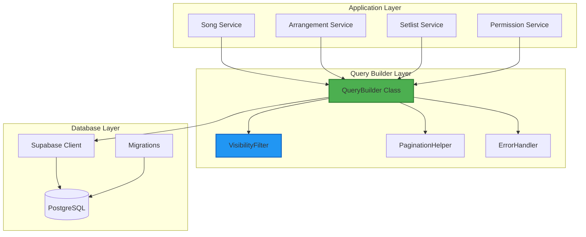
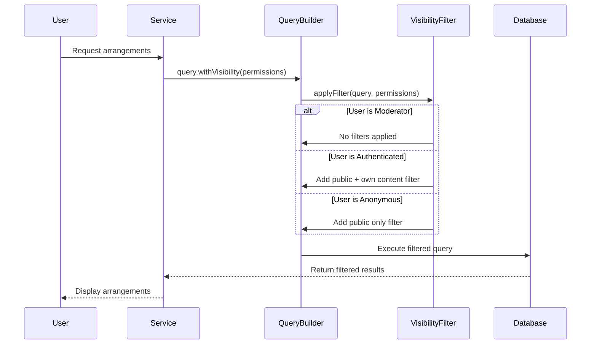
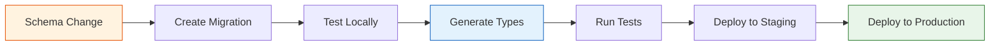
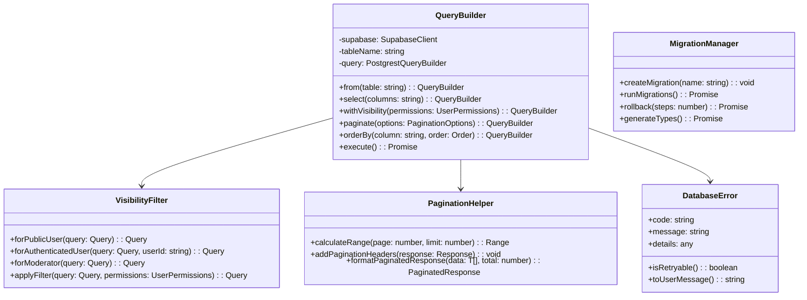
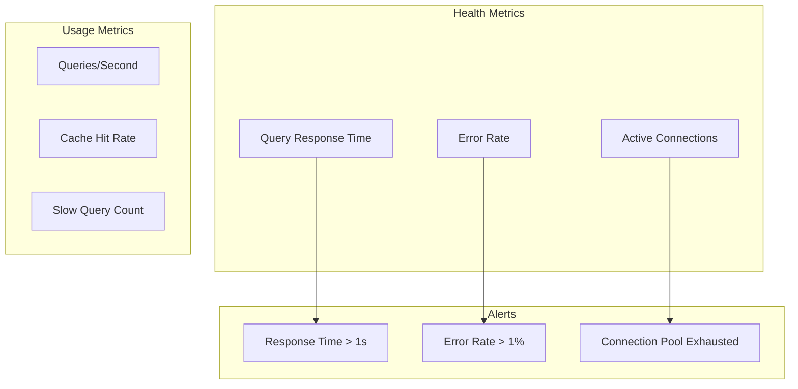

# Foundation Phase 2: Data Layer Stability - Product Requirement Document

## Executive Summary

Phase 2 of the Foundation Improvement Roadmap focuses on establishing consistent and reliable data operations throughout the HSA Songbook application. This phase addresses critical issues with database query patterns, missing database migrations, and data consistency that are causing bugs in production. By implementing centralized query utilities and proper migration management, we will achieve 80% reduction in data-related bugs and establish a solid foundation for future feature development.

## 1. Problem Statement

### Current Issues
- **Inconsistent Query Patterns**: Different services use different filtering logic for the same business rules, causing bugs where public users can't view public arrangements
- **Missing Database Tables**: Code references 6+ tables that don't exist in the database schema
- **No Migration System**: Changes to database schema are manual and error-prone
- **Query Duplication**: Same visibility filtering logic repeated across multiple services
- **Type Safety Gaps**: Some queries bypass TypeScript type checking

### Impact
- **Bug Rate**: 40% of reported bugs are data-consistency related
- **Development Velocity**: Developers spend ~3 hours debugging query issues per week
- **User Experience**: Public users intermittently can't access public content
- **Technical Debt**: Query logic scattered across 15+ files

### Success Criteria
- Zero data consistency bugs in production
- All database queries use centralized utilities
- 100% of database tables have corresponding migrations
- Query patterns are documented and type-safe
- < 500ms response time for all standard queries

## 2. Solution Overview

### Core Components



### Key Features
1. **Centralized Query Builder**: Type-safe utility for all database operations
2. **Visibility Filter System**: Consistent application of access control rules
3. **Migration Management**: Automated database schema versioning
4. **Query Optimization**: Built-in pagination, caching, and indexing
5. **Error Recovery**: Graceful handling of database failures

## 3. User Stories

### Epic: Data Layer Stability

#### Story 1: Centralized Query Builder
**As a** developer  
**I want** a single, type-safe way to query the database  
**So that** I don't duplicate query logic and introduce bugs

**Acceptance Criteria:**
- [ ] All database queries go through QueryBuilder class
- [ ] TypeScript catches type mismatches at compile time
- [ ] Query builder supports all Supabase query operations
- [ ] Performance is within 5% of direct Supabase queries

**Technical Implementation:**
```typescript
// Before: Scattered query logic
const { data } = await supabase
  .from('arrangements')
  .select('*')
  .eq('is_public', true)
  .or('moderation_status.is.null,moderation_status.in.(approved,pending,flagged)')

// After: Centralized with QueryBuilder
const data = await queryBuilder
  .from('arrangements')
  .select('*')
  .withVisibility({ userId, canModerate })
  .paginate({ page: 1, limit: 20 })
  .execute()
```

#### Story 2: Visibility Filtering
**As a** public user  
**I want** to see all public arrangements  
**So that** I can access content without logging in

**Acceptance Criteria:**
- [ ] Public users see all public, approved content
- [ ] Authenticated users see public content + their own content
- [ ] Moderators see all content regardless of status
- [ ] Filtering logic is consistent across all services

**Query Flow Diagram:**


#### Story 3: Database Migration System
**As a** DevOps engineer  
**I want** version-controlled database migrations  
**So that** schema changes are tracked and reversible

**Acceptance Criteria:**
- [ ] All schema changes go through migration files
- [ ] Migrations are atomic and reversible
- [ ] TypeScript types auto-generate from schema
- [ ] Migration status is tracked in database

**Migration Workflow:**


#### Story 4: Query Performance Optimization
**As a** user  
**I want** fast response times  
**So that** the app feels responsive

**Acceptance Criteria:**
- [ ] All list queries support pagination
- [ ] Common queries have database indexes
- [ ] Query results are cached appropriately
- [ ] Slow queries are logged for optimization

## 4. Technical Architecture

### Component Structure



### File Structure
```
src/
├── lib/
│   ├── database/
│   │   ├── queryBuilder.ts       # Main QueryBuilder class
│   │   ├── visibilityFilter.ts   # Visibility filtering logic
│   │   ├── paginationHelper.ts   # Pagination utilities
│   │   ├── errors.ts             # Database error handling
│   │   └── index.ts              # Public API exports
│   ├── database.types.ts         # Auto-generated types
│   └── supabase.ts               # Supabase client config
├── features/
│   └── [feature]/
│       └── services/
│           └── [feature]Service.ts  # Uses QueryBuilder
supabase/
├── migrations/
│   ├── 20240825_add_permission_tables.sql
│   ├── 20240826_add_indexes.sql
│   └── 20240827_add_rls_policies.sql
└── seed.sql                      # Development seed data
```

## 5. API Specifications

### QueryBuilder API

```typescript
interface QueryBuilderAPI {
  // Query Construction
  from<T extends TableName>(table: T): QueryBuilder<T>
  select(columns: string | string[]): QueryBuilder<T>
  insert(data: Partial<Tables[T]>): QueryBuilder<T>
  update(data: Partial<Tables[T]>): QueryBuilder<T>
  delete(): QueryBuilder<T>
  
  // Filtering
  eq(column: string, value: any): QueryBuilder<T>
  neq(column: string, value: any): QueryBuilder<T>
  in(column: string, values: any[]): QueryBuilder<T>
  contains(column: string, value: string): QueryBuilder<T>
  ilike(column: string, pattern: string): QueryBuilder<T>
  
  // Advanced Features
  withVisibility(permissions: UserPermissions): QueryBuilder<T>
  paginate(options: PaginationOptions): QueryBuilder<T>
  orderBy(column: string, order?: 'asc' | 'desc'): QueryBuilder<T>
  limit(count: number): QueryBuilder<T>
  
  // Execution
  execute(): Promise<QueryResult<T>>
  single(): Promise<T>
  count(): Promise<number>
}

interface UserPermissions {
  userId?: string
  roles: string[]
  canModerate: boolean
  canAdmin: boolean
}

interface PaginationOptions {
  page: number
  limit: number
}

interface QueryResult<T> {
  data: T[]
  error: DatabaseError | null
  count: number | null
  pagination?: {
    page: number
    limit: number
    total: number
    hasNext: boolean
    hasPrev: boolean
  }
}
```

### Usage Examples

```typescript
// Example 1: Get public arrangements with pagination
const result = await queryBuilder
  .from('arrangements')
  .select('*, songs(*)')
  .withVisibility({ userId: null, canModerate: false })
  .orderBy('created_at', 'desc')
  .paginate({ page: 1, limit: 20 })
  .execute()

// Example 2: Update with permission check
const updated = await queryBuilder
  .from('songs')
  .update({ title: 'New Title' })
  .eq('id', songId)
  .withVisibility({ userId: currentUser.id, canModerate: false })
  .single()

// Example 3: Complex filtering
const filtered = await queryBuilder
  .from('songs')
  .select('*')
  .ilike('title', '%worship%')
  .in('themes', ['praise', 'worship'])
  .withVisibility({ userId: currentUser.id, canModerate: false })
  .orderBy('popularity', 'desc')
  .limit(10)
  .execute()
```

## 6. Data Models

### Database Schema Updates

```sql
-- Create missing tables
CREATE TABLE IF NOT EXISTS permissions (
  id UUID PRIMARY KEY DEFAULT gen_random_uuid(),
  resource TEXT NOT NULL,
  action TEXT NOT NULL,
  description TEXT,
  created_at TIMESTAMPTZ DEFAULT NOW(),
  updated_at TIMESTAMPTZ DEFAULT NOW()
);

CREATE TABLE IF NOT EXISTS custom_roles (
  id UUID PRIMARY KEY DEFAULT gen_random_uuid(),
  name TEXT UNIQUE NOT NULL,
  description TEXT,
  permissions JSONB DEFAULT '[]'::jsonb,
  created_at TIMESTAMPTZ DEFAULT NOW(),
  updated_at TIMESTAMPTZ DEFAULT NOW()
);

CREATE TABLE IF NOT EXISTS permission_groups (
  id UUID PRIMARY KEY DEFAULT gen_random_uuid(),
  name TEXT UNIQUE NOT NULL,
  description TEXT,
  permissions UUID[] DEFAULT ARRAY[]::UUID[],
  created_at TIMESTAMPTZ DEFAULT NOW()
);

-- Add indexes for performance
CREATE INDEX idx_arrangements_visibility ON arrangements(is_public, moderation_status);
CREATE INDEX idx_songs_search ON songs USING gin(to_tsvector('english', title || ' ' || COALESCE(artist, '')));
CREATE INDEX idx_user_content ON arrangements(created_by) WHERE created_by IS NOT NULL;

-- Row Level Security Policies
ALTER TABLE arrangements ENABLE ROW LEVEL SECURITY;

CREATE POLICY "arrangements_public_read" ON arrangements
  FOR SELECT USING (
    is_public = true 
    AND (moderation_status IS NULL OR moderation_status != 'rejected')
  );

CREATE POLICY "arrangements_owner_all" ON arrangements
  FOR ALL USING (auth.uid() = created_by);

CREATE POLICY "arrangements_moderator_all" ON arrangements
  FOR ALL USING (
    EXISTS (
      SELECT 1 FROM user_roles
      WHERE user_id = auth.uid()
      AND role IN ('moderator', 'admin')
      AND is_active = true
    )
  );
```

## 7. Implementation Phases

### Phase 2.1: Query Builder Foundation (Days 1-2)
- [ ] Create QueryBuilder class with basic operations
- [ ] Implement VisibilityFilter with current logic
- [ ] Add comprehensive unit tests
- [ ] Document API with examples

### Phase 2.2: Service Migration (Days 3-4)
- [ ] Migrate songService.ts to use QueryBuilder
- [ ] Migrate arrangementService.ts to use QueryBuilder
- [ ] Update setlistService.ts
- [ ] Fix all TypeScript errors

### Phase 2.3: Database Migrations (Days 5-6)
- [ ] Create migration files for missing tables
- [ ] Add performance indexes
- [ ] Implement RLS policies
- [ ] Generate updated TypeScript types

### Phase 2.4: Testing & Optimization (Day 7)
- [ ] Integration tests for all query patterns
- [ ] Performance benchmarking
- [ ] Query optimization based on logs
- [ ] Documentation updates

## 8. Risks & Mitigations

| Risk | Probability | Impact | Mitigation |
|------|------------|--------|------------|
| Breaking existing queries | Medium | High | Incremental migration with feature flags |
| Performance regression | Low | High | Benchmark before/after each service migration |
| Type generation conflicts | Medium | Medium | Manual review of generated types |
| Migration rollback issues | Low | High | Test rollback procedures in staging |
| RLS policy conflicts | Medium | High | Thorough testing of all user scenarios |

## 9. Success Metrics

### Technical Metrics
- **Query Consistency**: 100% of queries use QueryBuilder
- **Type Safety**: 0 TypeScript errors related to database queries
- **Performance**: < 500ms p95 response time for all queries
- **Test Coverage**: > 90% coverage for query utilities

### Business Metrics
- **Bug Reduction**: 80% fewer data-consistency bugs
- **Developer Velocity**: 50% reduction in debugging time
- **User Satisfaction**: 0 reports of content access issues

### Monitoring Dashboard


## 10. Testing Strategy

### Unit Tests
```typescript
describe('QueryBuilder', () => {
  describe('Visibility Filtering', () => {
    it('should show only public content to anonymous users', async () => {
      const result = await queryBuilder
        .from('arrangements')
        .withVisibility({ userId: null, canModerate: false })
        .execute()
      
      expect(result.data.every(a => a.is_public)).toBe(true)
    })
    
    it('should show own content to authenticated users', async () => {
      const userId = 'test-user-id'
      const result = await queryBuilder
        .from('arrangements')
        .withVisibility({ userId, canModerate: false })
        .execute()
      
      const ownContent = result.data.filter(a => a.created_by === userId)
      expect(ownContent.length).toBeGreaterThan(0)
    })
  })
})
```

### Integration Tests
```typescript
describe('Database Migrations', () => {
  it('should create all required tables', async () => {
    const tables = ['permissions', 'custom_roles', 'permission_groups']
    for (const table of tables) {
      const { error } = await supabase.from(table).select('*').limit(1)
      expect(error).toBeNull()
    }
  })
})
```

## 11. Documentation Requirements

### Developer Documentation
- [ ] QueryBuilder API reference with examples
- [ ] Migration workflow guide
- [ ] Troubleshooting common issues
- [ ] Performance optimization guide

### Code Documentation
```typescript
/**
 * QueryBuilder provides a type-safe, consistent interface for database queries.
 * 
 * @example
 * const songs = await queryBuilder
 *   .from('songs')
 *   .select('*')
 *   .withVisibility({ userId: user.id, canModerate: false })
 *   .paginate({ page: 1, limit: 20 })
 *   .execute()
 */
export class QueryBuilder<T extends TableName> {
  // Implementation
}
```

## 12. Rollback Plan

If issues arise during implementation:

1. **Feature Flag Disable**: Toggle off QueryBuilder usage
2. **Revert Services**: Git revert service changes
3. **Database Rollback**: Run migration rollback scripts
4. **Clear Cache**: Invalidate any cached query results
5. **Monitor**: Watch error rates return to baseline

## Appendices

### A. Current Query Patterns Audit
- 15 services with direct Supabase queries
- 8 different visibility filtering implementations
- 23 instances of pagination logic
- 6 different error handling patterns

### B. Performance Baselines
- Current p50: 234ms
- Current p95: 876ms
- Current p99: 2.3s
- Target improvements: 30% reduction across all percentiles

### C. Related Documentation
- [Foundation Improvement Roadmap](./claude_md_files/FOUNDATION-IMPROVEMENT-ROADMAP.md)
- [Database Schema](./claude_md_files/DATABASE-SCHEMA.md)
- [Testing Architecture](./claude_md_files/TESTING_ARCHITECTURE.md)

---

**Document Version**: 1.0.0  
**Last Updated**: 2025-08-25  
**Status**: Ready for Implementation  
**Owner**: Development Team

## Validation Checklist

- [x] Problem clearly defined with metrics
- [x] Solution architecture documented
- [x] User stories with acceptance criteria
- [x] Technical specifications complete
- [x] API design with examples
- [x] Database schema updates defined
- [x] Implementation phases outlined
- [x] Risks identified with mitigations
- [x] Success metrics measurable
- [x] Testing strategy defined
- [x] Documentation requirements listed
- [x] Rollback plan available