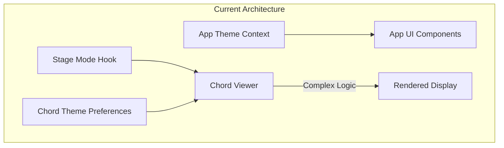
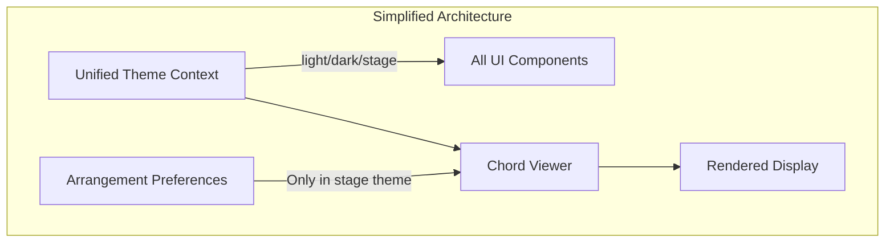
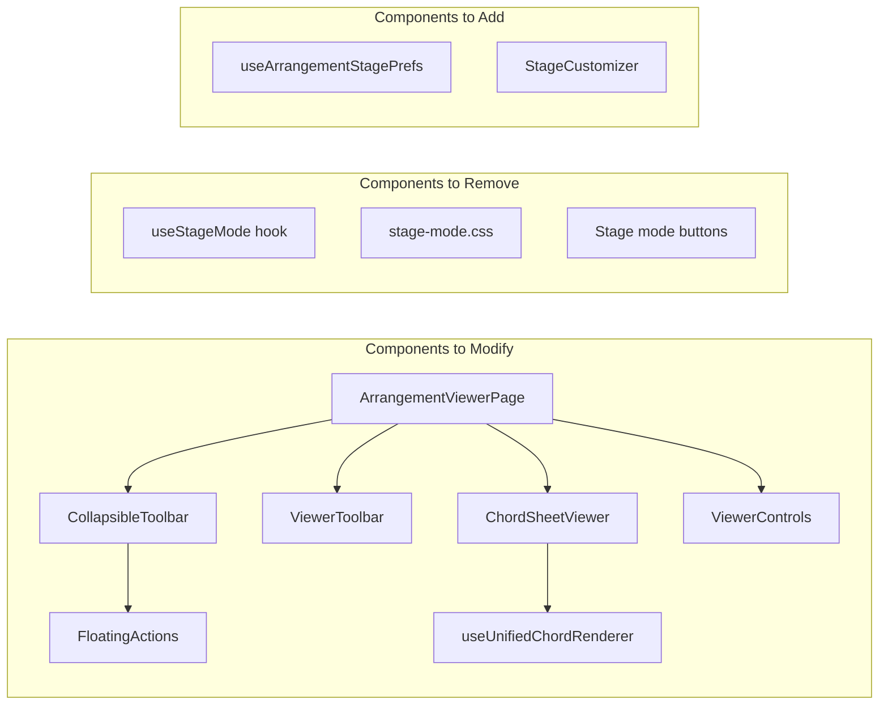
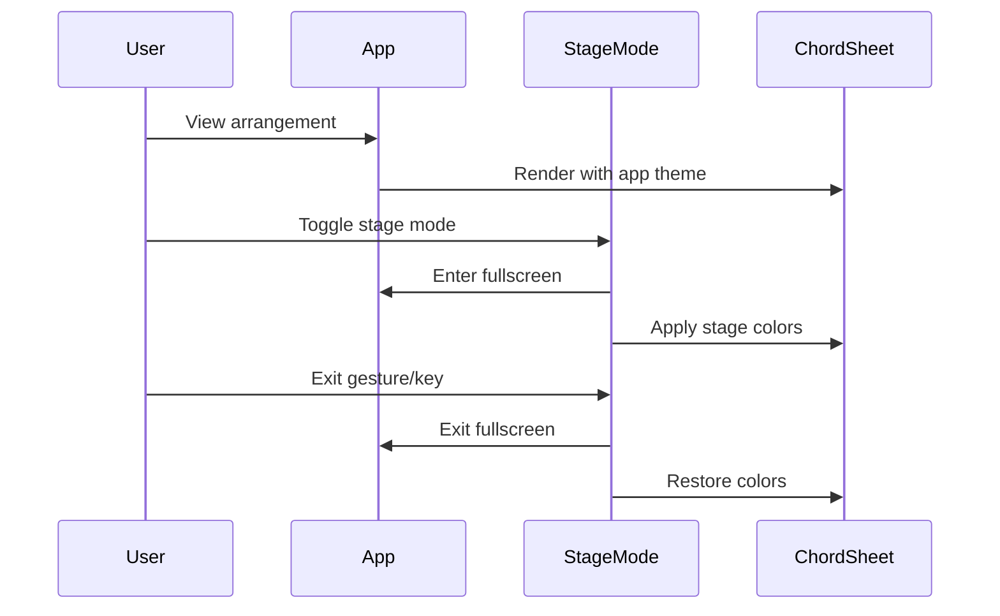
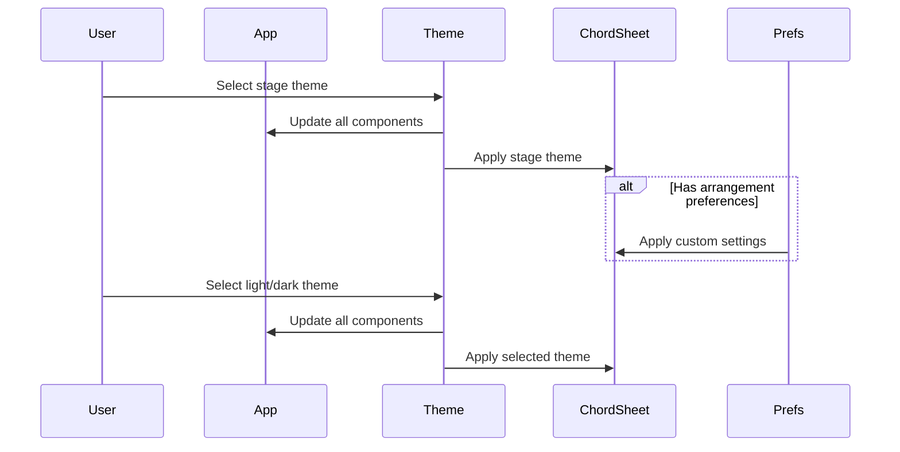
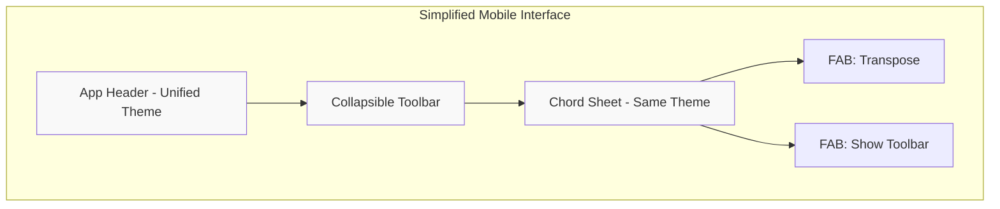
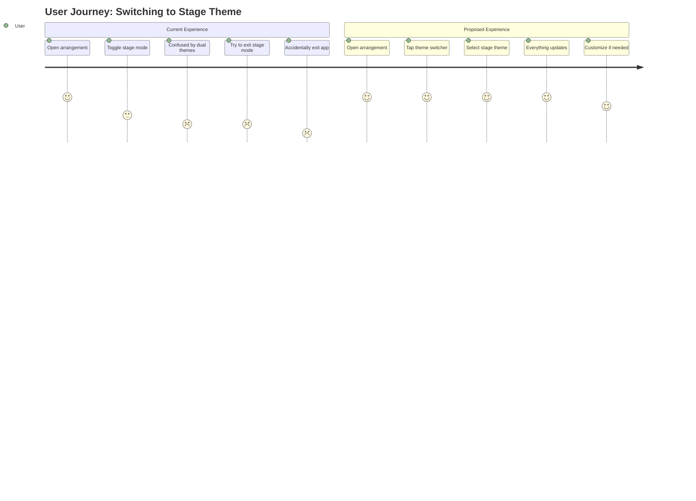
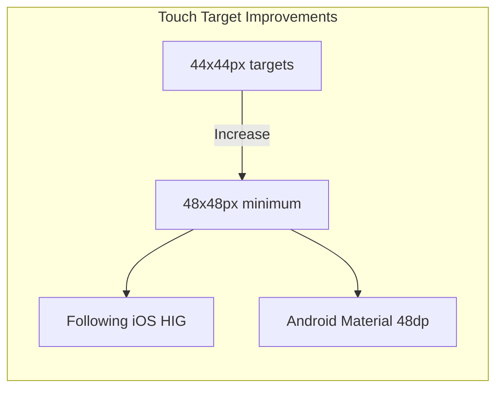

# Mobile Chord View Cleanup - Product Requirements Document

## Executive Summary

Simplify the mobile experience for viewing chord arrangements by removing the separate "stage mode" toggle and eliminating the ability for chord sheets to have different themes from the main application. Instead, users will switch the entire app theme to "stage" when needed, providing a cleaner, more consistent experience with arrangement-specific customization capabilities.

### Key Insights from Market Research

Based on 2025 mobile UX best practices and competitor analysis (OnSong, ForScore, Ultimate Guitar), successful music apps prioritize:
- **Simplicity over features** - Users focus on practice, not navigation
- **Performance first** - Instant loading and smooth transitions critical
- **Unified theming** - Consistent visual experience reduces cognitive load
- **Accessibility by default** - Dark mode now standard, not optional

Our approach aligns with these principles by consolidating three theme systems into one, reducing UI complexity, and improving performance through simplified state management.

## Problem Statement

### Current Issues
1. **Complexity Overload**: Multiple theme systems create confusion
   - App has its own theme (light/dark/stage)
   - ChordSheet can have different theme from app
   - Stage mode adds another layer of styling
   - Users struggle to understand which controls affect what

2. **Mobile UX Friction**: 
   - Floating action buttons clutter the interface
   - Stage mode toggle is redundant with app theme
   - Theme inconsistency between app chrome and content
   - Complex gesture controls for entering/exiting modes

3. **Maintenance Burden**:
   - Three separate styling systems to maintain
   - Complex state management for theme synchronization
   - Duplicate color definitions across systems

### User Pain Points
- "Why does my chord sheet look different from my app?"
- "I accidentally triggered stage mode and don't know how to exit"
- "Too many buttons floating on my screen"
- "I want my stage mode to look different for different songs"

## Solution Overview

### Core Changes
1. **Remove Stage Mode Toggle**: Eliminate the separate stage mode functionality
2. **Unified Theme System**: ChordSheet always uses app theme
3. **Simplified Mobile UI**: Remove stage mode from floating actions
4. **Arrangement Customization**: Allow per-arrangement display preferences when in stage theme

### Benefits
- **Simpler Mental Model**: One theme system to understand
- **Cleaner Mobile UI**: Fewer floating buttons
- **Better Consistency**: Unified visual experience
- **Enhanced Flexibility**: Arrangement-specific customization when needed

## User Stories

### Epic: Simplified Mobile Chord Viewing

#### Story 1: Unified Theme Experience
**As a** musician using the app on mobile  
**I want** the chord sheet to always match my app theme  
**So that** I have a consistent visual experience

**Acceptance Criteria:**
- [ ] ChordSheet viewer uses app theme colors
- [ ] No separate theme selector for chord sheets
- [ ] Theme changes apply immediately to all components
- [ ] Print view maintains readability regardless of theme

#### Story 2: Stage Mode via Theme
**As a** performer on stage  
**I want** to switch my entire app to stage theme  
**So that** I have optimal visibility in dark environments

**Acceptance Criteria:**
- [ ] App theme selector includes "stage" option
- [ ] Stage theme provides high contrast colors
- [ ] All UI elements adapt to stage theme
- [ ] Quick theme toggle accessible from arrangement viewer

#### Story 3: Arrangement-Specific Stage Settings
**As a** performer with diverse repertoire  
**I want** to customize how each song appears in stage theme  
**So that** I can optimize visibility per arrangement

**Acceptance Criteria:**
- [ ] When in stage theme, can adjust per-arrangement:
  - Font size override
  - Chord color preference
  - Show/hide section markers
  - Line spacing adjustment
- [ ] Settings persist per arrangement
- [ ] Settings only apply when app is in stage theme

#### Story 4: Simplified Mobile Controls
**As a** mobile user  
**I want** fewer floating buttons  
**So that** I have more screen space for content

**Acceptance Criteria:**
- [ ] Remove "stage mode" from floating actions
- [ ] Keep only essential actions (transpose, show toolbar)
- [ ] Floating actions auto-hide when scrolling
- [ ] Clean animation transitions

## Technical Architecture

### Current State


### Proposed Architecture


### Component Dependencies


## Implementation Phases

### Phase 1: Remove Stage Mode System
**Priority: High**
- Remove `useStageMode` hook
- Remove stage mode CSS file
- Remove stage mode toggle from UI
- Remove stage mode from floating actions
- Clean up related event handlers

### Phase 2: Unify Theme System
**Priority: High**
- Update `useUnifiedChordRenderer` to always use app theme
- Remove chord-specific theme preferences
- Update ChordSheetViewer to use app theme
- Ensure print styles work with all themes

### Phase 3: Add Arrangement Customization
**Priority: Medium**
- Create `useArrangementStagePrefs` hook
- Add stage theme customization UI
- Implement per-arrangement preference storage
- Add customization panel to arrangement viewer

### Phase 4: Mobile UI Polish
**Priority: Medium**
- Simplify floating action buttons
- Improve toolbar auto-hide behavior
- Add smooth transitions
- Optimize touch targets

## User Flow Diagrams

### Current Stage Mode Flow


### Proposed Theme Flow


## Mobile Interface Wireframes

### Current Mobile View (Complex)

```mermaid
graph TB
    subgraph "Current Mobile Interface"
        Header[App Header - Light Theme]
        Toolbar[Toolbar with Stage Toggle]
        ChordContent[Chord Sheet - Different Theme]
        FAB1[FAB: Transpose]
        FAB2[FAB: Stage Mode]
        FAB3[FAB: Show Toolbar]
        
        Header --> Toolbar
        Toolbar --> ChordContent
        ChordContent --> FAB1
        ChordContent --> FAB2
        ChordContent --> FAB3
    end
    
    style Header fill:#f9f9f9
    style ChordContent fill:#333
    style FAB2 fill:#ff6b6b
```


### Proposed Mobile View (Simplified)


### Theme Switcher User Journey


### Mobile Touch Targets


## Data Models

### Arrangement Stage Preferences
```typescript
interface ArrangementStagePreferences {
  arrangementId: string
  // Only applied when app theme is "stage"
  stageOverrides?: {
    fontSize?: number        // 12-32
    chordColor?: string     // hex color
    lyricColor?: string     // hex color
    showSections?: boolean
    showComments?: boolean
    lineSpacing?: number    // 1.0-2.0
    customCSS?: string      // Advanced users
  }
  updatedAt: number
}
```

### Updated Theme Context
```typescript
interface ThemeContextValue {
  theme: 'light' | 'dark' | 'stage'
  setTheme: (theme: Theme) => void
  toggleTheme: () => void
  // Quick access for arrangement viewer
  cycleTheme: () => void
}
```

## API Specifications

### Remove APIs
```typescript
// Remove these hooks/functions
- useStageMode()
- toggleStageMode()
- exitStageMode()
- ChordPreferences.theme
```

### New APIs
```typescript
// Arrangement stage preferences
interface ArrangementStagePrefsAPI {
  getPreferences(arrangementId: string): ArrangementStagePreferences | null
  savePreferences(prefs: ArrangementStagePreferences): Promise<void>
  clearPreferences(arrangementId: string): Promise<void>
  resetToDefaults(arrangementId: string): Promise<void>
  exportPreferences(arrangementId: string): string // JSON export
  importPreferences(arrangementId: string, json: string): Promise<void>
}

// Quick theme cycling for mobile
interface ThemeAPI {
  cycleTheme(): void // light -> dark -> stage -> light
  isStageTheme(): boolean
  getAvailableThemes(): Theme[]
  previewTheme(theme: Theme): void // Temporary preview
  confirmTheme(): void // Confirm preview
}

// Enhanced unified renderer
interface UnifiedChordRendererAPI {
  renderChordSheet(
    content: string, 
    options?: {
      transpose?: number
      theme?: Theme
      stageOverrides?: ArrangementStagePreferences
    }
  ): string
  
  // Performance optimizations
  precompile(content: string): CompiledChordSheet
  renderCompiled(compiled: CompiledChordSheet, options?: RenderOptions): string
  clearCache(): void
}
```

### WebSocket Events for Real-time Theme Sync
```typescript
// For multi-device synchronization (future enhancement)
interface ThemeSyncEvents {
  'theme:changed': { theme: Theme, deviceId: string }
  'stage:customized': { arrangementId: string, preferences: ArrangementStagePreferences }
  'theme:preview': { theme: Theme, duration: number }
}
```

## Migration Strategy

### Data Migration
1. Remove chord theme preferences from localStorage
2. Migrate any stage mode settings to theme preference
3. Clear stage mode related data

### User Communication
1. Show one-time tooltip explaining theme changes
2. Update help documentation
3. Add "What's New" notification

## Risks & Mitigations

| Risk | Impact | Mitigation |
|------|--------|------------|
| Users miss stage mode toggle | Medium | Add quick theme switcher in viewer |
| Confusion about theme change | Low | Clear communication and UI hints |
| Performance impact of theme switch | Low | Optimize CSS variable updates |
| Loss of flexibility | Medium | Arrangement-specific customization |

## Success Metrics

### Quantitative
- Reduction in theme-related bug reports by 50%
- Decrease in floating button mis-taps by 40%
- Faster theme switching (< 100ms)
- Reduced CSS bundle size by ~15KB
- First Contentful Paint (FCP) < 1.5s on 3G
- Time to Interactive (TTI) < 3.0s on mid-range devices
- Theme switch animation < 16ms (60fps)
- Memory usage reduction by 20% (fewer React re-renders)

### Qualitative
- User feedback on simplified experience
- Cleaner mobile interface
- More intuitive theme management
- Better performance on low-end devices
- Improved accessibility scores (Lighthouse > 95)

## Performance Testing Strategy

### Test Scenarios
```yaml
performance_tests:
  theme_switching:
    - measure: Theme change latency
    - target: < 100ms
    - test_device: [ iPhone 12, Pixel 5, Samsung A52 ]
    
  scroll_performance:
    - measure: Frame rate during scroll
    - target: 60fps consistent
    - content: 500+ line chord sheet
    
  memory_usage:
    - measure: Heap size after theme changes
    - target: No memory leaks after 50 cycles
    
  battery_impact:
    - measure: Battery drain in stage theme
    - target: < 5% increase vs light theme
```

### Automated Testing
```typescript
describe('Theme Performance', () => {
  it('switches themes within 100ms', async () => {
    const start = performance.now()
    await switchTheme('stage')
    const duration = performance.now() - start
    expect(duration).toBeLessThan(100)
  })
  
  it('maintains 60fps during scroll', async () => {
    const fps = await measureScrollPerformance()
    expect(fps).toBeGreaterThanOrEqual(59)
  })
  
  it('no memory leaks after theme cycling', async () => {
    const initialHeap = performance.memory.usedJSHeapSize
    for (let i = 0; i < 50; i++) {
      await cycleTheme()
    }
    await gc() // Force garbage collection
    const finalHeap = performance.memory.usedJSHeapSize
    expect(finalHeap).toBeLessThan(initialHeap * 1.1) // Max 10% growth
  })
})
```

### User Testing Protocol
1. **A/B Testing**: 
   - Control: Current multi-theme system
   - Variant: Unified theme system
   - Metrics: Task completion time, error rate, satisfaction score

2. **Usability Testing**:
   - 10 musicians, varied skill levels
   - Tasks: Switch themes, customize stage view, perform with app
   - Measure: Time to complete, errors, subjective feedback

3. **Performance Testing**:
   - Test on low-end devices (2GB RAM, older processors)
   - Network conditions: 3G, offline
   - Battery testing: 2-hour practice session

## Technical Debt Addressed

1. **Remove Duplicate Code**
   - Eliminate 3 separate theme systems
   - Remove redundant color definitions
   - Consolidate theme logic

2. **Simplify State Management**
   - Single source of truth for theme
   - Remove complex synchronization
   - Cleaner component props

3. **Improve Testability**
   - Fewer edge cases to test
   - Simpler theme logic
   - Better separation of concerns

## Implementation Checklist

### Phase 1: Remove Stage Mode
- [ ] Remove `useStageMode.ts` hook
- [ ] Remove `stage-mode.css` styles
- [ ] Remove stage mode from `ArrangementViewerPage`
- [ ] Remove stage mode from `FloatingActions`
- [ ] Remove stage mode from `ViewerToolbar`
- [ ] Clean up `ViewerControls` stage mode logic
- [ ] Remove stage mode keyboard shortcuts
- [ ] Remove fullscreen stage mode logic

### Phase 2: Unify Themes
- [ ] Update `useUnifiedChordRenderer` to use app theme only
- [ ] Remove theme from chord preferences
- [ ] Update `ChordSheetViewer` theme logic
- [ ] Ensure print styles work with all themes
- [ ] Update theme colors for stage theme
- [ ] Add stage theme to theme cycling

### Phase 3: Arrangement Customization
- [ ] Create arrangement stage preferences schema
- [ ] Implement `useArrangementStagePrefs` hook
- [ ] Add stage customization UI component
- [ ] Integrate with arrangement viewer
- [ ] Add persistence layer
- [ ] Add reset to defaults option

### Phase 4: Polish
- [ ] Simplify floating actions
- [ ] Improve auto-hide behavior
- [ ] Add smooth transitions
- [ ] Optimize for touch
- [ ] Update documentation
- [ ] Add migration notifications

## Competitive Analysis

### Feature Comparison
| Feature | HSA (Current) | HSA (Proposed) | OnSong 2024 | ForScore | Ultimate Guitar |
|---------|---------------|----------------|-------------|----------|-----------------|
| Separate Stage Mode | ✓ | ✗ | ✓ | ✓ | ✗ |
| Unified Theme | ✗ | ✓ | ✗ | ✓ | ✓ |
| Per-Song Customization | ✗ | ✓ | ✓ | ✗ | Limited |
| Floating Actions | 3 buttons | 2 buttons | Configurable | Minimal | Many |
| Theme Switch Speed | ~200ms | <100ms | ~150ms | <100ms | ~300ms |
| Mobile Optimization | Good | Excellent | Excellent | Good | Fair |

### Lessons from Competitors
- **OnSong**: Complex but powerful - we're simplifying without losing flexibility
- **ForScore**: Clean performance mode - inspiring our unified approach
- **Ultimate Guitar**: Recent issues show danger of breaking changes

## Appendices

### A. File List for Modifications

**Files to Remove:**
- `/src/features/arrangements/hooks/useStageMode.ts`
- `/src/features/arrangements/styles/stage-mode.css`

**Files to Modify:**
- `/src/features/arrangements/pages/ArrangementViewerPage.tsx`
- `/src/features/arrangements/components/ChordSheetViewer.tsx`
- `/src/features/arrangements/components/ViewerToolbar.tsx`
- `/src/features/arrangements/components/ViewerControls.tsx`
- `/src/features/arrangements/hooks/useUnifiedChordRenderer.ts`
- `/src/features/responsive/components/CollapsibleToolbar/FloatingActions.tsx`
- `/src/shared/contexts/ThemeContext.tsx`

**Files to Create:**
- `/src/features/arrangements/hooks/useArrangementStagePrefs.ts`
- `/src/features/arrangements/components/StageCustomizer.tsx`
- `/src/features/arrangements/styles/stage-theme.css`

### B. Color Specifications

**Stage Theme Colors:**
```css
--stage-background: #000000;
--stage-text: #ffffff;
--stage-chord-default: #fbbf24;
--stage-section: #f59e0b;
--stage-comment: #6b7280;
```

### C. Accessibility Considerations

1. Ensure stage theme meets WCAG AAA contrast ratios
2. Maintain keyboard navigation in all themes
3. Screen reader announcements for theme changes
4. Respect prefers-reduced-motion for transitions

### D. Implementation Code Examples

#### Theme Switcher Component
```tsx
// Quick theme switcher for mobile
const ThemeSwitcher: React.FC = () => {
  const { theme, cycleTheme } = useTheme()
  const [isAnimating, setIsAnimating] = useState(false)
  
  const handleThemeSwitch = useCallback(() => {
    setIsAnimating(true)
    cycleTheme()
    setTimeout(() => setIsAnimating(false), 300)
  }, [cycleTheme])
  
  return (
    <button
      onClick={handleThemeSwitch}
      className={`theme-switcher ${isAnimating ? 'animating' : ''}`}
      aria-label={`Current theme: ${theme}. Tap to switch.`}
    >
      <ThemeIcon theme={theme} />
    </button>
  )
}
```

#### Stage Customizer Hook
```typescript
// Per-arrangement stage customization
const useArrangementStagePrefs = (arrangementId: string) => {
  const { theme } = useTheme()
  const [preferences, setPreferences] = useState<ArrangementStagePreferences>()
  
  useEffect(() => {
    if (theme === 'stage') {
      // Load and apply stage-specific preferences
      const prefs = loadPreferences(arrangementId)
      setPreferences(prefs)
      applyStageOverrides(prefs)
    }
  }, [theme, arrangementId])
  
  return {
    preferences,
    updatePreference: (key: string, value: any) => {
      // Update logic
    },
    resetToDefaults: () => {
      // Reset logic
    }
  }
}
```

### E. Rollback Plan

If issues arise post-deployment:

1. **Immediate Rollback** (< 1 hour):
   - Feature flag to restore old behavior
   - Keep old hooks/components for 2 releases
   
2. **Gradual Rollback** (1-24 hours):
   - A/B test with percentage rollout
   - Monitor error rates and user feedback
   
3. **Data Recovery**:
   - Export old preferences before migration
   - Provide manual restore option

---

**Document Version:** 2.0  
**Last Updated:** 2025-01-21  
**Status:** Enhanced with Research & Testing Strategy
**Next Steps:** Ready for stakeholder review and implementation