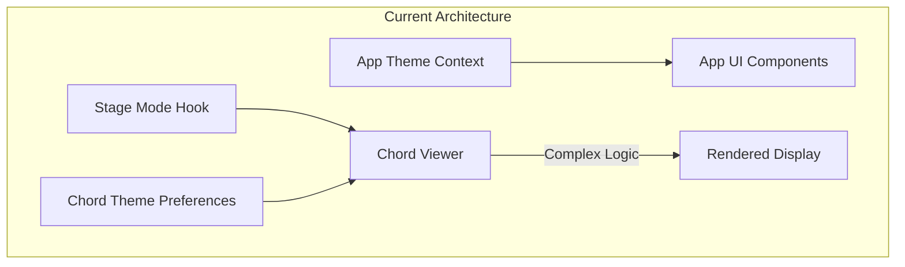
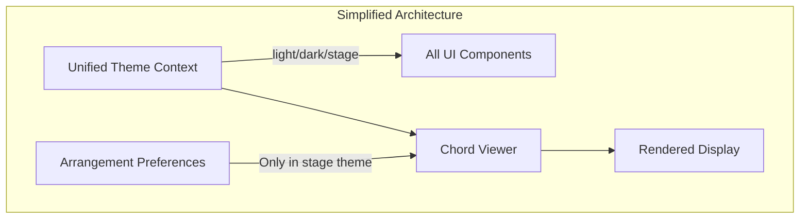
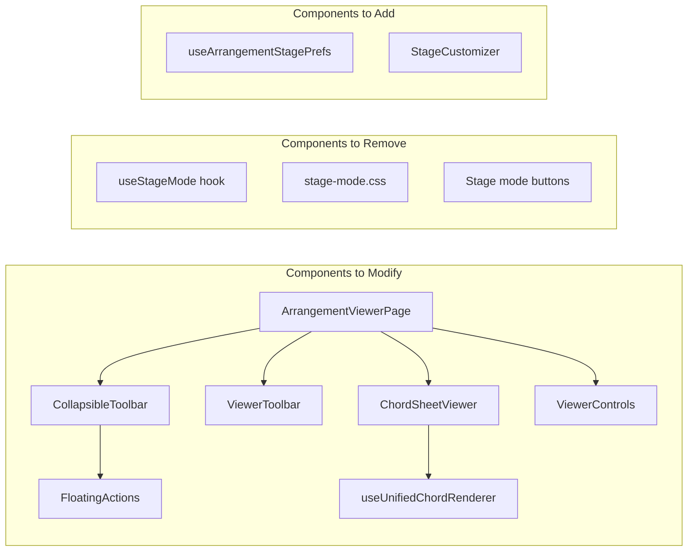
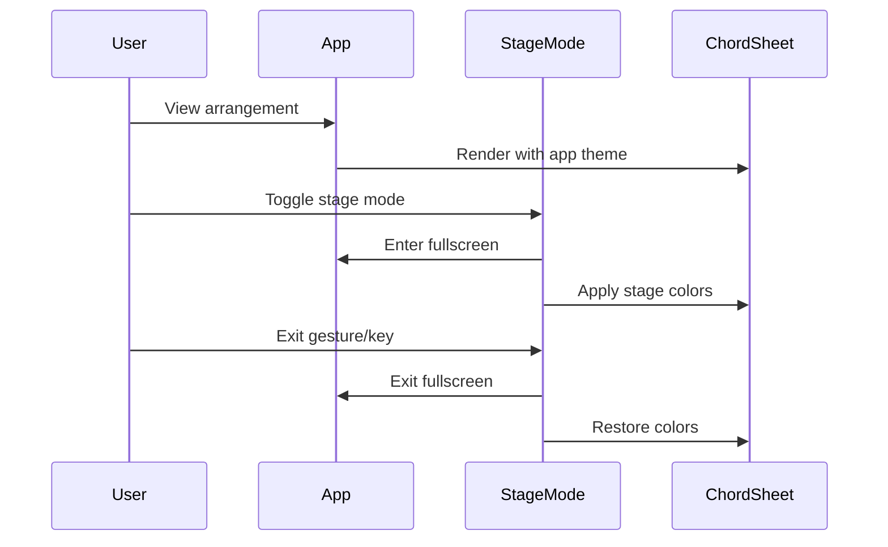
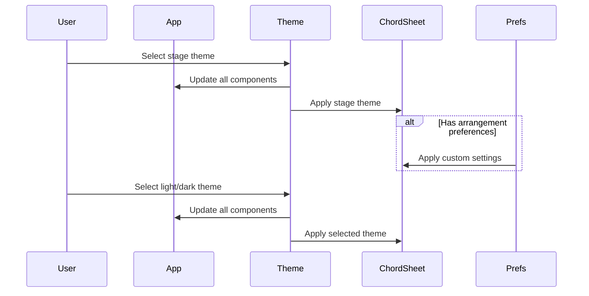

# Mobile Chord View Cleanup - Product Requirements Document

## Executive Summary

Simplify the mobile experience for viewing chord arrangements by removing the separate "stage mode" toggle and eliminating the ability for chord sheets to have different themes from the main application. Instead, users will switch the entire app theme to "stage" when needed, providing a cleaner, more consistent experience with arrangement-specific customization capabilities.

## Problem Statement

### Current Issues
1. **Complexity Overload**: Multiple theme systems create confusion
   - App has its own theme (light/dark/stage)
   - ChordSheet can have different theme from app
   - Stage mode adds another layer of styling
   - Users struggle to understand which controls affect what

2. **Mobile UX Friction**: 
   - Floating action buttons clutter the interface
   - Stage mode toggle is redundant with app theme
   - Theme inconsistency between app chrome and content
   - Complex gesture controls for entering/exiting modes

3. **Maintenance Burden**:
   - Three separate styling systems to maintain
   - Complex state management for theme synchronization
   - Duplicate color definitions across systems

### User Pain Points
- "Why does my chord sheet look different from my app?"
- "I accidentally triggered stage mode and don't know how to exit"
- "Too many buttons floating on my screen"
- "I want my stage mode to look different for different songs"

## Solution Overview

### Core Changes
1. **Remove Stage Mode Toggle**: Eliminate the separate stage mode functionality
2. **Unified Theme System**: ChordSheet always uses app theme
3. **Simplified Mobile UI**: Remove stage mode from floating actions
4. **Arrangement Customization**: Allow per-arrangement display preferences when in stage theme

### Benefits
- **Simpler Mental Model**: One theme system to understand
- **Cleaner Mobile UI**: Fewer floating buttons
- **Better Consistency**: Unified visual experience
- **Enhanced Flexibility**: Arrangement-specific customization when needed

## User Stories

### Epic: Simplified Mobile Chord Viewing

#### Story 1: Unified Theme Experience
**As a** musician using the app on mobile  
**I want** the chord sheet to always match my app theme  
**So that** I have a consistent visual experience

**Acceptance Criteria:**
- [ ] ChordSheet viewer uses app theme colors
- [ ] No separate theme selector for chord sheets
- [ ] Theme changes apply immediately to all components
- [ ] Print view maintains readability regardless of theme

#### Story 2: Stage Mode via Theme
**As a** performer on stage  
**I want** to switch my entire app to stage theme  
**So that** I have optimal visibility in dark environments

**Acceptance Criteria:**
- [ ] App theme selector includes "stage" option
- [ ] Stage theme provides high contrast colors
- [ ] All UI elements adapt to stage theme
- [ ] Quick theme toggle accessible from arrangement viewer

#### Story 3: Arrangement-Specific Stage Settings
**As a** performer with diverse repertoire  
**I want** to customize how each song appears in stage theme  
**So that** I can optimize visibility per arrangement

**Acceptance Criteria:**
- [ ] When in stage theme, can adjust per-arrangement:
  - Font size override
  - Chord color preference
  - Show/hide section markers
  - Line spacing adjustment
- [ ] Settings persist per arrangement
- [ ] Settings only apply when app is in stage theme

#### Story 4: Simplified Mobile Controls
**As a** mobile user  
**I want** fewer floating buttons  
**So that** I have more screen space for content

**Acceptance Criteria:**
- [ ] Remove "stage mode" from floating actions
- [ ] Keep only essential actions (transpose, show toolbar)
- [ ] Floating actions auto-hide when scrolling
- [ ] Clean animation transitions

## Technical Architecture

### Current State


### Proposed Architecture


### Component Dependencies


## Implementation Phases

### Phase 1: Remove Stage Mode System
**Priority: High**
- Remove `useStageMode` hook
- Remove stage mode CSS file
- Remove stage mode toggle from UI
- Remove stage mode from floating actions
- Clean up related event handlers

### Phase 2: Unify Theme System
**Priority: High**
- Update `useUnifiedChordRenderer` to always use app theme
- Remove chord-specific theme preferences
- Update ChordSheetViewer to use app theme
- Ensure print styles work with all themes

### Phase 3: Add Arrangement Customization
**Priority: Medium**
- Create `useArrangementStagePrefs` hook
- Add stage theme customization UI
- Implement per-arrangement preference storage
- Add customization panel to arrangement viewer

### Phase 4: Mobile UI Polish
**Priority: Medium**
- Simplify floating action buttons
- Improve toolbar auto-hide behavior
- Add smooth transitions
- Optimize touch targets

## User Flow Diagrams

### Current Stage Mode Flow


### Proposed Theme Flow


## Data Models

### Arrangement Stage Preferences
```typescript
interface ArrangementStagePreferences {
  arrangementId: string
  // Only applied when app theme is "stage"
  stageOverrides?: {
    fontSize?: number        // 12-32
    chordColor?: string     // hex color
    lyricColor?: string     // hex color
    showSections?: boolean
    showComments?: boolean
    lineSpacing?: number    // 1.0-2.0
    customCSS?: string      // Advanced users
  }
  updatedAt: number
}
```

### Updated Theme Context
```typescript
interface ThemeContextValue {
  theme: 'light' | 'dark' | 'stage'
  setTheme: (theme: Theme) => void
  toggleTheme: () => void
  // Quick access for arrangement viewer
  cycleTheme: () => void
}
```

## API Specifications

### Remove APIs
```typescript
// Remove these hooks/functions
- useStageMode()
- toggleStageMode()
- exitStageMode()
- ChordPreferences.theme
```

### New APIs
```typescript
// Arrangement stage preferences
interface ArrangementStagePrefsAPI {
  getPreferences(arrangementId: string): ArrangementStagePreferences | null
  savePreferences(prefs: ArrangementStagePreferences): Promise<void>
  clearPreferences(arrangementId: string): Promise<void>
}

// Quick theme cycling for mobile
interface ThemeAPI {
  cycleTheme(): void // light -> dark -> stage -> light
  isStageTheme(): boolean
}
```

## Migration Strategy

### Data Migration
1. Remove chord theme preferences from localStorage
2. Migrate any stage mode settings to theme preference
3. Clear stage mode related data

### User Communication
1. Show one-time tooltip explaining theme changes
2. Update help documentation
3. Add "What's New" notification

## Risks & Mitigations

| Risk | Impact | Mitigation |
|------|--------|------------|
| Users miss stage mode toggle | Medium | Add quick theme switcher in viewer |
| Confusion about theme change | Low | Clear communication and UI hints |
| Performance impact of theme switch | Low | Optimize CSS variable updates |
| Loss of flexibility | Medium | Arrangement-specific customization |

## Success Metrics

### Quantitative
- Reduction in theme-related bug reports by 50%
- Decrease in floating button mis-taps by 40%
- Faster theme switching (< 100ms)
- Reduced CSS bundle size by ~15KB

### Qualitative
- User feedback on simplified experience
- Cleaner mobile interface
- More intuitive theme management
- Better performance on low-end devices

## Technical Debt Addressed

1. **Remove Duplicate Code**
   - Eliminate 3 separate theme systems
   - Remove redundant color definitions
   - Consolidate theme logic

2. **Simplify State Management**
   - Single source of truth for theme
   - Remove complex synchronization
   - Cleaner component props

3. **Improve Testability**
   - Fewer edge cases to test
   - Simpler theme logic
   - Better separation of concerns

## Implementation Checklist

### Phase 1: Remove Stage Mode
- [ ] Remove `useStageMode.ts` hook
- [ ] Remove `stage-mode.css` styles
- [ ] Remove stage mode from `ArrangementViewerPage`
- [ ] Remove stage mode from `FloatingActions`
- [ ] Remove stage mode from `ViewerToolbar`
- [ ] Clean up `ViewerControls` stage mode logic
- [ ] Remove stage mode keyboard shortcuts
- [ ] Remove fullscreen stage mode logic

### Phase 2: Unify Themes
- [ ] Update `useUnifiedChordRenderer` to use app theme only
- [ ] Remove theme from chord preferences
- [ ] Update `ChordSheetViewer` theme logic
- [ ] Ensure print styles work with all themes
- [ ] Update theme colors for stage theme
- [ ] Add stage theme to theme cycling

### Phase 3: Arrangement Customization
- [ ] Create arrangement stage preferences schema
- [ ] Implement `useArrangementStagePrefs` hook
- [ ] Add stage customization UI component
- [ ] Integrate with arrangement viewer
- [ ] Add persistence layer
- [ ] Add reset to defaults option

### Phase 4: Polish
- [ ] Simplify floating actions
- [ ] Improve auto-hide behavior
- [ ] Add smooth transitions
- [ ] Optimize for touch
- [ ] Update documentation
- [ ] Add migration notifications

## Appendices

### A. File List for Modifications

**Files to Remove:**
- `/src/features/arrangements/hooks/useStageMode.ts`
- `/src/features/arrangements/styles/stage-mode.css`

**Files to Modify:**
- `/src/features/arrangements/pages/ArrangementViewerPage.tsx`
- `/src/features/arrangements/components/ChordSheetViewer.tsx`
- `/src/features/arrangements/components/ViewerToolbar.tsx`
- `/src/features/arrangements/components/ViewerControls.tsx`
- `/src/features/arrangements/hooks/useUnifiedChordRenderer.ts`
- `/src/features/responsive/components/CollapsibleToolbar/FloatingActions.tsx`
- `/src/shared/contexts/ThemeContext.tsx`

**Files to Create:**
- `/src/features/arrangements/hooks/useArrangementStagePrefs.ts`
- `/src/features/arrangements/components/StageCustomizer.tsx`
- `/src/features/arrangements/styles/stage-theme.css`

### B. Color Specifications

**Stage Theme Colors:**
```css
--stage-background: #000000;
--stage-text: #ffffff;
--stage-chord-default: #fbbf24;
--stage-section: #f59e0b;
--stage-comment: #6b7280;
```

### C. Accessibility Considerations

1. Ensure stage theme meets WCAG AAA contrast ratios
2. Maintain keyboard navigation in all themes
3. Screen reader announcements for theme changes
4. Respect prefers-reduced-motion for transitions

---

**Document Version:** 1.0  
**Last Updated:** 2025-01-21  
**Status:** Ready for Implementation