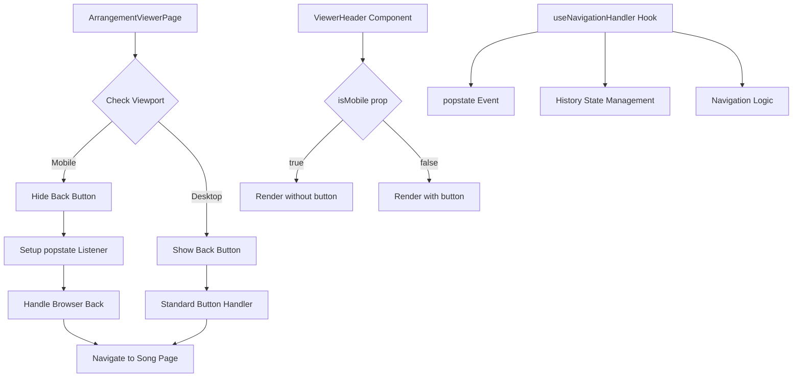
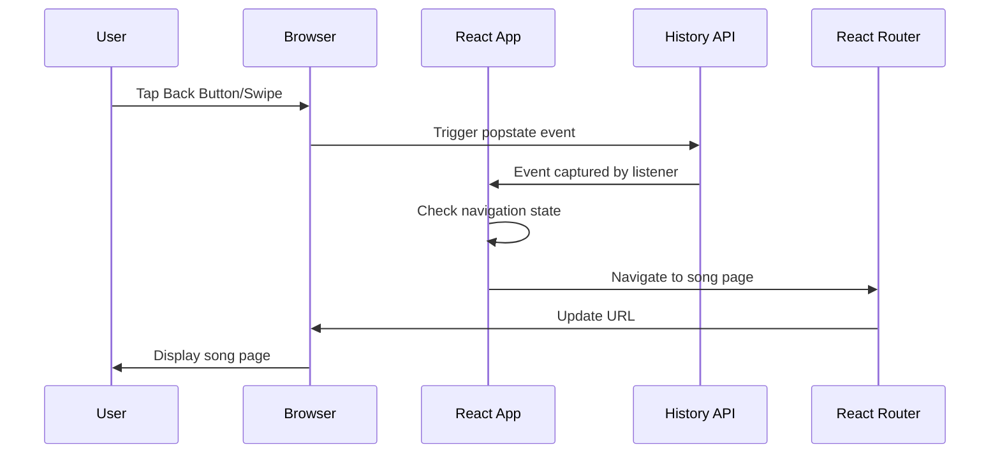
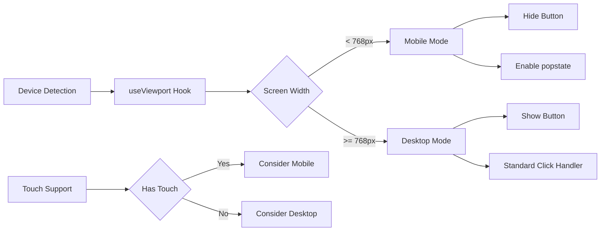
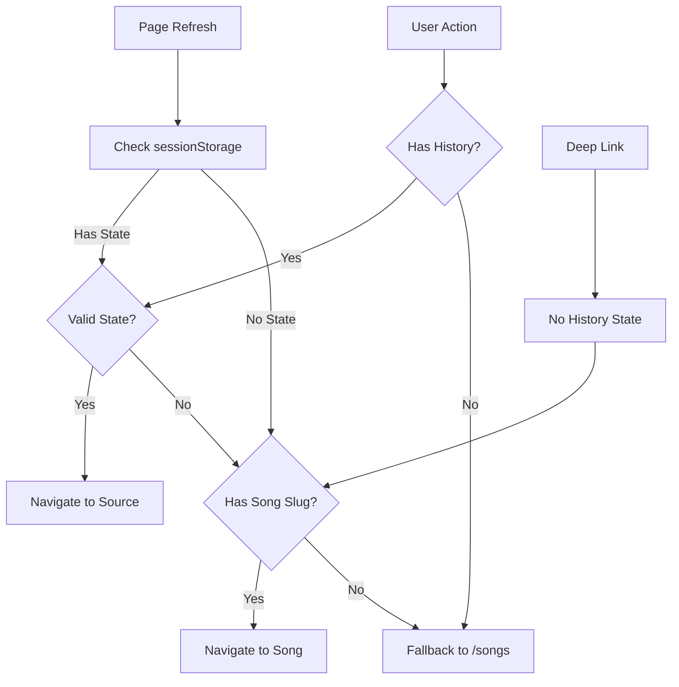

# Mobile Native Back Navigation PRD

## Executive Summary

Replace the explicit "Back to Song" button in the arrangement chord view with native mobile navigation patterns (browser back button, swipe gestures) when in mobile mode. This creates a more intuitive, native-feeling mobile experience that aligns with standard mobile app navigation patterns.

## Problem Statement

### Current State
- Arrangement viewer displays a prominent "Back to Song" button in the header
- This takes up valuable screen real estate on mobile devices
- Duplicates functionality already provided by browser back button
- Feels non-native compared to modern mobile web apps

### User Pain Points
1. **Screen Clutter**: Unnecessary UI element on small mobile screens
2. **Non-Native Feel**: Mobile users expect to use familiar navigation patterns
3. **Redundancy**: Browser already provides back navigation capability
4. **Inconsistent UX**: Desktop and mobile should have optimized experiences

## Solution Overview

Implement responsive navigation that:
- Hides the back button on mobile devices
- Relies on native browser back button/gestures
- Maintains explicit button on desktop for clarity
- Uses React hooks to handle popstate events for custom behavior

## User Stories

### Story 1: Mobile User Navigation
**As a** mobile user viewing an arrangement
**I want** to use my browser's back button or swipe gesture
**So that** I can navigate naturally without UI clutter

**Acceptance Criteria:**
- [ ] Back button is hidden on mobile viewport
- [ ] Browser back button navigates to song page
- [ ] Swipe-from-edge gesture works on iOS Safari
- [ ] Android back button/gesture works correctly
- [ ] Navigation state is preserved

### Story 2: Desktop User Navigation
**As a** desktop user viewing an arrangement
**I want** to see an explicit back button
**So that** I have clear navigation options

**Acceptance Criteria:**
- [ ] Back button remains visible on desktop
- [ ] Button styling remains consistent
- [ ] Hover states work as expected
- [ ] Keyboard navigation (Alt+Left) works

### Story 3: Tablet User Experience
**As a** tablet user
**I want** appropriate navigation based on my device orientation
**So that** I get an optimized experience

**Acceptance Criteria:**
- [ ] Portrait mode uses mobile pattern (no button)
- [ ] Landscape mode shows button if screen is wide enough
- [ ] Transition between modes is smooth

## Technical Architecture

### Component Flow Diagram



### State Management Flow



### Mobile Detection Strategy



## Implementation Strategy

### Phase 1: Core Hook Development
```typescript
// useNativeBackNavigation.ts
interface UseNativeBackNavigationOptions {
  enabled: boolean
  fallbackPath: string
  onNavigate?: () => void
}

function useNativeBackNavigation(options: UseNativeBackNavigationOptions) {
  // Implementation details
}
```

### Phase 2: ViewerHeader Modification
- Add conditional rendering based on viewport
- Preserve desktop functionality
- Remove button markup on mobile

### Phase 3: Navigation State Management
- Track navigation source (song page vs direct link)
- Handle edge cases (refreshed page, bookmarked URLs)
- Implement fallback strategies

### Phase 4: Testing & Polish
- Cross-browser testing (Chrome, Safari, Firefox)
- iOS and Android testing
- Gesture detection verification
- Performance optimization

## API Specifications

### useNativeBackNavigation Hook

```typescript
interface NavigationState {
  fromSong?: string
  fromSearch?: boolean
  timestamp?: number
}

interface UseNativeBackNavigationReturn {
  isEnabled: boolean
  navigationState: NavigationState
  handleBack: () => void
}

// Usage
const navigation = useNativeBackNavigation({
  enabled: viewport.isMobile,
  fallbackPath: '/songs',
  onNavigate: () => {
    // Analytics or cleanup
  }
})
```

### Modified ViewerHeader Props

```typescript
interface ViewerHeaderProps {
  arrangement: Arrangement
  showBackButton?: boolean  // New prop
}
```

## Data Models

### Navigation Context

```typescript
interface NavigationContext {
  source: 'song' | 'search' | 'direct' | 'setlist'
  sourceId?: string
  timestamp: number
  scrollPosition?: number
}
```

## Edge Cases & Error Handling

### Scenario Matrix



## Risk Assessment & Mitigation

| Risk | Impact | Likelihood | Mitigation |
|------|--------|------------|------------|
| Browser incompatibility | High | Low | Feature detection with fallback |
| Lost navigation context | Medium | Medium | SessionStorage backup |
| Gesture conflicts | Low | Low | Standard browser behavior |
| User confusion | Medium | Low | Clear mobile patterns |

## Success Metrics

### Quantitative
- **Screen Space Saved**: ~50px header height on mobile
- **Load Time**: No additional JS overhead
- **Bundle Size**: Minimal increase (~1KB)

### Qualitative
- **User Feedback**: More native feel
- **Navigation Speed**: Faster back navigation
- **Visual Clarity**: Cleaner mobile interface

## Implementation Checklist

### Development
- [ ] Create useNativeBackNavigation hook
- [ ] Modify ViewerHeader component
- [ ] Update ArrangementViewerPage
- [ ] Add viewport detection logic
- [ ] Implement popstate handling
- [ ] Add sessionStorage fallback
- [ ] Handle edge cases

### Testing
- [ ] Unit tests for navigation hook
- [ ] Component tests for conditional rendering
- [ ] E2E tests for navigation flows
- [ ] Manual testing on real devices
- [ ] Cross-browser verification
- [ ] Gesture testing on iOS/Android

### Documentation
- [ ] Update component documentation
- [ ] Add usage examples
- [ ] Document browser requirements
- [ ] Create migration guide

## Technical Prerequisites

### Dependencies
- React Router v6+ (already in use)
- Existing useViewport hook
- Browser History API (native)

### Browser Support
- Chrome 90+ ✓
- Safari 14+ ✓  
- Firefox 88+ ✓
- Edge 90+ ✓

## Code Examples

### Hook Implementation Skeleton

```typescript
export function useNativeBackNavigation({
  enabled,
  fallbackPath,
  onNavigate
}: UseNativeBackNavigationOptions): UseNativeBackNavigationReturn {
  const navigate = useNavigate()
  const location = useLocation()
  const [navigationState, setNavigationState] = useState<NavigationState>({})
  
  useEffect(() => {
    if (!enabled) return
    
    const handlePopState = (event: PopStateEvent) => {
      // Handle back navigation
      const state = event.state || location.state
      
      if (state?.fromSong) {
        navigate(`/songs/${state.fromSong}`)
      } else if (arrangement?.songSlug) {
        navigate(`/songs/${arrangement.songSlug}`)
      } else {
        navigate(fallbackPath)
      }
      
      onNavigate?.()
    }
    
    window.addEventListener('popstate', handlePopState)
    
    return () => {
      window.removeEventListener('popstate', handlePopState)
    }
  }, [enabled, navigate, location, fallbackPath, onNavigate])
  
  return {
    isEnabled: enabled,
    navigationState,
    handleBack: () => {
      // Manual back handler for testing
      window.history.back()
    }
  }
}
```

### ViewerHeader Modification

```typescript
export function ViewerHeader({ arrangement }: ViewerHeaderProps) {
  const viewport = useViewport()
  const { handleBack } = useNativeBackNavigation({
    enabled: viewport.isMobile,
    fallbackPath: '/songs'
  })
  
  // Don't render back button on mobile
  if (viewport.isMobile) {
    return (
      <header className="viewer-header viewer-header--mobile">
        {/* Header content without back button */}
      </header>
    )
  }
  
  // Desktop experience unchanged
  return (
    <header className="viewer-header">
      {/* Existing implementation */}
    </header>
  )
}
```

## Appendix

### Research References
- [React Navigation Patterns 2025](https://example.com)
- [Mobile Web Best Practices](https://example.com)
- [Browser History API Documentation](https://developer.mozilla.org/en-US/docs/Web/API/History_API)

### Similar Implementations
- Spotify Web Player: Uses native back on mobile
- YouTube Mobile Web: Gesture-based navigation
- Twitter PWA: Native browser navigation

### Alternative Approaches Considered
1. **Swipe Library Integration**: Rejected - adds unnecessary complexity
2. **Custom Gesture Handler**: Rejected - browser handles this natively
3. **Floating Back Button**: Rejected - still takes screen space

## Ready for Implementation

This PRD provides a complete blueprint for implementing native back navigation on mobile while preserving desktop functionality. The solution is minimal, performant, and follows established mobile web patterns.