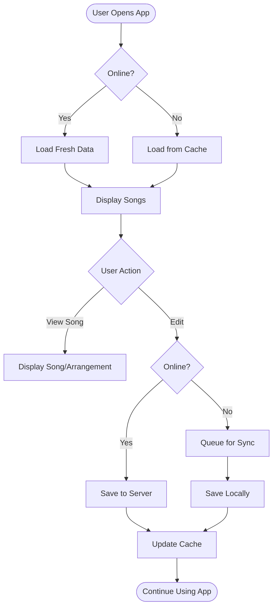
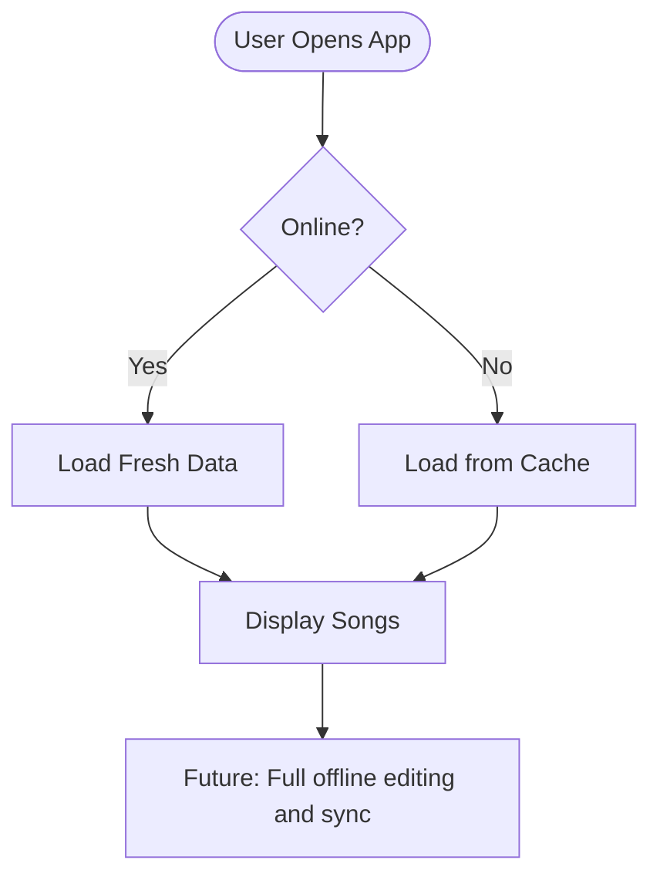
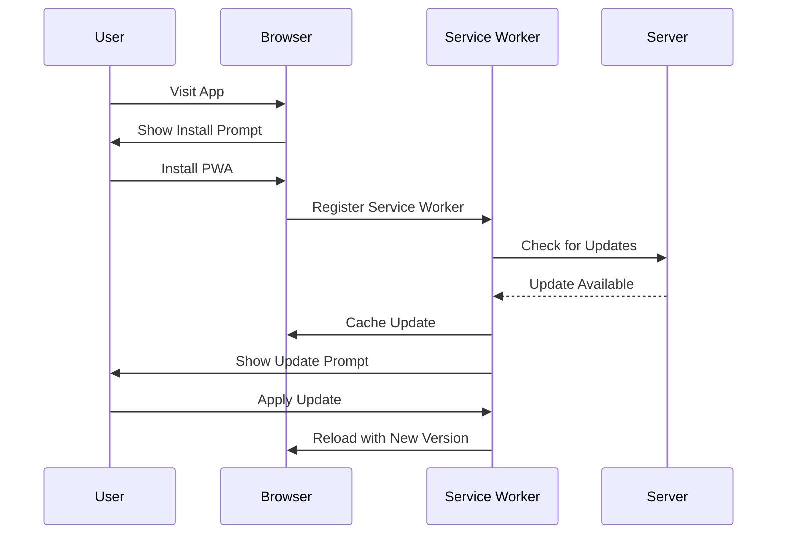
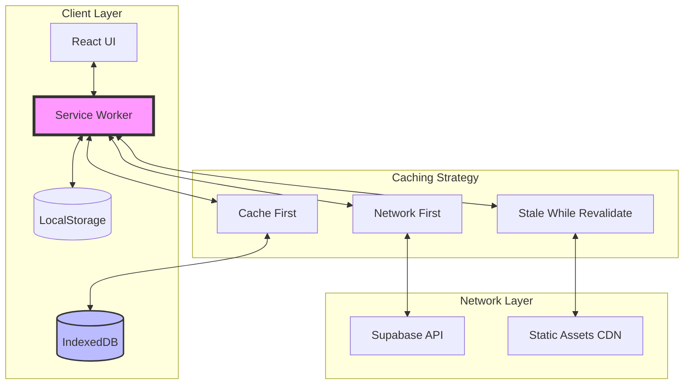
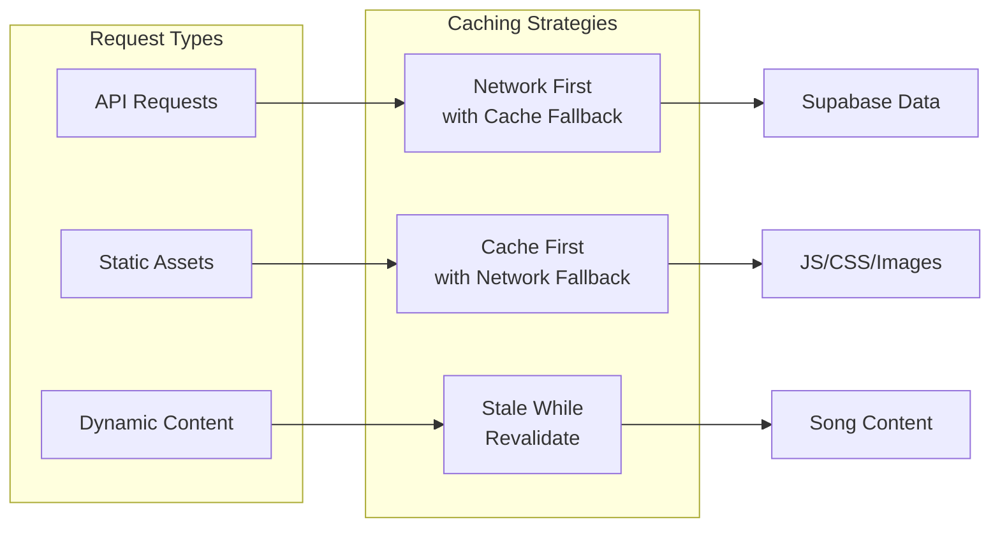
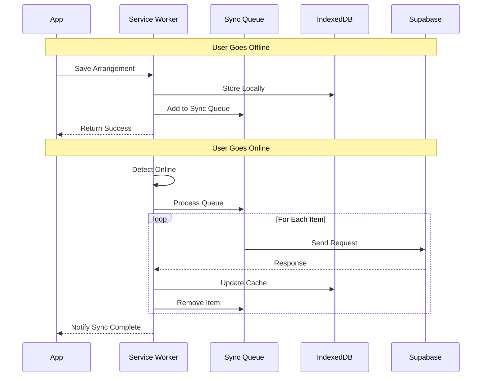
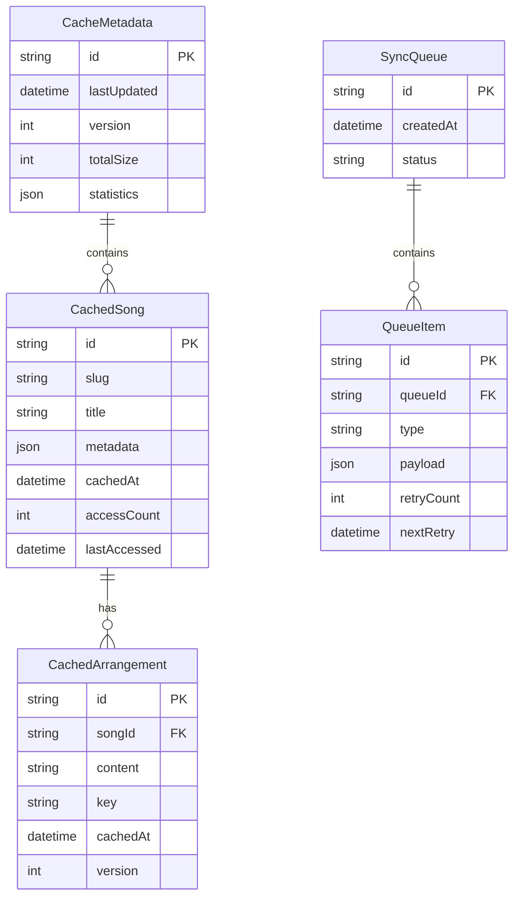

# PWA Reactivation - Product Requirements Document

## Executive Summary

This PRD outlines the phased reactivation of Progressive Web App (PWA) functionality for the HSA Songbook application. The initial implementation focuses on establishing core PWA infrastructure for improved performance and app-like experience, with offline capabilities planned as a future enhancement. The strategy prioritizes performance optimization, reasonable cache management (targeting <50MB for optimal performance), and preparing the foundation for eventual offline functionality within a 500MB storage constraint.

## Problem & Solution

### Problem Statement
The current web application lacks PWA capabilities, missing opportunities for:
- Enhanced performance through intelligent caching
- App-like user experience with home screen installation
- Improved loading times for frequently accessed content
- Foundation for future offline capabilities

**Future Consideration:** Worship leaders and musicians will eventually need offline access during services, rehearsals, and in venues with poor connectivity.

### Solution Overview
**Phase 1 (Immediate):** Re-enable core PWA infrastructure to provide:
- **App-like experience** with install prompts and home screen access
- **Performance optimization** through service worker caching
- **Automatic updates** with user-friendly notifications
- **Foundation for offline** with proper architecture setup

**Future Phases:** Add offline functionality for:
- Critical user paths during services
- Practice/rehearsal scenarios
- Bandwidth conservation through intelligent caching

## User Personas & Journey

### Primary Users
1. **Worship Leaders** - Need reliable access during services
2. **Musicians** - Require songs for practice and rehearsal
3. **Congregation Members** - May want to follow along (future consideration)

### Key Constraints
- **Storage Limit:** 500MB total database size
- **Cache Target:** <50MB for optimal performance
- **Priority:** Performance and UX over extensive offline features initially

## User Stories

### Epic 1: Core PWA Experience (Immediate Priority)



#### Story 1: PWA Installation
**As a** user  
**I want** to install the app on my device  
**So that** I can access it quickly like a native app

**Acceptance Criteria:**
- [ ] Install prompt appears for eligible browsers
- [ ] App icon appears on home screen
- [ ] App launches in standalone mode
- [ ] Splash screen displays during launch
- [ ] Works across modern browsers

**Technical Notes:**
- Configure manifest.json properly
- Implement beforeinstallprompt handling
- Test on Chrome, Firefox, Safari, Edge

#### Story 2: Performance Optimization
**As a** user  
**I want** the app to load quickly  
**So that** I can access songs without delays

**Acceptance Criteria:**
- [ ] Static assets cached for fast loading
- [ ] Recently viewed songs load instantly
- [ ] Cache size stays under 50MB
- [ ] Old cache entries are pruned automatically
- [ ] No performance degradation from caching

#### Story 3: Service Worker Foundation
**As a** developer  
**I want** proper service worker architecture  
**So that** we can add offline features later

**Acceptance Criteria:**
- [ ] Service worker registers successfully
- [ ] Basic caching strategies implemented
- [ ] Update mechanism works smoothly
- [ ] Architecture supports future offline features
- [ ] Monitoring and debugging tools in place

### Epic 2: Future Offline Capabilities (Later Phase)



#### Future Story: Offline Song Access
**As a** worship leader  
**I want** to access songs offline during services  
**So that** connectivity issues don't disrupt worship

**Future Requirements:**
- Smart caching within storage limits
- Selective download for setlists
- Offline indicators
- Sync queue for changes
- Conflict resolution

### Epic 3: PWA Installation & Updates



#### Story 4: Seamless Installation
**As a** new user  
**I want** to easily install the app on my device  
**So that** I can access it like a native app

**Acceptance Criteria:**
- [ ] Install prompt appears after 2 interactions
- [ ] Clear value proposition in install messaging
- [ ] App opens in standalone mode after install
- [ ] Home screen icon with proper branding
- [ ] Splash screen during app launch

#### Story 5: Transparent Updates
**As a** user  
**I want** the app to update automatically  
**So that** I always have the latest features without manual intervention

**Acceptance Criteria:**
- [ ] Updates download in background
- [ ] Non-intrusive update notification
- [ ] Option to apply update immediately or later
- [ ] No data loss during update process
- [ ] Rollback capability if update fails

## Technical Architecture

### System Architecture



### Service Worker Strategy



### Data Flow for Offline Sync



## API Specifications

### Service Worker Registration

```typescript
// Service Worker Registration API
interface PWAConfig {
  enabled: boolean;
  register: {
    scope: string;
    updateViaCache: 'none' | 'imports' | 'all';
  };
  manifest: {
    name: string;
    short_name: string;
    icons: IconConfig[];
    display: 'standalone' | 'fullscreen' | 'minimal-ui';
    theme_color: string;
    background_color: string;
  };
  workbox: {
    runtimeCaching: CacheRoute[];
    skipWaiting: boolean;
    clientsClaim: boolean;
  };
}

// Cache Route Configuration
interface CacheRoute {
  urlPattern: RegExp | string;
  handler: 'CacheFirst' | 'NetworkFirst' | 'StaleWhileRevalidate';
  options: {
    cacheName: string;
    expiration?: {
      maxEntries?: number;
      maxAgeSeconds?: number;
    };
  };
}
```

### Offline Sync API

```typescript
// Sync Queue Item
interface SyncQueueItem {
  id: string;
  timestamp: number;
  url: string;
  method: 'POST' | 'PUT' | 'DELETE';
  body?: any;
  retries: number;
  headers?: Record<string, string>;
}

// Sync Manager API
interface SyncManager {
  addToQueue(request: SyncRequest): Promise<void>;
  processQueue(): Promise<SyncResult[]>;
  getQueueStatus(): QueueStatus;
  clearQueue(): void;
  retryFailed(): Promise<void>;
}

// Conflict Resolution
interface ConflictResolver {
  strategy: 'client-wins' | 'server-wins' | 'merge';
  resolve(local: any, remote: any): Promise<any>;
}
```

### Cache Management API

```typescript
// Cache Manager
interface CacheManager {
  // Pre-caching
  precache(urls: string[]): Promise<void>;
  
  // Dynamic caching
  cache(request: Request, response: Response): Promise<void>;
  
  // Cache retrieval
  match(request: Request): Promise<Response | undefined>;
  
  // Cache cleanup
  cleanup(options: CleanupOptions): Promise<void>;
  
  // Cache statistics
  getStats(): Promise<CacheStats>;
}

interface CleanupOptions {
  maxAge?: number;
  maxSize?: number;
  excludePatterns?: RegExp[];
}

interface CacheStats {
  size: number;
  entries: number;
  oldestEntry: Date;
  hitRate: number;
}
```

## Data Models

### Cache Storage Schema



### State Management for Offline

```typescript
// Offline State
interface OfflineState {
  isOnline: boolean;
  lastOnline: Date | null;
  pendingSyncs: number;
  cachedItems: {
    songs: number;
    arrangements: number;
    setlists: number;
  };
  cacheSize: number;
  syncStatus: 'idle' | 'syncing' | 'error';
}

// PWA State
interface PWAState {
  installPromptEvent: BeforeInstallPromptEvent | null;
  isInstalled: boolean;
  updateAvailable: boolean;
  offlineReady: boolean;
  registration: ServiceWorkerRegistration | null;
}
```

## Priority & Timeline

### Immediate Focus (Phase 1-2)
- **Core PWA setup** for improved performance
- **App-like experience** with installation
- **Performance optimization** through caching
- **Foundation** for future offline features

### Future Enhancements (Phase 3-4)
- **Offline viewing** of songs and arrangements
- **Offline editing** with sync queue
- **Selective download** for bandwidth management
- **Full offline experience** for services/rehearsals

## Implementation Phases

### Phase 1: Core PWA Infrastructure (Immediate)
**Goal:** Establish PWA foundation with performance benefits

```mermaid
gantt
    title Phase 1 Implementation
    dateFormat X
    axisFormat %s
    
    section Setup
    Enable PWA Config     :a1, 0, 1
    Service Worker Setup  :a2, after a1, 2
    Manifest Config      :a3, after a1, 1
    
    section Caching
    Basic Cache Strategy :b1, after a2, 3
    Song Caching        :b2, after b1, 2
    Asset Caching       :b3, after b1, 2
    
    section UI
    Offline Indicator   :c1, after b1, 1
    Install Prompt      :c2, after a3, 2
    
    section Testing
    Offline Testing     :d1, after b2, 2
    Performance Tests   :d2, after b3, 1
```



**Deliverables:**
- [ ] Service Worker registration and lifecycle
- [ ] Performance caching for static assets (<50MB)
- [ ] Install prompt for supported browsers
- [ ] Update notification system
- [ ] Basic monitoring and analytics

**Technical Prerequisites:**
- Vite PWA plugin configuration
- Service Worker development setup
- IndexedDB wrapper library
- Workbox integration

### Phase 2: Performance Optimization
**Goal:** Enhance loading speed and user experience

**Deliverables:**
- [ ] Intelligent caching for frequently accessed songs
- [ ] Image optimization and lazy loading
- [ ] Code splitting optimization
- [ ] Cache versioning strategy
- [ ] Performance monitoring dashboard

**Dependencies:**
- Phase 1 completion
- Sync API design
- Conflict resolution strategy

### Phase 3: Offline Foundation (Future)
**Goal:** Basic offline viewing capabilities

**Deliverables:**
- [ ] Offline detection and indicators
- [ ] Cache-first strategy for songs
- [ ] Basic offline page
- [ ] IndexedDB setup for structured data
- [ ] Storage management within 500MB limit

**Dependencies:**
- Phase 2 completion
- Push notification service
- Advanced IndexedDB queries

### Phase 4: Full Offline Experience (Future)
**Goal:** Complete offline functionality with sync

**Deliverables:**
- [ ] Offline editing capability
- [ ] Sync queue implementation
- [ ] Conflict resolution
- [ ] Selective download for setlists
- [ ] Background sync for changes

## Risks & Mitigations

### Technical Risks

| Risk | Impact | Likelihood | Mitigation |
|------|--------|------------|------------|
| Browser Incompatibility | High | Low | Progressive enhancement; fallback for non-PWA browsers |
| Cache Storage Limits | Medium | Medium | Implement LRU cache eviction; user-configurable limits |
| Sync Conflicts | High | Medium | Clear conflict resolution UI; versioning system |
| Service Worker Bugs | High | Medium | Comprehensive testing; gradual rollout; kill switch |
| Performance Degradation | Medium | Low | Performance budgets; monitoring; lazy loading |

### User Experience Risks

| Risk | Impact | Likelihood | Mitigation |
|------|--------|------------|------------|
| Confusion about offline status | Medium | Medium | Clear UI indicators; user education |
| Data loss perception | High | Low | Visible sync status; data recovery options |
| Update fatigue | Low | Medium | Smart update scheduling; batched updates |
| Storage pressure | Medium | Medium | Cache management UI; clear storage indicators |

## Success Metrics

### Quantitative Metrics

| Metric | Target | Measurement Method |
|--------|--------|-------------------|
| PWA Install Rate | >20% of regular users | Install tracking |
| Cache Size | <50MB average | Storage API monitoring |
| Performance Score | >90 Lighthouse PWA | Automated testing |
| Time to Interactive | <2s on 4G | Performance monitoring |
| Static Asset Cache Hit | >90% | Service Worker metrics |
| Update Success Rate | >98% | Update tracking |
| Storage Usage | <500MB max | Storage quota monitoring |

### Qualitative Metrics

| Metric | Target | Measurement Method |
|--------|--------|-------------------|
| User Satisfaction | >4.5/5 rating | In-app surveys |
| Offline Feature Usage | High engagement | Feature analytics |
| Bug Reports | <5 per release | Issue tracking |
| User Retention | >10% improvement | Cohort analysis |

### Performance Benchmarks

```yaml
performance_targets:
  first_contentful_paint: <1.5s
  time_to_interactive: <3.5s
  cache_storage_size: <100MB
  service_worker_boot: <50ms
  offline_page_load: <500ms
  sync_queue_processing: <5s
  
monitoring:
  - Web Vitals tracking
  - Service Worker performance
  - Cache efficiency metrics
  - Network request interception rate
  - Background sync success rate
```

## Appendices

### A. Browser Support Matrix

| Feature | Chrome | Firefox | Safari | Edge |
|---------|---------|---------|--------|------|
| Service Workers | ✅ 45+ | ✅ 44+ | ✅ 11.1+ | ✅ 17+ |
| PWA Install | ✅ 73+ | ✅ Android | ⚠️ iOS 11.3+ | ✅ 79+ |
| Background Sync | ✅ 49+ | ❌ | ❌ | ✅ 79+ |
| Push Notifications | ✅ 42+ | ✅ 44+ | ⚠️ 16+ | ✅ 17+ |
| IndexedDB | ✅ All | ✅ All | ✅ 10+ | ✅ All |

### B. Cache Strategy Decision Matrix

| Content Type | Strategy | Rationale |
|--------------|----------|-----------|
| API Data (Songs) | Network First | Fresh data when online |
| User Data | Network First | Consistency critical |
| Static Assets | Cache First | Rarely change |
| Images | Stale While Revalidate | Balance freshness/performance |
| Arrangements | Network First + Queue | Offline editing support |

### C. Storage Quotas

```javascript
// Storage estimation with constraints
const storageConfig = {
  // Phase 1: Performance caching only
  performanceCache: {
    staticAssets: 20000, // KB (20MB)
    recentSongs: 10000, // KB (10MB)
    images: 15000, // KB (15MB)
    total: 45000 // KB (45MB target, <50MB limit)
  },
  
  // Future: Full offline storage
  futureOfflineStorage: {
    songs: 100000, // KB (100MB)
    arrangements: 50000, // KB (50MB)
    setlists: 20000, // KB (20MB)
    userContent: 80000, // KB (80MB)
    buffer: 250000, // KB (250MB reserve)
    total: 500000 // KB (500MB hard limit)
  }
}
```

### D. Implementation Checklist

#### Phase 1 (Immediate Priority) ✅
- [ ] Enable PWA in Vite config
- [ ] Configure Workbox plugin with <50MB cache limit
- [ ] Implement basic Service Worker
- [ ] Add install prompt component
- [ ] Implement update prompt
- [ ] Setup performance monitoring
- [ ] Create user documentation for PWA install
- [ ] Lighthouse PWA audit (target >90)

#### Future Phases 🔄
- [ ] Setup IndexedDB schema (within 500MB limit)
- [ ] Create offline fallback page
- [ ] Add offline indicator
- [ ] Create sync queue
- [ ] Implement cache management UI
- [ ] Add conflict resolution
- [ ] Perform comprehensive offline testing
- [ ] Selective download interface

### E. References

- [MDN Progressive Web Apps](https://developer.mozilla.org/en-US/docs/Web/Progressive_web_apps)
- [Google PWA Training](https://developers.google.com/codelabs/pwa-training)
- [Workbox Documentation](https://developer.chrome.com/docs/workbox)
- [Vite PWA Plugin](https://vite-pwa-org.netlify.app/)
- [Web.dev PWA Guide](https://web.dev/progressive-web-apps/)

---

## Next Steps

1. **Technical Review** - Architecture approval from tech lead
2. **Resource Planning** - Estimate development effort
3. **User Testing Plan** - Define testing scenarios
4. **Rollout Strategy** - Phased deployment approach
5. **Monitoring Setup** - Define KPIs and dashboards

## Important Notes & Constraints

### Storage & Performance Guidelines
- **Performance Cache:** Keep under 50MB for optimal performance
- **Total Storage:** 500MB hard limit for all app data
- **Priority:** Performance and UX over extensive caching
- **Offline Mode:** Planned for future phases, not immediate priority

### Development Approach
1. **Phase 1-2:** Focus on PWA benefits without offline complexity
2. **Phase 3-4:** Add offline capabilities based on user feedback
3. **Monitoring:** Track storage usage and performance metrics
4. **User Education:** Clear communication about PWA benefits

## Document History

| Version | Date | Author | Changes |
|---------|------|--------|---------|
| 1.0 | 2024-08-20 | Claude | Initial PRD creation |
| 1.1 | 2024-08-20 | Claude | Revised with storage constraints and phasing priorities |

---

*This PRD is ready for review and can be converted into implementation PRPs for each phase.*