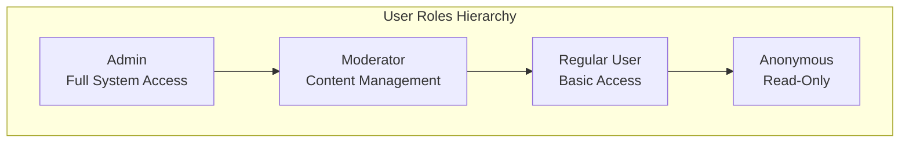
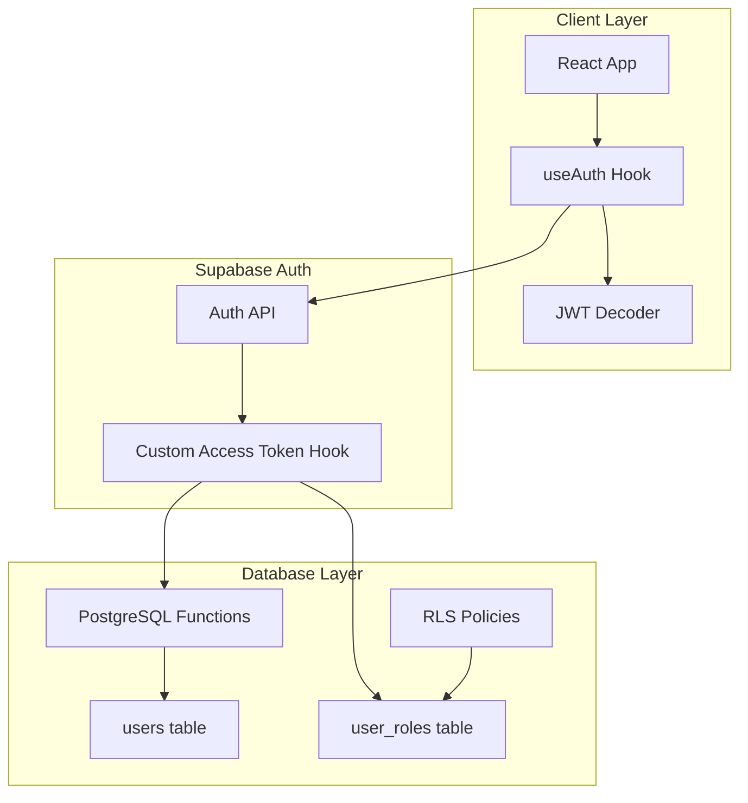
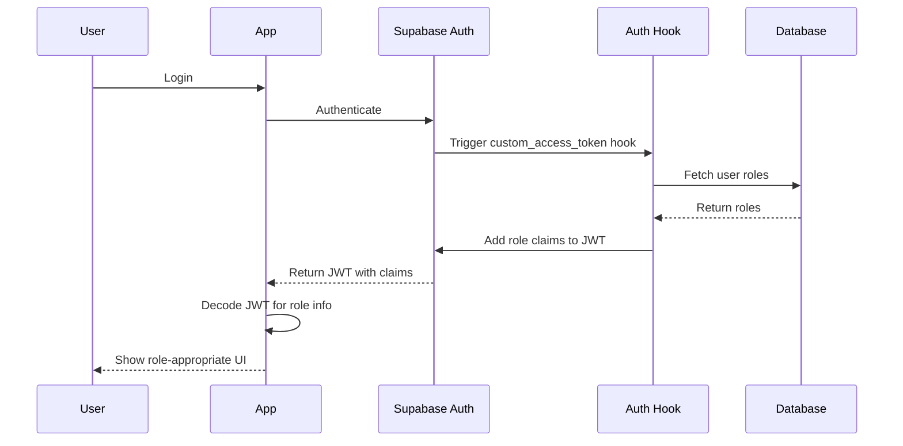

# Role-Based Access Control (RBAC) Implementation PRD

## Executive Summary

Implementation of a comprehensive Role-Based Access Control system for HSA Songbook using Supabase Auth Hooks and Row-Level Security (RLS). This system will enable granular permission management for administrators, moderators, and regular users while maintaining security and performance.

## Problem & Solution

### Problem Statement
The current authentication system only distinguishes between authenticated and anonymous users. There's a basic admin check (`isAdmin`) based on email patterns, but no proper role management system. This limits the ability to:
- Delegate administrative tasks to trusted community members
- Implement content moderation workflows
- Control access to sensitive features
- Track user actions for audit purposes

### Solution Overview
Implement a three-tier RBAC system using Supabase's latest Auth Hooks approach with custom JWT claims, combined with Row-Level Security policies for database-level enforcement.

## User Stories

### Epic: Role-Based Access Control System



### Story 1: Admin Role Management
**As an** admin  
**I want** to assign and manage user roles  
**So that** I can delegate responsibilities to trusted community members

**Acceptance Criteria:**
- [ ] Can view all users and their current roles
- [ ] Can promote users to moderator or admin
- [ ] Can demote users from privileged roles
- [ ] Changes take effect within 1 minute (JWT refresh)
- [ ] All role changes are logged for audit

**Technical Notes:**
- UI component in admin dashboard
- Calls Supabase RPC function to update roles
- Triggers auth hook to update JWT claims

### Story 2: Moderator Content Management
**As a** moderator  
**I want** to manage community-contributed content  
**So that** I can maintain quality and appropriateness

**Acceptance Criteria:**
- [ ] Can edit any public song/arrangement
- [ ] Can delete inappropriate content
- [ ] Can approve/reject user submissions
- [ ] Cannot modify system settings
- [ ] Cannot manage user roles

### Story 3: Permission-Based UI Rendering
**As a** user  
**I want** to see only the features I have access to  
**So that** the interface is clean and relevant

**Acceptance Criteria:**
- [ ] Admin-only features hidden for non-admins
- [ ] Moderator tools visible only to moderators
- [ ] Edit buttons shown only for owned content
- [ ] Clear visual indicators of role status

## Technical Architecture

### System Architecture



### Auth Flow Sequence



## Database Schema

### New Tables

```sql
-- User roles table
CREATE TABLE user_roles (
    id UUID DEFAULT gen_random_uuid() PRIMARY KEY,
    user_id UUID REFERENCES auth.users(id) ON DELETE CASCADE,
    role TEXT NOT NULL CHECK (role IN ('admin', 'moderator', 'user')),
    granted_by UUID REFERENCES auth.users(id),
    granted_at TIMESTAMPTZ DEFAULT NOW(),
    expires_at TIMESTAMPTZ,
    is_active BOOLEAN DEFAULT true,
    UNIQUE(user_id, role)
);

-- Audit log for role changes
CREATE TABLE role_audit_log (
    id UUID DEFAULT gen_random_uuid() PRIMARY KEY,
    user_id UUID REFERENCES auth.users(id),
    role TEXT NOT NULL,
    action TEXT NOT NULL CHECK (action IN ('grant', 'revoke')),
    performed_by UUID REFERENCES auth.users(id),
    performed_at TIMESTAMPTZ DEFAULT NOW(),
    reason TEXT,
    metadata JSONB
);

-- Permissions mapping (optional, for fine-grained control)
CREATE TABLE role_permissions (
    id UUID DEFAULT gen_random_uuid() PRIMARY KEY,
    role TEXT NOT NULL,
    resource TEXT NOT NULL,
    action TEXT NOT NULL,
    is_allowed BOOLEAN DEFAULT true,
    UNIQUE(role, resource, action)
);
```

### Auth Hook Function

```sql
CREATE OR REPLACE FUNCTION custom_access_token_hook(event jsonb)
RETURNS jsonb
LANGUAGE plpgsql
SECURITY DEFINER
AS $$
DECLARE
    claims jsonb;
    user_role text;
BEGIN
    -- Get user's highest role
    SELECT role INTO user_role
    FROM user_roles
    WHERE user_id = (event->>'user_id')::uuid
      AND is_active = true
      AND (expires_at IS NULL OR expires_at > NOW())
    ORDER BY 
        CASE role 
            WHEN 'admin' THEN 1
            WHEN 'moderator' THEN 2
            ELSE 3
        END
    LIMIT 1;
    
    -- Build custom claims
    claims := event->'claims';
    
    -- Add role to claims
    IF user_role IS NOT NULL THEN
        claims := jsonb_set(claims, '{user_role}', to_jsonb(user_role));
    ELSE
        claims := jsonb_set(claims, '{user_role}', '"user"');
    END IF;
    
    -- Add role-based permissions
    claims := jsonb_set(claims, '{can_moderate}', 
        to_jsonb(user_role IN ('admin', 'moderator')));
    claims := jsonb_set(claims, '{can_admin}', 
        to_jsonb(user_role = 'admin'));
    
    -- Return modified claims
    RETURN jsonb_set(event, '{claims}', claims);
END;
$$;
```

## RLS Policies

### Example RLS Policies

```sql
-- Songs table policies
CREATE POLICY "Users can view all public songs"
    ON songs FOR SELECT
    USING (is_public = true);

CREATE POLICY "Moderators can edit any song"
    ON songs FOR UPDATE
    USING (
        auth.jwt()->>'user_role' IN ('admin', 'moderator')
        OR created_by = auth.uid()
    );

CREATE POLICY "Admins can delete any song"
    ON songs FOR DELETE
    USING (
        auth.jwt()->>'user_role' = 'admin'
        OR (auth.jwt()->>'user_role' = 'moderator' AND NOT is_system)
    );

-- User roles table policies
CREATE POLICY "Only admins can manage roles"
    ON user_roles FOR ALL
    USING (auth.jwt()->>'user_role' = 'admin');

CREATE POLICY "Users can view their own role"
    ON user_roles FOR SELECT
    USING (user_id = auth.uid() OR auth.jwt()->>'user_role' = 'admin');
```

## Client Implementation

### Updated useAuth Hook

```typescript
interface AuthUser {
  id: string;
  email: string;
  role: 'admin' | 'moderator' | 'user';
  permissions: {
    canModerate: boolean;
    canAdmin: boolean;
  };
}

export function useAuth() {
  const [user, setUser] = useState<AuthUser | null>(null);
  
  useEffect(() => {
    const decodeToken = async () => {
      const session = await supabase.auth.getSession();
      if (session?.data?.session) {
        // Decode JWT to get custom claims
        const token = session.data.session.access_token;
        const payload = JSON.parse(atob(token.split('.')[1]));
        
        setUser({
          id: payload.sub,
          email: payload.email,
          role: payload.user_role || 'user',
          permissions: {
            canModerate: payload.can_moderate || false,
            canAdmin: payload.can_admin || false
          }
        });
      }
    };
    
    decodeToken();
  }, []);
  
  return user;
}
```

### Role-Based Components

```typescript
// Permission wrapper component
export function RequireRole({ 
  role, 
  children 
}: { 
  role: 'admin' | 'moderator'; 
  children: React.ReactNode 
}) {
  const { user } = useAuth();
  
  const hasPermission = useMemo(() => {
    if (!user) return false;
    if (role === 'moderator') {
      return user.permissions.canModerate;
    }
    if (role === 'admin') {
      return user.permissions.canAdmin;
    }
    return false;
  }, [user, role]);
  
  if (!hasPermission) return null;
  return <>{children}</>;
}

// Usage
<RequireRole role="moderator">
  <EditButton onClick={handleEdit} />
</RequireRole>
```

## Implementation Phases

### Phase 1: Database & Auth Infrastructure (MVP)
1. Create user_roles and audit tables
2. Implement custom_access_token_hook function
3. Configure Supabase Auth to use the hook
4. Create basic RLS policies
5. Update useAuth hook to decode JWT claims

### Phase 2: Admin Dashboard
1. Create role management UI
2. Implement role assignment functions
3. Add audit log viewing
4. Create user listing with filters

### Phase 3: Moderator Tools
1. Add content moderation interface
2. Implement bulk actions
3. Create moderation queue
4. Add reporting system

### Phase 4: Fine-Grained Permissions
1. Implement permission matrix
2. Create custom role builder
3. Add resource-level permissions
4. Implement permission inheritance

## Risks & Mitigations

### Risk 1: JWT Token Staleness
**Risk:** Role changes don't take effect immediately due to JWT expiration time  
**Mitigation:** 
- Implement force-refresh mechanism for critical role changes
- Set reasonable JWT expiration (1 hour)
- Add UI notification about pending changes

### Risk 2: Performance Impact
**Risk:** Auth hook adds latency to token generation  
**Mitigation:**
- Optimize database queries with proper indexes
- Cache role data in Redis (if available)
- Use materialized views for complex permission calculations

### Risk 3: Security Vulnerabilities
**Risk:** Improper RLS policies could expose sensitive data  
**Mitigation:**
- Comprehensive testing of all RLS policies
- Regular security audits
- Implement fail-secure defaults (deny by default)

## Success Metrics

1. **Performance**
   - Auth hook execution < 50ms
   - Role check overhead < 10ms
   - JWT size increase < 500 bytes

2. **Functionality**
   - 100% of admin features protected
   - Role changes effective within 60 seconds
   - Zero unauthorized access incidents

3. **User Experience**
   - Clear role indicators in UI
   - Intuitive permission errors
   - Smooth role transition experience

## Testing Strategy

### Unit Tests
- Role assignment logic
- Permission calculations
- JWT claim generation

### Integration Tests
- End-to-end auth flow
- RLS policy enforcement
- Role change propagation

### Security Tests
- Privilege escalation attempts
- SQL injection in role functions
- JWT tampering detection

## Migration Plan

1. **Preparation**
   - Backup existing user data
   - Document current permissions
   - Identify initial admins/moderators

2. **Migration**
   - Deploy database schema
   - Assign initial roles
   - Enable auth hook
   - Deploy updated client code

3. **Validation**
   - Verify all users can authenticate
   - Confirm role assignments
   - Test critical workflows

## Appendices

### A. Environment Variables
```env
# Supabase Auth Hook Configuration
GOTRUE_HOOK_CUSTOM_ACCESS_TOKEN_ENABLED=true
GOTRUE_HOOK_CUSTOM_ACCESS_TOKEN_URI="pg-functions://postgres/public/custom_access_token_hook"
```

### B. SQL Permissions
```sql
-- Grant necessary permissions for auth hook
GRANT EXECUTE ON FUNCTION custom_access_token_hook TO supabase_auth_admin;
GRANT SELECT ON user_roles TO supabase_auth_admin;

-- Revoke public access
REVOKE EXECUTE ON FUNCTION custom_access_token_hook FROM authenticated, anon;
```

### C. Monitoring Queries
```sql
-- Active roles distribution
SELECT role, COUNT(*) as count
FROM user_roles
WHERE is_active = true
GROUP BY role;

-- Recent role changes
SELECT * FROM role_audit_log
ORDER BY performed_at DESC
LIMIT 50;

-- Users with multiple roles
SELECT user_id, array_agg(role) as roles
FROM user_roles
WHERE is_active = true
GROUP BY user_id
HAVING COUNT(*) > 1;
```

## Next Steps

1. **Review & Approval**: Share this PRD with stakeholders for feedback
2. **Technical Spike**: Test auth hook implementation in development
3. **Security Review**: Have security team review RLS policies
4. **Implementation**: Begin Phase 1 development
5. **User Communication**: Prepare documentation for role system

---

*This PRD is ready for implementation. The approach uses Supabase's recommended Auth Hooks pattern for 2025, ensuring maintainability and security.*