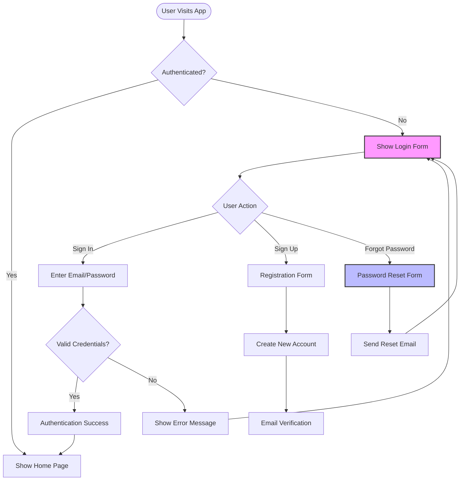
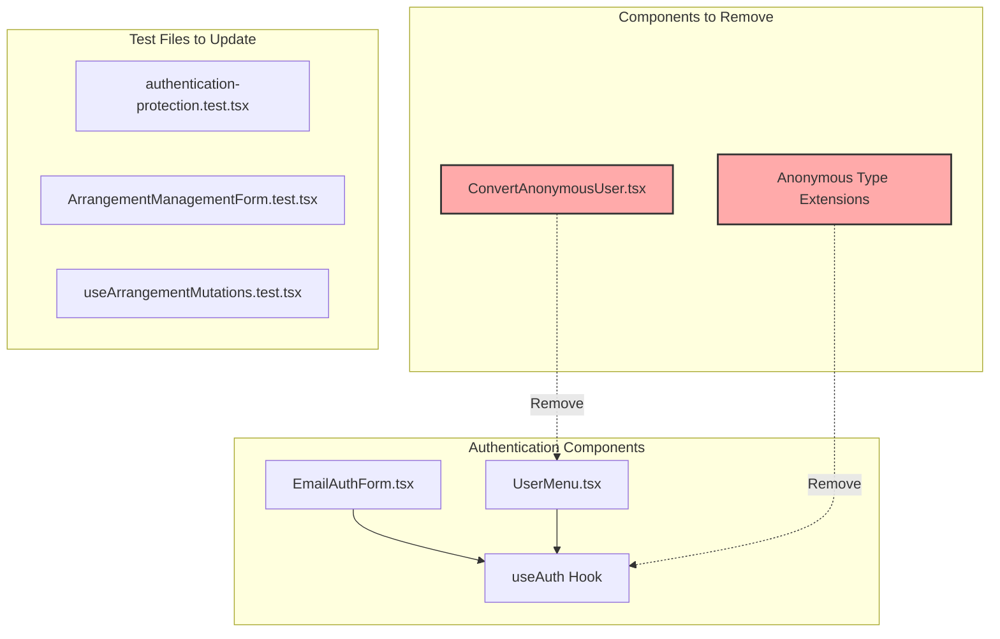
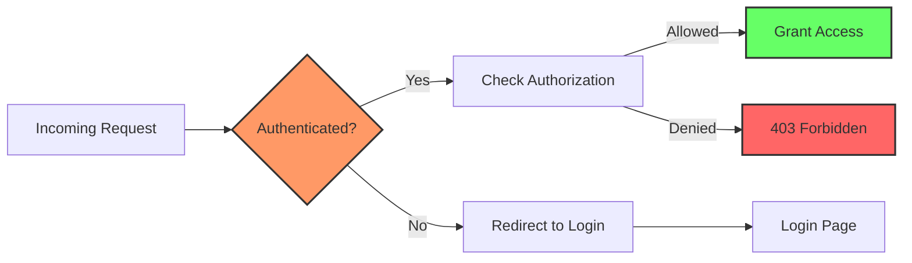
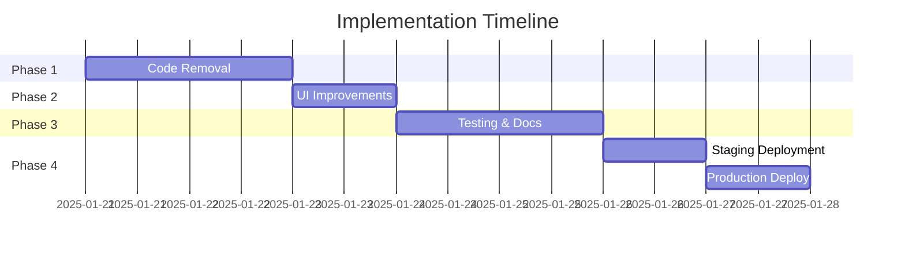

# Remove Guest Login & Improve Forgot Password Button - Product Requirements Document

## Executive Summary

This PRD outlines the removal of guest/anonymous authentication functionality from the HSA Songbook application and the improvement of the "Forgot Password" button styling to maintain consistency across all three themes (light, dark, stage). This change simplifies the codebase, improves security posture, and enhances UI consistency.

## 1. Problem & Solution

### Problem Statement
1. **Guest Login Complexity**: Anonymous authentication adds unnecessary complexity to the codebase with limited value proposition
2. **Security Concerns**: Anonymous users create potential security and data management challenges
3. **UI Inconsistency**: The "Forgot Password" button doesn't match the form styling across all themes
4. **Maintenance Overhead**: Supporting guest user conversion and special handling increases technical debt

### Solution Overview
- Complete removal of all anonymous/guest authentication features
- Simplification of authentication flow to only support email/OAuth
- Redesign of "Forgot Password" button to match form aesthetics across all themes
- Cleanup of related code, types, and documentation

## 2. User Stories & Flow Diagrams

### User Story 1: Sign In Without Guest Option
**As a** returning user  
**I want** to sign in using my email/password or OAuth  
**So that** I can access my personalized content securely

**Acceptance Criteria:**
- [ ] Sign-in form only shows email/password fields
- [ ] No "Continue as Guest" option visible
- [ ] OAuth options remain available
- [ ] Form validates email format and password requirements

### User Story 2: Forgot Password Flow
**As a** user who forgot my password  
**I want** to easily access password reset  
**So that** I can regain access to my account

**Acceptance Criteria:**
- [ ] Forgot Password button is clearly visible
- [ ] Button styling matches form design in all themes
- [ ] Button is accessible and keyboard navigable
- [ ] Clicking button switches to reset mode

### Authentication Flow Diagram



## 3. Technical Architecture

### Components to Modify



### Affected Files List

#### Primary Components to Modify:
1. `/src/features/auth/components/EmailAuthForm.tsx`
   - Remove anonymous mode from AuthMode type
   - Remove guest login button and conditional rendering
   - Improve forgot password button styling

2. `/src/features/auth/hooks/useAuth.ts`
   - Remove signInAnonymously function
   - Remove linkEmailToAnonymousUser function
   - Remove linkOAuthToAnonymousUser function
   - Remove isAnonymous computed property

3. `/src/features/auth/components/UserMenu.tsx`
   - Remove ConvertAnonymousUser import
   - Remove anonymous user conditional rendering
   - Simplify user display logic

#### Components to Delete:
1. `/src/features/auth/components/ConvertAnonymousUser.tsx` - Entire file
2. `/src/features/auth/types/index.ts` - Remove is_anonymous extension

#### Documentation to Update:
1. `/PRPs/ai_docs/anonymous-auth-setup.md` - Mark as deprecated or remove
2. Various PRPs mentioning anonymous users - Update references

#### Test Files to Update:
1. `/src/app/__tests__/authentication-protection.test.tsx`
2. `/src/features/songs/components/__tests__/ArrangementManagementForm.test.tsx`
3. `/src/features/songs/hooks/__tests__/useArrangementMutations.test.ts`

## 4. Implementation Details

### 4.1 Forgot Password Button Styling

The forgot password button should use the consistent Button component with proper theme support:

```typescript
// Current inline style approach (to be replaced)
<button style={linkStyles}>Forgot Password?</button>

// New approach using Button component
<Button 
  variant="link" 
  size="sm"
  onClick={() => handleModeChange('reset')}
  className="forgot-password-btn"
>
  Forgot Password?
</Button>
```

### 4.2 Theme-Aware Styling

```css
/* Theme-specific button styles */
.forgot-password-btn {
  /* Light theme (default) */
  color: var(--primary);
  text-decoration: underline;
  text-underline-offset: 4px;
}

[data-theme="dark"] .forgot-password-btn {
  color: var(--primary);
  opacity: 0.9;
}

[data-theme="stage"] .forgot-password-btn {
  color: var(--stage-accent);
  text-shadow: 0 0 2px rgba(255, 255, 255, 0.3);
}
```

### 4.3 EmailAuthForm Simplified Structure

```typescript
type AuthMode = 'signin' | 'signup' | 'reset' // Remove 'anonymous'

// Simplified form rendering without guest option
{mode === 'signin' && (
  <div className="auth-actions">
    <Button 
      variant="link" 
      size="sm"
      onClick={() => handleModeChange('reset')}
    >
      Forgot Password?
    </Button>
  </div>
)}
```

## 5. Data Migration Strategy

### Existing Anonymous Users
Since this is a breaking change, we need to handle existing anonymous users:

1. **Notification Period**: Display a banner for 30 days before removal
2. **Data Export**: Allow anonymous users to export their data
3. **Account Upgrade**: Encourage conversion to permanent accounts
4. **Graceful Degradation**: Redirect anonymous sessions to sign-up page

### Database Cleanup
```sql
-- Identify anonymous users (for metrics)
SELECT COUNT(*) FROM auth.users 
WHERE is_anonymous = true;

-- After migration period, remove anonymous user data
-- This should be done carefully with backups
```

## 6. Testing Strategy

### Unit Tests
- [ ] Remove all anonymous auth related test cases
- [ ] Add tests for simplified auth flow
- [ ] Verify forgot password button renders correctly in all themes
- [ ] Test keyboard navigation for forgot password

### Integration Tests
- [ ] Verify no anonymous auth endpoints are accessible
- [ ] Test complete sign-in flow without guest option
- [ ] Verify password reset flow works correctly
- [ ] Test theme switching doesn't break button styling

### E2E Tests
```typescript
// Example E2E test
describe('Authentication Flow', () => {
  it('should not show guest login option', async () => {
    await page.goto('/login')
    expect(await page.locator('text="Continue as Guest"')).not.toBeVisible()
  })
  
  it('should show properly styled forgot password button', async () => {
    await page.goto('/login')
    const forgotBtn = await page.locator('.forgot-password-btn')
    expect(forgotBtn).toBeVisible()
    expect(forgotBtn).toHaveCSS('text-decoration', 'underline')
  })
})
```

## 7. Security Improvements

### Benefits of Removing Anonymous Auth
1. **Reduced Attack Surface**: No anonymous user sessions to exploit
2. **Better Access Control**: All users must authenticate
3. **Clearer Audit Trail**: All actions tied to authenticated users
4. **Simplified Permissions**: No special cases for anonymous users

### New Security Posture


## 8. UI/UX Improvements

### Before vs After Comparison

#### Before (With Guest Login)
```
┌─────────────────────────┐
│     Sign In Form        │
├─────────────────────────┤
│ Email: [___________]    │
│ Password: [________]    │
│                         │
│ [Sign In Button]        │
│                         │
│ Forgot Password? |      │
│ Continue as Guest       │ ← To be removed
└─────────────────────────┘
```

#### After (Simplified)
```
┌─────────────────────────┐
│     Sign In Form        │
├─────────────────────────┤
│ Email: [___________]    │
│ Password: [________]    │
│                         │
│ [Sign In Button]        │
│                         │
│ [Forgot Password?]      │ ← Styled button
└─────────────────────────┘
```

### Button Styling Across Themes

| Theme | Background | Text Color | Hover State |
|-------|------------|------------|-------------|
| Light | Transparent | Blue (#3b82f6) | Underline + Darken |
| Dark | Transparent | Blue (#60a5fa) | Underline + Brighten |
| Stage | Transparent | Accent (#fbbf24) | Glow effect |

## 9. Rollback Plan

In case issues arise after deployment:

1. **Feature Flag**: Implement behind feature flag for gradual rollout
2. **Database Backup**: Ensure full backup before migration
3. **Code Reversion**: Tag release for easy Git reversion
4. **Monitoring**: Track authentication failures post-deployment

```typescript
// Feature flag implementation
const ENABLE_GUEST_LOGIN = process.env.VITE_ENABLE_GUEST_LOGIN === 'true'

if (ENABLE_GUEST_LOGIN) {
  // Show guest login option
}
```

## 10. Success Metrics

### Quantitative Metrics
- **Code Reduction**: ~500 lines of code removed
- **Bundle Size**: Estimated 5-10KB reduction
- **Test Coverage**: Maintain >80% coverage
- **Auth Errors**: <1% authentication failure rate

### Qualitative Metrics
- **Developer Experience**: Simpler auth flow to maintain
- **User Experience**: Clearer, more focused sign-in process
- **Security Posture**: Improved with no anonymous access
- **UI Consistency**: Unified button styling across themes

## 11. Implementation Checklist

### Phase 1: Code Removal
- [ ] Remove ConvertAnonymousUser component
- [ ] Remove anonymous types from auth types
- [ ] Update EmailAuthForm to remove guest mode
- [ ] Update useAuth hook to remove anonymous functions
- [ ] Update UserMenu to remove anonymous handling

### Phase 2: UI Improvements
- [ ] Implement new forgot password button styling
- [ ] Add theme-specific CSS for button
- [ ] Ensure keyboard navigation works
- [ ] Test across all three themes

### Phase 3: Testing & Documentation
- [ ] Update all affected test files
- [ ] Remove anonymous auth documentation
- [ ] Update README if needed
- [ ] Add migration guide for existing users

### Phase 4: Deployment
- [ ] Deploy to staging environment
- [ ] Run E2E tests on staging
- [ ] Monitor error rates
- [ ] Deploy to production with monitoring

## 12. Dependencies & Risks

### Dependencies
- Supabase configuration must be updated to disable anonymous auth
- Any external services expecting anonymous users must be notified

### Risks & Mitigations

| Risk | Impact | Mitigation |
|------|--------|------------|
| Existing anonymous users locked out | High | Provide 30-day migration period |
| Breaking change for API consumers | Medium | Version API, deprecation notice |
| Increased sign-up friction | Low | Improve sign-up UX |
| Test failures from removal | Low | Update tests before deployment |

## 13. Timeline



## Appendix A: Code Examples

### Simplified EmailAuthForm (Key Changes)

```typescript
// Before
type AuthMode = 'signin' | 'signup' | 'reset' | 'anonymous'

// After
type AuthMode = 'signin' | 'signup' | 'reset'

// Remove from form
{mode === 'anonymous' && (
  // All anonymous UI elements
)}

// Update button section
{mode === 'signin' && (
  <div className="auth-form-actions">
    <Button 
      variant="link" 
      size="sm"
      onClick={() => handleModeChange('reset')}
      className="forgot-password-button"
    >
      Forgot Password?
    </Button>
  </div>
)}
```

### Updated useAuth Hook

```typescript
// Remove these functions entirely
const signInAnonymously = async () => { /* REMOVE */ }
const linkEmailToAnonymousUser = async () => { /* REMOVE */ }
const linkOAuthToAnonymousUser = async () => { /* REMOVE */ }
const isAnonymous = false // Always false now

// Simplified return
return {
  user: authState.user,
  loading: authState.loading,
  signInWithEmail,
  signUpWithEmail,
  signInWithOAuth,
  signOut,
  resetPassword,
  // Remove: signInAnonymously, isAnonymous, etc.
}
```

## Appendix B: Testing Scenarios

### Manual Testing Checklist

1. **Sign In Flow**
   - [ ] Can sign in with email/password
   - [ ] Cannot see guest option
   - [ ] Forgot password button visible and styled

2. **Theme Testing**
   - [ ] Switch to light theme - button styled correctly
   - [ ] Switch to dark theme - button styled correctly
   - [ ] Switch to stage theme - button styled correctly

3. **Accessibility**
   - [ ] Tab navigation works
   - [ ] Screen reader announces button correctly
   - [ ] Keyboard activation works

4. **Error Handling**
   - [ ] Invalid credentials show error
   - [ ] Network errors handled gracefully
   - [ ] Form validation works

---

*Document Version: 1.0*  
*Created: January 21, 2025*  
*Status: Ready for Implementation*