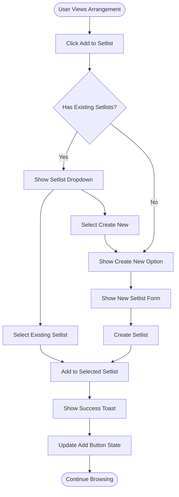
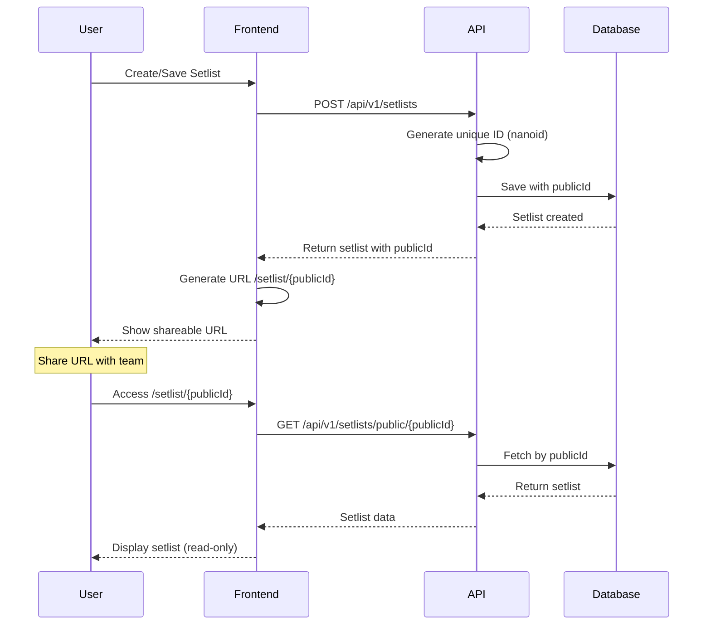
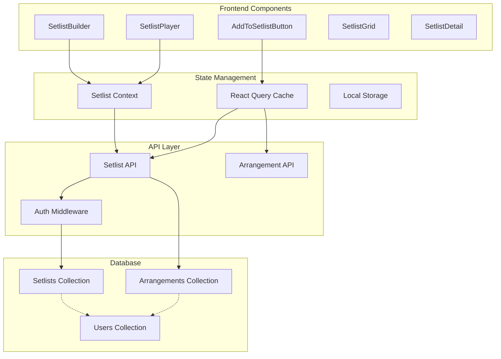
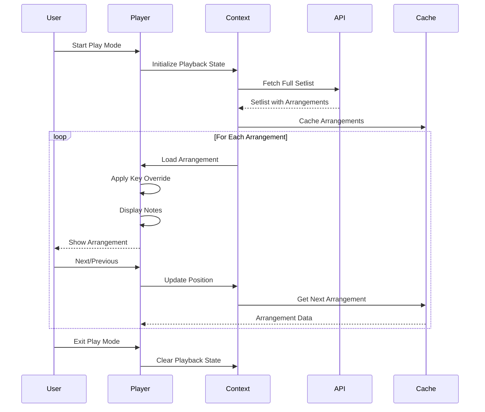
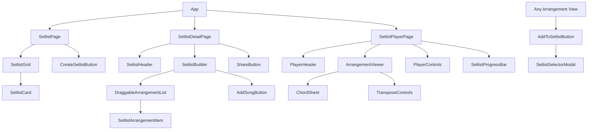

# HSA Songbook: Enhanced Setlist Management PRD

## Executive Summary

This PRD defines the enhanced setlist management feature for HSA Songbook, enabling worship leaders to create, share, and play through worship service setlists with arrangements. The feature introduces public URL sharing, collaborative editing, key transposition per arrangement, and a continuous playback mode for seamless worship services.

### Key Features
- Public shareable URLs for setlists (`/setlist/{random-id}`)
- Drag-and-drop reordering of arrangements
- Per-arrangement key transposition and notes
- Continuous playback mode ("Play Through")
- Quick "Add to Setlist" from any arrangement view
- User likes and profile integration

---

## 1. Problem & Solution

### Problem Statement

Worship teams currently lack an integrated way to:
- Share complete worship service plans with team members
- Play through multiple arrangements seamlessly during services
- Adjust keys per song without creating duplicate arrangements
- Quickly build setlists while browsing arrangements
- Track and reuse popular setlists

### Solution Overview

An enhanced setlist management system that:
- Generates unique, shareable URLs for each setlist
- Enables continuous playback through all arrangements
- Allows per-arrangement customization (key, notes)
- Integrates "Add to Setlist" throughout the application
- Provides social features (likes, following)

### Success Metrics
- Average setlist contains 5+ arrangements
- 70% of setlists are shared via URL
- 50% reduction in service preparation time
- 80% of users create at least one setlist
- Average session length increases by 40%

---

## 2. User Stories & Flows

### Epic: Setlist Management

#### Story 1: Create and Build Setlist
**As a** worship leader  
**I want** to create a setlist and add arrangements  
**So that** I can plan my worship service

**Acceptance Criteria:**
- [ ] Can create new setlist with name and description
- [ ] Can add arrangements from any arrangement view
- [ ] Can reorder arrangements via drag-and-drop
- [ ] Can set custom key per arrangement
- [ ] Can add notes per arrangement
- [ ] Changes auto-save



#### Story 2: Share Setlist via URL
**As a** worship leader  
**I want** to share my setlist via URL  
**So that** team members can access it

**Acceptance Criteria:**
- [ ] Each setlist has unique URL `/setlist/{random-id}`
- [ ] URL is publicly accessible (no login required to view)
- [ ] Share button copies URL to clipboard
- [ ] URL remains stable (doesn't change)
- [ ] Preview shows setlist metadata



#### Story 3: Play Through Setlist
**As a** musician  
**I want** to play through all arrangements in order  
**So that** I can perform the entire service seamlessly

**Acceptance Criteria:**
- [ ] "Play" button starts continuous mode
- [ ] Navigation between songs without returning to list
- [ ] Progress indicator shows position in setlist
- [ ] Can jump to any song in setlist
- [ ] Respects per-arrangement key overrides
- [ ] Shows arrangement notes inline

```mermaid
statechart-v2
    [*] --> ViewingSetlist: Open Setlist
    
    ViewingSetlist --> PlayMode: Click Play
    ViewingSetlist --> Editing: Click Edit
    
    PlayMode --> ShowingArrangement: Load First
    ShowingArrangement --> ShowingArrangement: Next/Previous
    ShowingArrangement --> JumpMenu: Open Navigation
    JumpMenu --> ShowingArrangement: Select Song
    
    ShowingArrangement --> TransposeView: Change Key
    TransposeView --> ShowingArrangement: Apply
    
    ShowingArrangement --> ViewingSetlist: Exit Play Mode
    
    Editing --> Reordering: Drag Songs
    Editing --> AddingSongs: Add Song
    Editing --> RemovingSongs: Remove Song
    Reordering --> Editing: Drop
    AddingSongs --> Editing: Complete
    RemovingSongs --> Editing: Confirm
    
    Editing --> ViewingSetlist: Save Changes
```

#### Story 4: Manage Setlist Permissions
**As a** setlist creator  
**I want** to control who can edit my setlist  
**So that** only authorized users can make changes

**Acceptance Criteria:**
- [ ] Creator can always edit their setlist
- [ ] Admin can edit any setlist
- [ ] Public URL provides read-only access
- [ ] Edit button only shown to authorized users
- [ ] Changes tracked with user attribution

#### Story 5: Like and Discover Setlists
**As a** worship leader  
**I want** to like and discover popular setlists  
**So that** I can find inspiration and reuse proven combinations

**Acceptance Criteria:**
- [ ] Can like/unlike setlists
- [ ] Liked setlists appear in profile
- [ ] Can browse popular setlists
- [ ] Can duplicate others' setlists
- [ ] Like count displayed on setlist

---

## 3. Technical Architecture

### System Architecture



### Data Flow for Play Mode



---

## 4. Data Models

### Enhanced Setlist Schema

```typescript
// Enhanced Setlist Model
interface Setlist {
  // Core fields
  id: string                    // MongoDB ObjectId
  publicId: string              // Unique shareable ID (nanoid)
  name: string
  description?: string
  
  // Arrangements with customization
  arrangements: SetlistArrangement[]
  
  // Metadata
  createdBy: string             // User ID
  createdByName: string         // Cached for display
  isPublic: boolean             // Default: true
  likes: number                 // Like count
  likedBy: string[]            // User IDs who liked
  
  // Timestamps
  createdAt: Date
  updatedAt: Date
  lastPlayedAt?: Date
  
  // Settings
  defaultTransitionTime?: number // Seconds between songs
  allowDuplication: boolean      // Can others duplicate
}

interface SetlistArrangement {
  arrangementId: string         // Reference to arrangement
  arrangement?: Arrangement     // Populated on fetch
  order: number                 // Position in setlist
  
  // Per-arrangement customization
  keyOverride?: string          // Custom key for this instance
  capoOverride?: number         // Custom capo position
  tempoOverride?: number        // Custom tempo
  
  // Creator notes
  notes?: string                // Performance notes
  duration?: number             // Estimated duration in seconds
  
  // Metadata
  addedAt: Date
  addedBy: string              // Who added this arrangement
}

// Like tracking
interface SetlistLike {
  id: string
  setlistId: string
  userId: string
  createdAt: Date
}
```

### State Management

```typescript
// Playback Context State
interface PlaybackState {
  setlist: Setlist | null
  currentIndex: number
  isPlaying: boolean
  
  // Navigation
  history: number[]              // Navigation history
  
  // Customization
  currentKey?: string            // Active transposition
  fontSize: number               // Display size
  scrollPosition: number         // Preserve scroll
  
  // Methods
  play: (setlist: Setlist) => void
  next: () => void
  previous: () => void
  jumpTo: (index: number) => void
  updateKey: (key: string) => void
  exit: () => void
}

// Add to Setlist Context
interface AddToSetlistState {
  showModal: boolean
  targetArrangement: Arrangement | null
  userSetlists: Setlist[]
  
  // Methods
  openSelector: (arrangement: Arrangement) => void
  addToSetlist: (setlistId: string) => Promise<void>
  createAndAdd: (name: string) => Promise<void>
  close: () => void
}
```

---

## 5. API Specifications

### Setlist Endpoints

```yaml
# Enhanced Setlist API
Base URL: /api/v1/setlists

Endpoints:
  # CRUD Operations
  POST /setlists
    Body: CreateSetlistRequest
    Response: Setlist
    Auth: Required
    
  GET /setlists
    Query: page, size, userId, sort
    Response: Page<Setlist>
    Auth: Optional (filters by user if authenticated)
    
  GET /setlists/:id
    Response: Setlist (with populated arrangements)
    Auth: Optional
    
  GET /setlists/public/:publicId
    Response: Setlist (public view)
    Auth: Not required
    
  PATCH /setlists/:id
    Body: UpdateSetlistRequest
    Response: Setlist
    Auth: Required (owner or admin)
    
  DELETE /setlists/:id
    Response: 204
    Auth: Required (owner or admin)
    
  # Arrangement Management
  POST /setlists/:id/arrangements
    Body: AddArrangementRequest
    Response: Setlist
    Auth: Required (owner or admin)
    
  PATCH /setlists/:id/arrangements/:arrangementId
    Body: UpdateArrangementRequest
    Response: Setlist
    Auth: Required (owner or admin)
    
  DELETE /setlists/:id/arrangements/:arrangementId
    Response: Setlist
    Auth: Required (owner or admin)
    
  POST /setlists/:id/reorder
    Body: ReorderRequest
    Response: Setlist
    Auth: Required (owner or admin)
    
  # Social Features
  POST /setlists/:id/like
    Response: { likes: number, liked: boolean }
    Auth: Required
    
  POST /setlists/:id/duplicate
    Body: { name: string }
    Response: Setlist (new copy)
    Auth: Required
    
  # Playback
  GET /setlists/:id/play
    Response: PlayableSetlist (optimized for playback)
    Auth: Optional
    
  POST /setlists/:id/played
    Response: { playCount: number }
    Auth: Optional
```

### Request/Response DTOs

```typescript
// Create Setlist
interface CreateSetlistRequest {
  name: string                  // Required, 1-200 chars
  description?: string          // Optional, max 1000
  arrangements?: {
    arrangementId: string
    keyOverride?: string
    notes?: string
  }[]
  isPublic?: boolean           // Default: true
}

// Add Arrangement
interface AddArrangementRequest {
  arrangementId: string         // Required
  position?: number            // Insert position
  keyOverride?: string
  capoOverride?: number
  tempoOverride?: number
  notes?: string
  duration?: number
}

// Update Arrangement in Setlist
interface UpdateArrangementRequest {
  keyOverride?: string
  capoOverride?: number
  tempoOverride?: number
  notes?: string
  duration?: number
  order?: number
}

// Reorder
interface ReorderRequest {
  arrangements: {
    arrangementId: string
    order: number
  }[]
}

// Playable Setlist (optimized response)
interface PlayableSetlist {
  id: string
  publicId: string
  name: string
  arrangements: {
    id: string
    name: string
    songTitle: string
    key: string                // With override applied
    tempo?: number             // With override applied
    capo?: number              // With override applied
    chordData: string          // Decompressed
    notes?: string             // Setlist creator's notes
    order: number
  }[]
  totalDuration?: number
  createdByName: string
}
```

---

## 6. UI/UX Design Specifications

### Component Hierarchy



### UI Components Specifications

#### AddToSetlistButton
```typescript
interface AddToSetlistButtonProps {
  arrangement: Arrangement
  variant?: 'icon' | 'button' | 'menu-item'
  size?: 'sm' | 'md' | 'lg'
  className?: string
}

// Visual states:
// - Default: "Add to Setlist" with + icon
// - In setlists: "In 3 Setlists" with check icon
// - Loading: Spinner
// - Success: "Added!" with animation
```

#### SetlistSelectorModal
```typescript
interface SetlistSelectorModalProps {
  arrangement: Arrangement
  isOpen: boolean
  onClose: () => void
  onSuccess?: (setlistId: string) => void
}

// Features:
// - Search/filter setlists
// - Show recent setlists first
// - Create new option at top
// - Show which setlists already contain this arrangement
// - Quick create with just name
```

#### SetlistPlayer Interface
```
┌─────────────────────────────────────────────┐
│ ← Back  Amazing Grace (2/5)         Share □ │
├─────────────────────────────────────────────┤
│                                             │
│  Key: G → A (+2)  Tempo: 72  Time: 3/4     │
│                                             │
│  ♪ Notes from worship leader:              │
│  "Start soft, build on verse 3"            │
│                                             │
├─────────────────────────────────────────────┤
│                                             │
│         [Chord Sheet Display]               │
│                                             │
│                                             │
├─────────────────────────────────────────────┤
│  ◄◄ Previous │ ▶ Play │ Next ►►            │
│                                             │
│  [====|=======================] 2 of 5     │
└─────────────────────────────────────────────┘
```

---

## 7. Implementation Phases

### Phase 1: Core Setlist Management (MVP)
**Goal:** Basic setlist CRUD with arrangements

**Tasks:**
- [ ] Create setlist data models and API
- [ ] Implement SetlistBuilder component
- [ ] Add drag-and-drop reordering
- [ ] Create SetlistDetailPage
- [ ] Add arrangement management endpoints
- [ ] Implement auto-save functionality

**Success Criteria:**
- Can create/edit/delete setlists
- Can add/remove/reorder arrangements
- Changes persist to database

### Phase 2: Public Sharing
**Goal:** Shareable URLs and public access

**Tasks:**
- [ ] Generate unique publicId for setlists
- [ ] Create public access endpoint
- [ ] Implement ShareButton with copy to clipboard
- [ ] Add public setlist view (read-only)
- [ ] Create SEO-friendly meta tags
- [ ] Add QR code generation option

**Success Criteria:**
- Each setlist has unique URL
- URLs work without authentication
- Share button copies URL successfully

### Phase 3: Add to Setlist Integration
**Goal:** Quick add from any arrangement view

**Tasks:**
- [ ] Create AddToSetlistButton component
- [ ] Implement SetlistSelectorModal
- [ ] Add to all arrangement views
- [ ] Create quick-create setlist flow
- [ ] Add success notifications
- [ ] Update arrangement cards with setlist count

**Success Criteria:**
- Button appears on all arrangement views
- Can add to existing or new setlist
- Visual feedback on success

### Phase 4: Playback Mode
**Goal:** Continuous play through setlist

**Tasks:**
- [ ] Create SetlistPlayerPage
- [ ] Implement navigation controls
- [ ] Add progress indicator
- [ ] Apply per-arrangement overrides
- [ ] Create jump-to navigation
- [ ] Add keyboard shortcuts

**Success Criteria:**
- Can play through entire setlist
- Navigation works smoothly
- Key overrides apply correctly

### Phase 5: Social Features
**Goal:** Likes and discovery

**Tasks:**
- [ ] Implement like/unlike functionality
- [ ] Add to user profile
- [ ] Create popular setlists view
- [ ] Implement duplicate setlist
- [ ] Add follow user functionality
- [ ] Create setlist recommendations

**Success Criteria:**
- Like counts update in real-time
- Can discover popular setlists
- Can duplicate others' setlists

### Phase 6: Enhanced Features
**Goal:** Advanced functionality

**Tasks:**
- [ ] Add setlist templates
- [ ] Implement collaborative editing
- [ ] Create setlist analytics
- [ ] Add practice mode
- [ ] Implement offline support
- [ ] Create mobile app views

---

## 8. Risks & Mitigations

### Technical Risks

| Risk | Impact | Probability | Mitigation |
|------|--------|-------------|------------|
| Performance issues with large setlists | High | Medium | Implement pagination, lazy loading, and caching |
| URL collisions with random IDs | Low | Low | Use nanoid with sufficient length (10+ chars) |
| Concurrent editing conflicts | Medium | Medium | Implement optimistic locking or CRDT |
| Data inconsistency with arrangements | High | Low | Use database transactions, add integrity checks |

### Product Risks

| Risk | Impact | Probability | Mitigation |
|------|--------|-------------|------------|
| Low adoption of sharing feature | Medium | Medium | Add email/SMS sharing, integrate with teams |
| Confusion with key overrides | Low | Medium | Clear UI indicators, preview changes |
| Abuse of public URLs | Medium | Low | Add rate limiting, report functionality |
| Feature complexity | High | Medium | Progressive disclosure, good defaults |

### Security Considerations

- **Public URLs:** Use unguessable IDs, no sequential patterns
- **Rate Limiting:** Prevent setlist spam creation
- **Access Control:** Verify permissions on all mutations
- **Data Validation:** Sanitize all user inputs
- **CORS Policy:** Restrict API access appropriately

---

## 9. Success Metrics

### Core Metrics
- **Adoption Rate:** % of users creating setlists
- **Engagement:** Average setlists per user
- **Sharing:** % of setlists shared via URL
- **Playback:** % of setlists using play mode
- **Retention:** Users returning to use setlists

### Feature-Specific Metrics

| Feature | Metric | Target | Measurement |
|---------|--------|--------|-------------|
| Creation | Setlists created/week | 100+ | Database count |
| Sharing | Unique URL visits | 500+/week | Analytics |
| Add to Setlist | Uses per session | 3+ | Event tracking |
| Playback | Complete play-throughs | 50% | Session tracking |
| Social | Likes per setlist | 5+ average | Database |

### Quality Metrics
- **Error Rate:** < 1% of API calls
- **Load Time:** < 2s for setlist page
- **Save Success:** > 99.9% reliability
- **URL Availability:** 99.99% uptime

---

## 10. Appendices

### A. URL Structure Examples

```
# Public setlist URL
https://hsasongbook.com/setlist/kQX9f2Rt8m

# Play mode URL
https://hsasongbook.com/setlist/kQX9f2Rt8m/play

# Edit mode URL (authenticated)
https://hsasongbook.com/setlist/kQX9f2Rt8m/edit

# Embedded view
https://hsasongbook.com/embed/setlist/kQX9f2Rt8m
```

### B. Keyboard Shortcuts (Play Mode)

| Key | Action |
|-----|--------|
| Space | Play/Pause auto-scroll |
| → | Next arrangement |
| ← | Previous arrangement |
| ↑/↓ | Transpose up/down |
| 1-9 | Jump to arrangement N |
| F | Toggle fullscreen |
| ESC | Exit play mode |

### C. Migration Strategy

For existing setlist data:
1. Generate publicId for all existing setlists
2. Migrate song references to arrangement references
3. Set default isPublic = true
4. Initialize like counts to 0
5. Backfill createdByName from users collection

### D. Example API Calls

```bash
# Create setlist
curl -X POST /api/v1/setlists \
  -H "Authorization: Bearer $TOKEN" \
  -d '{
    "name": "Sunday Service 2024-01-21",
    "description": "Contemporary worship set",
    "arrangements": [
      {
        "arrangementId": "507f1f77bcf86cd799439011",
        "keyOverride": "G",
        "notes": "Start soft"
      }
    ]
  }'

# Add arrangement to setlist
curl -X POST /api/v1/setlists/507f1f77bcf86cd799439012/arrangements \
  -H "Authorization: Bearer $TOKEN" \
  -d '{
    "arrangementId": "507f1f77bcf86cd799439013",
    "keyOverride": "D",
    "notes": "Build energy",
    "position": 2
  }'

# Get public setlist
curl GET /api/v1/setlists/public/kQX9f2Rt8m

# Like setlist
curl -X POST /api/v1/setlists/507f1f77bcf86cd799439012/like \
  -H "Authorization: Bearer $TOKEN"
```

---

## Document History

| Version | Date | Author | Changes |
|---------|------|--------|---------|
| 1.0 | 2024-01-20 | AI Assistant | Initial PRD |

---

## Next Steps

1. **Review & Approval:** Stakeholder review of PRD
2. **Technical Design:** Detailed technical specification
3. **UI/UX Design:** Mockups and prototypes
4. **Implementation:** Phase 1 development
5. **Testing:** QA and user testing
6. **Launch:** Phased rollout with monitoring