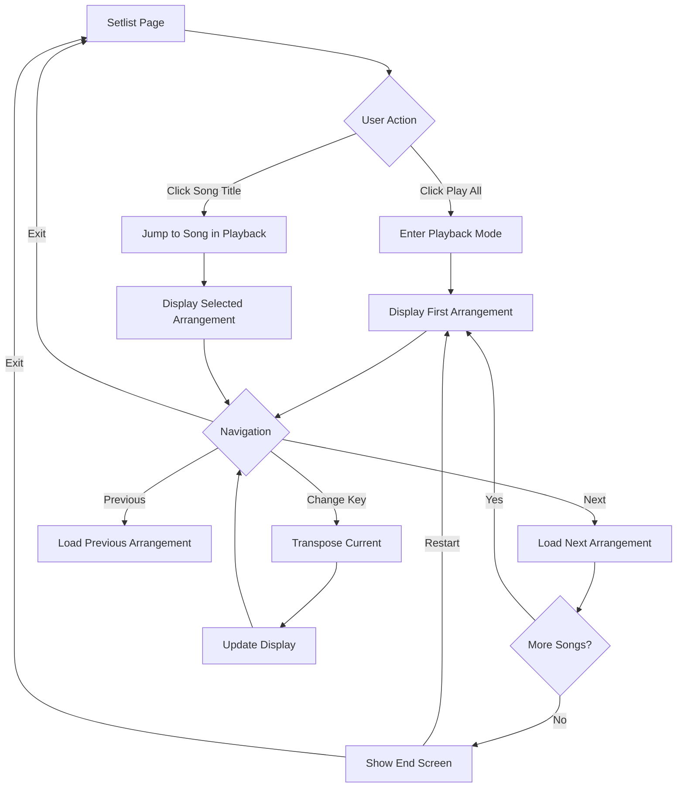
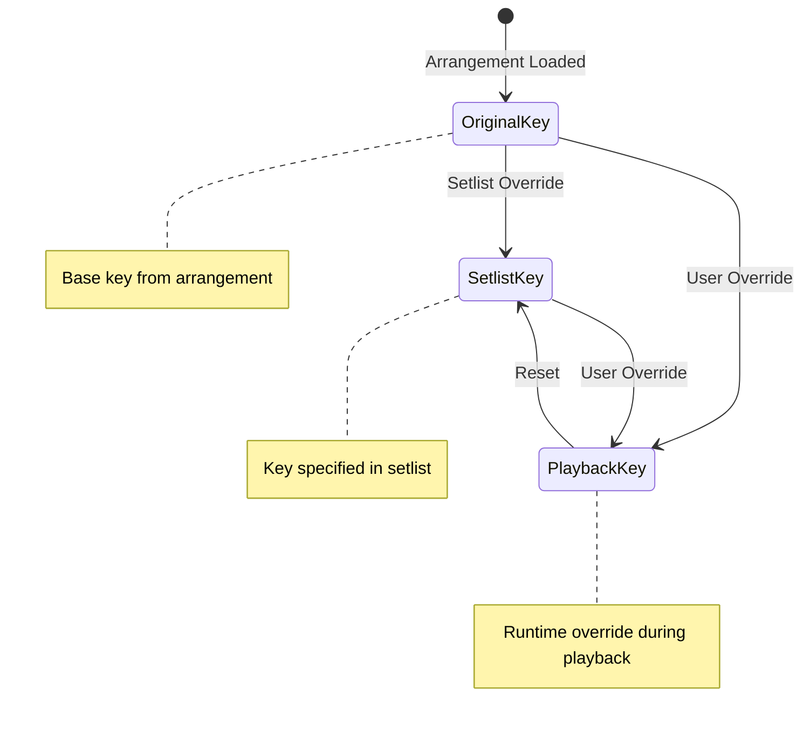
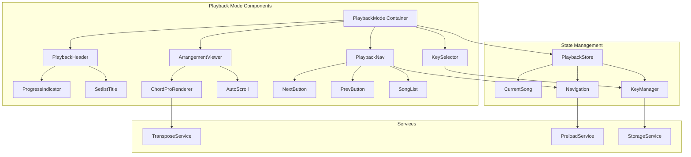
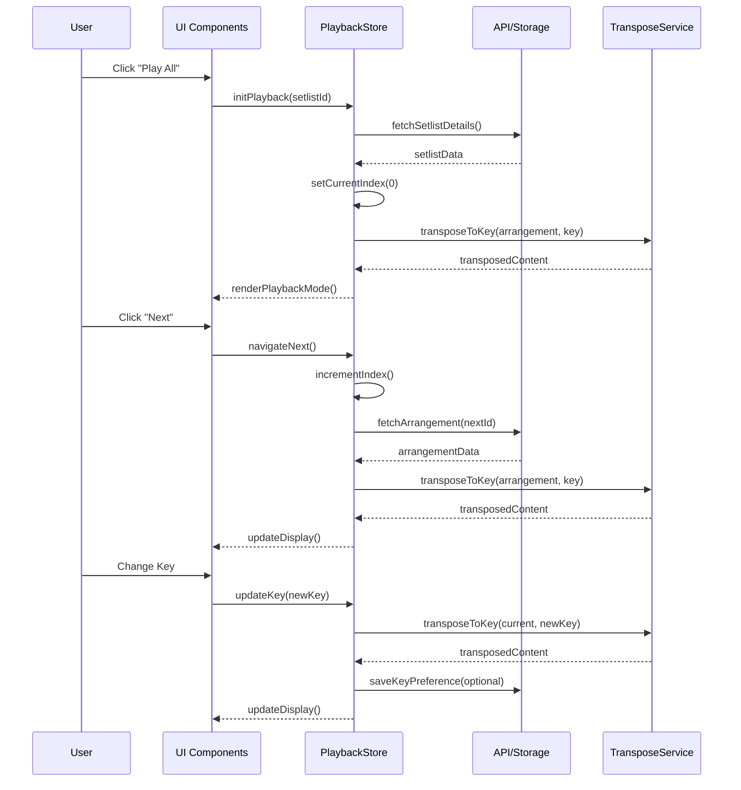
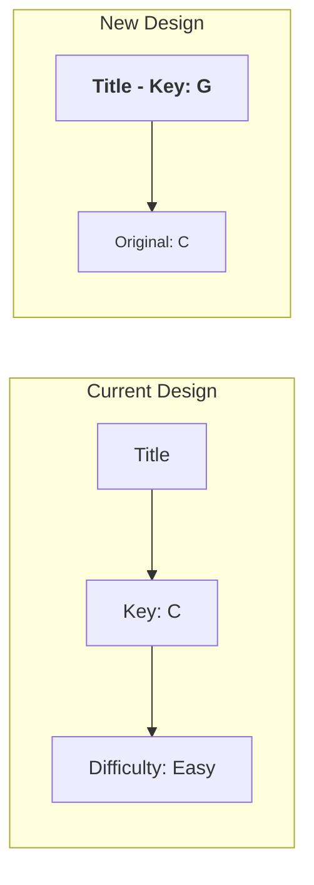

# Setlist Playback Mode - Product Requirements Document

## Executive Summary

This PRD defines a comprehensive playback mode for setlists in the HSA Songbook application. The feature enables musicians to perform entire setlists seamlessly with sequential arrangement playback, dynamic key transposition, and intuitive navigation controls. This addresses the critical need for smooth performance flow during live music sessions.

## Problem Statement

### Current Pain Points
- Musicians must manually navigate between individual arrangements during performances
- No unified view for performing entire setlists
- Key changes require navigating away from performance view
- Lack of visual continuity between songs disrupts performance flow
- No quick way to jump to specific songs while maintaining setlist context

### Target Users
- **Primary**: Worship leaders and band members performing live
- **Secondary**: Musicians practicing setlists for rehearsals
- **Tertiary**: Music directors coordinating multiple performers

### Success Criteria
- 90% reduction in navigation clicks during performances
- < 2 seconds transition time between arrangements
- Zero page refreshes during setlist playback
- 100% of users can transpose keys without leaving playback mode

## Solution Overview

A dedicated playback mode that transforms setlists into seamless performance experiences with:
- One-click "Play All" to enter performance mode
- Automatic progression through arrangements
- In-context key transposition per arrangement
- Direct song access while maintaining playback context
- Clear visual hierarchy showing current and upcoming songs

## User Stories

### Epic: Setlist Playback Mode

#### Story 1: Entering Playback Mode
**As a** musician  
**I want** to start playing my entire setlist with one click  
**So that** I can focus on performing rather than navigation

**Acceptance Criteria:**
- [ ] "Play All" button prominently displayed on setlist page
- [ ] Clicking opens first arrangement in playback view
- [ ] Playback mode shows arrangement in setlist's specified key
- [ ] Visual indicator shows position in setlist
- [ ] Smooth transition without page reload

#### Story 2: Sequential Navigation
**As a** performer  
**I want** to move between arrangements seamlessly  
**So that** I maintain performance flow

**Acceptance Criteria:**
- [ ] "Next" button advances to next arrangement
- [ ] "Previous" button returns to prior arrangement
- [ ] Keyboard shortcuts (arrow keys) for navigation
- [ ] Progress indicator shows current position
- [ ] Pre-loading of next arrangement for instant display

#### Story 3: Key Override Control
**As a** musician  
**I want** to change the key of any arrangement during playback  
**So that** I can adapt to vocal range or instrument needs

**Acceptance Criteria:**
- [ ] Key selector visible in playback mode
- [ ] Shows current playback key (bold) and original key (subtitle)
- [ ] Instant transposition without page reload
- [ ] Key change persists for session
- [ ] Option to save key preference to setlist

#### Story 4: Direct Song Access
**As a** worship leader  
**I want** to jump to any song in the setlist  
**So that** I can adapt to service flow changes

**Acceptance Criteria:**
- [ ] Clicking arrangement title enters playback at that song
- [ ] Maintains setlist context (can still navigate next/previous)
- [ ] Shows jumped-to song in setlist's specified key
- [ ] Visual indicator of current position updates
- [ ] Smooth transition without losing place

## User Flow Diagrams

### Main Playback Flow



### Key Management Flow



## Technical Architecture

### Component Architecture



### Data Flow



## UI/UX Specifications

### Setlist Card Updates



### Playback Mode Layout

```
+--------------------------------------------------+
| ← Back  | Setlist: Sunday Service | 3 of 8      |
+--------------------------------------------------+
|                                                  |
| Amazing Grace - Key: [G ▼]  (Original: C)       |
|                                                  |
| [Verse 1]                                        |
| G         C        G                            |
| Amazing grace how sweet the sound               |
|     G                D                          |
| That saved a wretch like me                     |
|                                                  |
| [Chorus]                                         |
| C          G                                    |
| How sweet the sound...                          |
|                                                  |
|                    ...                          |
|                                                  |
+--------------------------------------------------+
| [Previous] [Song List ▼] [Next]  | Auto-scroll ▢|
+--------------------------------------------------+
```

### Visual States

| Component | Default | Hover | Active | Disabled |
|-----------|---------|-------|--------|----------|
| Play All Button | Primary color | Darker shade | Pressed state | Greyed out |
| Next/Prev | Secondary | Primary | Pressed | Greyed if none |
| Key Selector | Current key bold | Highlight | Dropdown open | - |
| Song Title Link | Underline | Color change | - | - |

## API Specifications

### Endpoints

#### GET /api/setlists/{id}/playback
Returns optimized data for playback mode
```json
{
  "setlist": {
    "id": "sl_123",
    "name": "Sunday Service",
    "arrangements": [
      {
        "id": "arr_456",
        "order": 0,
        "title": "Amazing Grace",
        "originalKey": "C",
        "playbackKey": "G",
        "keyOverride": "G",
        "content": "...",
        "nextId": "arr_789",
        "prevId": null
      }
    ]
  }
}
```

#### POST /api/setlists/{id}/arrangements/{arrId}/key
Updates key preference for arrangement in setlist
```json
{
  "key": "G",
  "persist": true
}
```

### WebSocket Events

```typescript
// Real-time sync for collaborative setlists
interface PlaybackEvents {
  'setlist:keyChanged': {
    setlistId: string
    arrangementId: string
    newKey: string
    userId: string
  }
  'setlist:navigationChanged': {
    setlistId: string
    currentIndex: number
    userId: string
  }
}
```

## Data Models

### Updated Setlist Schema

```typescript
interface SetlistArrangement {
  id: string
  arrangementId: string
  order: number
  arrangement?: Arrangement
  keyOverride?: string      // Setlist-specific key
  playbackKey?: string       // Runtime playback key
  notes?: string
}

interface PlaybackSession {
  setlistId: string
  currentIndex: number
  keyOverrides: Map<string, string>
  startedAt: Date
  lastActivity: Date
}

interface PlaybackPreferences {
  autoScroll: boolean
  scrollSpeed: number
  fontSize: 'small' | 'medium' | 'large'
  showChords: boolean
  showSectionLabels: boolean
}
```

## Implementation Phases

### Phase 1: Core Playback Mode (MVP)
- [ ] Create PlaybackMode component structure
- [ ] Implement basic navigation (next/previous)
- [ ] Add "Play All" button to setlist page
- [ ] Display arrangements in sequence
- [ ] Show current position indicator

### Phase 2: Key Management
- [ ] Update arrangement cards to show keys prominently
- [ ] Implement key selector in playback mode
- [ ] Add transpose service integration
- [ ] Show original key as reference
- [ ] Cache transposed versions

### Phase 3: Enhanced Navigation
- [ ] Add direct song access via title click
- [ ] Implement keyboard shortcuts
- [ ] Add progress bar/dots
- [ ] Pre-load next arrangement
- [ ] Add song list dropdown

### Phase 4: Performance Features
- [ ] Add auto-scroll capability
- [ ] Implement fullscreen mode
- [ ] Add gesture support (swipe)
- [ ] Session persistence
- [ ] Collaborative sync (WebSocket)

### Phase 5: Polish & Optimization
- [ ] Smooth transitions/animations
- [ ] Offline capability
- [ ] Performance monitoring
- [ ] Analytics integration
- [ ] User preferences

## Risks & Mitigations

| Risk | Impact | Probability | Mitigation |
|------|--------|-------------|------------|
| Performance issues with large setlists | High | Medium | Implement virtual scrolling, lazy loading |
| Complex key transposition errors | High | Low | Extensive testing, fallback to original |
| Browser compatibility issues | Medium | Low | Progressive enhancement, polyfills |
| State sync complexities | Medium | Medium | Use proven state management (Redux/Zustand) |
| Mobile responsiveness | High | Low | Mobile-first design, touch optimization |

## Success Metrics

### Performance Metrics
- **Page Load Time**: < 1s for playback mode entry
- **Transition Time**: < 200ms between arrangements
- **Key Change Time**: < 100ms for transposition
- **Memory Usage**: < 50MB for 20-song setlist

### User Metrics
- **Adoption Rate**: 80% of setlist users try playback mode
- **Retention**: 60% use playback mode regularly
- **Error Rate**: < 1% failed navigations
- **Task Success**: 95% complete full setlist playback

### Business Metrics
- **Session Duration**: +30% when using playback mode
- **User Engagement**: 2x arrangement views per session
- **Feature NPS**: > 8.0
- **Support Tickets**: < 5% related to playback

## Testing Strategy

### Unit Tests
- Key transposition logic
- Navigation state management
- Cache management
- URL routing

### Integration Tests
- Setlist to playback flow
- Key persistence
- Pre-loading mechanism
- Error recovery

### E2E Tests
- Complete playback session
- Key changes during playback
- Direct song access
- Mobile interactions

### Performance Tests
- Large setlist handling (50+ songs)
- Rapid navigation stress test
- Memory leak detection
- Network failure scenarios

## Accessibility Requirements

- **Keyboard Navigation**: Full functionality without mouse
- **Screen Reader**: Announce position, key changes
- **High Contrast**: Maintain readability
- **Focus Management**: Clear focus indicators
- **ARIA Labels**: Descriptive labels for all controls

## Security Considerations

- Validate user permissions for setlist access
- Sanitize ChordPro content before rendering
- Rate limit API calls for key changes
- Secure WebSocket connections for collaboration
- Audit log for setlist modifications

## Appendices

### A. Competitor Analysis
- OnSong: Instant transposition, pedal support
- SongBook: Simple navigation, offline mode
- Planning Center: Collaborative features, team sync
- MultiTracks: Advanced playback controls, stems

### B. Technical Dependencies
- @dnd-kit (existing): Potential reuse for gesture support
- ChordPro parser: Enhanced for transposition
- React Router: Playback mode routing
- Zustand/Redux: State management
- Socket.io: Real-time collaboration

### C. Future Enhancements
- MIDI controller support
- Bluetooth pedal integration
- PDF/image chord charts
- Metronome integration
- Click track sync
- Multi-screen support
- Recording capability
- Practice mode with loops

---

## Document History
- v1.0 - Initial PRD creation
- Created: 2024-01-16
- Author: Development Team

## Approval
- [ ] Product Owner
- [ ] Engineering Lead
- [ ] UX Designer
- [ ] QA Lead