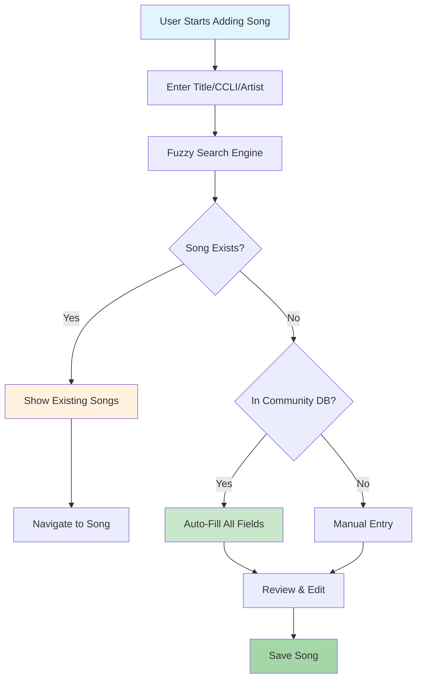
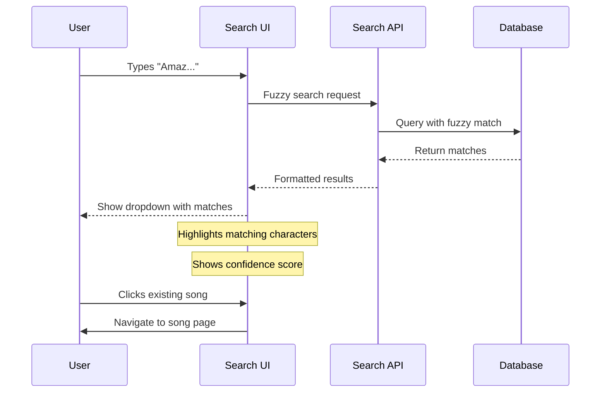
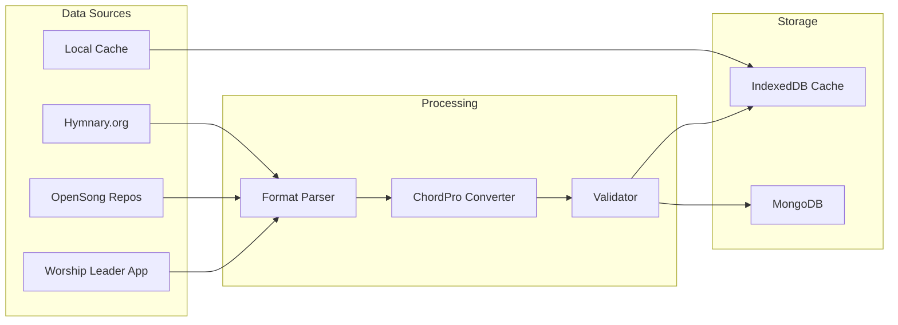
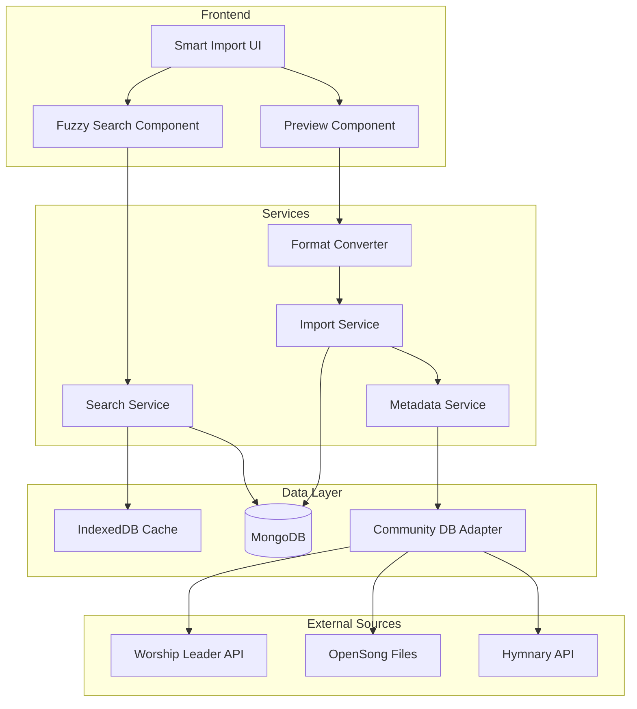

# Product Requirements Document: Smart Song Import with Auto-Fill

## Executive Summary

The Smart Song Import feature enhances the HSA Songbook application by providing intelligent duplicate detection, auto-fill capabilities, and seamless integration with community song databases. This feature will dramatically reduce manual data entry, prevent duplicate songs, and leverage existing worship song databases to provide comprehensive metadata and chord information automatically.

### Key Benefits
- **Reduce Duplicate Songs**: Fuzzy search prevents adding songs that already exist
- **Save Time**: Auto-fill metadata, lyrics, and chords from community databases
- **Improve Data Quality**: Consistent metadata from verified sources
- **Better UX**: Intelligent suggestions and seamless workflow

---

## Problem Statement

### Current Pain Points
1. **Manual Data Entry**: Users must manually enter all song information including title, artist, CCLI number, year, lyrics, and chords
2. **Duplicate Songs**: No detection system leads to multiple versions of the same song
3. **Incomplete Metadata**: Songs often lack complete information (missing years, artists, CCLI numbers)
4. **Time-Consuming Process**: Adding a single song can take 10-15 minutes of manual work
5. **Inconsistent Data**: Different users enter the same song with varying metadata

### User Impact
- **Worship Leaders**: Spend hours manually entering songs instead of planning services
- **Musicians**: Deal with inconsistent chord formats and missing information
- **Administrators**: Must clean up duplicate entries and incomplete data

---

## Solution Overview

### Smart Import System
A multi-layered approach that combines:
1. **Fuzzy Search**: Real-time duplicate detection as users type
2. **Community Database Integration**: Access to 30,000+ worship songs
3. **Auto-Fill Engine**: Intelligent metadata and content population
4. **Format Conversion**: Support for OpenSong, ChordPro, and other formats

### Core Capabilities


---

## User Stories

### Epic: Smart Song Import System

#### Story 1: Duplicate Detection
**As a** worship leader
**I want** to see if a song already exists as I type
**So that** I don't create duplicate entries

**Acceptance Criteria:**
- [ ] Fuzzy search activates after 3 characters
- [ ] Results appear within 200ms
- [ ] Shows top 5 matches with title, artist, and year
- [ ] Handles typos and variations (e.g., "Amazing Grace" finds "Amazing Grace (My Chains Are Gone)")
- [ ] Visual indicators show confidence level of match

**User Flow:**


#### Story 2: CCLI Number Auto-Fill
**As a** church administrator
**I want** to enter a CCLI number and have all fields auto-populate
**So that** I can quickly add licensed songs with accurate information

**Acceptance Criteria:**
- [ ] CCLI field validates format (numeric, 5-8 digits)
- [ ] Auto-fill triggers on valid CCLI entry
- [ ] Populates: title, artist, year, copyright
- [ ] Shows source of data
- [ ] Allows manual override of auto-filled data

#### Story 3: Community Database Import
**As a** user adding a new song
**I want** to import from community databases
**So that** I get complete lyrics and chords automatically

**Acceptance Criteria:**
- [ ] Search community DB after local search
- [ ] Support OpenSong XML format
- [ ] Convert to ChordPro format
- [ ] Preview before importing
- [ ] Attribution to source database

**Data Flow:**


#### Story 4: Intelligent Field Suggestions
**As a** user entering song details
**I want** smart suggestions for each field
**So that** I maintain consistency with existing data

**Acceptance Criteria:**
- [ ] Artist field suggests from existing artists
- [ ] Theme tags suggest from popular tags
- [ ] Key suggestion based on song analysis
- [ ] Year extraction from copyright string
- [ ] Auto-slug generation from title

---

## Technical Architecture

### System Components


### Technology Stack
- **Frontend**: React + TypeScript
- **Search**: Fuse.js for fuzzy search
- **Parsing**: xml2js for OpenSong XML
- **Storage**: IndexedDB + MongoDB
- **API**: Express endpoints

---

## API Specifications

### 1. Fuzzy Search Endpoint
```typescript
POST /api/songs/search/fuzzy
{
  "query": string,          // Search text (min 3 chars)
  "fields": string[],       // Fields to search ["title", "artist", "lyrics"]
  "limit": number,          // Max results (default: 5)
  "threshold": number       // Fuzzy match threshold 0-1 (default: 0.6)
}

Response:
{
  "results": [
    {
      "id": string,
      "title": string,
      "artist": string,
      "score": number,      // Match confidence 0-1
      "highlights": {       // Matching segments
        "title": string[],
        "artist": string[]
      }
    }
  ],
  "totalFound": number,
  "searchTime": number      // milliseconds
}
```

### 2. CCLI Lookup Endpoint
```typescript
GET /api/metadata/ccli/:number

Response:
{
  "found": boolean,
  "source": "local" | "worshipleader" | "opensong" | "cached",
  "data": {
    "ccli": string,
    "title": string,
    "artist": string,
    "copyright": string,
    "year": number,
    "themes": string[],
    "key": string
  },
  "confidence": number      // Data reliability 0-1
}
```

### 3. Import from Community Database
```typescript
POST /api/import/community
{
  "source": "worshipleader" | "opensong" | "hymnary",
  "identifier": string,     // Song ID in source system
  "format": "opensong" | "chordpro" | "plain"
}

Response:
{
  "success": boolean,
  "data": {
    "metadata": {
      "title": string,
      "artist": string,
      "ccli": string,
      "year": number
    },
    "content": {
      "lyrics": string,
      "chords": string,     // ChordPro format
      "structure": string[] // ["verse", "chorus", "verse", "chorus", "bridge"]
    }
  },
  "conversionNotes": string[]
}
```

### 4. Batch Import Endpoint
```typescript
POST /api/import/batch
{
  "format": "opensong" | "openlp" | "csv",
  "data": string | File,    // Base64 or multipart
  "options": {
    "skipDuplicates": boolean,
    "mergeMetadata": boolean,
    "dryRun": boolean
  }
}

Response:
{
  "processed": number,
  "imported": number,
  "skipped": number,
  "errors": Array<{
    "index": number,
    "title": string,
    "error": string
  }>,
  "preview": Song[]         // If dryRun=true
}
```

---

## Data Models

### Enhanced Song Schema
```typescript
interface Song {
  // Existing fields
  _id: ObjectId;
  title: string;
  artist: string;
  slug: string;

  // Import metadata
  importSource?: {
    type: 'manual' | 'ccli' | 'worshipleader' | 'opensong' | 'hymnary';
    id?: string;            // ID in source system
    importedAt: Date;
    importedBy: string;     // User ID
    confidence: number;     // 0-1 reliability score
  };

  // Duplicate detection
  duplicateCheck?: {
    fingerprint: string;    // Hash of normalized title+artist
    similarSongs: Array<{
      id: string;
      score: number;        // Similarity score 0-1
    }>;
  };

  // Community data cache
  communityData?: {
    lastChecked: Date;
    sources: Array<{
      type: string;
      hasData: boolean;
      lastModified?: Date;
    }>;
  };
}
```

### Import Cache Schema
```typescript
interface ImportCache {
  _id: string;              // CCLI or source ID
  source: string;
  data: {
    metadata: object;
    content: object;
  };
  created: Date;
  expires: Date;            // TTL for cache
  hits: number;             // Usage tracking
}
```

### Fuzzy Search Index
```typescript
interface SearchIndex {
  songId: string;
  tokens: {
    title: string[];        // Tokenized title
    artist: string[];       // Tokenized artist
    aliases: string[];      // Alternative names
  };
  metaphone: {              // Phonetic encoding
    title: string;
    artist: string;
  };
  popularity: number;       // For result ranking
}
```

---

## UI/UX Design

### Smart Import Modal
```
┌─────────────────────────────────────────────┐
│ Add New Song                            [X] │
├─────────────────────────────────────────────┤
│                                             │
│ ┌─────────────────────────────────────────┐ │
│ │ 🔍 Song Title or CCLI Number...        │ │
│ └─────────────────────────────────────────┘ │
│                                             │
│ ╔═══════════════════════════════════════╗   │
│ ║ 💡 Similar songs found:               ║   │
│ ║                                       ║   │
│ ║ ► Amazing Grace (My Chains Are Gone)  ║   │
│ ║   Chris Tomlin • Key of G • 95% match ║   │
│ ║                                       ║   │
│ ║ ► Amazing Grace                       ║   │
│ ║   Traditional • Key of D • 90% match  ║   │
│ ╚═══════════════════════════════════════╝   │
│                                             │
│ ─────────── OR Enter Details ───────────    │
│                                             │
│ CCLI #: [_________] 🔄 Auto-fill           │
│                                             │
│ Title:  [_____________________]            │
│ Artist: [_____________________] 📝         │
│ Year:   [____]                             │
│                                             │
│ [Import from Database ▼]                   │
│                                             │
│ [Cancel]                    [Next: Chords] │
└─────────────────────────────────────────────┘
```

### Auto-Fill Notification
```
┌──────────────────────────────────────┐
│ ✅ Auto-filled from Worship Leader DB │
│                                      │
│ • Title: Way Maker                   │
│ • Artist: Sinach                     │
│ • Year: 2015                         │
│ • CCLI: 7115744                      │
│                                      │
│ [Keep All] [Review] [Change Source]  │
└──────────────────────────────────────┘
```

---

## Implementation Phases

### Phase 1: Fuzzy Search & Duplicate Detection (MVP)
**Goal**: Prevent duplicate songs

**Deliverables**:
- [ ] Fuzzy search component with Fuse.js
- [ ] Search API endpoint
- [ ] Duplicate detection on save
- [ ] UI dropdown with matches
- [ ] Navigation to existing songs

**Technical Tasks**:
1. Install and configure Fuse.js
2. Create search index on song collection
3. Build fuzzy search API
4. Implement search UI component
5. Add duplicate warnings

### Phase 2: CCLI & Metadata Auto-Fill
**Goal**: Auto-populate from CCLI number

**Deliverables**:
- [ ] CCLI validation and lookup
- [ ] Local cache for CCLI data
- [ ] Auto-fill UI feedback
- [ ] Manual override capability

**Technical Tasks**:
1. Build CCLI lookup service
2. Implement IndexedDB cache
3. Create auto-fill UI flow
4. Add data source attribution

### Phase 3: Community Database Integration
**Goal**: Import from external sources

**Deliverables**:
- [ ] OpenSong XML parser
- [ ] Format conversion service
- [ ] Database adapter layer
- [ ] Import preview UI

**Technical Tasks**:
1. Implement XML parsing
2. Build format converters
3. Create adapter interfaces
4. Add preview component

### Phase 4: Batch Import & Advanced Features
**Goal**: Bulk operations and optimization

**Deliverables**:
- [ ] Batch import UI
- [ ] Progress tracking
- [ ] Conflict resolution
- [ ] Import history

**Technical Tasks**:
1. Build batch processor
2. Implement progress events
3. Create conflict UI
4. Add audit logging

---

## Performance Requirements

### Response Times
| Operation | Target | Max |
|-----------|--------|-----|
| Fuzzy search | 200ms | 500ms |
| CCLI lookup | 300ms | 1s |
| Import single song | 1s | 3s |
| Batch import (100 songs) | 30s | 60s |

### Scalability
- Support 100,000+ songs in search index
- Handle 50 concurrent imports
- Cache 10,000 most popular songs
- Index updates < 100ms

---

## Security & Privacy

### Data Protection
- **No Storage of Licensed Content**: Only metadata cached
- **Attribution Required**: Track source of all imported data
- **User Consent**: Explicit permission for community features
- **Rate Limiting**: Prevent abuse of external APIs

### API Security
```typescript
// Rate limiting configuration
{
  fuzzySearch: "100/minute per IP",
  ccliLookup: "30/minute per user",
  import: "10/minute per user",
  batchImport: "1/minute per user"
}
```

---

## Risks & Mitigations

| Risk | Impact | Probability | Mitigation |
|------|--------|-------------|------------|
| External API unavailable | High | Medium | Implement fallback to cache, manual entry |
| Copyright concerns | High | Low | Only import metadata, require CCLI license |
| Poor fuzzy match quality | Medium | Medium | Tunable thresholds, user feedback |
| Performance degradation | Medium | Low | Implement pagination, optimize indexes |
| Data inconsistency | Low | Medium | Validation rules, admin review queue |

---

## Success Metrics

### Quantitative Metrics
| Metric | Target | Measurement |
|--------|--------|-------------|
| Duplicate songs prevented | 90% reduction | Compare before/after duplicate rate |
| Time to add song | 80% reduction | Track form completion time |
| Auto-fill success rate | 70% of songs | Successful auto-fills / attempts |
| Search accuracy | 95% relevant | User clicks on results |
| Import success rate | 90% | Successful imports / attempts |

### Qualitative Metrics
- User satisfaction surveys
- Feature adoption rate
- Support ticket reduction
- Community contribution rate

---

## Dependencies

### Technical Dependencies
- Fuse.js for fuzzy search
- xml2js for XML parsing
- ChordSheetJS for format conversion
- IndexedDB for client caching
- MongoDB text indexes

### External Dependencies
- Worship Leader App database
- OpenSong repositories
- Hymnary.org API
- Community contributors

---

## Future Enhancements

### Version 2.0 Possibilities
1. **AI-Powered Matching**: Use ML for better duplicate detection
2. **OCR Import**: Scan printed music for automatic entry
3. **Audio Recognition**: Identify songs from audio recordings
4. **Collaborative Editing**: Multiple users contributing to same song
5. **Smart Recommendations**: Suggest related songs
6. **Automatic Updates**: Sync with source databases

### Integration Opportunities
- Planning Center integration
- CCLI SongSelect API (if available)
- Spotify/Apple Music metadata
- YouTube worship channels
- Sheet music services

---

## Appendices

### A. OpenSong XML Format Example
```xml
<?xml version="1.0" encoding="UTF-8"?>
<song>
  <title>Amazing Grace</title>
  <author>John Newton</author>
  <copyright>Public Domain</copyright>
  <ccli>22025</ccli>
  <key>G</key>
  <tempo>72</tempo>
  <time_sig>3/4</time_sig>
  <lyrics>
[V1]
 G          G7        C         G
Amazing grace how sweet the sound
     G                D   D7
That saved a wretch like me
  G        G7       C      G
I once was lost but now am found
     Em       D    G
Was blind but now I see
  </lyrics>
</song>
```

### B. ChordPro Output Format
```chordpro
{title: Amazing Grace}
{artist: John Newton}
{key: G}
{tempo: 72}
{time: 3/4}
{ccli: 22025}

{verse: 1}
A[G]mazing [G7]grace how [C]sweet the [G]sound
That [G]saved a wretch like [D]me [D7]
I [G]once was [G7]lost but [C]now am [G]found
Was [Em]blind but [D]now I [G]see
```

### C. Fuzzy Search Algorithm Configuration
```javascript
const fuseOptions = {
  keys: [
    { name: 'title', weight: 0.5 },
    { name: 'artist', weight: 0.3 },
    { name: 'aliases', weight: 0.2 }
  ],
  threshold: 0.4,           // 0 = exact, 1 = anything
  location: 0,              // Start of string preferred
  distance: 100,            // How far from location
  minMatchCharLength: 3,    // Min chars to match
  includeScore: true,       // Return confidence scores
  includeMatches: true,     // Return match positions
  findAllMatches: true,     // Find all matches
  useExtendedSearch: true   // Enable advanced operators
};
```

---

## Document Control

- **Version**: 1.0
- **Created**: January 2025
- **Status**: Ready for Implementation
- **Owner**: HSA Songbook Team
- **Review Cycle**: After each phase completion

---

*This PRD provides a comprehensive blueprint for implementing the Smart Song Import feature. Each phase builds upon the previous, ensuring a stable and valuable feature set at each milestone.*
