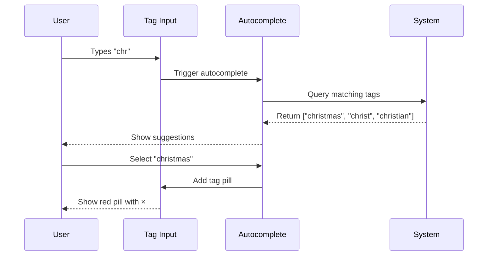
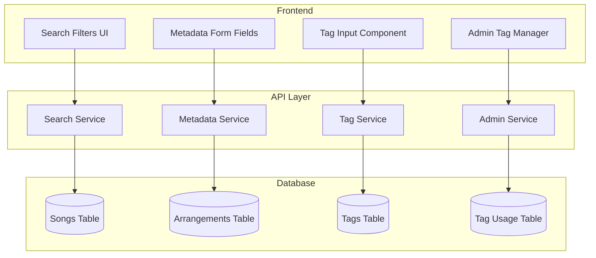
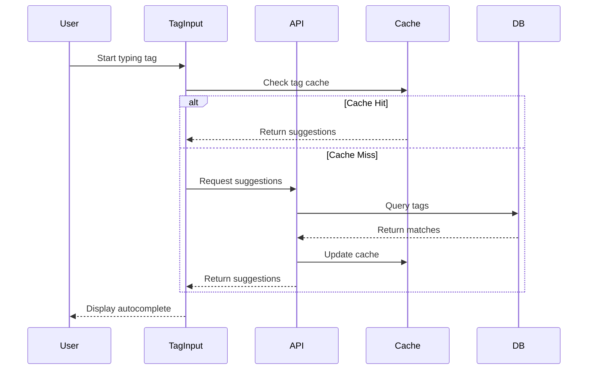

# Streamlined Tags & Metadata System - Product Requirements Document

## Executive Summary

This PRD outlines a comprehensive overhaul of the tagging and metadata system for HSA Songbook, splitting the current mixed approach into two distinct systems:
1. **Flexible tagging for songs** (themes, occasions, moods)
2. **Structured metadata for arrangements** (key, difficulty, style, instrumentation)

This separation aligns with user mental models, improves search capabilities, and provides better data integrity while maintaining flexibility where needed.

## Problem Statement

### Current Pain Points
- **Inconsistent tagging**: Same concept tagged differently ("Xmas" vs "Christmas")
- **Poor discoverability**: Users can't efficiently filter arrangements by objective criteria
- **Slow entry**: No autocomplete or quick-pick options
- **Mixed concerns**: Subjective themes mixed with objective metadata
- **No moderation**: No way for admins to manage tag quality

### User Impact
- Users spend 30+ seconds adding tags manually
- Search results are inconsistent due to tag variations
- Can't filter arrangements by practical criteria (key, difficulty)
- Discovery relies on exact text matches rather than semantic understanding

## Solution Overview

### Two-System Approach

```mermaid
graph TD
    A[User Search Intent] --> B{Search Type}
    B -->|Thematic/Contextual| C[Song Tags]
    B -->|Technical/Practical| D[Arrangement Metadata]
    
    C --> E[Flexible Tags]
    E --> F["grace", "christmas", "wedding"]
    
    D --> G[Structured Fields]
    G --> H["Key: G", "Difficulty: 2", "Style: Fingerpicking"]
    
    F --> I[Faceted Search Results]
    H --> I
```

### Key Benefits
- **5-second tagging** via autocomplete and quick picks
- **Consistent data** through suggestions and normalization
- **Powerful filtering** with structured arrangement metadata
- **Better discovery** through semantic song tags
- **Admin control** for tag quality management

## User Stories

### Story 1: Song Contributor Adding Tags
**As a** song contributor  
**I want** to quickly tag songs with themes and occasions  
**So that** others can find them by context and meaning

**Acceptance Criteria:**
- [ ] Can add tags via autocomplete (shows after 2 chars)
- [ ] Can bulk add via comma-separated entry
- [ ] See "Quick Add" section with popular tags
- [ ] Get "Did you mean?" suggestions for similar tags
- [ ] Visual feedback with colored tag pills



### Story 2: Worship Leader Finding Arrangements
**As a** worship leader  
**I want** to filter songs by both theme and arrangement properties  
**So that** I can find singable arrangements for my congregation

**Acceptance Criteria:**
- [ ] Search by song tags (e.g., "communion")
- [ ] Filter results by key (dropdown)
- [ ] Filter by difficulty (1-5 scale)
- [ ] Filter by instrumentation
- [ ] See results update in real-time

```mermaid
graph LR
    A[Search: "communion"] --> B[15 Songs Found]
    B --> C{Apply Filters}
    C -->|Key: G| D[8 Songs]
    C -->|Difficulty ≤ 3| E[5 Songs]
    C -->|Guitar| F[4 Songs]
    D --> G[Final Results]
    E --> G
    F --> G
```

### Story 3: Admin Managing Tag Quality
**As an** admin  
**I want** to moderate and consolidate tags  
**So that** the tagging system remains clean and useful

**Acceptance Criteria:**
- [ ] View all tags with usage counts
- [ ] Merge duplicate/similar tags
- [ ] Promote popular custom tags to standard set
- [ ] Ban inappropriate tags
- [ ] View tag analytics dashboard

## Technical Architecture

### System Components



### Data Flow



## Data Models

### Database Schema

```sql
-- Core tag storage
CREATE TABLE tags (
  id UUID PRIMARY KEY DEFAULT gen_random_uuid(),
  name VARCHAR(50) UNIQUE NOT NULL,
  normalized_name VARCHAR(50) NOT NULL, -- lowercase, trimmed
  category VARCHAR(20) NOT NULL, -- 'theme', 'occasion', 'liturgical', 'mood'
  color VARCHAR(7), -- hex color for UI
  usage_count INTEGER DEFAULT 0,
  is_standard BOOLEAN DEFAULT false, -- predefined vs custom
  created_at TIMESTAMPTZ DEFAULT NOW(),
  created_by UUID REFERENCES auth.users(id),
  promoted_at TIMESTAMPTZ, -- when custom became standard
  INDEX idx_normalized (normalized_name),
  INDEX idx_usage (usage_count DESC)
);

-- Song tags (many-to-many)
CREATE TABLE song_tags (
  song_id UUID REFERENCES songs(id) ON DELETE CASCADE,
  tag_id UUID REFERENCES tags(id) ON DELETE CASCADE,
  added_by UUID REFERENCES auth.users(id),
  added_at TIMESTAMPTZ DEFAULT NOW(),
  PRIMARY KEY (song_id, tag_id)
);

-- Tag synonyms for normalization
CREATE TABLE tag_synonyms (
  id UUID PRIMARY KEY DEFAULT gen_random_uuid(),
  synonym VARCHAR(50) UNIQUE NOT NULL,
  canonical_tag_id UUID REFERENCES tags(id) ON DELETE CASCADE,
  created_at TIMESTAMPTZ DEFAULT NOW(),
  INDEX idx_synonym (synonym)
);

-- Structured arrangement metadata (modify existing table)
ALTER TABLE arrangements 
  DROP COLUMN tags, -- Remove unstructured tags
  ADD COLUMN key VARCHAR(3), -- 'C', 'G', 'F#', etc.
  ADD COLUMN difficulty INTEGER CHECK (difficulty BETWEEN 1 AND 5),
  ADD COLUMN style VARCHAR(30), -- 'fingerpicking', 'strumming', etc.
  ADD COLUMN tempo_bpm INTEGER,
  ADD COLUMN instrumentation TEXT[], -- ['acoustic_guitar', 'piano']
  ADD COLUMN capo_position INTEGER,
  ADD COLUMN tuning VARCHAR(20), -- 'standard', 'drop_d', etc.
  ADD COLUMN style_tags TEXT[]; -- Minimal flexible tags

-- Tag moderation log
CREATE TABLE tag_moderation_log (
  id UUID PRIMARY KEY DEFAULT gen_random_uuid(),
  action VARCHAR(20) NOT NULL, -- 'merge', 'promote', 'ban', 'rename'
  tag_id UUID REFERENCES tags(id),
  target_tag_id UUID REFERENCES tags(id), -- for merges
  moderator_id UUID REFERENCES auth.users(id),
  reason TEXT,
  timestamp TIMESTAMPTZ DEFAULT NOW()
);
```

### TypeScript Types

```typescript
// Song tag types
interface Tag {
  id: string
  name: string
  category: 'theme' | 'occasion' | 'liturgical' | 'mood'
  color?: string
  usageCount: number
  isStandard: boolean
}

interface TagSuggestion {
  tag: Tag
  matchType: 'exact' | 'fuzzy' | 'synonym'
  score: number
}

// Arrangement metadata types
interface ArrangementMetadata {
  key?: MusicalKey
  difficulty?: 1 | 2 | 3 | 4 | 5
  style?: ArrangementStyle
  tempoBpm?: number
  instrumentation?: Instrument[]
  capoPosition?: number
  tuning?: GuitarTuning
  styleTags?: string[] // Limited flexible tags
}

type MusicalKey = 'C' | 'G' | 'D' | 'A' | 'E' | 'B' | 'F' | 
                   'Bb' | 'Eb' | 'Ab' | 'Db' | 'Gb' |
                   'Am' | 'Em' | 'Bm' | 'F#m' | 'C#m' | 'G#m' |
                   'Dm' | 'Gm' | 'Cm' | 'Fm' | 'Bbm' | 'Ebm'

type ArrangementStyle = 'fingerpicking' | 'strumming' | 'classical' | 
                        'jazz' | 'blues' | 'folk' | 'worship_contemporary'

type Instrument = 'acoustic_guitar' | 'electric_guitar' | 'piano' | 
                  'keyboard' | 'bass' | 'drums' | 'full_band'
```

## UI/UX Specifications

### Tag Input Component

```tsx
interface TagInputProps {
  value: Tag[]
  onChange: (tags: Tag[]) => void
  maxTags?: number
  placeholder?: string
  category?: TagCategory
  quickPicks?: Tag[] // Popular tags for one-click add
}
```

#### Visual Design

```
┌─────────────────────────────────────────────────────┐
│ Song Themes & Occasions                            │
│                                                     │
│ [grace ×] [christmas ×] [worship ×] [___________]  │
│                                                     │
│ Quick Add: [communion] [praise] [hope] [easter]    │
│                                                     │
│ ┌─────────────────────────────────┐               │
│ │ Suggestions (type 2+ chars)      │               │
│ │ • christmas                       │               │
│ │ • christ the king                 │               │
│ │ • christian living                │               │
│ │ + Create "chris"                  │               │
│ └─────────────────────────────────┘               │
└─────────────────────────────────────────────────────┘
```

### Arrangement Metadata Form

```
┌─────────────────────────────────────────────────────┐
│ Arrangement Details                                 │
│                                                     │
│ Key: [G ▼]  Difficulty: [●●○○○]  Tempo: [120] BPM │
│                                                     │
│ Style: [Fingerpicking ▼]                           │
│                                                     │
│ Instrumentation:                                   │
│ ☑ Acoustic Guitar  ☐ Piano  ☐ Full Band          │
│                                                     │
│ Special Requirements:                               │
│ Capo: [3 ▼]  Tuning: [Standard ▼]                 │
│                                                     │
│ Style Tags (optional):                              │
│ [campfire-friendly ×] [beginner-friendly ×]        │
└─────────────────────────────────────────────────────┘
```

### Color Coding System

```typescript
const TAG_COLORS = {
  // Song tag colors (semantic)
  christmas: '#c41e3a',      // Traditional red
  easter: '#7b68ee',          // Purple
  communion: '#8b4513',       // Brown (bread/wine)
  worship: '#4169e1',         // Royal blue
  praise: '#ffd700',          // Gold
  thanksgiving: '#ff8c00',    // Orange
  wedding: '#ffb6c1',         // Light pink
  funeral: '#2f4f4f',         // Dark slate gray
  
  // Arrangement difficulty (gradient)
  difficulty_1: '#4ade80',    // Green (easy)
  difficulty_2: '#86efac',    
  difficulty_3: '#fbbf24',    // Yellow (medium)
  difficulty_4: '#fb923c',    
  difficulty_5: '#ef4444',    // Red (hard)
}
```

## API Specifications

### Tag Endpoints

```typescript
// Get tag suggestions
GET /api/tags/suggest?q={query}&category={category}&limit=10
Response: {
  suggestions: TagSuggestion[]
  createOption?: { name: string, category: string }
}

// Get popular tags
GET /api/tags/popular?category={category}&limit=20
Response: {
  tags: Tag[]
}

// Create custom tag
POST /api/tags
Body: { name: string, category: TagCategory }
Response: { tag: Tag }

// Admin: Merge tags
POST /api/admin/tags/merge
Body: { sourceTagId: string, targetTagId: string }
Response: { success: boolean, affectedCount: number }

// Admin: Promote custom tag
POST /api/admin/tags/{id}/promote
Response: { tag: Tag }
```

### Search Enhancement

```typescript
// Enhanced search with faceted filtering
POST /api/songs/search
Body: {
  query?: string
  tags?: string[]  // Song theme tags
  filters?: {
    key?: MusicalKey[]
    difficulty?: { min: number, max: number }
    style?: ArrangementStyle[]
    instrumentation?: Instrument[]
    hasChords?: boolean
  }
  pagination: { page: number, limit: number }
}
Response: {
  songs: Song[]
  facets: {
    tags: { name: string, count: number }[]
    keys: { key: string, count: number }[]
    difficulties: { level: number, count: number }[]
  }
  total: number
}
```

## Implementation Phases

### Phase 1: Foundation (Week 1)
- [ ] Create database schema and migrations
- [ ] Build core tag service and API endpoints
- [ ] Implement tag normalization and synonym mapping
- [ ] Create basic tag input component with autocomplete

### Phase 2: Song Tagging (Week 2)
- [ ] Integrate tag input into song management form
- [ ] Implement quick picks and bulk entry
- [ ] Add color coding and visual design
- [ ] Create tag display components for song views

### Phase 3: Arrangement Metadata (Week 3)
- [ ] Convert arrangement tags to structured fields
- [ ] Build metadata form components
- [ ] Create filter UI components
- [ ] Implement faceted search backend

### Phase 4: Search & Discovery (Week 4)
- [ ] Enhance search with tag filtering
- [ ] Build faceted search UI
- [ ] Create tag-based navigation
- [ ] Implement search result ranking

### Phase 5: Admin Tools (Week 5)
- [ ] Build admin tag management interface
- [ ] Implement tag merging and promotion
- [ ] Create moderation log and analytics
- [ ] Add bulk operations for existing data

### Phase 6: Polish & Migration (Week 6)
- [ ] Performance optimization and caching
- [ ] User testing and feedback incorporation
- [ ] Data migration scripts
- [ ] Documentation and training materials

## Success Metrics

### Performance Metrics
- **Tag entry time**: < 5 seconds (from 30+ seconds)
- **Autocomplete response**: < 100ms
- **Search with filters**: < 500ms
- **Tag suggestion accuracy**: > 80% selection rate

### Usage Metrics
- **Tag adoption**: 90% of new songs have 3+ tags
- **Filter usage**: 60% of searches use at least one filter
- **Custom tag promotion**: 5+ custom tags promoted monthly
- **Search success rate**: 75% of searches lead to song selection

### Quality Metrics
- **Tag consistency**: < 5% duplicate concepts
- **Metadata completeness**: 80% of arrangements have key + difficulty
- **Admin actions**: < 10 moderation actions needed weekly

## Risk Mitigation

### Technical Risks
| Risk | Impact | Mitigation |
|------|--------|------------|
| Autocomplete performance | High | Implement caching, use debouncing, index normalized names |
| Tag proliferation | Medium | Admin moderation tools, usage thresholds, synonym mapping |
| Migration complexity | Medium | Phased rollout, maintain backward compatibility initially |

### User Adoption Risks
| Risk | Impact | Mitigation |
|------|--------|------------|
| Resistance to structured fields | Low | Make fields optional initially, show value through better search |
| Tag inconsistency | Medium | Provide clear guidelines, quick picks, smart suggestions |
| Learning curve | Low | Progressive disclosure, tooltips, inline help |

## Appendices

### A. Tag Categories and Examples

```yaml
song_tags:
  themes:
    - grace
    - forgiveness
    - hope
    - faith
    - love
    - salvation
  occasions:
    - christmas
    - easter
    - wedding
    - funeral
    - baptism
    - communion
  liturgical:
    - call_to_worship
    - benediction
    - offertory
    - processional
  mood:
    - celebratory
    - contemplative
    - upbeat
    - solemn
    - joyful

arrangement_metadata:
  structured_fields:
    key: [C, G, D, A, E, B, F, etc.]
    difficulty: [1-5]
    style: [fingerpicking, strumming, classical, jazz]
    tempo: [60-200 BPM]
    instrumentation: [guitar, piano, full_band]
  optional_style_tags:
    - campfire_friendly
    - kids_friendly
    - traditional_hymn_style
    - modern_worship_style
```

### B. Component Library Requirements

```typescript
// Required components
- TagInput with autocomplete
- TagPill with remove button
- QuickPickSection
- MetadataForm fields
- DifficultySelector (1-5 stars)
- KeySelector (dropdown)
- InstrumentationPicker (multi-checkbox)
- AdminTagManager
- TagMergeDialog
- FacetedSearchFilters
```

### C. Performance Optimization Strategies

1. **Caching Strategy**
   - Cache popular tags in localStorage
   - Cache autocomplete results for 5 minutes
   - Use React Query for server state management

2. **Database Optimization**
   - Index normalized tag names
   - Use materialized views for facet counts
   - Implement database-level text search

3. **Frontend Optimization**
   - Virtualize long tag lists
   - Debounce autocomplete requests (300ms)
   - Lazy load admin components

---

## Next Steps

1. Review and approve this PRD
2. Create detailed technical implementation plan
3. Set up development environment
4. Begin Phase 1 implementation

This PRD provides a comprehensive blueprint for transforming the tagging system into a powerful, user-friendly tool that enhances both content creation and discovery in HSA Songbook.