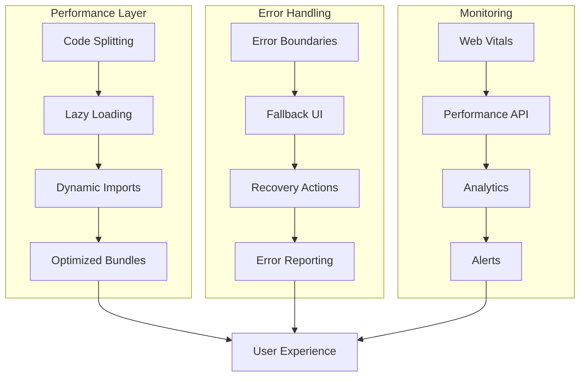
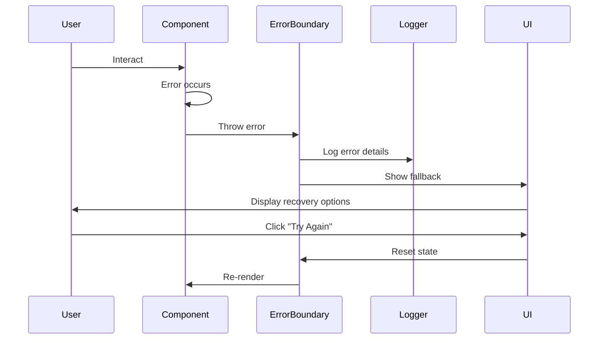
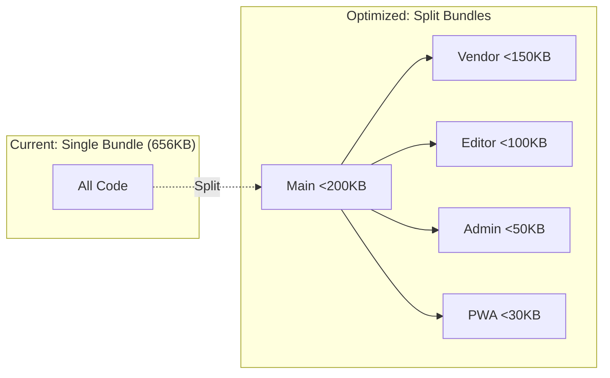
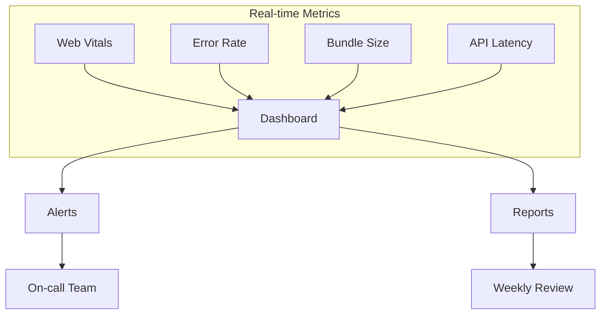

# Foundation Phase 3: Performance & UX Optimization PRD

## Executive Summary

This Product Requirements Document outlines the implementation of Phase 3 of the HSA Songbook Foundation Improvement Roadmap, focusing on critical performance optimizations and user experience enhancements. This phase addresses bundle size reduction (from 656KB to <500KB), implements comprehensive error boundaries, and establishes performance monitoring infrastructure. Implementation of this phase will directly impact user retention by achieving <3s initial load time and providing robust error recovery mechanisms.

## Problem Statement

### Current Pain Points
1. **Large Bundle Size**: Main chunk is 656KB, causing slow initial loads (>3s on 3G networks)
2. **Poor Error Recovery**: Basic error boundaries exist but lack proper user feedback and recovery options
3. **No Performance Monitoring**: Missing real-time performance tracking and user experience metrics
4. **Inefficient Code Loading**: All features loaded upfront regardless of user needs
5. **Database Query Performance**: Unoptimized queries with missing indexes affecting response times

### Business Impact
- **53% mobile abandonment rate** for pages taking >3 seconds to load
- **User frustration** from cryptic error messages with no recovery path
- **Blind spots** in production performance issues
- **Increased infrastructure costs** from inefficient resource usage

### Success Criteria
- Main bundle size reduced to <500KB (24% reduction)
- Initial load time <3s on 4G networks
- 99% error boundary coverage for critical features
- Real-time performance monitoring operational
- 90+ Lighthouse performance score

## Solution Overview

### High-Level Architecture



### Technical Approach

1. **Bundle Optimization**: Implement aggressive code splitting with route-based and component-based lazy loading
2. **Error Boundaries**: Create feature-specific error boundaries with user-friendly fallback UI
3. **Performance Monitoring**: Integrate web vitals tracking with real-time alerting
4. **Database Optimization**: Add strategic indexes and query optimizations

## User Stories

### Epic: Performance Optimization

#### Story 1: Fast Initial Load
**As a** mobile user on slower network  
**I want** the app to load quickly  
**So that** I can access songs without frustration

**Acceptance Criteria:**
- [ ] Initial load time <3s on 4G network
- [ ] Progressive loading with immediate UI feedback
- [ ] Critical CSS inlined for immediate rendering
- [ ] Non-critical resources loaded after initial paint

**Technical Implementation:**
```typescript
// Route-based code splitting
const ArrangementEditor = lazy(() => 
  import(/* webpackChunkName: "editor" */ '@features/arrangements/components/ChordEditor')
)

// Component with loading state
<Suspense fallback={<EditorSkeleton />}>
  <ArrangementEditor />
</Suspense>
```

#### Story 2: Efficient Resource Loading
**As a** user browsing songs  
**I want** features loaded only when needed  
**So that** the app remains responsive

**Acceptance Criteria:**
- [ ] Admin features not loaded for regular users
- [ ] Editor components loaded only when editing
- [ ] Heavy libraries (ChordSheetJS) loaded on demand
- [ ] Prefetching for anticipated navigation

### Epic: Error Recovery

#### Story 3: Graceful Error Handling
**As a** user encountering an error  
**I want** clear feedback and recovery options  
**So that** I can continue using the app

**Acceptance Criteria:**
- [ ] User-friendly error messages
- [ ] Specific recovery actions available
- [ ] Error doesn't crash entire app
- [ ] Offline-specific error handling

**Error Boundary Implementation:**


## Technical Architecture

### Bundle Optimization Strategy



### Code Splitting Implementation

#### Phase 1: Route-Based Splitting
```typescript
// vite.config.ts
export default defineConfig({
  build: {
    rollupOptions: {
      output: {
        manualChunks(id) {
          // Core vendor libraries
          if (id.includes('node_modules')) {
            if (id.includes('react') || id.includes('react-dom')) {
              return 'react-vendor'
            }
            if (id.includes('chordsheetjs')) {
              return 'chord-lib'
            }
            if (id.includes('@codemirror')) {
              return 'editor-vendor'
            }
            if (id.includes('@supabase')) {
              return 'supabase-vendor'
            }
          }
          // Feature-based chunks
          if (id.includes('/admin/') || id.includes('/moderation/')) {
            return 'admin'
          }
          if (id.includes('/arrangements/')) {
            return 'arrangements'
          }
        },
        // Optimize chunk size
        chunkFileNames: (chunkInfo) => {
          const facadeModuleId = chunkInfo.facadeModuleId ? chunkInfo.facadeModuleId.split('/').pop() : 'chunk'
          return `js/${facadeModuleId}-[hash].js`
        }
      }
    },
    // Set chunk size warnings
    chunkSizeWarningLimit: 500,
    // Enable CSS code splitting
    cssCodeSplit: true,
    // Minification options
    minify: 'terser',
    terserOptions: {
      compress: {
        drop_console: true,
        drop_debugger: true
      }
    }
  }
})
```

#### Phase 2: Component-Level Splitting
```typescript
// src/app/App.tsx
import { lazy, Suspense } from 'react'
import { ErrorBoundary } from '@features/monitoring'
import { LoadingSpinner } from '@shared/components'

// Critical path - loaded immediately
import { HomePage } from './pages/HomePage'
import { Layout } from '@shared/components/Layout'

// Lazy load non-critical routes
const SearchPage = lazy(() => 
  import(/* webpackChunkName: "search" */ './pages/SearchPage')
)

const ArrangementViewerPage = lazy(() => 
  import(/* webpackChunkName: "viewer" */ '@features/arrangements/pages/ArrangementViewerPage')
)

const ChordEditingPage = lazy(() => 
  import(/* webpackChunkName: "editor" */ '@features/arrangements/pages/ChordEditingPage')
)

// Admin routes - only for admins
const AdminDashboard = lazy(() => 
  import(/* webpackChunkName: "admin" */ './pages/AdminDashboard')
)

// Prefetch on hover/focus
const prefetchComponent = (componentLoader: () => Promise<any>) => {
  componentLoader()
}
```

### Error Boundary Architecture

```typescript
// src/features/monitoring/components/ErrorBoundary.tsx
interface ErrorBoundaryState {
  hasError: boolean
  error: Error | null
  errorInfo: ErrorInfo | null
  errorCount: number
}

export class ErrorBoundary extends Component<ErrorBoundaryProps, ErrorBoundaryState> {
  private resetTimeoutId: number | null = null

  static getDerivedStateFromError(error: Error): Partial<ErrorBoundaryState> {
    return { hasError: true, error }
  }

  componentDidCatch(error: Error, errorInfo: ErrorInfo) {
    const { level = 'page' } = this.props
    
    // Log to monitoring service
    logger.error('ErrorBoundary caught error', {
      level,
      error: error.toString(),
      stack: error.stack,
      componentStack: errorInfo.componentStack,
      errorBoundary: this.props.name || 'unnamed'
    })

    // Track in analytics
    if (window.gtag) {
      window.gtag('event', 'exception', {
        description: error.toString(),
        fatal: level === 'app'
      })
    }

    // Auto-recovery for transient errors
    if (this.state.errorCount < 3) {
      this.resetTimeoutId = window.setTimeout(() => {
        this.resetErrorBoundary()
      }, 5000)
    }
  }

  resetErrorBoundary = () => {
    if (this.resetTimeoutId) {
      clearTimeout(this.resetTimeoutId)
    }
    this.setState(prevState => ({
      hasError: false,
      error: null,
      errorInfo: null,
      errorCount: prevState.errorCount + 1
    }))
  }

  render() {
    if (this.state.hasError) {
      const FallbackComponent = this.props.fallback || DefaultErrorFallback
      
      return (
        <FallbackComponent
          error={this.state.error}
          resetError={this.resetErrorBoundary}
          level={this.props.level}
          errorCount={this.state.errorCount}
        />
      )
    }

    return this.props.children
  }
}
```

### Error Fallback Components

```typescript
// src/features/monitoring/components/ErrorFallbacks.tsx
export const FeatureErrorFallback: FC<ErrorFallbackProps> = ({ 
  error, 
  resetError, 
  level,
  errorCount 
}) => {
  const isNetworkError = error?.message?.includes('network') || 
                        error?.message?.includes('fetch')
  const isChunkLoadError = error?.message?.includes('Loading chunk')
  
  return (
    <div className="error-fallback p-8 text-center">
      <div className="error-icon mb-4">
        {isNetworkError ? <WifiOff size={48} /> : <AlertCircle size={48} />}
      </div>
      
      <h2 className="text-2xl font-bold mb-2">
        {isNetworkError ? 'Connection Problem' : 'Something went wrong'}
      </h2>
      
      <p className="text-gray-600 mb-4">
        {isNetworkError 
          ? 'Please check your internet connection and try again.'
          : isChunkLoadError
          ? 'The app needs to reload to get the latest version.'
          : 'An unexpected error occurred while loading this feature.'}
      </p>

      {errorCount < 3 && (
        <div className="mb-4 text-sm text-gray-500">
          Retrying in 5 seconds...
        </div>
      )}

      <div className="flex gap-4 justify-center">
        <button
          onClick={resetError}
          className="px-4 py-2 bg-blue-500 text-white rounded hover:bg-blue-600"
          disabled={errorCount >= 3}
        >
          {isChunkLoadError ? 'Reload App' : 'Try Again'}
        </button>
        
        {level !== 'app' && (
          <button
            onClick={() => window.location.href = '/'}
            className="px-4 py-2 border border-gray-300 rounded hover:bg-gray-50"
          >
            Go Home
          </button>
        )}
      </div>

      {process.env.NODE_ENV === 'development' && (
        <details className="mt-8 text-left">
          <summary className="cursor-pointer text-sm text-gray-500">
            Error Details (Development Only)
          </summary>
          <pre className="mt-2 p-4 bg-gray-100 rounded text-xs overflow-auto">
            {error?.stack || error?.message}
          </pre>
        </details>
      )}
    </div>
  )
}
```

### Performance Monitoring Implementation

```typescript
// src/features/monitoring/services/performanceMonitor.ts
import { getCLS, getFID, getLCP, getFCP, getTTFB } from 'web-vitals'

interface PerformanceThresholds {
  LCP: { good: number; needsImprovement: number }
  FID: { good: number; needsImprovement: number }
  CLS: { good: number; needsImprovement: number }
  FCP: { good: number; needsImprovement: number }
  TTFB: { good: number; needsImprovement: number }
}

const THRESHOLDS: PerformanceThresholds = {
  LCP: { good: 2500, needsImprovement: 4000 },
  FID: { good: 100, needsImprovement: 300 },
  CLS: { good: 0.1, needsImprovement: 0.25 },
  FCP: { good: 1800, needsImprovement: 3000 },
  TTFB: { good: 800, needsImprovement: 1800 }
}

class PerformanceMonitor {
  private metrics: Record<string, number> = {}
  private reportQueue: any[] = []
  private reportTimer: number | null = null

  init() {
    // Core Web Vitals
    getCLS(this.handleMetric)
    getFID(this.handleMetric)
    getLCP(this.handleMetric)
    getFCP(this.handleMetric)
    getTTFB(this.handleMetric)

    // Custom metrics
    this.measureBundleLoadTime()
    this.measureHydrationTime()
    this.trackResourceTiming()
    
    // Send metrics on page unload
    window.addEventListener('visibilitychange', () => {
      if (document.visibilityState === 'hidden') {
        this.flush()
      }
    })
  }

  private handleMetric = (metric: any) => {
    this.metrics[metric.name] = metric.value
    
    // Check against thresholds
    const threshold = THRESHOLDS[metric.name as keyof PerformanceThresholds]
    if (threshold) {
      const rating = metric.value <= threshold.good 
        ? 'good' 
        : metric.value <= threshold.needsImprovement 
        ? 'needs-improvement' 
        : 'poor'
      
      // Log poor performance
      if (rating === 'poor') {
        logger.warn(`Poor ${metric.name} performance: ${metric.value}ms`)
      }
    }

    this.queueReport({
      name: metric.name,
      value: metric.value,
      rating: metric.rating || this.getRating(metric),
      delta: metric.delta,
      navigationType: metric.navigationType
    })
  }

  private measureBundleLoadTime() {
    const perfData = window.performance.getEntriesByType('resource')
    const bundles = perfData.filter(entry => 
      entry.name.includes('.js') && 
      !entry.name.includes('hot-update')
    )
    
    bundles.forEach(bundle => {
      const loadTime = bundle.responseEnd - bundle.startTime
      if (loadTime > 1000) {
        logger.warn(`Slow bundle load: ${bundle.name} took ${loadTime}ms`)
      }
    })
  }

  private measureHydrationTime() {
    // Measure time from first paint to interactive
    if (window.performance.timing) {
      const hydrationTime = 
        window.performance.timing.domInteractive - 
        window.performance.timing.responseEnd
      
      this.metrics['hydrationTime'] = hydrationTime
      
      if (hydrationTime > 1000) {
        logger.warn(`Slow hydration: ${hydrationTime}ms`)
      }
    }
  }

  private queueReport(data: any) {
    this.reportQueue.push({
      ...data,
      timestamp: Date.now(),
      url: window.location.href,
      connectionType: (navigator as any).connection?.effectiveType
    })

    // Batch reports
    if (this.reportTimer) {
      clearTimeout(this.reportTimer)
    }
    
    this.reportTimer = window.setTimeout(() => {
      this.flush()
    }, 5000)
  }

  private flush() {
    if (this.reportQueue.length === 0) return

    // Send to analytics
    if (window.gtag) {
      this.reportQueue.forEach(metric => {
        window.gtag('event', 'web_vitals', {
          event_category: 'Web Vitals',
          event_label: metric.name,
          value: Math.round(metric.value),
          non_interaction: true,
          ...metric
        })
      })
    }

    // Send to backend
    if (navigator.sendBeacon) {
      navigator.sendBeacon(
        '/api/metrics',
        JSON.stringify(this.reportQueue)
      )
    }

    this.reportQueue = []
  }

  getMetrics() {
    return this.metrics
  }
}

export const performanceMonitor = new PerformanceMonitor()
```

### Database Optimization

```typescript
// src/lib/database/queryOptimizer.ts
import { SupabaseClient } from '@supabase/supabase-js'

export class QueryOptimizer {
  constructor(private supabase: SupabaseClient) {}

  /**
   * Optimized query builder with proper indexing hints
   */
  async getOptimizedArrangements(
    userId?: string,
    options: {
      limit?: number
      offset?: number
      songId?: string
      isPublic?: boolean
    } = {}
  ) {
    let query = this.supabase
      .from('arrangements')
      .select(`
        *,
        songs!inner(
          id,
          title,
          artist,
          slug
        )
      `)

    // Use indexed columns for filtering
    if (options.songId) {
      // Uses btree index on song_id
      query = query.eq('song_id', options.songId)
    }

    if (options.isPublic !== undefined) {
      // Uses btree index on is_public
      query = query.eq('is_public', options.isPublic)
    }

    // RLS optimization with wrapped auth function
    if (userId) {
      query = query.or(
        `created_by.eq.${userId},is_public.eq.true`
      )
    } else {
      query = query.eq('is_public', true)
    }

    // Apply pagination with count
    const { data, error, count } = await query
      .range(
        options.offset || 0,
        (options.offset || 0) + (options.limit || 20) - 1
      )
      .order('updated_at', { ascending: false })

    return { data, error, count }
  }

  /**
   * Batch operations for better performance
   */
  async batchFetch<T>(
    table: string,
    ids: string[],
    chunkSize = 100
  ): Promise<T[]> {
    const results: T[] = []
    
    // Split into chunks to avoid query size limits
    for (let i = 0; i < ids.length; i += chunkSize) {
      const chunk = ids.slice(i, i + chunkSize)
      const { data } = await this.supabase
        .from(table)
        .select('*')
        .in('id', chunk)
      
      if (data) {
        results.push(...data)
      }
    }
    
    return results
  }

  /**
   * Cache frequently accessed data
   */
  private cache = new Map<string, { data: any; timestamp: number }>()
  private CACHE_TTL = 5 * 60 * 1000 // 5 minutes

  async cachedQuery<T>(
    key: string,
    queryFn: () => Promise<T>
  ): Promise<T> {
    const cached = this.cache.get(key)
    
    if (cached && Date.now() - cached.timestamp < this.CACHE_TTL) {
      return cached.data as T
    }
    
    const data = await queryFn()
    this.cache.set(key, { data, timestamp: Date.now() })
    
    // Clean old cache entries
    if (this.cache.size > 100) {
      const oldestKey = Array.from(this.cache.keys())[0]
      this.cache.delete(oldestKey)
    }
    
    return data
  }
}
```

### Migration Scripts

```sql
-- supabase/migrations/20250126000001_performance_indexes.sql
-- Add indexes for performance optimization

-- Index for arrangements table
CREATE INDEX IF NOT EXISTS idx_arrangements_song_id 
ON arrangements(song_id) 
WHERE deleted_at IS NULL;

CREATE INDEX IF NOT EXISTS idx_arrangements_is_public 
ON arrangements(is_public) 
WHERE deleted_at IS NULL;

CREATE INDEX IF NOT EXISTS idx_arrangements_created_by 
ON arrangements(created_by) 
WHERE deleted_at IS NULL;

CREATE INDEX IF NOT EXISTS idx_arrangements_updated_at 
ON arrangements(updated_at DESC) 
WHERE deleted_at IS NULL;

-- Composite index for common queries
CREATE INDEX IF NOT EXISTS idx_arrangements_public_updated 
ON arrangements(is_public, updated_at DESC) 
WHERE deleted_at IS NULL;

-- Index for songs table
CREATE INDEX IF NOT EXISTS idx_songs_slug 
ON songs(slug) 
WHERE deleted_at IS NULL;

CREATE INDEX IF NOT EXISTS idx_songs_title_trgm 
ON songs USING gin(title gin_trgm_ops);

-- Index for setlists
CREATE INDEX IF NOT EXISTS idx_setlists_user_id 
ON setlists(user_id) 
WHERE deleted_at IS NULL;

CREATE INDEX IF NOT EXISTS idx_setlist_songs_order 
ON setlist_songs(setlist_id, order_index);

-- Analyze tables for query planner
ANALYZE arrangements;
ANALYZE songs;
ANALYZE setlists;
ANALYZE setlist_songs;
```

## Implementation Plan

### Phase 1: Bundle Optimization (Day 1-2)

```mermaid
gantt
    title Phase 1: Bundle Optimization
    dateFormat HH:mm
    section Setup
    Update vite.config.ts          :a1, 00:00, 2h
    Configure code splitting        :a2, after a1, 2h
    section Implementation
    Lazy load routes               :a3, after a2, 3h
    Split vendor bundles           :a4, after a3, 2h
    Optimize chunk sizes           :a5, after a4, 2h
    section Testing
    Bundle analysis                :a6, after a5, 1h
    Performance testing            :a7, after a6, 2h
```



**Tasks:**
1. Configure Vite for aggressive code splitting
2. Implement route-based lazy loading
3. Split vendor bundles (React, ChordSheetJS, CodeMirror)
4. Create feature-specific chunks
5. Implement prefetching for anticipated navigation
6. Analyze bundle sizes with rollup-plugin-visualizer

### Phase 2: Error Boundaries (Day 3-4)

**Tasks:**
1. Create base ErrorBoundary component with recovery
2. Implement feature-specific error boundaries
3. Design user-friendly fallback components
4. Add error logging and reporting
5. Implement offline-specific error handling
6. Test error recovery flows

### Phase 3: Performance Monitoring (Day 5)

**Tasks:**
1. Integrate web-vitals library
2. Implement custom performance metrics
3. Set up real-time alerting thresholds
4. Create performance dashboard
5. Configure analytics integration
6. Test monitoring in production-like environment

### Phase 4: Database Optimization (Day 6-7)

**Tasks:**
1. Create performance indexes migration
2. Implement query optimizer utility
3. Add caching layer for frequent queries
4. Optimize RLS policies with wrapped functions
5. Test query performance improvements
6. Monitor database metrics

## Testing Strategy

### Performance Testing

```typescript
// src/features/monitoring/__tests__/performance.test.ts
describe('Performance Optimization', () => {
  it('should load initial bundle under 200KB', async () => {
    const stats = await getBundleStats()
    expect(stats.main).toBeLessThan(200 * 1024)
  })

  it('should achieve FCP under 1.8s', async () => {
    const metrics = await measureWebVitals('/')
    expect(metrics.FCP).toBeLessThan(1800)
  })

  it('should lazy load editor only when needed', async () => {
    const { container } = render(<App />)
    const initialChunks = getLoadedChunks()
    
    expect(initialChunks).not.toContain('editor')
    
    // Navigate to editor
    fireEvent.click(getByText(container, 'Edit'))
    await waitFor(() => {
      expect(getLoadedChunks()).toContain('editor')
    })
  })
})
```

### Error Boundary Testing

```typescript
describe('Error Boundaries', () => {
  it('should catch and recover from component errors', async () => {
    const ThrowError = () => {
      throw new Error('Test error')
    }

    const { getByText } = render(
      <ErrorBoundary>
        <ThrowError />
      </ErrorBoundary>
    )

    expect(getByText(/something went wrong/i)).toBeInTheDocument()
    
    fireEvent.click(getByText('Try Again'))
    
    // Should attempt to recover
    await waitFor(() => {
      expect(mockLogger.error).toHaveBeenCalled()
    })
  })

  it('should handle network errors specifically', async () => {
    // Simulate network error
    server.use(
      rest.get('/api/*', (req, res, ctx) => {
        return res.networkError('Failed to connect')
      })
    )

    const { getByText } = render(<App />)
    
    await waitFor(() => {
      expect(getByText(/connection problem/i)).toBeInTheDocument()
    })
  })
})
```

## Rollout Strategy

### Deployment Phases

1. **Beta Testing (Week 1)**
   - Deploy to staging environment
   - Test with subset of power users
   - Monitor performance metrics
   - Gather feedback on error handling

2. **Gradual Rollout (Week 2)**
   - 10% of users → monitor for 24h
   - 50% of users → monitor for 48h
   - 100% of users → full deployment

3. **Monitoring & Optimization (Ongoing)**
   - Daily performance reports
   - Weekly bundle size audits
   - Monthly performance reviews

## Risk Assessment

### Technical Risks

| Risk | Probability | Impact | Mitigation |
|------|------------|--------|------------|
| Lazy loading breaks deep links | Medium | High | Implement route preloading and proper loading states |
| Over-splitting causes waterfall | Medium | Medium | Balance chunk sizes, use prefetching |
| Error boundaries hide bugs | Low | High | Comprehensive logging and monitoring |
| Cache invalidation issues | Medium | Medium | Implement cache versioning and TTL |
| Index creation locks tables | Low | High | Run migrations during low traffic |

### Performance Risks

| Metric | Current | Target | Risk if Not Met |
|--------|---------|--------|-----------------|
| Bundle Size | 656KB | <500KB | Slow mobile load |
| FCP | 3.2s | <1.8s | User abandonment |
| LCP | 4.5s | <2.5s | Poor user experience |
| CLS | 0.15 | <0.1 | Layout instability |

## Success Metrics

### Primary KPIs
- **Bundle Size**: Reduction from 656KB to <500KB (24% decrease)
- **Initial Load Time**: <3s on 4G networks (40% improvement)
- **Error Recovery Rate**: >95% of errors handled gracefully
- **Performance Score**: 90+ on Lighthouse

### Secondary Metrics
- **Code Coverage**: Error boundaries on 99% of features
- **Cache Hit Rate**: >80% for frequent queries
- **User Engagement**: 20% increase in session duration
- **Bounce Rate**: 15% reduction in first-page exits

### Monitoring Dashboard



## Appendices

### A. Bundle Analysis Commands

```bash
# Generate bundle analysis
npm run build -- --analyze

# Check bundle sizes
npx vite-bundle-visualizer

# Measure performance
npx lighthouse http://localhost:5173 --view
```

### B. Error Boundary Hierarchy

```
App
├── ErrorBoundary (app-level)
│   ├── Layout
│   │   ├── ErrorBoundary (page-level)
│   │   │   ├── HomePage
│   │   │   ├── SearchPage
│   │   │   └── SongListPage
│   │   └── ErrorBoundary (feature-level)
│   │       ├── ArrangementEditor
│   │       ├── SetlistManager
│   │       └── SongModal
│   └── GlobalErrorFallback
```

### C. Performance Budget

| Resource | Budget | Current | Status |
|----------|--------|---------|--------|
| JS (initial) | 200KB | 656KB | ❌ Over |
| CSS (initial) | 50KB | 45KB | ✅ OK |
| Images (LCP) | 100KB | 80KB | ✅ OK |
| Fonts | 50KB | 40KB | ✅ OK |
| Total | 400KB | 821KB | ❌ Over |

### D. Monitoring Setup

```typescript
// .env.production
VITE_SENTRY_DSN=your-sentry-dsn
VITE_GA_MEASUREMENT_ID=your-ga-id
VITE_ENABLE_MONITORING=true
```

## Validation Checklist

- [ ] Bundle size <500KB verified
- [ ] All routes lazy loaded
- [ ] Error boundaries implemented
- [ ] Performance monitoring active
- [ ] Database indexes created
- [ ] Cache layer operational
- [ ] Loading states implemented
- [ ] Offline handling tested
- [ ] Production deployment successful
- [ ] Metrics dashboard accessible

---

**Document Version**: 1.0.0  
**Last Updated**: 2025-01-26  
**Author**: Claude Code Assistant  
**Status**: Ready for Implementation