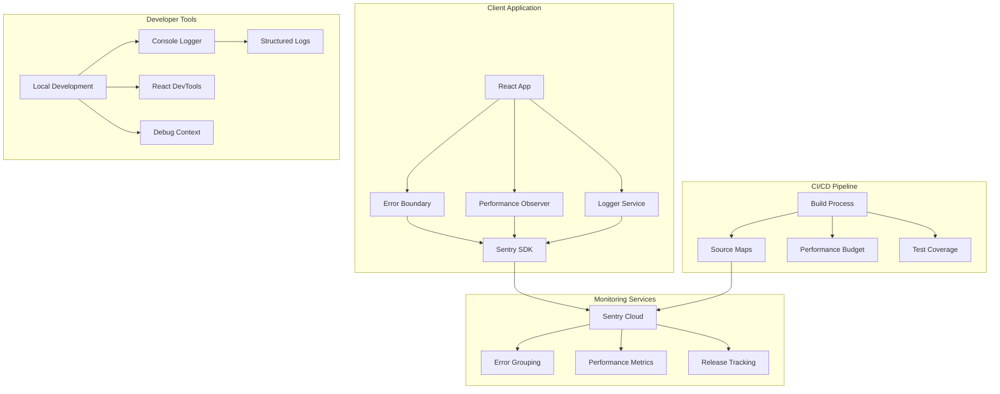
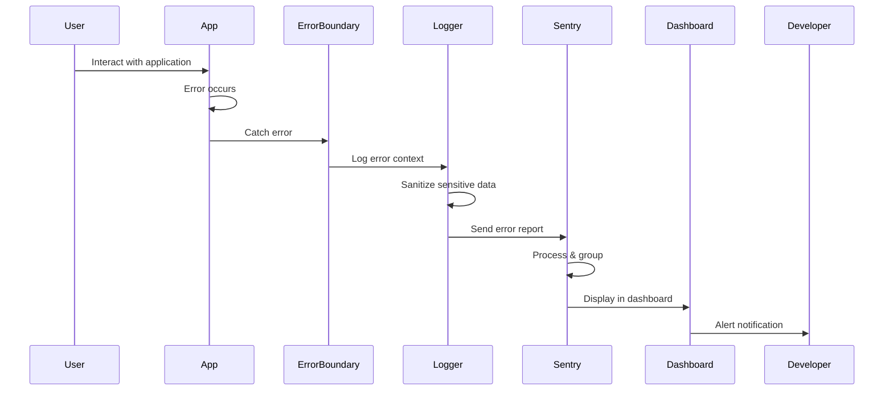
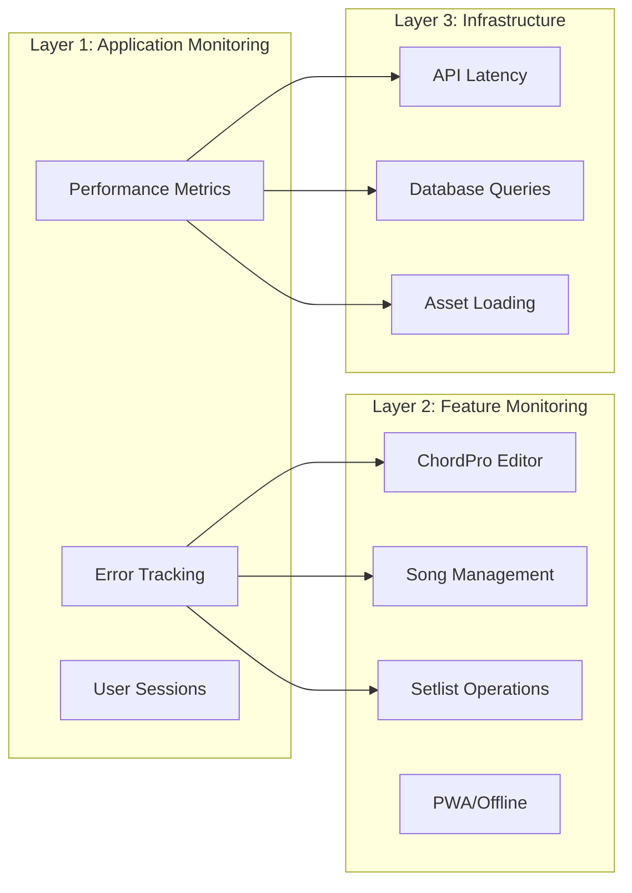

# Foundation Phase 4: Monitoring & Observability System - Planning PRD

## Executive Summary

This PRD outlines the implementation of a comprehensive monitoring and observability system for the HSA Songbook application as part of Phase 4 of the Foundation Improvement Roadmap. The focus is on establishing production-grade error tracking, performance monitoring, and developer tools that will improve the development workflow and ensure application reliability. This implementation follows the 80/20 principle - implementing 20% of monitoring features that will catch 80% of issues.

## Problem & Solution

### Current Problems

1. **Blind Production Operations**
   - No visibility into production errors beyond console logs
   - Unable to track user experience issues
   - No alerting system for critical failures
   - Missing performance degradation detection

2. **Incomplete Developer Tools**
   - Logger implementation has TODO for production monitoring (line 61)
   - Web vitals collected but not reported anywhere
   - No structured error tracking or categorization
   - Missing performance profiling capabilities

3. **Lack of User Experience Insights**
   - No tracking of actual user interactions
   - Unable to identify problematic user flows
   - Missing data on feature adoption
   - No visibility into offline/PWA usage patterns

### Proposed Solution

Implement a three-tier monitoring system:

1. **Error Tracking & Debugging** (Sentry integration)
2. **Performance Monitoring** (Web Vitals + Custom Metrics)
3. **Developer Experience Tools** (Enhanced logging, debugging utilities)

## User Stories

### Epic: Production Monitoring & Observability

#### Story 1: Error Tracking for Developers
**As a** developer  
**I want** automatic error tracking in production  
**So that** I can quickly identify and fix issues affecting users

**Acceptance Criteria:**
- [ ] All unhandled errors are captured automatically
- [ ] Error reports include stack traces, user context, and breadcrumbs
- [ ] Errors are grouped by similarity for easier triage
- [ ] Source maps work correctly for meaningful stack traces
- [ ] Sensitive data is scrubbed from error reports

**Technical Notes:**
- Integrate Sentry SDK with React Error Boundaries
- Configure source map upload in build pipeline
- Implement custom error scrubbing rules

#### Story 2: Performance Monitoring for Users
**As a** user  
**I want** the application to load and respond quickly  
**So that** I can efficiently manage my songs and setlists

**Acceptance Criteria:**
- [ ] Core Web Vitals tracked for all pages
- [ ] Custom performance metrics for critical user paths
- [ ] Performance budgets enforced in CI/CD
- [ ] Slow API calls and database queries identified
- [ ] Performance regression alerts configured

**Technical Notes:**
- Leverage existing useWebVitals hook
- Add custom transaction tracking
- Implement performance budget validation

#### Story 3: Integration Testing for QA
**As a** QA engineer  
**I want** comprehensive integration tests  
**So that** I can verify critical user flows work correctly

**Acceptance Criteria:**
- [ ] Integration tests for authentication flow
- [ ] Tests for public/private content access
- [ ] Offline mode synchronization tests
- [ ] Permission system validation tests
- [ ] Test coverage report generation

**Technical Notes:**
- Use Vitest for integration testing
- Mock Supabase client for offline testing
- Generate coverage reports with c8

#### Story 4: Developer Debugging Tools
**As a** developer  
**I want** enhanced debugging capabilities  
**So that** I can efficiently troubleshoot issues

**Acceptance Criteria:**
- [ ] Structured logging with log levels
- [ ] Debug mode with verbose output
- [ ] Performance profiling tools
- [ ] Network request inspection
- [ ] State debugging utilities

**Technical Notes:**
- Enhance existing logger.ts implementation
- Add React DevTools profiling integration
- Implement debug context providers

## Technical Architecture

### System Components Diagram



### Data Flow Diagram



### Monitoring Layers Architecture



## API Specifications

### Logger Service Enhancement

```typescript
// src/lib/logger.ts - Enhanced implementation
interface LogContext {
  component?: string;
  action?: string;
  userId?: string;
  metadata?: Record<string, unknown>;
}

interface MonitoringConfig {
  dsn: string;
  environment: 'development' | 'staging' | 'production';
  sampleRate: number;
  tracesSampleRate: number;
}

class EnhancedLogger {
  private sentry: typeof Sentry | null = null;
  
  initialize(config: MonitoringConfig): void {
    if (import.meta.env.PROD) {
      this.sentry = Sentry;
      this.sentry.init({
        dsn: config.dsn,
        environment: config.environment,
        integrations: [
          new Sentry.BrowserTracing(),
          new Sentry.Replay()
        ],
        tracesSampleRate: config.tracesSampleRate,
        replaysSessionSampleRate: 0.1,
        replaysOnErrorSampleRate: 1.0,
      });
    }
  }
  
  error(message: string, error?: Error, context?: LogContext): void {
    // Development logging
    if (import.meta.env.DEV) {
      console.error(message, error, context);
    }
    
    // Production monitoring
    if (import.meta.env.PROD && this.sentry) {
      this.sentry.captureException(error || new Error(message), {
        level: 'error',
        tags: {
          component: context?.component,
          action: context?.action,
        },
        extra: context?.metadata,
        user: context?.userId ? { id: context.userId } : undefined,
      });
    }
  }
  
  metric(name: string, value: number, unit: string): void {
    if (this.sentry) {
      // Custom metric tracking
      this.sentry.metrics.gauge(name, value, { unit });
    }
  }
}

export const logger = new EnhancedLogger();
```

### Performance Service API

```typescript
// src/features/monitoring/services/performanceService.ts
interface PerformanceMetric {
  name: string;
  value: number;
  rating: 'good' | 'needs-improvement' | 'poor';
  attribution?: Record<string, unknown>;
}

interface PerformanceTransaction {
  name: string;
  operation: string;
  startTime: number;
  endTime?: number;
  status: 'ok' | 'error' | 'cancelled';
}

class PerformanceService {
  private transactions = new Map<string, PerformanceTransaction>();
  
  startTransaction(name: string, operation: string): string {
    const id = crypto.randomUUID();
    this.transactions.set(id, {
      name,
      operation,
      startTime: performance.now(),
      status: 'ok'
    });
    return id;
  }
  
  endTransaction(id: string, status: 'ok' | 'error' = 'ok'): void {
    const transaction = this.transactions.get(id);
    if (transaction) {
      transaction.endTime = performance.now();
      transaction.status = status;
      this.reportTransaction(transaction);
      this.transactions.delete(id);
    }
  }
  
  reportMetric(metric: Metric): void {
    const rating = this.getRating(metric);
    logger.metric(`web-vitals.${metric.name}`, metric.value, 'ms');
    
    if (rating === 'poor') {
      logger.warn(`Poor ${metric.name} performance`, {
        component: 'web-vitals',
        metadata: { metric, rating }
      });
    }
  }
  
  private getRating(metric: Metric): 'good' | 'needs-improvement' | 'poor' {
    // Based on Web Vitals thresholds
    const thresholds: Record<string, [number, number]> = {
      'CLS': [0.1, 0.25],
      'INP': [200, 500],
      'LCP': [2500, 4000],
      'FCP': [1800, 3000],
      'TTFB': [800, 1800]
    };
    
    const [good, poor] = thresholds[metric.name] || [0, Infinity];
    if (metric.value <= good) return 'good';
    if (metric.value <= poor) return 'needs-improvement';
    return 'poor';
  }
}

export const performanceService = new PerformanceService();
```

### Error Boundary Enhancement

```typescript
// src/features/monitoring/components/ErrorBoundary.tsx
interface ErrorInfo {
  componentStack: string;
  digest?: string;
}

interface ErrorBoundaryState {
  hasError: boolean;
  error: Error | null;
  errorInfo: ErrorInfo | null;
  errorBoundaryKey: number;
}

export class MonitoredErrorBoundary extends Component<Props, ErrorBoundaryState> {
  static getDerivedStateFromError(error: Error): Partial<ErrorBoundaryState> {
    return { hasError: true, error };
  }
  
  componentDidCatch(error: Error, errorInfo: ErrorInfo): void {
    const { level = 'app' } = this.props;
    
    logger.error(`Error in ${level} boundary`, error, {
      component: 'ErrorBoundary',
      action: 'componentDidCatch',
      metadata: {
        level,
        componentStack: errorInfo.componentStack,
        digest: errorInfo.digest
      }
    });
    
    // Track error boundary triggers as custom metric
    performanceService.reportCustomMetric('error-boundary-triggered', 1, {
      level,
      errorName: error.name
    });
  }
  
  handleReset = (): void => {
    this.setState(prevState => ({
      hasError: false,
      error: null,
      errorInfo: null,
      errorBoundaryKey: prevState.errorBoundaryKey + 1
    }));
  };
  
  render() {
    if (this.state.hasError) {
      return (
        <ErrorFallback
          error={this.state.error}
          resetError={this.handleReset}
          level={this.props.level}
        />
      );
    }
    
    return this.props.children;
  }
}
```

## Data Models

### Monitoring Event Schema

```typescript
interface MonitoringEvent {
  id: string;
  timestamp: string;
  type: 'error' | 'performance' | 'custom';
  level: 'debug' | 'info' | 'warning' | 'error' | 'critical';
  message: string;
  
  // Context
  environment: 'development' | 'staging' | 'production';
  release?: string;
  userId?: string;
  sessionId: string;
  
  // Error specific
  error?: {
    name: string;
    message: string;
    stack?: string;
    cause?: unknown;
  };
  
  // Performance specific
  performance?: {
    metric: string;
    value: number;
    unit: string;
    rating?: 'good' | 'needs-improvement' | 'poor';
  };
  
  // Metadata
  tags: Record<string, string>;
  extra: Record<string, unknown>;
  breadcrumbs: Array<{
    timestamp: string;
    type: string;
    category: string;
    message: string;
    data?: Record<string, unknown>;
  }>;
}
```

### Performance Budget Configuration

```typescript
interface PerformanceBudget {
  metrics: {
    // Core Web Vitals
    lcp: { warning: number; error: number };  // Largest Contentful Paint
    inp: { warning: number; error: number };  // Interaction to Next Paint
    cls: { warning: number; error: number };  // Cumulative Layout Shift
    
    // Additional metrics
    fcp: { warning: number; error: number };  // First Contentful Paint
    ttfb: { warning: number; error: number }; // Time to First Byte
    
    // Custom metrics
    bundleSize: { warning: number; error: number }; // KB
    jsExecutionTime: { warning: number; error: number }; // ms
  };
  
  // Feature-specific budgets
  features: {
    songLoad: { warning: number; error: number };
    chordProRender: { warning: number; error: number };
    searchResponse: { warning: number; error: number };
    setlistOperation: { warning: number; error: number };
  };
}

// Default budget configuration
const DEFAULT_BUDGET: PerformanceBudget = {
  metrics: {
    lcp: { warning: 2500, error: 4000 },
    inp: { warning: 200, error: 500 },
    cls: { warning: 0.1, error: 0.25 },
    fcp: { warning: 1800, error: 3000 },
    ttfb: { warning: 800, error: 1800 },
    bundleSize: { warning: 500, error: 750 },
    jsExecutionTime: { warning: 100, error: 200 }
  },
  features: {
    songLoad: { warning: 1000, error: 2000 },
    chordProRender: { warning: 500, error: 1000 },
    searchResponse: { warning: 300, error: 500 },
    setlistOperation: { warning: 200, error: 400 }
  }
};
```

## Implementation Phases

### Phase 4.1: Core Monitoring Infrastructure (Priority 1)

**Objectives:**
- Set up Sentry integration
- Implement enhanced logger service
- Configure error boundaries

**Tasks:**
1. Install and configure Sentry SDK
2. Update logger.ts with production monitoring
3. Enhance error boundaries with monitoring
4. Configure source map upload
5. Test error reporting flow

**Dependencies:**
- Sentry account setup
- Environment variables configuration

### Phase 4.2: Performance Monitoring (Priority 2)

**Objectives:**
- Implement web vitals reporting
- Add custom performance metrics
- Set up performance budgets

**Tasks:**
1. Complete performanceService implementation
2. Add transaction tracking to critical paths
3. Configure performance budget checks
4. Implement performance dashboard
5. Add performance regression tests

**Dependencies:**
- Phase 4.1 completion
- Metrics storage decision

### Phase 4.3: Integration Testing Suite (Priority 3)

**Objectives:**
- Create comprehensive integration tests
- Achieve 80% test coverage for critical paths
- Set up continuous testing

**Tasks:**
1. Write authentication flow tests
2. Create permission system tests
3. Implement offline mode tests
4. Add performance benchmark tests
5. Configure coverage reporting

**Dependencies:**
- Test data fixtures
- Mock service implementations

### Phase 4.4: Developer Experience Tools (Priority 4)

**Objectives:**
- Enhance debugging capabilities
- Improve development workflow
- Add monitoring dashboard

**Tasks:**
1. Create debug context provider
2. Add network request inspector
3. Implement state debugging tools
4. Create local monitoring dashboard
5. Add development mode helpers

**Dependencies:**
- Phase 4.1-4.3 completion
- Developer documentation

## Risks & Mitigations

### Technical Risks

| Risk | Impact | Probability | Mitigation |
|------|--------|------------|------------|
| Performance overhead from monitoring | High | Medium | Implement sampling rates, lazy load monitoring SDK |
| Sensitive data exposure in logs | High | Low | Implement data scrubbing, review all log points |
| Source map exposure | Medium | Low | Secure source map upload, use separate endpoint |
| Integration test flakiness | Medium | High | Use proper wait strategies, mock external services |
| Bundle size increase | Medium | Medium | Lazy load monitoring code, use dynamic imports |

### Implementation Risks

| Risk | Impact | Probability | Mitigation |
|------|--------|------------|------------|
| Scope creep | High | Medium | Stick to 80/20 principle, defer nice-to-haves |
| Breaking existing functionality | High | Low | Comprehensive testing, gradual rollout |
| Developer adoption | Medium | Medium | Good documentation, clear benefits demonstration |
| Cost of monitoring services | Low | Low | Use free tier initially, monitor usage |

## Success Metrics

### Quantitative Metrics

**Week 1 (After Phase 4.1):**
- ✅ 100% of production errors captured
- ✅ < 5% performance overhead from monitoring
- ✅ Source maps working for all errors
- ✅ Zero sensitive data in error reports

**Week 2 (After Phase 4.2):**
- ✅ All Core Web Vitals tracked
- ✅ 90% of transactions have performance data
- ✅ Performance budgets enforced in CI
- ✅ < 2s average page load time maintained

**Week 3 (After Phase 4.3):**
- ✅ 80% test coverage for critical paths
- ✅ All integration tests passing
- ✅ < 5 minute test execution time
- ✅ Zero flaky tests

**Week 4 (After Phase 4.4):**
- ✅ 100% of developers using debug tools
- ✅ 50% reduction in debugging time
- ✅ All production issues traceable
- ✅ < 1 hour mean time to resolution

### Qualitative Metrics

- **Developer Satisfaction**: Easier debugging and issue resolution
- **Code Quality**: Better error handling patterns adopted
- **User Experience**: Faster issue resolution, better performance
- **Team Confidence**: Increased confidence in deployments

## Implementation Checklist

### Pre-Implementation
- [ ] Sentry account created and configured
- [ ] Environment variables documented
- [ ] Team trained on monitoring tools
- [ ] Performance budgets agreed upon

### Phase 4.1: Core Monitoring
- [ ] Sentry SDK installed (`npm install @sentry/react`)
- [ ] Logger service enhanced with Sentry integration
- [ ] Error boundaries updated with monitoring
- [ ] Source map upload configured in build
- [ ] Test error reporting in staging

### Phase 4.2: Performance
- [ ] Performance service implemented
- [ ] Web vitals reporting to Sentry
- [ ] Custom metrics for critical paths
- [ ] Performance budget validation in CI
- [ ] Performance dashboard accessible

### Phase 4.3: Testing
- [ ] Integration test structure created
- [ ] Authentication tests written
- [ ] Permission tests written
- [ ] Offline mode tests written
- [ ] Coverage reporting configured

### Phase 4.4: Developer Tools
- [ ] Debug context provider created
- [ ] Network inspector implemented
- [ ] State debugging utilities added
- [ ] Local dashboard created
- [ ] Documentation written

### Post-Implementation
- [ ] Monitoring alerts configured
- [ ] Runbook for common issues created
- [ ] Team training completed
- [ ] Success metrics validated

## Example Implementation Code

### Sentry Initialization

```typescript
// src/app/main.tsx
import * as Sentry from '@sentry/react';
import { logger } from '@/lib/logger';

if (import.meta.env.PROD) {
  Sentry.init({
    dsn: import.meta.env.VITE_SENTRY_DSN,
    environment: import.meta.env.VITE_APP_ENV,
    integrations: [
      new Sentry.BrowserTracing({
        routingInstrumentation: Sentry.reactRouterV6Instrumentation(
          React.useEffect,
          useLocation,
          useNavigationType,
          createRoutesFromChildren,
          matchRoutes
        ),
      }),
      new Sentry.Replay({
        maskAllText: false,
        blockAllMedia: false,
      }),
    ],
    tracesSampleRate: 0.1,
    replaysSessionSampleRate: 0.1,
    replaysOnErrorSampleRate: 1.0,
    beforeSend(event) {
      // Scrub sensitive data
      if (event.request?.cookies) {
        delete event.request.cookies;
      }
      return event;
    },
  });
  
  logger.initialize({
    dsn: import.meta.env.VITE_SENTRY_DSN,
    environment: import.meta.env.VITE_APP_ENV,
    sampleRate: 1.0,
    tracesSampleRate: 0.1,
  });
}
```

### Performance Tracking Example

```typescript
// src/features/songs/services/songService.ts
import { performanceService } from '@features/monitoring';

export async function searchSongs(query: string): Promise<Song[]> {
  const transactionId = performanceService.startTransaction(
    'song-search',
    'search'
  );
  
  try {
    const startTime = performance.now();
    
    const { data, error } = await supabase
      .from('songs')
      .select('*')
      .textSearch('title', query);
    
    const duration = performance.now() - startTime;
    
    performanceService.reportCustomMetric('song-search-duration', duration, {
      query,
      resultCount: data?.length || 0,
    });
    
    if (error) throw error;
    
    performanceService.endTransaction(transactionId, 'ok');
    return data || [];
    
  } catch (error) {
    performanceService.endTransaction(transactionId, 'error');
    logger.error('Song search failed', error as Error, {
      component: 'songService',
      action: 'searchSongs',
      metadata: { query }
    });
    throw error;
  }
}
```

### Integration Test Example

```typescript
// src/features/songs/__tests__/song-access.integration.test.ts
import { describe, it, expect, beforeEach } from 'vitest';
import { createClient } from '@supabase/supabase-js';
import { songService } from '../services/songService';

describe('Song Access Integration Tests', () => {
  describe('Public User Access', () => {
    beforeEach(() => {
      // Mock unauthenticated Supabase client
      vi.mock('@/lib/supabase', () => ({
        supabase: createClient(
          'http://localhost:54321',
          'anon-key'
        )
      }));
    });
    
    it('should only show public approved songs to unauthenticated users', async () => {
      const songs = await songService.getAllSongs();
      
      songs.forEach(song => {
        expect(song.metadata.isPublic).toBe(true);
        expect(['approved', 'pending', null]).toContain(
          song.metadata.moderationStatus
        );
      });
    });
    
    it('should not show private songs to public users', async () => {
      const songs = await songService.getAllSongs();
      const privateSongs = songs.filter(s => !s.metadata.isPublic);
      
      expect(privateSongs).toHaveLength(0);
    });
  });
  
  describe('Authenticated User Access', () => {
    const mockUserId = 'test-user-123';
    
    beforeEach(() => {
      // Mock authenticated Supabase client
      vi.mock('@/lib/supabase', () => ({
        supabase: createClient(
          'http://localhost:54321',
          'service-role-key'
        )
      }));
    });
    
    it('should show public songs and user\'s own songs', async () => {
      const songs = await songService.getAllSongs(mockUserId);
      
      songs.forEach(song => {
        const isPublic = song.metadata.isPublic;
        const isOwn = song.metadata.createdBy === mockUserId;
        
        expect(isPublic || isOwn).toBe(true);
      });
    });
  });
});
```

## Appendices

### Appendix A: Monitoring Service Comparison

| Feature | Sentry | LogRocket | Datadog | New Relic |
|---------|--------|-----------|---------|-----------|
| Error Tracking | ✅ Excellent | ✅ Good | ✅ Good | ✅ Good |
| Performance Monitoring | ✅ Good | ⚠️ Basic | ✅ Excellent | ✅ Excellent |
| Session Replay | ✅ Yes | ✅ Excellent | ⚠️ Limited | ⚠️ Limited |
| Free Tier | ✅ Generous | ⚠️ Limited | ❌ None | ⚠️ Limited |
| React Integration | ✅ Native | ✅ Good | ⚠️ Generic | ⚠️ Generic |
| Bundle Size | ~30KB | ~45KB | ~50KB | ~60KB |

**Recommendation**: Sentry for initial implementation due to generous free tier, excellent React integration, and good balance of features.

### Appendix B: Performance Budget Justification

Based on industry standards and Google's Web Vitals:

- **LCP < 2.5s**: 75% of users expect pages to load in under 3 seconds
- **INP < 200ms**: Users perceive delays over 200ms
- **CLS < 0.1**: Prevents frustrating layout shifts
- **Bundle < 500KB**: Ensures reasonable load time on 3G
- **Search < 300ms**: Feels instantaneous to users

### Appendix C: Test Coverage Priorities

Priority order for test coverage based on user impact:

1. **Authentication Flow** (Critical - affects all users)
2. **Song Search & Display** (High - core functionality)
3. **ChordPro Rendering** (High - core feature)
4. **Setlist Operations** (Medium - power user feature)
5. **Offline Sync** (Medium - PWA feature)
6. **Admin Functions** (Low - limited users)

### Appendix D: Debug Context Implementation

```typescript
// src/shared/contexts/DebugContext.tsx
import { createContext, useContext, useState } from 'react';

interface DebugContextValue {
  isDebugMode: boolean;
  logs: DebugLog[];
  addLog: (log: DebugLog) => void;
  clearLogs: () => void;
  exportLogs: () => void;
}

export const DebugContext = createContext<DebugContextValue | null>(null);

export function DebugProvider({ children }: { children: React.ReactNode }) {
  const [isDebugMode] = useState(() => {
    return localStorage.getItem('debug') === 'true' ||
           import.meta.env.DEV;
  });
  
  const [logs, setLogs] = useState<DebugLog[]>([]);
  
  const addLog = (log: DebugLog) => {
    if (isDebugMode) {
      setLogs(prev => [...prev.slice(-99), log]);
    }
  };
  
  const exportLogs = () => {
    const blob = new Blob(
      [JSON.stringify(logs, null, 2)],
      { type: 'application/json' }
    );
    const url = URL.createObjectURL(blob);
    const a = document.createElement('a');
    a.href = url;
    a.download = `debug-logs-${Date.now()}.json`;
    a.click();
  };
  
  return (
    <DebugContext.Provider value={{
      isDebugMode,
      logs,
      addLog,
      clearLogs: () => setLogs([]),
      exportLogs
    }}>
      {children}
      {isDebugMode && <DebugPanel logs={logs} />}
    </DebugContext.Provider>
  );
}
```

---

This PRD provides a comprehensive plan for implementing monitoring and observability in the HSA Songbook application, following the 80/20 principle to maximize impact while minimizing complexity.