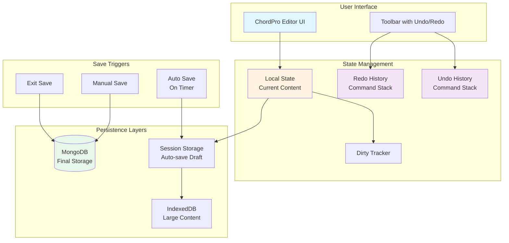
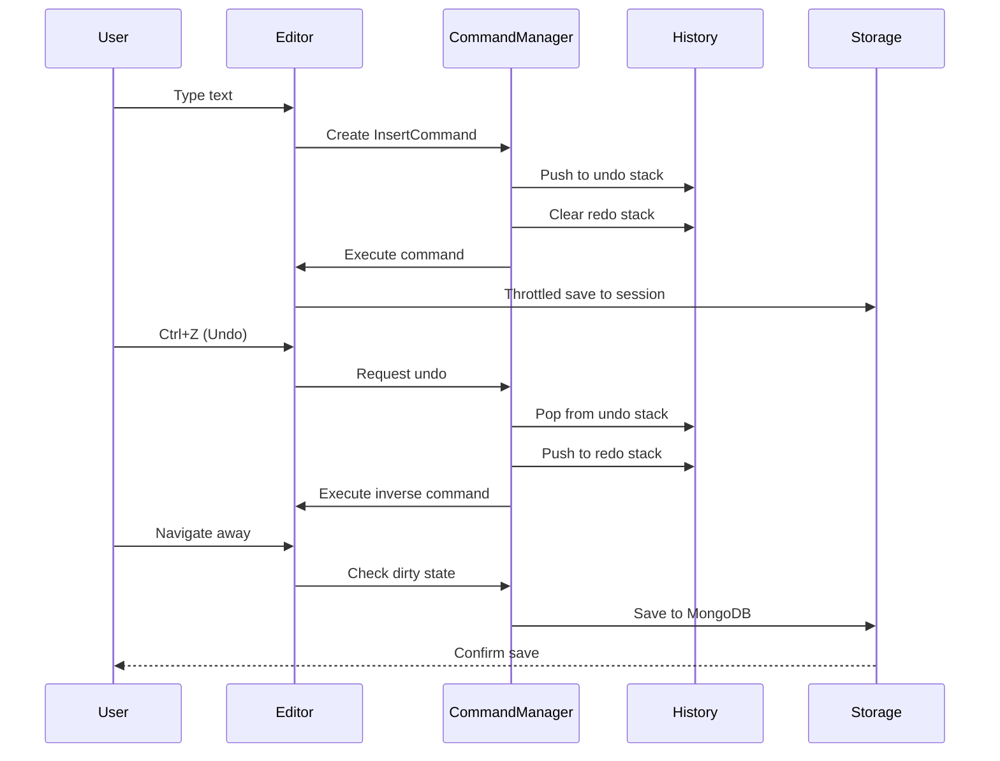
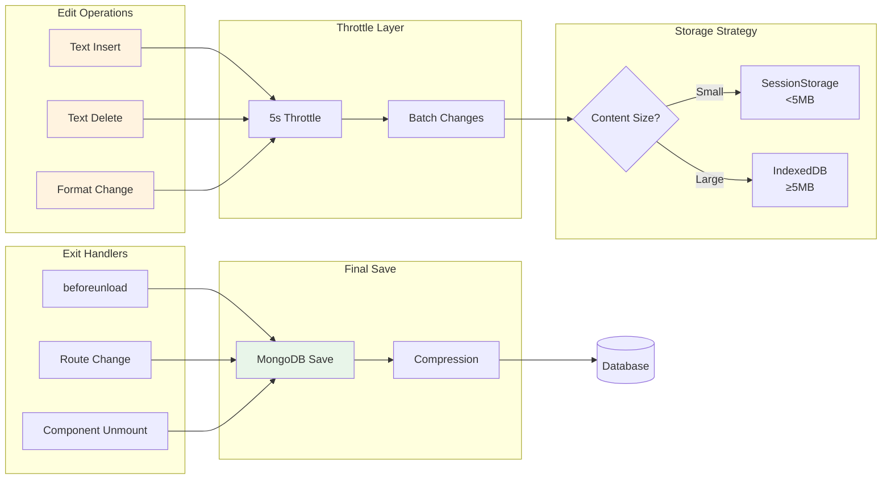

# ChordPro Editor: Robust Undo-Redo with Optimized Auto-Save - Product Requirements Document

## Executive Summary

This PRD outlines the implementation of a robust undo-redo system with intelligent auto-save functionality for the ChordPro editor. The solution minimizes database calls by implementing local state management with undo/redo capabilities while only persisting to MongoDB when the user exits the editor or explicitly saves. This approach ensures data integrity, improves performance, and enhances the user experience.

## Problem Statement

### Current Issues
1. **No Data Persistence**: Changes made in the ChordPro editor are not being saved, resulting in data loss
2. **Missing Undo/Redo**: Users cannot undo or redo their editing actions
3. **No Auto-Save**: Users risk losing work if they forget to manually save
4. **Database Performance**: Frequent saves would create unnecessary database load

### User Impact
- **Data Loss**: Users lose their work if they navigate away or experience browser issues
- **Poor UX**: No ability to undo mistakes or redo corrections
- **Cognitive Load**: Users must remember to manually save their work
- **Performance**: Potential for slow editor response with frequent DB writes

## Solution Overview

Implement a three-tier state management system:
1. **Local State**: Immediate updates with undo/redo history
2. **Session Storage**: Browser-level persistence for recovery
3. **Database**: Final persistence only on exit or explicit save

## User Stories

### Epic: Enhanced Editor State Management

#### Story 1: Undo/Redo Functionality
**As a** songwriter editing arrangements  
**I want** to undo and redo my changes  
**So that** I can easily correct mistakes and experiment freely

**Acceptance Criteria:**
- [ ] Ctrl/Cmd+Z triggers undo
- [ ] Ctrl/Cmd+Y or Ctrl/Cmd+Shift+Z triggers redo
- [ ] UI buttons show undo/redo availability
- [ ] History maintains last 100 operations
- [ ] History survives component re-renders

#### Story 2: Auto-Save on Exit
**As a** user leaving the editor  
**I want** my changes automatically saved  
**So that** I don't lose my work

**Acceptance Criteria:**
- [ ] Save triggers on navigation away
- [ ] Save triggers on browser tab close
- [ ] Save triggers on session timeout
- [ ] User sees save confirmation
- [ ] Failed saves show error notification

#### Story 3: Session Recovery
**As a** user who experienced a browser crash  
**I want** to recover my unsaved work  
**So that** I don't have to start over

**Acceptance Criteria:**
- [ ] Draft saved to sessionStorage every 5 seconds
- [ ] Recovery prompt on return to editor
- [ ] Option to restore or discard draft
- [ ] Draft includes full undo history

## Technical Architecture

### State Management Architecture



### Command Pattern Implementation



### Data Flow for Auto-Save



## API Specifications

### Command Interface

```typescript
interface EditorCommand {
  id: string;
  timestamp: number;
  execute(): void;
  undo(): void;
  canMerge(other: EditorCommand): boolean;
  merge(other: EditorCommand): EditorCommand;
}

interface TextInsertCommand extends EditorCommand {
  position: number;
  text: string;
  previousText?: string;
}

interface TextDeleteCommand extends EditorCommand {
  position: number;
  length: number;
  deletedText: string;
}

interface FormatCommand extends EditorCommand {
  type: 'bold' | 'italic' | 'chord';
  range: [number, number];
  previousFormat?: string;
}
```

### State Management Hook

```typescript
interface UseEditorStateOptions {
  maxHistorySize?: number;      // Default: 100
  autoSaveInterval?: number;     // Default: 5000ms
  enableSessionRecovery?: boolean; // Default: true
  compressThreshold?: number;    // Default: 5MB
}

interface EditorState {
  content: string;
  isDirty: boolean;
  canUndo: boolean;
  canRedo: boolean;
  lastSaved: Date | null;
  isAutoSaving: boolean;
  isSaving: boolean;
}

interface EditorActions {
  updateContent: (content: string) => void;
  undo: () => void;
  redo: () => void;
  save: () => Promise<void>;
  recoverSession: () => Promise<boolean>;
  clearHistory: () => void;
}

function useEnhancedEditorState(
  initialContent: string,
  arrangementId: string,
  options?: UseEditorStateOptions
): [EditorState, EditorActions];
```

### Storage Service

```typescript
interface StorageService {
  // Session storage for drafts
  saveDraft(arrangementId: string, content: string, history: EditorCommand[]): void;
  loadDraft(arrangementId: string): { content: string; history: EditorCommand[] } | null;
  clearDraft(arrangementId: string): void;
  
  // IndexedDB for large content
  saveLargeDraft(arrangementId: string, content: string): Promise<void>;
  loadLargeDraft(arrangementId: string): Promise<string | null>;
  
  // MongoDB persistence
  saveToDatabase(arrangementId: string, content: string): Promise<void>;
  
  // Compression utilities
  compress(content: string): string;
  decompress(content: string): string;
}
```

## Data Models

### History State Model

```typescript
interface HistoryState {
  past: EditorCommand[];      // Undo stack
  present: string;             // Current content
  future: EditorCommand[];     // Redo stack
  lastCommandTime: number;     // For merging similar commands
  originalContent: string;     // For dirty checking
}
```

### Session Storage Schema

```typescript
interface SessionDraft {
  arrangementId: string;
  content: string;
  compressedHistory?: string;  // Base64 encoded compressed history
  timestamp: number;
  version: number;             // For migration compatibility
}
```

### Exit Save Payload

```typescript
interface ExitSavePayload {
  arrangementId: string;
  chordProText: string;
  lastModified: Date;
  editDuration: number;        // Time spent editing in ms
  commandCount: number;         // Number of edit operations
}
```

## Implementation Phases

### Phase 1: Enhanced Undo/Redo System (Priority: High)
- Implement Command pattern for all edit operations
- Create command history management
- Add keyboard shortcuts (Ctrl+Z, Ctrl+Y)
- Implement command merging for similar operations
- Add UI indicators for undo/redo availability

### Phase 2: Session Storage Auto-Save (Priority: High)
- Implement throttled session storage saves
- Add draft recovery on page reload
- Create recovery UI dialog
- Handle storage quota exceeded errors
- Add draft versioning for compatibility

### Phase 3: Exit Save Implementation (Priority: Critical)
- Implement beforeunload handler
- Add React Router navigation guards
- Handle component unmount saves
- Implement save queue for reliability
- Add retry logic for failed saves

### Phase 4: Large Content Optimization (Priority: Medium)
- Implement IndexedDB for large drafts
- Add content compression
- Create hybrid storage strategy
- Optimize command history storage
- Add memory usage monitoring

### Phase 5: Advanced Features (Priority: Low)
- Collaborative editing preparation
- Operation transformation groundwork
- Add edit history visualization
- Implement branching history
- Add named checkpoints

## Performance Optimizations

### Memory Management
```typescript
// Limit history size with sliding window
const MAX_HISTORY_SIZE = 100;
const HISTORY_CLEANUP_THRESHOLD = 120;

// Compress old commands
const COMPRESSION_AGE_THRESHOLD = 50; // Compress commands older than 50 operations
```

### Storage Optimization
- Use LZ-string compression for text > 100KB
- Implement incremental saves (diff patches)
- Clean up old drafts (> 7 days)
- Use Web Workers for compression

### Throttling Strategy
```typescript
const AUTOSAVE_THROTTLE = 5000;     // 5 seconds
const COMMAND_MERGE_WINDOW = 500;   // 500ms to merge similar commands
const SAVE_DEBOUNCE = 1000;         // 1 second after last change
```

## Risk Mitigation

### Risk 1: Data Loss During Save Failure
**Mitigation:**
- Implement retry mechanism with exponential backoff
- Keep session storage until DB save confirmed
- Show persistent error notification
- Provide manual save trigger

### Risk 2: Browser Storage Limits
**Mitigation:**
- Monitor storage quota usage
- Implement compression for large content
- Fallback to IndexedDB for large drafts
- Clean up old drafts automatically

### Risk 3: Performance Degradation
**Mitigation:**
- Limit history size to 100 operations
- Use requestIdleCallback for non-critical saves
- Implement virtual scrolling for long content
- Use Web Workers for heavy operations

### Risk 4: Concurrent Edit Conflicts
**Mitigation:**
- Implement optimistic locking
- Add version checking on save
- Show conflict resolution dialog
- Maintain backup of last known good state

## Success Metrics

### Quantitative Metrics
- **Data Loss Rate**: < 0.01% of editing sessions
- **Save Success Rate**: > 99.9%
- **Undo/Redo Response Time**: < 50ms
- **Auto-Save Performance Impact**: < 5% CPU usage
- **Memory Usage**: < 50MB for history
- **Database Calls**: 90% reduction vs per-change saves

### Qualitative Metrics
- **User Confidence**: Users trust the editor to preserve their work
- **Editing Flow**: Seamless undo/redo enhances creativity
- **Error Recovery**: Users can recover from crashes
- **Performance Feel**: Editor remains responsive during auto-save

## Testing Strategy

### Unit Tests
- Command execution and reversal
- History state management
- Storage service operations
- Compression/decompression
- Throttle/debounce logic

### Integration Tests
- End-to-end save flow
- Session recovery flow
- Browser storage interactions
- Database persistence
- Error handling paths

### Performance Tests
- Large content handling (10MB+)
- History with 1000+ operations
- Concurrent save operations
- Memory leak detection
- Storage quota handling

### User Acceptance Tests
- Undo/redo keyboard shortcuts
- Auto-save visual feedback
- Recovery dialog interaction
- Save confirmation messages
- Error notification display

## Security Considerations

### Data Protection
- Encrypt sensitive content in session storage
- Sanitize content before storage
- Validate command operations
- Prevent XSS in recovered content

### Access Control
- Verify user ownership before save
- Check permissions on recovery
- Audit log for save operations
- Rate limit save requests

## Appendices

### A. Browser Compatibility
- SessionStorage: All modern browsers
- IndexedDB: All modern browsers
- beforeunload: Limited on mobile
- Visibility API: For auto-save triggers

### B. Libraries and Dependencies
- **lz-string**: For compression
- **idb**: IndexedDB wrapper
- **lodash**: Throttle/debounce utilities

### C. Migration Path
1. Deploy with feature flag
2. Enable for 10% of users
3. Monitor metrics for 1 week
4. Gradual rollout to 100%
5. Remove old save logic

### D. Related Documentation
- ChordPro Editor Implementation: `/PRPs/chordpro-editor.md`
- Current Editor State Hook: `/src/features/arrangements/hooks/useChordEditor.ts`
- Arrangement Service: `/src/features/songs/services/arrangementService.ts`

---

## Ready for Implementation

This PRD provides a comprehensive blueprint for implementing a robust undo-redo system with optimized auto-save. The solution balances user experience, performance, and reliability while minimizing database load. The phased approach allows for incremental delivery of value while maintaining system stability.