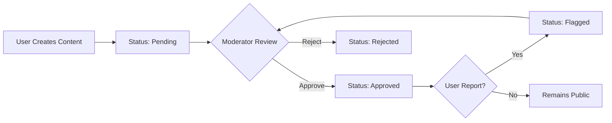

# HSA Songbook Moderation System Guide

## Table of Contents
1. [System Overview](#system-overview)
2. [Moderation Roles & Permissions](#moderation-roles--permissions)
3. [Moderation Workflow](#moderation-workflow)
4. [Moderator Dashboard Interface](#moderator-dashboard-interface)
5. [Content Review Process](#content-review-process)
6. [Reporting System](#reporting-system)
7. [Bulk Operations](#bulk-operations)
8. [Moderation Statistics](#moderation-statistics)
9. [Quick Start for New Moderators](#quick-start-for-new-moderators)
10. [Best Practices & Guidelines](#best-practices--guidelines)
11. [Technical Architecture](#technical-architecture)

---

## System Overview

The HSA Songbook moderation system is designed to maintain content quality and community standards across all user-generated songs and arrangements. It provides a streamlined interface for reviewing, approving, editing, and removing content that doesn't meet community guidelines.

### Key Components

1. **Moderation Dashboard** (`/moderation`) - Central interface for content reviewT
2. **Content Queue** - Prioritized list of items requiring review
3. **Reporting System** - Community-driven flagging mechanism
4. **Audit Log** - Complete history of all moderation actions
5. **Statistics Panel** - Real-time moderation metrics

### Content States

All content in the system exists in one of four moderation states:

- **`pending`** - Newly created content awaiting initial review
- **`approved`** - Content that has been reviewed and approved for public viewing
- **`rejected`** - Content that was reviewed and deemed inappropriate
- **`flagged`** - Previously approved content that has been reported by users

## Moderation Roles & Permissions

### Role Hierarchy

```
Admin (all permissions)
  └── Moderator (content moderation)
      └── User (basic access + reporting)
          └── Anonymous (read-only)
```

### Moderator Capabilities

Moderators have the following permissions:

- ✅ View and filter moderation queue
- ✅ Approve/reject/flag content
- ✅ Edit song and arrangement details
- ✅ Perform bulk moderation actions
- ✅ View and resolve user reports
- ✅ Access moderation statistics
- ✅ View moderation activity logs
- ❌ Cannot modify user roles
- ❌ Cannot access admin settings
- ❌ Cannot delete permanent content

### Permission Gates

The system uses `PermissionGate` components to restrict access:

```typescript
<PermissionGate requiredPermission="moderate">
  <ModerationDashboard />
</PermissionGate>
```

## Moderation Workflow

### Standard Content Flow



### Priority Queue Algorithm

The moderation queue prioritizes content based on:

1. **Flagged content** (highest priority)
2. **Reported items** (sorted by report count)
3. **Pending content** (sorted by creation date)
4. **Previously reviewed** (lowest priority)

## Moderator Dashboard Interface

### Main Dashboard Layout

The moderation dashboard (`/moderation`) consists of:

```
┌─────────────────────────────────────────┐
│  Content Moderation                     │
│  Review and moderate user content       │
├─────────────────────────────────────────┤
│  📊 Statistics Panel                    │
│  - Pending: 24                          │
│  - Flagged: 3                           │
│  - Approved Today: 18                   │
│  - Avg Review Time: 2.3 min             │
├─────────────────────────────────────────┤
│  🔍 Filter Controls                     │
│  [Status ▼] [Type ▼] [□ Reported Only]  │
│  [Search...                         ]   │
├─────────────────────────────────────────┤
│  📋 Content Queue                       │
│  □ Select All   [Bulk Actions] Refresh  │
│  ┌─────────────────────────────────┐    │
│  │ □ Song Title - Artist            │    │
│  │   Status: Pending | Reports: 0   │    │
│  │   [View] [Approve] [Reject]      │    │
│  └─────────────────────────────────┘    │
│  [More items...]                        │
└─────────────────────────────────────────┘
```

### Filter Options

- **Status Filter**: All, Pending, Flagged, Approved, Rejected
- **Content Type**: All Types, Songs, Arrangements
- **Reported Only**: Toggle to show only reported content
- **Search**: Full-text search across titles and creators

## Content Review Process

### Individual Review Steps

1. **Access Queue**: Navigate to `/moderation`
2. **Select Item**: Click on a content card to expand details
3. **Review Content**: 
   - Check title, artist, lyrics for accuracy
   - Verify ChordPro formatting is correct
   - Ensure no inappropriate content
   - Check for copyright issues
4. **Take Action**:
   - **Approve**: Makes content publicly visible
   - **Reject**: Hides content with optional note
   - **Flag**: Marks for further review
   - **Edit**: Opens edit modal for corrections

### Content Review Card

Each item in the queue displays:

```typescript
interface ContentReviewCard {
  title: string           // Song or arrangement name
  creator: {              // Submitter information
    email: string
    name: string | null
  }
  status: ModerationStatus // Current moderation state
  reportCount: number      // Number of user reports
  createdAt: string       // Submission timestamp
  content: {              // Full content details
    lyrics?: string
    chordpro?: string
    themes?: string[]
  }
}
```

### Quick Actions

- **View**: Opens full content preview
- **Approve**: Single-click approval
- **Reject**: Opens rejection dialog with note field
- **Edit**: Opens content editor (preserves attribution)

## Reporting System

### User Reporting Flow

Users can report content through:

1. **Report Button** on song cards
2. **Flag Icon** in arrangement viewer
3. **Context Menu** in setlists

### Report Categories

```typescript
type ReportReason = 
  | 'inappropriate'  // Offensive or unsuitable content
  | 'copyright'      // Potential copyright violation
  | 'spam'          // Duplicate or spam content
  | 'incorrect'     // Wrong chords or lyrics
  | 'other'         // Custom reason with description
```

### Report Resolution

1. Reports appear in moderation queue
2. Content with multiple reports gets priority
3. Moderator reviews and takes action
4. Report marked as `resolved` with resolution note
5. Reporter notified of outcome (optional)

## Bulk Operations

### Selecting Multiple Items

1. Use checkboxes on individual cards
2. Or click "Select All" for entire page
3. Selected count appears in bulk action bar

### Available Bulk Actions

```typescript
interface BulkActions {
  approve: string[]  // Approve multiple items
  reject: string[]   // Reject with single note
  flag: string[]     // Flag for further review
  unflag: string[]   // Clear flag status
}
```

### Bulk Action Workflow

1. Select target items using checkboxes
2. Choose action from bulk operations menu
3. Confirm action in modal dialog
4. Optional: Add moderation note
5. System processes all items sequentially
6. Queue refreshes automatically

## Moderation Statistics

### Real-time Metrics

The statistics panel displays:

- **Pending Count**: Items awaiting review
- **Flagged Count**: Items requiring urgent attention
- **Approved Today**: Daily approval count
- **Rejected Today**: Daily rejection count
- **Average Review Time**: Mean time to process items
- **Top Reporters**: Most active community moderators

### Performance Indicators

```typescript
interface ModerationStats {
  pendingCount: number        // Queue size
  flaggedCount: number        // Urgent items
  approvedToday: number       // Daily approvals
  rejectedToday: number       // Daily rejections
  averageReviewTime: number   // Minutes per item
  topReporters: Array<{       // Active reporters
    userId: string
    email: string
    reportCount: number
  }>
}
```

## Quick Start for New Moderators

### Day 1: Getting Started

1. **Access the Dashboard**
   - Log in with moderator credentials
   - Navigate to `/moderation`
   - Familiarize with interface layout

2. **Review Your First Item**
   - Start with a `pending` item
   - Click to expand full details
   - Check against content guidelines
   - Click "Approve" or "Reject"

3. **Handle a Report**
   - Filter by "Reported Only"
   - Review report reason
   - Investigate the content
   - Take appropriate action
   - Add resolution note

### Week 1: Building Proficiency

- Review 10-20 items daily
- Practice bulk operations
- Learn common rejection reasons
- Understand theme categorization
- Master keyboard shortcuts

### Keyboard Shortcuts

- `A` - Approve current item
- `R` - Reject current item
- `E` - Edit current item
- `Space` - Toggle item selection
- `Shift + A` - Select all visible
- `Escape` - Close modal/dialog

## Best Practices & Guidelines

### Content Standards

#### Acceptable Content
- ✅ Worship songs with accurate chords
- ✅ Original arrangements with attribution
- ✅ Translated lyrics with language tags
- ✅ Educational chord exercises
- ✅ Performance notes and instructions

#### Rejection Criteria
- ❌ Copyrighted material without permission
- ❌ Inappropriate or offensive lyrics
- ❌ Spam or duplicate submissions
- ❌ Severely incorrect chord progressions
- ❌ Non-music content or advertisements

### Moderation Ethics

1. **Be Consistent**: Apply standards uniformly
2. **Stay Neutral**: Personal taste shouldn't influence decisions
3. **Document Decisions**: Always add notes for rejections
4. **Escalate When Needed**: Consult admins for edge cases
5. **Respect Privacy**: Don't share user information

### Communication Guidelines

When adding moderation notes:

```
✅ GOOD: "Rejected: Copyrighted lyrics from commercial album"
❌ BAD: "This song is terrible"

✅ GOOD: "Flagged: Chords need verification by music team"
❌ BAD: "Wrong"

✅ GOOD: "Edited: Fixed ChordPro formatting in chorus"
❌ BAD: "Fixed your mistakes"
```

## Technical Architecture

### Database Schema

```sql
-- Moderation fields on content
ALTER TABLE songs ADD COLUMN
  moderation_status TEXT DEFAULT 'pending',
  moderated_by UUID REFERENCES auth.users(id),
  moderated_at TIMESTAMPTZ,
  moderation_note TEXT;

-- Reports table
CREATE TABLE content_reports (
  id UUID PRIMARY KEY,
  content_id UUID NOT NULL,
  content_type TEXT NOT NULL,
  reported_by UUID REFERENCES auth.users(id),
  reason TEXT NOT NULL,
  description TEXT,
  status TEXT DEFAULT 'open',
  resolved_by UUID,
  resolution TEXT
);

-- Moderation activity log
CREATE TABLE moderation_log (
  id UUID PRIMARY KEY,
  content_id UUID NOT NULL,
  action TEXT NOT NULL,
  performed_by UUID,
  performed_at TIMESTAMPTZ,
  note TEXT
);
```

### API Endpoints

```typescript
// Moderation Queue
GET /api/moderation/queue
  ?status=pending
  &type=song
  &reported=true

// Moderation Actions
POST /api/moderation/moderate
  body: { contentIds[], action, note }

// Reports
POST /api/reports/create
  body: { contentId, reason, description }

GET /api/reports/list
  ?status=open

PUT /api/reports/:id/resolve
  body: { resolution }

// Statistics
GET /api/moderation/stats
```

### React Components

```typescript
// Main Components
<ModerationDashboard />     // Main page
<ModerationQueue />         // Content list
<ContentReviewCard />       // Individual item
<BulkActions />            // Bulk operations
<ModerationStats />        // Statistics panel

// Supporting Components
<ReportButton />           // User reporting
<ReportModal />           // Report form
<PermissionGate />        // Access control
```

### State Management

The moderation system uses TanStack Query for server state:

```typescript
// Queries
useModerationQueue(filter)  // Fetch queue
useModerationStats()        // Get statistics
useContentReports(contentId) // Get reports

// Mutations
useContentModeration()      // Approve/reject
useBulkModeration()         // Bulk actions
useReportContent()          // Create report
useResolveReport()          // Resolve report
```

### Performance Optimizations

1. **Pagination**: Queue loads 20 items at a time
2. **Caching**: 5-minute cache for approved content
3. **Optimistic Updates**: UI updates before server confirms
4. **Debounced Search**: 300ms delay on search input
5. **Virtual Scrolling**: For queues > 100 items

---

## Troubleshooting

### Common Issues

**Queue not loading:**
- Check network connection
- Verify moderator permissions
- Clear browser cache
- Check Supabase connection

**Bulk actions failing:**
- Reduce selection size (max 50)
- Check for locked content
- Verify all items are same type
- Review error messages

**Statistics not updating:**
- Refresh the page
- Check browser console
- Verify real-time subscriptions
- Contact admin if persists

### Support Resources

- Admin Contact: Available in `/admin` dashboard
- Documentation: This guide and PRPs/rbac-phase3-moderator-tools.md
- Technical Issues: GitHub Issues page
- Feature Requests: Submit through admin portal

---

*Last Updated: January 2025*
*Version: 1.0.0*