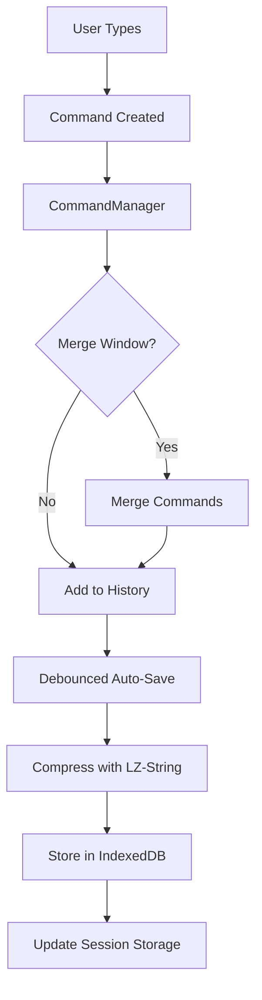

# Auto-Save Architecture Documentation

## Overview
The ChordPro editor implements a robust auto-save system with undo/redo capabilities using local storage and session persistence. This document describes the architecture and package dependencies.

## Package Dependencies

### 1. IndexedDB (idb@8.0.3)
**Purpose**: Provides persistent browser storage for auto-save drafts and command history.

**Usage**:
- Stores editor drafts with compression
- Maintains command history across sessions
- Provides quota management and cleanup
- Enables offline editing capabilities

**Key Features**:
- Async/await API wrapper for IndexedDB
- Supports large data storage (>5MB)
- Automatic versioning and migration
- Cross-tab synchronization support

**Implementation Location**: `src/features/arrangements/services/EditorStorageService.ts`

### 2. LZ-String (lz-string@1.5.0)
**Purpose**: Provides compression for stored editor content and command history.

**Usage**:
- Compresses ChordPro content before storage (typically 60-70% reduction)
- Reduces IndexedDB storage usage
- Enables storing more history within browser quotas
- Fast compression/decompression for real-time editing

**Key Features**:
- UTF-16 safe compression
- Optimized for JavaScript strings
- Small library size (~9KB)
- Synchronous operation for instant saves

**Implementation Location**: `src/features/arrangements/services/EditorStorageService.ts`

## Storage Architecture

### Three-Tier Storage System

1. **Memory State** (Immediate)
   - Current editor content
   - Active command history (undo/redo stacks)
   - Managed by: `CommandManager`
   - Capacity: Last 100-500 commands (configurable)

2. **Session Storage** (Tab-specific)
   - Temporary drafts during editing
   - Quick recovery from accidental tab close
   - Managed by: `EditorStorageService`
   - Capacity: Current session only

3. **IndexedDB** (Persistent)
   - Long-term draft storage
   - Command history preservation
   - Cross-session recovery
   - Managed by: `EditorStorageService` with `idb`
   - Capacity: ~50MB per origin (browser dependent)

## Auto-Save Flow



## Configuration

### CommandManager Options
```typescript
interface CommandManagerOptions {
  maxHistorySize?: number;  // Default: 100
  mergeWindow?: number;      // Default: 500ms
}
```

### Auto-Save Options
```typescript
interface AutoSaveOptions {
  debounceMs?: number;       // Default: 1000ms
  maxDraftSize?: number;     // Default: 5MB
  compressionEnabled?: boolean; // Default: true
}
```

## Storage Quotas

### Browser Limits
- **Chrome/Edge**: ~60% of free disk space
- **Firefox**: ~50% of free disk space
- **Safari**: ~1GB initially, can request more

### Quota Management
1. Monitor storage usage via `navigator.storage.estimate()`
2. Implement LRU cache for draft cleanup
3. Compress data before storage
4. Alert user when approaching limits

## Recovery Scenarios

### 1. Browser Crash
- On restart: Load from IndexedDB
- Restore last saved draft
- Rebuild command history

### 2. Tab Close
- On reopen: Check session storage first
- Fall back to IndexedDB if needed
- Merge any pending changes

### 3. Network Loss
- Continue saving locally
- Sync when connection restored
- No data loss during offline editing

## Performance Considerations

### Compression Benchmarks
- Average ChordPro file (10KB): ~3KB compressed (70% reduction)
- Compression time: <5ms for typical files
- Decompression time: <3ms for typical files

### Storage Operations
- IndexedDB write: ~10-50ms
- Session storage write: <5ms
- Memory operations: <1ms

### Optimization Strategies
1. Debounce saves (default 1000ms)
2. Compress large content
3. Batch command history updates
4. Use Web Workers for heavy operations (future)

## Security Considerations

1. **Data Isolation**: IndexedDB is origin-specific
2. **No Encryption**: Data stored in plain text (compressed)
3. **User Privacy**: Clear storage on logout
4. **XSS Protection**: Sanitize content before storage

## Future Enhancements

1. **Cloud Sync**: Backup to server when online
2. **Conflict Resolution**: Handle multi-tab editing
3. **Selective Compression**: Smart compression based on content
4. **Web Worker**: Offload compression to worker thread
5. **Storage Analytics**: Track usage patterns

## Testing

### Unit Tests
- `CommandManager.test.ts`: Command history management
- `EditorStorageService.test.ts`: Storage operations
- `useAutoSave.test.ts`: Auto-save hook logic

### Integration Tests
- End-to-end save/restore flow
- Multi-tab synchronization
- Storage quota handling

## Debugging

### Chrome DevTools
1. Application > Storage > IndexedDB
2. View stored drafts and metadata
3. Monitor storage quota

### Debug Commands
```javascript
// Check storage usage
await navigator.storage.estimate()

// Clear all drafts
await editorStorage.clearAll()

// Export command history
commandManager.serializeHistory()
```